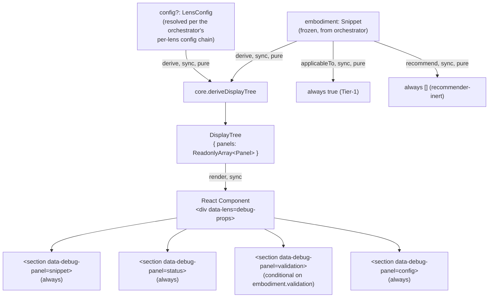

# debug-props — Architecture & Decisions

## Why this lens exists

`debug-props` is a meta-lens that renders its received
[`LensProps`](../types.ts) as on-screen panels. It exists to **verify the
orchestrator's resolution chain end-to-end** without consuming the props for a
pedagogical UI of its own — sandbox harnesses can mount it against any
`Snippet` + `LensConfig` combination and read back the props it received in the
rendered DOM.

It also serves as the **first concrete `LensModule` implementation against the
new contract** (per
[`../../.planning-handoffs/B-plugin-alignment.md`](../../.planning-handoffs/B-plugin-alignment.md)).
This bootstraps the orchestrator's lens-mount path — the
`<StudyLenses lens="debug-props">` route is wired in B's increment B.7 as the
first registered entry of a single-entry static lens registry. F4
([`../../.planning-handoffs/03-orchestrator-and-contracts.md`](../../.planning-handoffs/03-orchestrator-and-contracts.md))
later grows the registry with the first pedagogical trial lens; the shape
decision (static map vs. runtime `register()` API) stays in F4 Phase 0.

`debug-props` is **NOT a pedagogical surface**. It has no learner-facing
exercise, no validation, no scoring. The lens is intentionally recommender-inert
(`applicableTo: () => true` so it stays available for manual harness use;
`recommend: () => []` so it never surfaces in the Q-II recommendations panel).

## Architectural sketch

> Written Phase 0, before implementation. The Refactor step of B.6 is held
> against this sketch. Domain terms only — no function names, no variable names,
> no pseudocode (React hook names like `useEffect` / `useMemo` are acceptable as
> structural-mechanism references).

The lens is the standard **two-layer module** the lenses peer mandates (per
[`../README.md` § How to add a lens](../README.md#how-to-add-a-lens)): a pure-TS
core derives a serialisable display tree from the incoming `LensProps`; a light
React wrapper renders one `<section>` per panel.

### Display derivation

The pure-TS core (`./core.ts`) consumes `LensProps` and returns a `DisplayTree`
(per `./types.ts`). Each panel below is named with its `data-debug-panel` key in
parentheses; sandbox-harness selectors use the key directly.

> The sketch below describes the **post-refactor target shape**, aligned with
> the current embody contract (see [`../../embody/types.ts § Snippet`]
> (../../embody/types.ts)). The Refactor step of this increment updates
> `core.ts` to match — the current implementation predates the `validated`
> status field addition and the optional `Snippet.validation` shape, and crashes
> on fail-leaf embodiments.

1. **Snippet panel** (`snippet`) — `embodiment.source.code` (the raw source
   string the orchestrator embodied). Verifies `snippet` round-tripped through
   the plugin's emission and the orchestrator's `embody()` call.
2. **Embodiment status panel** (`status`) —
   `embodiment.status.{tokenized, parsed, validated, created}` flags + the
   first-fail kind (`embodiment.errors?.kind ?? null`). Verifies the embodiment
   pipeline ran (and surfaces canned scenario outcomes when a scenario keyword
   is in play; real composition for non-scenario input lands per
   [`../../ROADMAP.md`](../../ROADMAP.md)). `Snippet.errors` is a peer of
   `Snippet.status` in the embody contract; the panel echoes both together so
   the harness can verify the first-fail-wins gate semantics at a glance.
3. **Validation panel** (`validation`) — conditional rendering per the `Snippet`
   staircase. When `embodiment.validation` is present (validate-fail,
   create-fail, and apex leaves), the panel renders
   `embodiment.validation.{formatted, isJeJ, isDeterministic, doesPause}` +
   `validation.violations` count. When `embodiment.validation` is absent
   (tokenize-fail and parse-fail leaves), the panel renders the placeholder
   `(validation absent — gated on parse success)`. The placeholder phrases the
   gate condition, not a counterfactual about what happened, so it reads
   correctly for both fail-leaves regardless of which gate actually failed. See
   [§ Handling absent fields](#handling-absent-fields) below.
4. **Config panel** (`config`) — `Object.entries(config)` rendered as a
   key/value list, OR an `(empty)` placeholder when the config is `undefined` OR
   an explicit empty object `{}`. Verifies the orchestrator's resolution chain
   (`module.config() ⊕ configs[lens] ⊕ config`) produced the expected merged
   bundle. **Why `{}` collapses to `(empty)` rather than rendering as the JSON
   `{}`**: the harness's primary verification surface is the React DevTools
   props panel; the on-screen panel is a quick at-a-glance summary. When the
   distinction between "no config supplied" and "config resolved to empty
   object" matters (e.g. detecting an L2 resolution-chain bug that returns `{}`
   instead of the correct bundle), the harness operator drills into DevTools.
   The `(empty)` collapse keeps the visual surface clean for the common case.

The contract is the `DisplayTree.panels: ReadonlyArray<Panel>` shape (where each
panel carries `key`, `label`, `content` strings). The panel keys above are
stable — sandbox-harness selectors target them by key, so renaming or removing a
panel breaks the selectors and is a contract change. Adding a NEW panel (with a
fresh key) is non-breaking.

### Handling absent fields

The `Snippet` contract (see
[`../../embody/types.ts § Snippet`](../../embody/types.ts) and
[`../../embody/README.md § Named scenarios`](../../embody/README.md) for the
5-leaf shape catalog) marks several fields optional: `validation` and `static`
are present only when their staircase gate has been computed, and certain
`streams.*` sub-fields are present only at apex. Lenses that consume the
embodiment guard on the appropriate `Snippet.status.*` boolean (or on the
presence of the optional field itself) before reading dependent data.

In `debug-props`:

- **`embodiment.validation`** — the validation panel guards on
  `embodiment.validation !== undefined`. The presence check is coherent with the
  embody contract: `validation` is present at validate-fail and beyond on the
  staircase (see the staircase comment in
  [`../../embody/types.ts § Snippet`](../../embody/types.ts)). For absent cases
  (tokenize-fail, parse-fail) the panel renders the gate-phrased placeholder.
- **`embodiment.errors`** — already nullable (`EmbodyError | null`) and guarded
  inline at the status-panel summary site.
- **`embodiment.static`, `embodiment.parse.*`, `embodiment.streams.*`** —
  intentionally not surfaced by debug-props (see the panel-set rationale in
  [`./README.md` § Panel contract](./README.md)). A future `embody-graph` lens
  would own that surface.

This pattern — "guard on `status.*` or on presence; render a gate-phrased
placeholder when absent" — mirrors the staircase consumer convention from
[`../../embody/DOCS.md § Data flow`](../../embody/DOCS.md). debug-props
demonstrates the pattern; the cross-cutting "how lenses consume optional
`Snippet` fields" guidance belongs at the lenses-peer level (see
[`../DOCS.md`](../DOCS.md)) — not redefined inside one consumer.

### Mount lifecycle

Per the lenses peer's [§Mount lifecycle](../DOCS.md#mount-lifecycle) contract:

- React mounts the component when the orchestrator dispatches to the
  `debug-props` registry entry (B.7's lens-mount path).
- The component reads `embodiment` and `config` from props on every render;
  calls `core.deriveDisplayTree` synchronously; renders the panel tree.
- No async setup is required (the lens is sync-only by design).
- React unmounts the component when the orchestrator switches lens or the
  snippet changes (per F2's disposability principle); no per-mount state to
  dispose.

### Data flow

The diagram is per-mount. The orchestrator (upstream) supplies `embodiment` and
`config`; the recommender (sibling) calls `applicableTo` (always `true`) and
`recommend` (always `[]`). The exercise UI is the panel tree the learner
inspects — its content is read-only and per-mount; React unmounts it when the
snippet changes or the lens switches.

### Structural constraints

- **Two-layer module shape** — `core.ts` (no React) + `index.tsx` (React
  wrapper). Tests split: `tests/core.test.ts` (no jsdom) +
  `tests/component.test.tsx` (jsdom + `@testing-library/react`). Per the lenses
  peer's [§Structural constraints](../DOCS.md#structural-constraints).
- **`embodiment` parameter name** in core signatures, per the lenses peer's
  invariant. The core function destructures `LensProps` to pass `embodiment` and
  `config` into derivation by name; never as `props.embodiment` and never
  renamed at the parameter boundary.
- **`data-lens="debug-props"` on the wrapper's root element.** Load- bearing for
  sandbox-harness selectors. Per the lenses peer's invariant.
- **`data-debug-panel="<key>"` per panel.** Sandbox-harness selectors use this
  to target individual panels (e.g. assert the config panel rendered a specific
  resolved-key value).
- **Tier-1 classification.** `applicableTo` always returns `true`; the lens
  works on any `Snippet` shape (parsed or not, evaluable or not). Per the lenses
  peer's [§Three-tier classification](../README.md#three-tier-classification).
- **Recommender-inert.** `recommend` always returns `[]`. The lens does NOT
  surface in the Q-II recommendations panel. This is by design — debug-props is
  a harness/development surface, not a pedagogical one.
- **Read-only views.** The lens never mutates `embodiment` or `config` (both are
  deep-frozen by the orchestrator anyway).
- **Disposable practice.** No cross-mount state. No `localStorage`, no refs
  across mounts. React owns the lifecycle.
- **No consumer-side branching on `embodiment.source.code`.** The lens renders
  `source.code` verbatim in the snippet panel (a source-display use case is
  legitimate) but MUST NOT use it as a branching key. It only branches on the
  `Snippet`'s public shape (status flags, validation flags, errors count). Per
  the lenses peer's invariant — see [`../README.md`](../README.md).
- **Display content is rendered as text, not interpreted as markup.** The
  wrapper renders panel content via `<pre>` (for multi-line stringified objects)
  or `<code>` (for inline values), never via `dangerouslySetInnerHTML`.
  Sandbox-harness fences may contain arbitrary string content; the lens treats
  it as opaque display data.

### Out of scope

- **Schema validation of incoming props.** The lens trusts the orchestrator's
  contract — `embodiment` is a `Snippet`, `config` is a `LensConfig`. Mismatches
  are upstream bugs, not the lens's to detect.
- **Editable inputs.** The lens displays props; it does not let the learner
  modify them. Single-writer state lives in
  [`../../orchestrate/editor/`](../../orchestrate/editor/).
- **Pedagogical scoring or completion tracking.** Not a learning surface; no
  `exercise-completed` event ever fires from this lens.
- **Async setup.** The lens is sync-only by design. Adding async resource
  loading (e.g. fetching documentation for an inspected field) is out of scope;
  if a need surfaces, it lives in a different lens.
- **CSS theming.** The wrapper renders semantic HTML
  (`<section>`/`<h3>`/`<pre>`); styling is the consuming page's concern
  (Docusaurus theme cascade applies).

## Why a meta-lens for sandbox verification

Two alternatives were considered during planning and rejected:

- **Skip the lens; verify via React DevTools on `<StudyLenses>`.** Workable, but
  loses the through-the-orchestrator data path — DevTools would show the props
  at the orchestrator level but not confirm they flow into a mounted lens
  correctly. The orchestrator's per-lens resolution chain (deep-merge of
  `module.config()`, `configs[lens]`, and `config`) is invisible to DevTools at
  the `<StudyLenses>` boundary.

- **Tree-snapshot test only (no live UI).** A vitest test could inspect the
  emitted MDAST four-prop JSX shape end-to-end without rendering. This catches
  the plugin's emission contract correctly, but doesn't verify that React
  actually mounts the lens with the resolved config. Since the orchestrator's
  lens-mount path is new in B.7, missing the live-render check leaves a gap.

The meta-lens approach catches both: the plugin's prop emission (via
fence-routed mounting) and the orchestrator's per-lens resolution chain (via the
rendered config panel). A single sandbox page exercises both layers.

## Why "always true" applicability + empty recommendations

The lens is for harness/development work, not pedagogical surfaces. If
`applicableTo` returned `false` outside debug builds, the harness couldn't mount
it during real verification runs. If `recommend` returned anything, the
meta-lens would pollute the Q-II recommendations panel for real curriculum
pages. Both behaviors are deliberate recommender-inertia.

## Module ownership

The lens owns its own `README.md`, `DOCS.md`, `types.ts`, source (`core.ts` +
`index.tsx`), and tests. Cross-cutting lens conventions (two-layer split,
`data-lens` invariant, `LensConfig` shape, no-source.code-branching
anti-pattern) live in [`../README.md`](../README.md) +
[`../DOCS.md`](../DOCS.md); this lens inherits them.

## Future direction

- The panel set may grow as the orchestrator's resolution chain exposes more
  fields (e.g. `configs` at the orchestrator level before lens-resolution; would
  require the orchestrator to thread the bundle into `LensProps`, which is a
  contract change deferred to a later increment).
- A toggle that hides recommender-inert lenses from the picker dropdown would
  let `debug-props` stay in the registry for harness use while not cluttering
  the learner-facing Q-I surface. Not a current need; surfacing here for future
  consideration.
- A "diff against expected" mode (the harness supplies an expected prop bundle;
  the lens highlights mismatches) could turn the lens from passive renderer into
  active assertion surface. Out of scope for B; potential follow-up.
