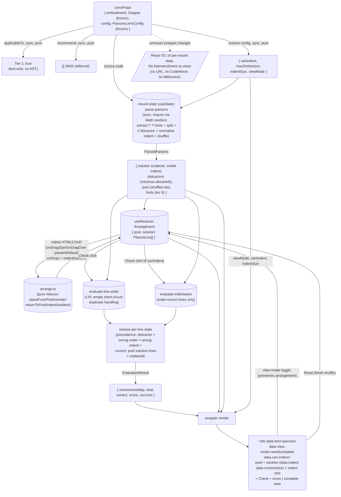

# parsons — Architecture & Decisions

## Why this module exists

The `parsons` lens is the learner's **assembly workbench**: a place to
reconstruct a program from its scrambled lines. The learner sees the snippet's
lines shuffled into an available pool (mixed with optional distractor lines that
do not belong), drags them into a solution column in the right order, indents
them to the right nesting level, and clicks **Check** to get per-line feedback
(correct / wrong place / wrong indentation, in a colour-blind-safe palette — a
placed distractor reads as "wrong place" and a missing line lowers the score, so
the feedback never reveals which lines are distractors) and a score. A Parsons
problem (Parsons & Haden 2006) isolates **program structure and sequencing**
from the load of recalling syntax — it sits earlier on the novice → competence
path than `blanks` (recall tokens); parsons asks the learner to **order and
nest** lines they are given.

It is a migrated pedagogical lens in WS4's batch, redone after the previous
sprint shipped a structurally-compliant shell that satisfied the `LensModule`
contract and passed tests + AR cycles but **never worked in a browser as a
learner** — a "weak hallucination" lacking the real pedagogy. That shell was
reverted (commit `a177317`, together with the blanks shell). This redo migrates
the legacy JSParsons pedagogy faithfully, treating the Sandbox Checkpoint as a
gate, not a celebration.

## Migration

The pre-refactor lens lived at `zz--…/spiral-lens/src/lenses/ParsonsLens.jsx` —
a thin React shell that `encodeURIComponent`'d the source into a sandboxed
`parsons-iframe.html?code=…`. The pedagogy lived inside that iframe in the
jQuery **JSParsons** widget (`Explorotron/libs/js-parsons/parsons.js`, 1446 LOC;
jQuery + jQuery-UI `sortable` + underscore) backed by a
**Longest-Increasing-Subsequence** grader (`public/static/parsonizer/lis.js`).
The V2 redo preserves the **pedagogical surface** (shuffle, distractors,
indentation grading, LIS-minimal-move order feedback, per-line correctness,
score) while replacing structural pieces:

- iframe + `?code=` → direct component mount with the `embodiment` prop
- jQuery / jQuery-UI `sortable` / underscore → native HTML5 Drag-and-Drop + a
  pure TS reducer (`lib/arrange.ts`); zero new dependencies
- the jQuery-coupled `parsons.js` widget → the pure algorithm vendored as TS
  (`lib/lis.ts`, `lib/parse-parsons.ts`) + new evaluator code
- Python-Parsons `#distractor` marker → the JS-idiom `// distractor`
- the `first_error_only` sequential grader → independent per-line evaluation
- binary `success` grade → a percentage score (V2 cross-lens convention) +
  `success`
- no URL state (legacy had none beyond `?code=`) → still none in v1 (deferred)

See `./README.md` for the public spec and the full lens-specific drop list, and
the handoff plan at `~/.claude/plans/parsons-lens-migration-tranquil-island.md`
for session-level decisions and the audit trail.

## Modules

| File                          | Layer   | Purpose                                                                                                                                                                                                                        |
| ----------------------------- | ------- | ------------------------------------------------------------------------------------------------------------------------------------------------------------------------------------------------------------------------------ |
| `index.tsx`                   | wrapper | React `Component`; owns arrangement + view state; native HTML5 DnD handlers; composes the core                                                                                                                                 |
| `core.ts`                     | core    | `LensModule` defaults — `config`, `applicableTo` (Tier 1), `recommend`                                                                                                                                                         |
| `lib/lis.ts`                  | core    | **Vendored** (from `parsonizer/lis.js`) — patience-sort → longest-increasing-subsequence → inverse-indices (the lines to move). Restores the original `_.max` selection (declines the parsonizer `.sort()` transcription bug). |
| `lib/parse-parsons.ts`        | core    | **Vendored & slimmed** — split lines, detect `// distractor`, normalize indent to relative levels, select distractor subset, shuffle the pool                                                                                  |
| `lib/evaluate-line-order.ts`  | core    | **New** — wraps `lis.ts` for per-line order correctness; empty short-circuit; duplicate-line handling                                                                                                                          |
| `lib/evaluate-indentation.ts` | core    | **New** — per-line indent-level correctness for order-correct lines                                                                                                                                                            |
| `lib/evaluate.ts`             | core    | **New** — composes the two evaluators into one `EvaluationResult`; resolves per-line precedence (distractor > wrong-order > wrong-indent > correct); marks `unplaced` solution lines; computes total/correct/score/`success`   |
| `lib/arrange.ts`              | core    | **New** — pure reducer for the arrangement (`placeFromPool`/`reorderWithinSolution`/`returnToPool`/`indent`/`outdent`)                                                                                                         |
| `types.ts`                    | shared  | `ParsonsLine`, `ParsedParsons`, `PlacedLine`, `Arrangement`, `LineCorrectness`, `CorrectnessMap`, `EvaluationResult`, `ParsonsLensConfig`                                                                                      |

Default export of `index.tsx` is the frozen `LensModule` record. The core
subsystems under `lib/` are internal; only `index.tsx` and (where applicable)
`core.ts` import them. The `lib/` subdirectory is eslint-ignored per
`eslint.config.mjs` § Global ignores — the vendored files (`lis.ts`,
`parse-parsons.ts`) preserve the legacy's style as a deliberate trade against
the mechanical-conversion mandate, and the new files (`evaluate-*.ts`,
`arrange.ts`) share the carve-out for WIP-duration consistency with the blanks
precedent. Tests target each subsystem in isolation (vitest, no jsdom) plus the
wrapper end-to-end (jsdom + `@testing-library/react`); tests live under `tests/`
(NOT `lib/tests/`).

## Architectural sketch

> Written Phase 0, before implementation. The Refactor step of each increment is
> held against this sketch. Domain terms only — no function names, no variable
> names, no pseudocode (React hook names like `useState` / `useReducer` /
> `useMemo` are acceptable as structural-mechanism references).

### Execution phases

1. **Mount + resolve config** (sync, pure) — the orchestrator passes a frozen
   embodiment and a frozen lens config via props. The wrapper reads four known
   config fields (`canIndent`, `maxDistractors`, `indentSize`, `viewMode`) with
   documented defaults; other fields are preserved but ignored. Initial
   per-mount state at mount: view mode seeded from config; the arrangement
   seeded from the parser's shuffled pool (all lines in the pool, solution
   column empty); the evaluation result is empty (populated on the first Check).

2. **Parse the snippet** (sync, **impure**, held as **mount-state** — NOT
   memoized) — the wrapper holds the `parse-parsons` result in lazy-seeded
   `useState` (see § Phase-8 additions for why `useState` over `useMemo`: the
   parse is impure via `Math.random()`, and Reset must reseed parse +
   arrangement atomically or a fresh parse's re-selected distractor subset
   desyncs `lineById`). The call is synchronous and does not parse an AST
   (parsons is text-only). Result shape per `ParsedParsons`: the model solution
   (ordered), the selected distractors (`min(maxDistractors, declared)`), the
   initial shuffled pool of line ids, and (Inc 9) the extracted hint blocks. The
   shuffle uses bare `Math.random()` (mechanical mandate); a valid shuffle never
   equals the model order for a multi-line solution. **`parsed` is
   mount-stable:** a config/source change REMOUNTS the component (preview
   `key={code}`, orchestrator editor↔lens toggle + lens switch) rather than
   re-parsing in place; only **Reset** reseeds it in-mount (replacing parse +
   arrangement together and clearing the evaluation result).

3. **Arrange** (per learner drag/indent, sync, pure reducer) — the learner's
   arrangement (`{ pool, solution }`) is `useReducer` state transformed by
   `lib/arrange.ts`. Native HTML5 DnD handlers in the wrapper are thin adapters:
   `onDragStart` records the dragged id + source zone in `dataTransfer`;
   `onDragOver` calls `preventDefault` (load-bearing — without it `onDrop` never
   fires); `onDrop` computes the insert index from the drop target and
   dispatches one pure action (`placeFromPool` / `reorderWithinSolution` /
   `returnToPool`). Indent/outdent controls dispatch `indent` / `outdent`. The
   reducer preserves the invariant that every line id is in exactly one of
   `pool` / `solution`. Indent starts at 0 on placement, persists across
   reorders within the solution, and resets to 0 on a pool round-trip (the pool
   stores no indent).

4. **Evaluate** (per Check click, sync, pure) — clicking Check calls the
   composing grader `evaluate.ts` (`buildEvaluation`), which produces the
   `EvaluationResult` by combining the two evaluators below under the precedence
   and computing `unplaced`/score/`success`. Order correctness comes from
   `evaluate-line-order`, which derives the LIS input per-Check by **matching
   each placed line's `code` to the next-unused solution line** (the legacy
   `lastFoundCodeIndex` walk — so identical lines are interchangeable and not
   penalized for "wrong copy"); lines not in the LIS are `wrong-order`; an empty
   arrangement short-circuits before the vendored LIS call (`patience_sort([])`
   builds a phantom `[[undefined]]` deck). Indent correctness comes from
   `evaluate-indentation` (only for order-correct lines, only when `canIndent`;
   the expected level is the matched solution line's). Distractors placed in the
   solution are `distractor`; solution lines still in the pool are `unplaced`.
   Per-line states resolve under the precedence
   `distractor > wrong-order > wrong-indent > correct`. The score is
   `Math.round(correct / total * 100)` over solution lines
   (`total === 0 → 100`), with unplaced solution lines counted in `total`.

5. **Render** (sync) — the wrapper emits the root
   `
`.
   In work view: the available pool (draggable lines) + the solution column
   (drop target, ordered placed lines with `data-indent` and, after Check,
   `data-correctness`) + indent controls + the Check button + the score
   (`aria-live="polite"`). **Work-view indent renders as compact guide steps
   (`data-parsons-indent-step`), NOT a `level * indentSize` margin** —
   `indentSize` is literal in the COMPLETE view only; controls sit on the right
   (see § Phase-8 additions). In complete view: the model solution rendered
   read-only at literal `level * indentSize`.

6. **Toggle + Reset** (the interactions not owned by phases 3–4) — the view-mode
   toggle swaps `viewMode` **without** clearing the arrangement (self-check
   affordance, parity with the blanks toggle); a Reset re-seeds the arrangement
   from a fresh shuffle and clears the evaluation result. (Drag/indent are phase
   3; Check is phase 4.)

7. **Unmount** (React-driven) — the orchestrator unmounts on snippet change or
   lens exit. Per-mount state (arrangement, view mode, evaluation result) is
   garbage-collected with the component instance. There are **no** listeners or
   timers to clean up (no URL surface, no CodeMirror, no debounce) — a simpler
   teardown than blanks.

### Data flow

> **Diagram currency:** the Parse node is `useState` mount-state (not
> `useMemo`). The Phase-8 render surface (info panel: legend / `extra lines: N`
> / hint blocks; the single view toggle; the per-level guide steps; the
> attempt-history modal + its `Attempt[]` state) is now SHIPPED (Inc 9–11) but
> is not re-drawn in this high-level diagram — see § Phase-8 additions for the
> authoritative deltas, including the browser-gate redlines (distractor fold,
> `unplaced` removal, Wong palette).

The diagram is per-mount. The orchestrator (upstream) supplies `embodiment` and
`config`; the recommender (sibling) calls `applicableTo` and `recommend`. The
render loop reads the arrangement state + the parse mount-state + (after Check)
the evaluation result; the drag/indent handlers feed arrangement updates through
the reducer. **There is no cross-mount persistence** — the arrangement,
evaluation, and attempt history die with the component instance (no URL state in
v1).

### Structural constraints

- **Two-layer module shape** — `core.ts` + the files under `lib/` do NOT
  `import React`. `lib/lis.ts`, `lib/parse-parsons.ts`, `lib/evaluate*.ts` (the
  two evaluators + the composing `lib/evaluate.ts`), and `lib/arrange.ts` are
  pure TS over plain values; `index.tsx` is the only file with React imports.
  Tests split: `tests/lis.test.ts`, `tests/parse-parsons.test.ts`,
  `tests/evaluate-line-order.test.ts`, `tests/evaluate-indentation.test.ts`,
  `tests/evaluate.test.ts`, `tests/arrange.test.ts`, `tests/core.test.ts` (no
  jsdom) + `tests/component.test.tsx` (jsdom). Per the lenses peer's
  [§ Structural constraints](../DOCS.md#structural-constraints).
- **`embodiment` parameter name** in core signatures (lenses-peer invariant).
- **`data-lens="parsons"` on the wrapper's root.** Load-bearing for
  sandbox-harness selectors. Per the lenses-peer invariant.
- **`data-view-mode`, `data-can-indent`, `data-indent`, `data-correctness`** on
  the relevant elements — sandbox-harness selectors + CSS hooks; renaming is a
  contract change. `data-correctness` carries only the four **placed** states
  (`correct|wrong-order|wrong-indent|distractor`), never `unplaced`.
  **Anti-leak:** `distractor` is styled identically to `wrong-order` (no
  distinct colour), pool lines carry **no** feedback attribute at all (the old
  `data-parsons-unplaced` is removed), and the legend lists only
  `correct|wrong-order|wrong-indent` — so the feedback never identifies the
  distractors. Feedback uses the Wong colour-blind-safe palette with
  border-style (solid/dashed/dotted) carrying the signal, not hue alone.
- **Tier 1 classification.** `applicableTo` returns `true` — parsons reorders
  text lines and needs no AST and no parse success. A **deliberate divergence**
  from `blanks` (Tier 2, `status.parsed`). Suitability (single-line / trivial
  snippets) is the recommender's concern; until WS2 the lens is offered for any
  snippet.
- **`recommend()`'s signature is locked at
  `(embodiment) => ReadonlyArray<Recommendation>`.** The v1 body returns `[]`;
  the WS2 follow-up replaces the body in place.
- **LensModule defaults return deep-frozen values.** `config()` returns a frozen
  `LensConfig`; `recommend()` returns a module-level frozen-empty-array
  constant; `applicableTo()` returns a primitive. Per the codebase's
  `freezeInPlace` / `cloneAndFreeze` convention (AGENTS.md § Deep Freeze Return
  Values).
- **`SerializableValue` discipline.** `ParsonsLensConfig` fields are primitives
  only (`canIndent`, `maxDistractors`, `indentSize`, `viewMode`). Domain values
  (`ParsonsLine`, `PlacedLine`, `Arrangement`, `CorrectnessMap`) are runtime
  structures, never stored in `LensConfig`. The deferred seeded-RNG is call-site
  injection, NOT a config field (a function is non-serializable).
- **Grading is a deliberate MODEL change, not a rendering tweak.** The legacy
  grader (`parsons.js` L609–723) is a sequential gate (`first_error_only`:
  indent only when zero order/count errors; `correct` only when zero errors
  anywhere). V2 evaluates each line independently (order via LIS; indent per
  order-correct line; `correct` per the line's own order+indent). This is the
  same justification as the blanks redo enabling its hints panel: per-line
  formative feedback is the load-bearing affordance. Documented as a behavior
  change in README § Feedback contract.
- **LIS selection restored to original intent.** `lib/lis.ts` is vendored from
  `parsonizer/lis.js`, whose L99 replaced the original underscore
  `_.max(scores, s => s.score)` (commented on L98) with a single-arg
  `scores.sort(s => s.score)[length-1]` — an invalid comparator that silently
  defeated the "most consecutive runs" tie-break. That is a de-underscoring
  **transcription bug**, not a JSParsons design choice (the original
  `js-parsons/lib/lis.js` uses `_.max`). V2 restores the `_.max` semantics
  (highest-consecutive-run LIS; first-max on ties), declining the defect exactly
  as it declines the `maxDistractors` overflow bug. `tests/lis.test.ts` pins the
  highest-score selection.
- **Empty-input guard.** `evaluate-line-order` short-circuits on zero placed
  lines (no LIS call). The vendored `patience_sort([])` builds a phantom
  `decks = [[undefined]]`; guarding before the call keeps the evaluator's
  contract clean rather than relying on the inverse-indices loop's zero-length
  save.
- **Arrangement invariant.** The reducer keeps every line id in exactly one of
  `pool` / `solution`. Tested in `tests/arrange.test.ts`.
- **Indent semantics.** Model indent levels are relative nesting depths from
  `normalizeIndents` (not raw spaces). Learner indent starts at 0, persists
  across reorders within the solution, and resets on a pool round-trip. Grading
  compares levels. `indentSize` is presentation-only.
- **Distractor cap is `min`, not the legacy overflow.** `parse-parsons` selects
  `min(maxDistractors, declared)` distractors — a deliberate non-propagation of
  the legacy `parseCode` `undefined`-push bug.
- **Toggle-preserves-arrangement invariant.** The view-mode toggle updates only
  `viewMode`; the arrangement is untouched. Tested at the wrapper level.
- **DnD writes to local state, never to `setSnippet`.** The arrangement is
  lens-local reducer state; `embodiment.source.code` is unchanged. Per the
  lenses-peer single-writer invariant.
- **Read-only views.** The lens never mutates `embodiment` or `config` (both
  deep-frozen anyway).
- **Disposable practice.** No `localStorage`, no module-level cache, no refs
  across mounts. **No URL state in v1** (legacy had none) — a deliberate
  divergence from blanks.
- **No consumer-side branching on `embodiment.source.code`.** The lens parses
  `source.code` into lines (legitimate consumption) but does not use it as a
  behavior discriminator.
- **LensModule surface stays synchronous.** `config()`, `applicableTo()`,
  `recommend()` are sync; parse, arrange, and evaluate are all sync-pure.
- **Display content rendered safely.** Line `code` strings render as plain text
  inside React elements (framework-escaped); never `dangerouslySetInnerHTML`.

### Out of scope

- **Cross-mount persistence of the arrangement / feedback.** Per-mount React
  state only; nothing survives unmount.
- **URL state.** v1 ships none (legacy parsons had none beyond `?code=`). A
  Future-direction item; would lift to the orchestrator. **All JS lenses
  converge here — `blanks` dropped its `url-config.ts` in the help-model
  redesign, so URL persistence is uniformly orchestrator-domain, not a per-lens
  surface.**
- **Snippet mutation / editing.** The lens is read-only; the arrangement is
  lens-local and never written back to `setSnippet`.
- **Code execution / run / trace.** Other lenses' jobs.
- **Seeded RNG for reproducible shuffles.** v1 uses bare `Math.random()` (the
  shuffle + distractor-subset selection) per the mechanical-conversion mandate.
  Reproducibility-via-seed is deferred (call-site PRNG injection).
- **Live (as-you-drag) feedback.** v1 is commit-then-Check by design (preserves
  the structural-reasoning value). A live-feedback toggle is deferred.
- **Keyboard / screen-reader reordering and touch DnD.** Native HTML5 DnD is
  pointer-oriented and accessibility-limited. A `@dnd-kit` swap (the pure core
  is drag-mechanism-agnostic) and explicit move/indent buttons are deferred.
- **Toggle-line distractors (`$$toggle$$`), embedded unit/variable tests, and
  Python-isms.** Out of scope; a richer-assessment follow-up.
- **Multi-language support.** v1 is JavaScript-only (the package is
  `study-lenses`); multi-language is an `embody/` concern.

## Phase-8 additions + browser-checkpoint reconciliations

> The wrapper's UX was reshaped at the per-increment browser gates, and a second
> DDD pass added four parsonizer-parity features (read faithfully from the
> legacy `…/parsonizer/component.js`). These are the deltas to the sketch phases
> above and to the structural constraints; the original phases otherwise stand.

- **Parse held as `useState`, not `useMemo` (phase 2 delta).** `parseParsons` is
  impure (`Math.random`), and Reset must reseed the parse AND the arrangement
  together — a fresh parse re-selects the distractor subset, which would desync
  `lineById` from the reducer if parse re-derived independently. So `parsed` is
  lazy-seeded mount-state, replaced atomically with the arrangement on Reset
  (React batches both). Mount-stable otherwise (snippet/config changes remount).
- **Indent rendering split (phases 3/5 delta).** `data-indent` is the semantic
  level. The **work view** renders it as `N` compact fixed-width guide steps
  (`data-parsons-indent-step`) — an alignment cue, NOT a literal margin — with
  the indent/outdent controls on the **right** so the code's left origin is
  fixed. `indentSize` is read ONLY for the **complete view's** literal
  `level * indentSize` rendering. Rationale for buttons-not-drag corrected:
  `clientX` IS available on `drop`; buttons are an a11y/precision/simplicity
  trade-off, not a hard limit.
- **Single view toggle (phase 6 delta).** One `data-parsons-view-toggle` button
  (label + `aria-pressed` track the view) replaces a two-button segmented
  control — a deliberate divergence from blanks (peeking is binary). Toggle
  changes only `viewMode`; it is not an `applyArrange` edit, so it preserves
  arrangement + feedback.
- **Block-comment hints (new parse output).** `parse-parsons.ts` extracts
  `/* … */` blocks (legacy regex) from the source before line-splitting, strips
  them from the orderable code, and returns
  `ParsedParsons.hints: ReadonlyArray<HintBlock>`. The parser tags each block's
  `summary` (`null` = no marker, `''` = empty marker, else the label text).
  **Render (Inc 10, redlined): every block is a collapsible `
` with a
  default `Hint` label** (body in a `<pre>`); a `parsons-collapse: <label>`
  marker only customizes that label (the old always-visible plain-`<pre>` mode
  is dropped). Summary + body render as escaped TEXT. Rendered above the board
  (`data-parsons-hints`). Only `/* */` blocks are extracted; `//` line-comments
  stay as orderable code (deliberate scope vs. the legacy `strip()`-all-comments
  — note this means a ported snippet with trailing `// note` comments keeps them
  as line text). **The extraction is a source→source pre-pass UPSTREAM of the
  existing split/normalize/guard pipeline and must preserve its invariants:**
  the empty-snippet guard (a hint-only source → empty exercise → score 100, no
  crash), indent normalization of the line following a stripped block (no
  phantom indent), and the marker-only-line drop. (An INLINE block mid-code-line
  is also stripped — eating its surrounding horizontal whitespace — which can
  leave a broken code remnant on that line; educators should place hint blocks
  on their own lines.)
- **Distractor-count + legend (new render).** `data-parsons-distractor-count`
  (`
`, N>0) and `data-parsons-legend` (the **3-state** colour key —
  `correct|wrong-order|wrong-indent`, the only states a learner can act on) sit
  in an info panel above the board (rendered in BOTH views). **Both collapsed by
  default** (a deliberate divergence from the always-open legacy). **Redline:**
  the distractor count is a spoiler, so its collapsed summary is spoiler-free
  and the `extra lines: N` text lives in the expandable BODY (revealed on
  expand), not the summary. The legend is a V2 add (legacy used bare marker
  classes) and uses the Wong palette swatches.
- **Attempt history (new in-mount state).** Each Check appends an `Attempt`
  (snapshot of placed lines' code+indent+correctness + score + success) to a
  `useState` array; a `data-parsons-history-open` button **in the toolbar**
  opens a React-state modal (`data-parsons-history-modal`, `role="dialog"`,
  closed via `data-parsons-history-close` or Escape — a document keydown
  `useEffect`; NOT the legacy `:target`/anchor hack) listing them. Persists
  across Reset (faithful), dies on unmount (in-mount only — squares with
  disposable-practice: no cross-mount persistence). **Snapshots are frozen at
  Check time and rendered verbatim — the modal NEVER re-grades** (re-derivation
  would diverge from what the learner saw; the same desync class as the
  parse-`useState` decision). The snapshot stores the **raw** graded
  `correctness` (incl. `distractor`); the modal CSS folds `distractor` into the
  wrong-place look exactly as the board does. **The legacy `history`
  enable/disable flag (default `true`) is dropped:** history is always-on, no
  config knob (no pedagogical case for disabling a non-destructive review
  affordance; keeps `ParsonsLensConfig` minimal).
- **Anti-leak redlines (browser-gate decisions — feedback must not identify the
  distractors).** (1) A placed `distractor` keeps
  `data-correctness="distractor"` but CSS renders it **identically to
  `wrong-order`** ("wrong place") — no badge, no distinct colour. (2) Pool-line
  feedback is **removed entirely**: the old `data-parsons-unplaced` hint is gone
  (flagging the missing solution lines would reveal the distractors by
  elimination); missing lines lower the **score** only. (3) The legend lists
  only the three actionable placed states. (4) Feedback uses the **Wong
  colour-blind-safe palette** (blue correct / vermilion error) with border-style
  (solid/dashed/dotted) carrying the signal, not hue alone — mirrors `blanks`; a
  dark-mode media query bumps the tint alpha (board + modal snapshot).
  `evaluate.ts` is untouched (it still computes `distractor`/`unplaced`
  internally for the score + snapshot); these are pure presentation rules.
- **New sandbox-harness `data-*` hooks** join the contract (renaming any is a
  contract change): `data-parsons-toolbar`, `-check`, `-reset`, `-view-toggle`,
  `-score` (value-bearing), `-legend`, `-distractor-count`, `-hints`,
  `-history-open`, `-history-modal`, `-history-close`, plus per-line
  `-indent-step`, `-indent`/`-outdent`. Internal (non-harness) hooks:
  `data-line-id`, `data-legend-state`, `data-parsons-attempt`,
  `data-attempt-success`, `data-snapshot-line`. (`-unplaced` is **removed**.)
  Types added: `HintBlock`, `Attempt` (runtime, not config — SerializableValue
  discipline unaffected); `ParsedParsons.hints` lands with its producer in the
  hint-extraction increment.

## Why grade per-line independently (vs. the legacy sequential gate)

The legacy `LineBasedGrader` stops at the first error class and only marks lines
correct when the whole arrangement is error-free — so a learner with one
misordered line gets a wall of nothing on every other line, and never sees
indent feedback until order is perfect. That is a submit-then-grade posture. The
redo exists precisely to prevent shipping pedagogy-free shells; per-line
formative feedback (here's what you got right, here's the one line to move,
here's the mis-indented block) is the load-bearing affordance that makes the
exercise self-pacing. This mirrors the blanks redo's decision to ship its hints
panel enabled-by-default rather than compiled-out. The legacy's per-line markers
(`markCorrect` / `markIncorrectPosition` / `markIncorrectIndent`) are reused as
the visual vocabulary; only the gating is removed. (AR-1 decision lock — the
early Phase-0 framing that mislabeled this as a "rendering change" was caught
and corrected.)

## Why a pure `arrange.ts` reducer (vs. inline drag handlers)

The prior shell died in the browser despite passing tests — the interaction
layer was the gap. Native HTML5 DnD cannot be exercised by jsdom, so RTL
component tests cannot prove drag works. Extracting the arrangement transitions
into a pure reducer (`{ pool, solution }` → action → `{ pool, solution }`) makes
the **logic** of the interaction unit-testable without a DOM, leaving only the
thin event-wiring (and the real drag behavior) for the manual browser
checkpoint. This splits the untestable-in-jsdom surface down to the smallest
possible adapter and puts every reorder/place/indent transition under
deterministic test. (AR-1 decision lock — added in response to the
interaction-underspecification finding.)

## Why restore the original LIS selection (vs. copying the parsonizer bug)

There are two vendored lineages of the LIS code. The original
`Explorotron/libs/js-parsons/lib/lis.js` uses underscore: `best_lise` selects
the maximal-consecutive-run subsequence via `_.max(scores, s => s.score)`. The
de-underscored `spiral-lens/public/static/parsonizer/lis.js` — the no-dependency
copy this lens vendors — replaced that on L99 with
`scores.sort(s => s.score)[length-1]`, a single-argument function passed to
`Array.sort` (not a valid comparator), with the original `_.max` left commented
on L98. The replacement silently broke the tie-break.

This is a **transcription bug introduced by the prior de-underscoring**, not a
JSParsons design decision — so "preserve the vendored algorithm" means preserve
the algorithm JSParsons actually shipped (`_.max` selection), not the parsonizer
copy's accidental regression. V2 restores the `_.max` semantics in `lib/lis.ts`
(pick the highest-consecutive-run LIS; first-max on ties, matching `_.max`) and
pins it in `tests/lis.test.ts`. This is the same declined-defect posture as the
`maxDistractors` overflow fix: a faithful conversion corrects transcription
errors, it does not enshrine them. (AR-2 surfaced the ambiguity — the original
docs cited "L99" without disambiguating which of the two lis.js copies; the
citation is now explicit and the decision is "restore," not "preserve.")

## Module ownership

The lens owns its own `README.md`, `DOCS.md`, `types.ts`, source (`core.ts`,
`lib/lis.ts`, `lib/parse-parsons.ts`, `lib/evaluate-line-order.ts`,
`lib/evaluate-indentation.ts`, `lib/evaluate.ts`, `lib/arrange.ts`,
`index.tsx`), and tests. Cross-cutting lens conventions (two-layer split,
`data-lens` invariant, `LensConfig` shape, no-source-code-branching
anti-pattern, disposable-practice) live in [`../README.md`](../README.md) +
[`../DOCS.md`](../DOCS.md); this lens inherits them.

## Future direction

See [`./README.md` § Future direction](./README.md#future-direction) for the
full list. Key directions in scope of this lens's evolution:

- **WS2 `recommend()` heuristics** — populate Block-Model placements; down-rank
  single-line / all-flat snippets too trivial to order.
- **Seeded RNG** — inject `random: () => number` at the call-site so the vendor
  stays mechanical; wrapper supplies a seeded PRNG when `seed` is configured.
- **`@dnd-kit` / keyboard reordering** — accessible, touch-capable drag; the
  pure core is drag-mechanism-agnostic.
- **Live feedback toggle** — educator-configurable as-you-drag grading.
- **URL state lifted to the orchestrator** — persist `canIndent` /
  `maxDistractors` / `viewMode` once the orchestrator grows a URL surface.
