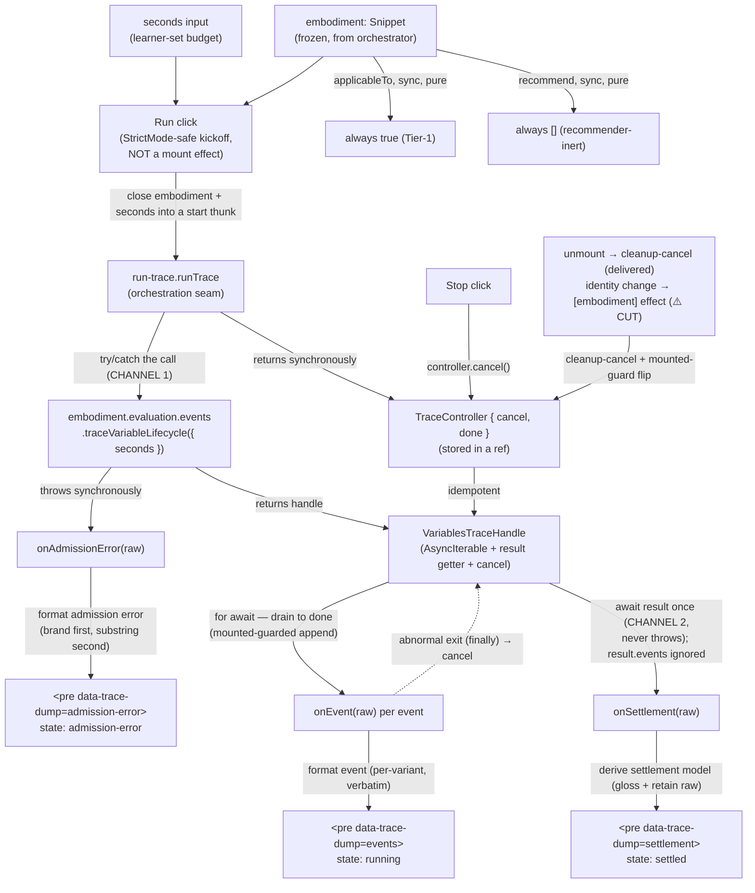

# trace-debugging — Architecture & Decisions

## Why this lens exists

`trace-debugging` is the **first real UI consumer** of the variables tracer's
own typed handle. The tracer
([`../../embody/lib/evaluating/trace/variables/`](../../embody/lib/evaluating/trace/variables/))
is complete and AR-5'd, and the embody surface now exposes it as
`evaluation.events.traceVariableLifecycle` — a raw method returning the tracer's
**own** `VariablesTraceHandle` (not the `AnyNMEvent` adapter `trace.variables`).
This lens runs a learner's Just-Enough-JavaScript through that method, streams
the typed lifecycle events into a `<pre>` dump, shows the terminal settlement,
and exposes Stop plus a seconds budget.

It is a **harness/debug surface**, not a pedagogical one — the readable proof
that the tracer streams, settles, cancels, and times out in the real
cross-origin-isolated browser. It is intentionally recommender-inert
(`applicableTo: () => true`; `recommend: () => []`) and panel-excluded (no
`phase`), exactly like [`debug-props`](../debug-props/). It is **not** the
polished prediction/quiz lens (a separate, later pedagogical surface).

> **Implementation status (dev-only reframe, 2026-06-30).** This lens is
> dev-only tracer-proof scaffolding; the pedagogical consumer lens is built
> fresh later. **Delivered:** the pure core, the `run-trace.ts` seam, the
> `index.tsx` shell (click-kickoff Run/Stop/seconds, the three dumps,
> **cleanup-cancel on unmount**, and a **per-run generation token** that gates a
> superseded run's late callbacks), the smoke page, and the real-worker
> `trace-debugging.browser.test.ts` (the four settlement classes). **Cut** — the
> sketch below still describes them as the design target, but a
> smoke-page-mounted dev harness needs neither, so they are NOT implemented
> (sections marked **⚠️ CUT** below): the `[embodiment]`-keyed
> **cancel-on-embodiment-identity** reset effect (no same-instance identity swap
> without the orchestrator), and the **StrictMode double-mount test**
> (click-kickoff already makes StrictMode safe; the mounted-ref + generation
> token hold the invariant). Registration in `LENS_REGISTRY` is likewise cut
> (the smoke page mounts the lens directly). The future pedagogical lens will
> own these.

## Architectural sketch

> Written Phase 0, before implementation. The Refactor step of each Phase-1
> increment is held against this sketch. Domain terms only — no function names,
> no variable names, no pseudocode (React hook names like `useEffect` / `useRef`
> / `useState` are acceptable as structural-mechanism references; the data-flow
> diagram names the seam and core projections as nodes).

The lens is a **three-layer module** — the lenses peer's two layers (a pure-TS
core plus a light React wrapper) plus an **async orchestration seam** between
them, because this lens's central behaviour is asynchronous: a streamed trace
run with two terminal channels. Async orchestration of a streamed protocol is
hard to exercise through React alone, so it is factored out (see
[§ Why the orchestration seam exists](#why-the-orchestration-seam-exists)).

### Trace derivation

A **trace run** consumes the embodiment's variable-lifecycle tracer through the
public access path on the `embodiment` prop. The seam invokes the tracer call
inside a guard. On success it receives a live handle: a lazy async iterable
whose terminal result resolves to the settlement. The seam pulls each **streamed
event** in arrival order, appending it to the events surface; it then awaits the
terminal result and projects the **settlement** into a render-ready model for
the settlement surface.

The pure core owns three stateless projections:

1. A verbatim, readable rendering of one streamed event across all six lifecycle
   variants (`scope-push`, `scope-pop`, `initialize`, `read`, `assign`,
   `increment`) — the events dump is the join of these.
2. The settlement display model — the outcome, a one-line headline, expanded
   detail lines, and the **retained raw** halt / engineError / failReason /
   duration (the readable gloss never replaces the raw data, so a verbatim dump
   stays faithful). The detail builder stringifies `failReason` (`unknown`)
   **defensively**: a string passes through; a non-string degrades to a safe
   `String(...)`/typeof label, never `JSON.stringify` on an unbounded or
   circular value — the builder runs in the render path, so a throw there would
   be a render crash, not a caught channel. (A `failed` settlement never
   originates here — Stop maps to `cancel()` — so this is defensive faithfulness
   for a foreign-sourced settlement; the first `core.test.ts` pins a
   circular-`failReason` boundary case.)
3. The admission-error text — the human-readable string for a channel-1 throw.

The streamed events are the **single source of truth** for the events dump; the
terminal result also carries a full `events` array, but the lens **ignores
`result.events`** and reads the result **only** for the settlement. (Reading
both would double-count, and on a cancelled run the stream and the result can
disagree on the final parked item.)

The events accumulate as a **per-mount, append-only list** in React state (raw
events, formatted at render via the core's event projection), so the events dump
is the rendered join; the list resets on an embodiment-identity change or a
rerun. One state update per streamed event is accepted — a debug HUD is not a
hot path. The **seconds budget** is parsed in the React wrapper before the start
thunk closes over it: an empty or non-numeric input is **omitted** (the call
falls through to the engine's default budget), never an error state — `seconds`
is not a channel-1 trigger (the call validates source, not the budget). Keeping
the parse in the wrapper leaves the seam's start thunk a plain handle-producer.

### The two channels

- **Channel 1 — synchronous admission throw.** The tracer call throws at the
  call site on **inadmissible input**, so the seam wraps the call in a guard; a
  caught throw means no run happened — the lens shows admission-error text and
  never enters the running state. Four throw shapes, with pairwise-disjoint
  detection: a plain `Error` whose message **contains** one of three stable
  authored **substrings** (`not available on canned scenario`,
  `not valid JavaScript`, `not Just-Enough-JavaScript`) — matched with
  `.includes`, NOT `.startsWith` (the real messages are prefixed
  `traceVariableLifecycle:` / `traceVariables:`, so the tokens are interior);
  the text is tier-authored (`embody/index.ts`,
  `tracers/variables/trace-variables.ts`), so a tier-side wording change breaks
  this classifier. The other shape is a **structurally-branded** boundary error
  (carries an own `instrumentBoundary === true` discriminant and a `reason`).
  The boundary error is **not** on the embodiment's public type surface, so it
  is detected by its structural brand, never by a type import. **Detection order
  is load-bearing:** because the boundary error _extends_ `Error`, the
  structural brand is checked **first** and the message substrings **second** —
  otherwise a branded error whose message happened to contain one of these
  substrings would mis-route. A non-`Error` throw degrades to its string form.
- **Channel 2 — settlement.** A run that proceeds ends only through the terminal
  result, **never by throwing**. The settlement carries one of five outcomes
  (`completed` / `errored` / `cancelled` / `failed` / `timed-out`); a
  worker-side stop carries a halt; an engine-side end (timeout, worker failure)
  carries an engine error; a consumer fail carries a reason. The seam surfaces
  the settlement to the display layer regardless of outcome — **cancel and
  timeout are settlements, not errors.** This lens exposes no consumer-fail
  control (Stop maps to cancel), so the `failed` outcome does not arise from
  user action, but the display model handles all five for faithfulness.

### React mount / run / stop / cleanup / embodiment-change lifecycle

- **Click kickoff (StrictMode-safe).** A run starts on a Run interaction, NOT in
  a mount effect — StrictMode double-invokes effects in development, which would
  spawn two worker-backed runs. The interaction closes the live embodiment and
  the resolved seconds budget over the start thunk and hands it to the seam; the
  seam returns a controller **synchronously**, stored in a ref so Stop can
  cancel before the first event.
- **Stop.** The Stop control reaches the held controller's cancel, which
  delegates to the handle's cancel — idempotent and a no-op after settle or
  before any run. Cancelling a live run settles it as `cancelled` (channel 2),
  which flows to the settlement surface normally.
- **Cleanup-cancel + mounted guard.** A cleanup effect cancels the held run on
  unmount so a worker-backed run is torn down (the disposability invariant). A
  mounted-guard ref gates every seam callback, so a late event or settlement
  arriving after unmount updates no state. The ref is set `true` in the body of
  **one** effect and reset `false` in **that same** effect's cleanup — so under
  StrictMode's mount→unmount→mount, React's ordering (the surviving mount's
  effect body runs after the discarded mount's cleanup) leaves the ref `true` on
  the live instance; splitting set and reset across effects would risk gating
  every callback off. The cleanup-cancel on the discarded first mount cancels a
  handle that was never started — a no-op, since kickoff is click-only.
- **Cancel-on-embodiment-identity.** ⚠️ **CUT (dev-only reframe — not
  implemented; the per-run generation token + a `key={code}` remount cover the
  dev harness).** The orchestrator mounts the lens with **no `key`** (the
  lens-mount site, [`../../orchestrate/index.tsx`](../../orchestrate/index.tsx)
  ~L908 — `<lensModule.Component embodiment={…} config={…} />` carries no
  `key`), so the internal debounced/flush re-embody swaps the `embodiment` prop
  **identity** on the **same component instance** — there is no remount. (The
  lenses-peer DOCS's "React unmounts when the snippet changes" describes the
  _caller's_ `key={…}` remount path; the internal re-embody is distinct —
  lens-mode coherence pins the snippet constant while minting a fresh embodiment
  object, so only an **identity**-keyed effect catches it, not a `source.code`
  _value_ effect.) A single effect keyed on the embodiment owns both halves: its
  cleanup cancels the old run, its body resets the dumps to `idle`. This is a
  **new** pattern with no exact sibling precedent — the `annotate` lens's
  `cancelled`-flag, `source.code`-value-keyed effect is a weaker analogue, not a
  mirror. No orphaned worker survives the swap.
- **No undrained-iterable / no-hung-worker invariant.** Claiming the handle's
  async iterator imposes backpressure: an abandoned `for await` would freeze the
  worker at a parked item and leave the terminal result pending forever.
  Therefore every kicked-off run is **fully drained** (the loop pulls to
  completion) or **explicitly cancelled** (break-out == cancel) — the seam never
  abandons a handle mid-stream without cancelling. The mounted guard gates the
  callback, **never** the pull. To make this **total** rather than aspirational,
  the seam wraps the drain in a
  `try { … } finally { try { cancel() } catch {} }`: **any** abnormal loop exit
  (a throwing `onEvent`, an unmount tearing down mid-pull) still routes through
  `cancel()` — idempotent, a no-op on an already-settled run. The `finally`'s
  cancel is **itself guarded**: the handle's `cancel` is contracted idempotent
  but **not** no-throw (it forwards bare to the engine's worker/iframe teardown
  — `tracers/variables/trace-variables.ts`), so a throwing cancel is swallowed
  (best-effort teardown). That guard, plus catching callback throws, is what
  makes the seam's `done` promise **resolve on every path and never reject** —
  genuinely total, not merely asserted — which is why the wrapper may ignore
  `done` without a `.catch` (no `no-floating-promises` violation).

### Why the orchestration seam exists

The seam (`run-trace.ts`) exists for **Node-testability, not reuse**. The lens's
hard behaviour is async: a streamed run with a synchronous channel-1 throw, an
async channel-2 settlement, mounted-guarded appends, idempotent cancel, and the
backpressure-drain invariant. Exercising that only through the React wrapper
would force every case through jsdom plus a faked worker, and the real worker is
browser-only. Factoring the orchestration into a pure async function lets it be
driven in plain Node against a **fake handle** (an async generator plus a result
promise plus cancel/fail spies, settling `cancelled` on iterator return),
injected via the start thunk — every settlement class, the channel-1 throw, the
mounted-guard drop, and idempotent cancel become fast unit tests with no React
and no worker. The seam takes a start thunk (so the guard wraps the embody
call), raw callbacks, and a mounted predicate, and returns a cancel controller
plus a `done` promise (the wrapper ignores `done`; tests await it for
determinism). This mirrors the tracer tier's own two-tier testing doctrine (Node
logic via a fake transport; browser fidelity via the real worker). This is a
genuine bounded-context boundary (orchestration of an async protocol),
categorically heavier than the sibling `annotate` lens's single fire-and-forget
`.then()` — which is why `annotate` keeps its async in-component and this lens
does not.

### Data flow

The diagram is per-mount. The orchestrator (upstream) supplies `embodiment` and
`config`; the recommender (sibling) calls `applicableTo` (always `true`) and
`recommend` (always `[]`). The exercise UI is the three dumps the operator
reads; their content is per-mount, and the lens cancels its run when the lens
unmounts (cleanup-cancel — delivered); the snippet-change identity effect is ⚠️
cut (dev-only; see § Implementation status).

### Structural constraints

- **Three-layer module shape** — `core.ts` (no React, no async) + `run-trace.ts`
  (pure async, no React) + `index.tsx` (React wrapper). The seam imports zero
  React; the boundary stays clean. Tests split: `tests/core.test.ts` (no jsdom),
  `tests/run-trace.test.ts` (fake handle, no jsdom / no worker),
  `tests/component.test.tsx` (jsdom + `@testing-library/react`),
  `tests/trace-debugging.browser.test.ts` (real worker).
- **`data-lens="trace-debugging"` on the wrapper's root element** — load-bearing
  for sandbox-harness selectors.
- **Stable harness selectors** — `data-trace-control="run" | "stop" | "seconds"`
  on the controls; `data-trace-dump="events" | "settlement" | "admission-error"`
  on the three output surfaces. Renaming or removing one is a contract change.
- **`embodiment` parameter name** wherever a function takes a `Snippet`.
- **Tier-1 classification** — `applicableTo` always returns `true`;
  admissibility is a call-time `try/catch` concern (channel 1), not an
  `applicableTo` gate (the embody method's guard is inverted vs the NM tiers —
  its JSDoc says "Guard with `try/catch` instead").
- **Recommender-inert** — `recommend` always returns `[]`; the lens never
  surfaces in the Q-II recommendations panel.
- **Click-kickoff, not effect-kickoff** — the run starts on an interaction,
  never a mount effect (StrictMode double-fire safety).
- **Cancel on unmount** (the cleanup-cancel — delivered; ⚠️ the on-embodiment-
  identity-change half is **CUT**, dev-only), with a mounted-guard ref + a
  per-run generation token; idempotent cancel; the no-undrained-iterable
  invariant — the drain is **total** (a `try/finally` whose **guarded** cancel
  settles on every path and catches callback throws, so the seam's `done`
  resolves always and never rejects).
- ⚠️ **CUT (dev-only reframe — test not written; click-kickoff makes StrictMode
  safe and the mounted-ref + generation token hold the invariant).** **A
  StrictMode double-mount test pins the mounted-guard survival** — after the
  development-mode mount→unmount→mount, the live instance's ref reads `true`
  (set in one effect's body, reset in that same effect's cleanup), and the
  discarded first mount's cleanup-cancel is a no-op (no handle, since kickoff is
  click-only). This is the sibling-less pattern (§ lifecycle,
  "Cancel-on-embodiment-identity") made a held invariant rather than an asserted
  one.
- **Read-only views** — the lens never mutates `embodiment` or `config` (both
  deep-frozen by the orchestrator anyway).
- **Disposable practice** — no cross-mount state, no `localStorage`, no refs
  across mounts.
- **No branching on `embodiment.source.code`** — source is forwarded to the
  tracer, never used as a branching key.
- **Display content is text, not markup** — dumps render via `<pre>`, never
  `dangerouslySetInnerHTML`.
- **Named function declarations** for multi-statement logic (block-bodied arrows
  are forbidden), and `Array.from(...)` over `[...iterable]` for any Set/Map (a
  Babel-loose mistranspile only the production build catches; array spread is
  fine).
- **Structural (not type-import) detection** of the boundary error;
  **type-only** imports from `embody/types.js`.

### Out of scope

- **The embody `AnyNMEvent` / `RunInstance` / `EndReport` adapter.** The lens
  consumes the tracer's own handle directly; the uniform NM-event adapter
  (`trace.variables`) stays stubbed and is a different surface.
- **The polished prediction/quiz lens.** The pedagogical surface that hides
  values and quizzes the learner on the next variable state is a separate, later
  effort; this lens is the debug HUD that precedes it.
- **Any change to the tracer tier** (`tracers/variables/`). It is complete and
  AR-5'd — surface bugs, do not patch in-lens.
- **Pedagogical scoring or completion tracking.** No `exercise-completed` event
  ever fires from this lens.
- **Schema validation of incoming props.** The lens trusts the orchestrator's
  contract; mismatches are upstream bugs.
- **Editable source input.** Single-writer editing lives in
  [`../../orchestrate/editor/`](../../orchestrate/editor/); this lens displays a
  run, it does not edit the snippet.
- **CSS theming.** The wrapper renders semantic HTML; styling is the consuming
  page's concern (the Docusaurus theme cascade applies).

## Why a debug lens that streams (rather than `await result` only)

A simpler lens could call `traceVariableLifecycle` and `await` only the terminal
result, then dump `result.events` + `result.settlement` in one shot. That was
rejected: the definition of done needs an **observable Stop** and a **live
timeout**, and a one-shot await cannot demonstrate cancel mid-stream — the Stop
button would have nothing to interrupt. Streaming the events as they arrive (and
reading the result only for the settlement) is the locked decision because it is
the only shape that proves the cancel and timeout paths in the real UI. The cost
is the backpressure-drain invariant
([§ lifecycle](#react-mount--run--stop--cleanup--embodiment-change-lifecycle)),
which the seam owns and tests pin.

## Why "always true" applicability + empty recommendations

The lens is for harness/development work, not pedagogical surfaces. If
`applicableTo` returned `false` outside debug builds, the harness could not
mount it during real verification runs. If `recommend` returned anything, the
lens would pollute the Q-II recommendations panel for real curriculum pages.
Both behaviours are deliberate recommender-inertia, matching `debug-props`.
Crucially, admissibility is NOT decided here: the embody method's guard is
inverted (it admits a throwing canned `OK` and rejects a working real apex), so
gating `applicableTo` on any `status.*` flag would be wrong. The lens stays
mountable on any snippet and lets the call's `try/catch` (channel 1) decide.

## Why a three-layer module here

`debug-props` is two layers (pure core + React wrapper) because its derivation
is synchronous and pure. This lens adds a third layer — the `run-trace.ts`
orchestration seam — because its core behaviour is an **async streamed
protocol** with two terminal channels, a backpressure invariant, and idempotent
cancel. That orchestration cannot be unit-tested through a React effect without
jsdom and a faked worker; extracting it into a pure async function with an
injected handle makes every async case a fast Node test. The seam is justified
by testability, not reuse, and it imports zero React so the layer boundary stays
honest. See
[§ Why the orchestration seam exists](#why-the-orchestration-seam-exists).

## Module ownership

The lens owns its own `README.md`, `DOCS.md`, `types.ts`, source (`core.ts` +
`run-trace.ts` + `index.tsx`), and tests. Cross-cutting lens conventions
(two-layer split, `data-lens` invariant, `LensConfig` shape,
no-`source.code`-branching anti-pattern, lens-purity) live in
[`../README.md`](../README.md) + [`../DOCS.md`](../DOCS.md); this lens inherits
them. The tracer contract it consumes is owned by
[`../../embody/`](../../embody/); the lens depends on it type-only.

## Future direction

- **The prediction/quiz lens** supersedes this one as the learner-facing
  surface; it will reuse the tracer's `fail(reason)` consumer-stop (which this
  lens does not surface) for "you predicted wrong" interactions.
- **A webpack worker-chunk acceptance harness** — the campaign must re-prove,
  after this lens lands, that the tracer's module worker bundles under
  Docusaurus/webpack (a `[...Set]` / split-module hazard that Vite/vitest cannot
  catch). That proof is a build-config gate, owned outside the lens.
- **A "diff against predicted" mode** could turn the passive dump into an active
  assertion surface; out of scope here, noted for a later pedagogical lens.
