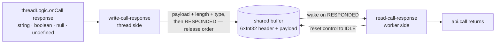

# engine/worker — Architecture & Decisions

Vocabulary: [../README.md § Glossary](../README.md). The engine-level
constraints this layer serves (pause ordering, the Stops block):
[../DOCS.md § Structural constraints](../DOCS.md).

## The wire

Emits and call requests ride `postMessage` (FIFO, order-preserving); only the
**call response** rides the shared buffer — a fixed 8192-byte SharedArrayBuffer:
a six-slot Int32 control header, then an 8168-byte UTF-8 payload area. The
layout facts (total size, six-slot header, payload at byte 24) are ported from
the old intercept engine's protocol; the payload ceiling and its bounds check
are new — the old engines wrote the payload area unbounded.

## Data flow

## Constraints (correctness, not style)

- **Release ordering**: every data write (payload bytes, byte length, type code,
  value flag) lands before the control slot flips to RESPONDED. The worker wakes
  on the signal and must observe a complete response.
- **Bounds check before any store**: an over-ceiling response throws a
  RangeError naming the ceiling and the actual size and leaves the buffer
  untouched — no partial writes, no silent truncation. Measurement is in ENCODED
  bytes, never characters.
- **Read resets the channel**: decoding stores IDLE back to the control slot so
  the next round-trip starts clean — the channel is reusable within a run.
- **Untouched means zero**: a freshly created buffer is all zeros; the
  protocol's signal values are chosen so zero is the idle/default state of every
  slot.

## Why a typed module, not an inlined script

The old engines duplicated the worker-side read logic inside generated
worker-script strings because Blob-URL workers cannot import modules. Module
workers make this layer a single typed, directly-testable module — ending that
duplication is part of why the engine exists
([../DOCS.md § Why this design](../DOCS.md)).
