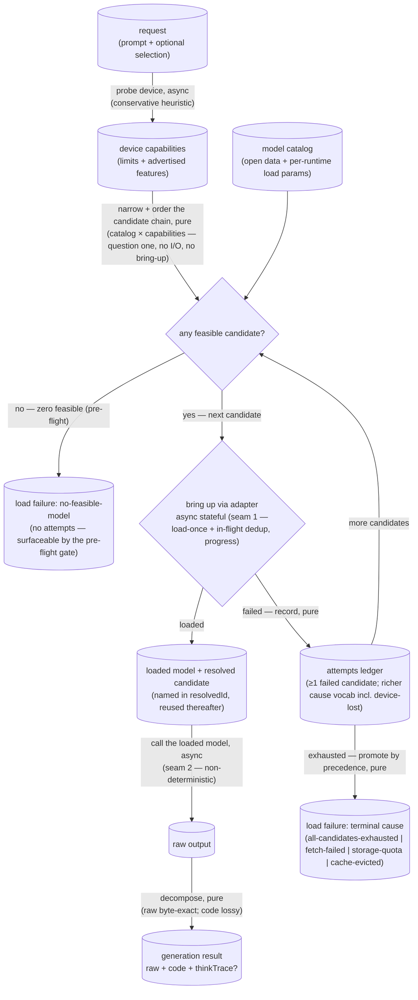

# local-llm — Architecture & Decisions

Vocabulary: [README.md § Ubiquitous language](./README.md). The refusal map and
the local-only invariant: [README.md § Edge cases](./README.md). The
dependency-direction exemplar this module follows (own your contract; consumers
re-map): [`../engine/DOCS.md`](../engine/DOCS.md).

## Architectural Sketch

> Written Phase 0, before implementation. The Refactor step is held against this
> document — not what the code does, but what shape it takes.

The module answers two questions — _what can this device run?_ and _given a
model, run it_ — split by one internal seam: a **pure selection core**
(capability match, feasibility, selection, decomposition) and an **impure
lifecycle** (a stateful loader and a non-deterministic model call). The pure
core answers question one on its own — it reports the feasible set, or the
single chosen entry, with no I/O and no bring-up — so the loader is the one verb
that crosses the seams. The sketch's point is to keep those two impure points on
the far side of a seam so the rest is data-in, data-out, and the host's injected
backends are the only thing that touches a network or a GPU.

## Execution phases

1. **Capability probe** (async, device-boundary read) — input: the device;
   output: a device-capabilities profile. A **conservative heuristic** — WebGPU
   presence, its adapter's advertised features, the probed buffer limits (kept
   for diagnostics, not feasibility gating), a coarse memory bucket, storage
   headroom, WASM features — never an exact resource readout (the browser does
   not expose total VRAM). Injectable, so the pure phases below test without a
   real device.

2. **Feasibility, selection & chain ordering** (sync, pure) — input: device
   capabilities + the catalog + an optional preference; output: a chosen catalog
   entry (or nothing-feasible) **and the ordered candidate chain** — the
   feasible `(model, runtime)` pairs in descent order. Narrows the catalog to
   what the device can bring up on a _registered_ runtime (a model whose
   required WebGPU features the adapter lacks is filtered out), then picks: an
   explicit named model if feasible, else the **cost-aware default** rung (which
   weighs the one-time download, not the largest that fits). The chain orders
   the feasible candidates **browser-first then descending-size** — the
   cost-aware default first, then smaller candidates, then a switch to CPU/WASM
   — so the ordering is a **pure, upstream** product the loader consumes
   unre-ordered. An explicit named preference is first checked for **catalog
   membership** — absent ⇒ a precondition throw (a programmer error), _before_
   any feasibility reasoning; present-but-infeasible ⇒ the nothing-feasible
   value, kept distinct (a named model pins to its single artifact — no
   descent). This pure result is **reportable on its own** — the feasible set or
   the chosen entry — answering question one without a bring-up. No I/O, no
   model.

3. **Model bring-up — the fallback chain** (async, stateful — seam 1, load-once)
   — input: the ordered candidate chain + the registered adapters; output: a
   loaded model with its resolved candidate, or a typed terminal load failure.
   The chain tries each candidate in order — the cost-aware default, then
   smaller, then a switch to a CPU/WASM runtime — bringing each up through its
   adapter (fetch-once / load-once-reuse, in-flight dedup per resolved id). A
   candidate's failure is **intermediate**: it is recorded in the attempts
   ledger and the chain descends to the next. Only an **exhausted** chain
   refuses, with a terminal cause **promoted from the ledger by precedence** (a
   pure reduction). The descent is **silent and honest** — the learner never
   opts in, the chain reports one calm progress narrative (not a per-candidate
   sequence of download bars), and the winning candidate is named in
   `resolvedId`. The chain is deterministic given `(selection, capabilities)`,
   so concurrent identical loads converge on one winner over the shared per-id
   cache. The fetch/cache/run mechanics sit below this seam — the backend's.

4. **Generation & decomposition** (async — seam 2, the model call; then sync,
   pure) — input: a prompt + a loaded model; output: a decomposed generation
   result. The model call is the only non-reproducible point (the same prompt
   may differ). Decomposition then separates the reply into byte-exact raw, an
   extracted code part (a lossy parse — a fence-miss falls back to the raw), and
   an optional reasoning trace — separation only, never validation.

## Data flow

The chain has **two** failure exits — a **pre-flight** `no-feasible-model`
(selection-time, pure; no attempts, so the pre-flight gate can show it before
any bring-up) and a **post-flight** terminal cause (after ≥1 candidate failed).
The post-flight cause is a **pure reduction** of the attempts ledger by
precedence; the ledger's richer per-attempt causes (incl. `device-lost`) are
**diagnostic**, and the terminal value is always one of the four public
post-flight causes. Both exits are delivery-agnostic typed values — the consumer
maps them to guidance (incl. a native-app recommendation). An unknown model name
is not on the diagram: it is a precondition throw, not a data state (see
constraints).

## Structural constraints

- **The two seams are the only impure points** (load-bearing): the stateful
  loader (chosen entry → loaded model, load-once + in-flight dedup) and the
  non-deterministic model call (loaded model → raw output). Capability matching,
  feasibility, selection, and decomposition are pure given the injected probe
  and adapters. Decomposition never reaches the model.
- **The generator never judges.** No validation, conformance, or gating runs
  here; `raw` is byte-exact and `code` is a best-effort lossy parse. Any
  cleaning of `raw` would be a defect.
- **Failure is a value, not a throw.** Every load-failure cause is a returned
  value — one **pre-flight** cause (`no-feasible-model`, the chain never ran)
  and a set of **post-flight** causes (the chain was tried and exhausted). The
  lone throw is a precondition, evaluated _before_ feasibility — an unknown
  model name (absent from the catalog) is a programmer error, fail-loud, kept
  distinct from a named-but-infeasible model (which is the nothing-feasible
  value).
- **The fallback chain is ordered in the pure phase, consumed in order by
  bring-up.** Phase 2 (pure) produces the ordered candidate chain; phase 3
  (impure) iterates it and never re-orders. The chain is therefore deterministic
  _before_ any I/O — which is what lets the per-id cache converge concurrent
  callers (below).
- **The chain is a descent, never an ascent.** It starts at the cost-aware
  default and steps toward smaller/cheaper candidates, then switches runtime
  (browser → CPU/WASM); a model heavier than the default is an explicit opt-in,
  never silently tried. A device can have zero feasible candidates — the chain
  then honestly refuses.
- **Silent honest descent — one calm narrative.** The learner never opts into a
  fallback; honesty lives in `resolvedId`. Intermediate candidate progress
  reports under one candidate-agnostic label, never a sequence of per-candidate
  download bars.
- **Pinning is artifact-precise.** A named catalog id pins exactly that
  `(model, runtime, quant)` build and fails loud if infeasible (no descent); to
  run a model family on whatever runtime works, name a feasible sibling or use
  the default pick-for-me. `feasibleModels()` lists the runnable sibling.
- **Failure causes are delivery-agnostic.** A load failure names a typed cause
  and never a product; the consumer maps a terminal cause to a next step (incl.
  recommending a native runtime), preserving the local-only / no-server-hatch
  invariant.
- **The attempts ledger is diagnostic.** A post-flight failure carries a
  non-empty per-candidate ledger with a richer cause vocabulary than the public
  terminal enum (it names `device-lost`/`unknown`), for tests and a future
  debug/instructor view; the consumer relay does not read it. The terminal cause
  is promoted from the ledger by precedence — a pure reduction.
- **Storage-quota is sticky.** A capacity failure does not stop the descent (a
  smaller candidate may fit), but if even the smallest candidate cannot cache,
  quota is the terminal cause — partial-fetch cleanup between candidates is the
  backend's and is not assumed.
- **The probed buffer limits are diagnostic, not a feasibility gate.** WebGPU
  exposes no binding per-model buffer requirement for the catalog's models, and
  its own runtime _tries, warns, and falls back_ rather than refusing below a
  limit — so feasibility does **not** pre-gate on `maxBufferBytes` /
  `maxStorageBufferBindingBytes`. The webllm gates are a **coarse admission
  filter**: WebGPU **presence** (hard), the features a model **advertises** when
  WebLLM lists them (partial — many q4f16 builds list none), and a
  **system-RAM** budget (`navigator.deviceMemory`, NOT a VRAM readout — the
  browser exposes no VRAM). A binding-limited device (e.g. Firefox / Android at
  the 128 MiB floor) is therefore **not** pre-refused; its WebGPU candidates may
  enter the chain and fail at bring-up, where the chain descends to a smaller
  candidate or a CPU/WASM runtime — the chain is the real backstop for
  everything the coarse filter admits but can't predict. The limits stay on
  `DeviceCapabilities` as **diagnostics** (surfaced in `canRun` and a failure's
  `detail`).
- **Browser-first ordering accepts a possibly-doomed fetch, bounded by the
  cost-aware default.** Because buffers no longer pre-gate, a binding-limited
  device may spend one WebGPU bring-up before the switch to CPU/WASM. The first
  WebGPU candidate is the cost-aware default (`chain[0]`), capped by the cost
  ceiling — so on a low-budget device it is already a small, cheap rung, and the
  worst-case wasted fetch is bounded by that default's download, not by the
  largest model the device could nominally fit; the remaining WebGPU candidates
  **descend** in size before the runtime switch. _(Supersedes the earlier rule
  that made a buffer gate a hard prerequisite of browser-first ordering: the
  prerequisite is removed, replaced by this cost-ceiling bound + descent —
  consistent with the cost-aware default policy.)_
- **Convergence assumes a stable capability probe within a session.** The chain
  re-runs per `load` call; a non-deterministic probe (different capabilities
  across concurrent calls) breaks per-id-cache convergence and is out of
  contract.
- **No-WebGPU is not an automatic refusal.** A registered CPU/WASM runtime with
  a feasible tiny model still loads; only an empty feasible set across _all_
  registered runtimes refuses.
- **The WebGPU feature gate lives inside the webllm branch, after the WebGPU
  presence guard.** A model's required WebGPU features (e.g. `shader-f16`) are
  checked against the adapter's advertised set only once WebGPU is present, so a
  no-WebGPU device is already refused before features are consulted. A
  feature-mismatch is a new _resolution_ of the existing feasibility decision
  (an infeasible model), not a new data path — it refuses up front rather than
  failing mid-bring-up.
- **Selection is cost-aware by construction.** The default pick weighs the
  one-time download and never auto-selects the largest feasible model; the
  resolved pick is always reported, so the heuristic is never a black box.
- **The catalog is data.** The open set grows by editing data, never by changing
  a type; selection prefers browser runtimes, with desktop ones explicit opt-ins
  that break the no-install property.
- **Sampling defaults live in the adapter, per model.** There is no per-call
  sampling override across the seam.
- **Offline-capability is best-effort.** A fetched-once model runs offline from
  cache, but eviction can force a refetch that fails offline (the
  `cache-evicted` cause, distinct from `storage-quota`) — the cache is mitigated
  (durable storage, persisted), not guaranteed.

## Out of scope

- **Validation, conformance, gating, repair** — the consumer's (aithor's
  admission, conformance, and repair loop). This module imports no validator and
  reads no output.
- **Selecting which generation-result part to use** — `code` vs `raw` is a
  use-case choice (curated vs. raw-drift), the consumer's, not the runtime's.
- **Prompt construction** — the consumer hands in a finished prompt.
- **The inference mechanism** — how a backend fetches, caches, and executes a
  model sits below the bring-up seam; this module names _which_ model and drives
  _when_, not _how_. The runtime is injected.
- **Constructing the runtime and supplying the adapter map** — the host builds
  the runtime once with the backends it ships (and may override the catalog, the
  capability probe, and the browser-first preference order); this module
  registers no global and ships no adapter. An entry whose runtimes are all
  unregistered is simply not loadable.
- **The catalog's contents** — the concrete model list is data the host/module
  supplies; this sketch covers the catalog's shape and use, not its entries.
- **JeJ, the language level, pedagogy** — the runtime is JeJ-agnostic; once text
  exists it is an ordinary string the consumer interprets.
- **Generation-time fallback** — the chain is **load-time only**; once a model
  is loaded, a failing generation propagates, it does not re-descend.
- **Mid-generation device-loss** — the load-time `device-lost` outcome (a GPU
  drop _during bring-up_) is recorded in the attempts ledger and folds to
  `all-candidates-exhausted`; recovering from a device lost _during generation_
  is not in scope.
- **Chain cancellation** — `load` takes no `AbortSignal`; cancelling a long
  multi-candidate descent is a real future need the chain creates, but is not
  modelled here.
- **The cause→guidance render surface** — mapping a terminal cause to copy/a
  download URL (incl. naming a product) is the consumer's; this module emits
  only a delivery-agnostic cause.
- **The repetition guard, the desktop shell build, and the second/third
  adapters** — the per-model sampling guard against tiny-model degeneration, the
  native shell that the terminal refusal points at, and the CPU/WASM +
  local-server adapters are downstream build work, not this sketch's contract.

## Related

- [`./README.md`](./README.md) — what this module is (the two questions, the
  ubiquitous language, owns vs. excludes).
- [`./types.ts`](./types.ts) — the contract in TypeScript (the catalog, the
  per-runtime load union, the loaded model and generation result, the load
  failure).
- [`../engine/DOCS.md`](../engine/DOCS.md) — the sibling stateful `lib/`
  resource and the dependency-direction template (own your contract; consumers
  re-map).
- [`../../embody/language-levels/just-enough-javascript/aithor/DOCS.md`](../../embody/language-levels/just-enough-javascript/aithor/DOCS.md)
  — the primary consumer; aithor injects this as its model runtime and re-maps
  the load failure into its own `no-model-available` refusal.
- [`../README.md`](../README.md) — the package-level shared `lib/` (what belongs
  here; peer-independence).
