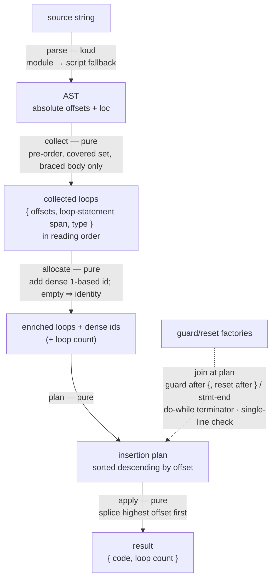

# lib/loop-guard — Architecture & Decisions

## Context

Two runners — the sandbox runner (intercept) and the same-origin iframe runner
(danger) — need the same loop-guard behavior, and the sandbox runner's new
helper protocol needs the guard AND reset **call text to be caller-supplied**
(its counters live in a worker closure, so a raw counter-assignment reset is no
longer reproducible). This module is that behavior re-authored with the call
text parameterized: it takes a learner-provided source string and two call-text
factories, walks the source's AST, and returns a transformed string with the
factories' guard and reset calls injected into every covered loop.

The transformation is a string-level splice driven by AST positions. The
original source's characters are preserved one-for-one in the output except at
the two anchor points per loop (immediately after the body's opening brace, and
at the loop's end). **Line count is preserved exactly.**

## Re-authoring vs the behavior oracle

This sketch is a re-authoring of the excluded behavior oracle
(`embody/lib/evaluating/shared/guard-loops/`), not a refactor of it, and not an
import of it. Two deliberate differences:

- **Parser: acorn, not recast.** The oracle parsed with recast, which reports
  columns as visual widths (tabs expanded), forcing a tab-aware column-to-offset
  computation. acorn annotates every node with **absolute character offsets**,
  so that entire computation phase is deleted. Anchor offsets read straight off
  the loop and its body nodes.
- **Call text: caller-supplied, not hardcoded.** The oracle hardcoded a
  throwing-guard string and a counter-assignment reset string. Here both are
  produced by caller factories (one per guard, one per reset), so intercept can
  inject closure-counter **calls** and danger can inject its `var`-global
  **assignment** through the same splicer.

The **covered set is unchanged** from the oracle:
`{WhileStatement, ForStatement, DoWhileStatement, ForOfStatement}` with a braced
body. Two **distinct** exclusions remain: `ForInStatement` is excluded **by
type** (object-property iteration is off the JeJ surface — a braced for-in
_does_ have brace anchors, so anchor absence is not its reason), and any
**brace-less** body is excluded for lack of `{`/`}` anchors. The runner's own
budget, where it has one, is the only backstop for what passes through.

## Execution phases

1. **Parse** (sync, throws on malformed source) — Drive the source through a
   parser that yields an AST with absolute character offsets and line/column
   positions on every node. The parse tries module semantics first and falls
   back to script semantics if module parsing fails, so admissible constructs
   that are script-only still parse; loop structure is identical across the two,
   so the fallback only widens acceptance. If neither parses, the failure is
   loud and typed — the caller decides whether to substitute an error event,
   retry, or abort.

2. **Collect** (sync, pure) — Walk the AST in the learner's reading order (a
   loop whose keyword appears earlier is collected earlier). Accept only the
   four covered types, and only when the loop's body is a braced block; ignore
   every other node. For each accepted loop, capture the offsets its two
   insertions will need, the loop's own source span, and **its type** — so Plan
   can dispatch the do-while reset anchor and terminator without re-inspecting
   the AST. Nothing but this captured data crosses into the later phases; no
   live AST node travels past Collect.

3. **Allocate** (sync, pure) — Assign each collected loop a dense, 1-based index
   in collection order, so the earliest-reading loop is index one, a nested
   inner loop outranks its outer, and siblings are consecutive. The total is the
   result's loop count. When nothing was collected, allocation yields zero and
   the apply phase is a no-op — the returned code is the input itself, by
   reference, with no reprint.

4. **Plan** (sync, pure) — For each loop, produce two insertion requests. The
   **guard insertion** targets the position immediately after the body's opening
   brace; its text is what the guard factory returns for that loop's index and
   span. The **reset insertion** targets the position immediately after the
   loop's closing structure: the body's closing brace for `while`, `for`, and
   `for-of`; the **full statement's end** for `do-while` (after a written
   trailing terminator, or after the condition's closing parenthesis under ASI).
   The do-while reset text is prefixed with a statement terminator (see § Reset
   self-termination). Each factory return is checked here: a return carrying a
   line terminator is rejected loudly, since it would break line preservation.

5. **Apply** (sync, pure) — Sort all planned insertions by offset descending and
   splice each into the source in that order. Descending order is load-bearing:
   applying a lower-offset insertion first would shift every higher-offset
   position and invalidate the remaining plan. Return the spliced string paired
   with the loop count.

## Data flow

The factories are a **side input** consumed only at Plan (dashed edge); Plan is
a join of the enriched, id-bearing loops with the factories — the parse edge
does not touch them. Node D carries each loop's offsets, span, and type forward;
the loop count is a scalar summary alongside, not a replacement for that
per-loop data.

## Structural constraints

- **Parse is loud.** Malformed source throws a typed boundary failure; there is
  no fallback to unguarded code. The caller decides how to surface it.

- **Collect order is source-text reading order.** The earliest-reading loop is
  index one. This is the user-facing promise: "Loop 3" refers to the third loop
  a reader sees scanning top to bottom.

- **Only the four covered types with a braced body are accepted.** Every other
  node — `for-in`, a brace-less loop body, a non-loop — passes through
  unmodified. The covered-set constant is the single source of truth; it is
  internal, not public contract surface.

- **Empty collection ⇒ identity.** Zero collected loops returns the input code
  by reference (identical, not merely equivalent), with a zero count and no
  parse-reprint round-trip.

- **Index range is dense.** A count of N means exactly the indices one through N
  were emitted, no gaps — a consumer may provision exactly N counters.

- **Offsets are absolute character positions.** No visual-column or tab
  computation exists; the parser's absolute offsets are used directly. The guard
  anchor is one past the body's opening brace; the non-do-while reset anchor is
  one past the body's closing brace; the do-while reset anchor is the full
  statement's end.

- **Apply processes insertions from highest offset to lowest.** Any other order
  invalidates unapplied offsets. No two insertions share an offset (a guard sits
  just inside an opening brace, a reset at a closing position), so a stable sort
  is not required.

- **Do-while's reset point is the full statement's end, not the body's end.**
  All other covered types reset immediately after the body's closing brace.

- **Reset self-termination (do-while only).** The do-while reset text is
  prefixed with a statement terminator. The do-while grammar already
  force-terminates the statement after its condition's closing parenthesis, so
  the terminator is redundant rather than load-bearing — it is kept as a
  harmless guarantee that the reset is a fresh statement regardless of the
  factory's text. The genuinely load-bearing do-while difference is the reset
  **anchor** (full-statement end, not body end).

- **Zero line shift.** No inserted text contains a line terminator. Every line
  number in the input maps to the same line number in the output. A factory
  return that violates this is rejected at plan time rather than silently
  desyncing line numbers. This holds because **two** halves hold together: the
  transform never _deletes_ (so no line collapses), and the boundary check
  rejects any _inserted_ terminator — an equal input/output line count is a
  proxy for per-line fidelity only when both halves are in force.

- **Column shift on the anchor line is expected, not a violation.** Inserting
  guard text after `{` shifts the columns of any same-line body content, and the
  reset shifts columns after the loop end. This is immaterial: runtime error
  mapping is line-based, and the loop span handed to the guard factory is read
  from the input **before** any splice. There is deliberately no "zero column
  shift" invariant (the oracle asserted one; it was never true of the anchor
  line).

- **Factory text is spliced verbatim.** The only text this module authors of its
  own is the do-while reset's leading terminator. Statement termination (the
  trailing terminator that makes a call a statement) and any cosmetic leading
  space are the factory's responsibility.

- **The guard factory receives the loop's own span; the reset factory receives
  only the index.** A limit trip is attributed to the loop, so the guard text
  can carry the loop's location; a reset needs no location.

## loc fidelity (an ordering constraint on the sandbox consumer)

The span handed to the guard factory is the loop's location **in the string this
module was given**. Its line numbers are always faithful to the learner's source
(every transform here is line-preserving). Its **column** numbers are faithful
only when no column-shifting rewriter ran before this module. The sandbox runner
also runs a same-line call-wrapping rewrite; if that runs first, columns on
lines with wrapped calls shift, and the span's columns reflect the instrumented
source, not the learner's. Keeping the span column-faithful is therefore the
**sandbox runner's ordering responsibility** — run this module on the original
source, and keep the call-wrapper from re-wrapping injected calls. This module
cannot solve ordering for its caller; it reports honest positions for the string
it receives and documents the constraint.

## Implementation freedom

The five phases are _named responsibilities_, not _function boundaries_. A
correct implementation may realize them as one function with labeled sections,
as several small functions, or any grouping between, as long as each phase's
responsibility is traceable. The behavior oracle's shape — a single module with
phases realized as small named helpers — is an acceptable target.

## Out of scope

- **The guard/reset call semantics.** What the calls do at runtime (throw,
  count, stamp a location), where the counters live, what the iteration limit
  is, and how a trip is reported are all the caller's, expressed entirely
  through the factory return text. This module never names a limit, a counter,
  or an error.

- **Counter declarations.** The emitted calls reference per-loop counters; a
  consumer declares and initializes them (a `var`-global block, or a closure).

- **The executable wrapper.** Whatever makes the transformed source runnable — a
  worker script, a `<script>`, a function wrapper — is the consumer's; this
  module's output is a string.

- **Source maps, caching, memoization.** One pure call per invocation; a
  consumer that needs any of these builds it around the call.

- **Validity judgment.** This module parses only to locate loops; it does not
  decide whether the source is in-subset or worth running. The script-mode parse
  fallback is intentionally more permissive than any upstream validator.

## Regression gates

Because this is a re-authoring, three suites together pin fidelity — behavioral
parity alone is not enough, because the oracle's guard text carried no location.

- **Golden parity.** Factories that reproduce the oracle's own guard and reset
  text, driven through this module, with the transformed source executed to
  assert the guard fires at the same iteration counts the oracle guaranteed (a
  body running zero, one, and N times for representative limits), across all
  covered types. This pins that the recast→acorn change changed the mechanism,
  not the runtime behavior.

- **Loc-value fixtures.** The parity suite never reads the span (the oracle's
  text had none), so the migration's headline — the span is the
  **loop-statement** span in the parser's absolute 0-based-column convention,
  not the body span and not the oracle's visual columns — needs its own gate:
  fixtures asserting the exact start/end line and column the guard factory
  receives, for at least a **multi-line-header loop** (where the statement span
  visibly differs from the body span), a **tab-indented loop** (0-based
  character column, not a tab-expanded visual width), and a **nested loop**.
  Without this, an implementation that emits the body span or is off-by-one on
  the column passes parity, line-count, and placement while mis-attributing
  every limit trip.

- **Line-count invariant + adjacency.** The equal-line-count assertion over a
  multi-loop, multi-line fixture, paired with an **adjacency fixture** — nested
  loops, consecutive siblings, and a do-while as the last statement of an outer
  body — so the "no two insertions share an offset" property (which lets the
  apply sort be unstable) cannot be silently broken by a future covered-set
  change.
