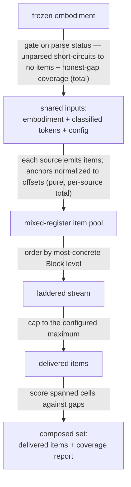

# question-orchestrator — Architecture & Decisions

## Why a composition layer, not a merged lib

`socratizing` (open register) and `quizzing` (closed register) are each complete
and each **bounded**: quizzing's charter is _static decidability_ (every item is
machine-gradable) and it excludes open Socratic questions; socratizing is
open/reflective and has no answer key. Merging their internals would break both
charters. Yet a learning environment wants _both registers on one grid_ —
quizzing's own README names this goal.

So the reconciliation lives **above** both, in a pure composition lib, owning
only what is irreducibly cross-register:

1. **One grid.** Merge both registers' items into one item model on the shared
   Block Model coordinate.
2. **Normalize anchors** to one coordinate (offsets), so a consumer _can_
   co-anchor items across registers.
3. **Coverage-report** the delivered set against the grid.
4. **Ladder** the mixed stream by Block level.

Everything else — generation, filtering, grading, and the co-anchoring act
itself — stays with the source libs and the consumers. This keeps both bounded
contexts intact and this lib small.

## Why reuse both items by reference (symmetric)

`OrchestratedItem` is a union whose **base** carries only the
orchestrator-computed shared coordinate (`id`, `sourceId`, `anchorOffsets`,
`cells`), and whose **arm** carries the untouched native object:

- closed → `item: QuizItem` (grading via `grade(item, response)` and mastery
  folding need the whole discriminated item — there is no lighter option),
- open → `question: CodeQuestion` (kept whole, so its stable `id` — defined by
  socratizing for shown/dismissed adaptive fading — and its `context` +
  `questions[]` survive for the open consumer).

An earlier sketch _projected_ a subset of the open item to "avoid leaking
internal axes." That rationale did not hold: the closed arm already carries the
entire `QuizItem`, so the seam is not thinner on one side than the other.
Carrying both natively is symmetric, lossless, and the most faithful reading of
"reuse both registers as-is." The base is the shared grid coordinate; the arm is
the source's own frozen value.

Both libs already tag with the **same** `BlockCell` type (`quizzing/types.ts:21`
deep-imports it from `socratizing`), so the unified `cells` needs no mapping —
`item.cells` (closed) or `question.block` (open), copied unchanged. `cells` on
the base is load-bearing, not redundant: it lets coverage and ladder read one
field regardless of arm.

## The `register` homonym (resolved here, per DEV.md § 0.1)

The word "register" is overloaded in this domain, on purpose:

- `OrchestratedRegister` (`open | closed`) — the **whole-kind** axis, quizzing's
  "two registers of the same Block Model." This is the `OrchestratedItem`
  discriminant.
- socratizing's `QuestionRegister` (`open | pointed | comparative`) — a **finer
  rhetorical** axis tagging each _inner_ `Question`.

They coexist on one open item: `orchestratedItem.register === 'open'` sits above
`orchestratedItem.question.questions[i].register === 'pointed'`. The token
`'open'` appears at both levels with different meanings. Alternatives are worse
(`kind` collides with `CodeQuestionKind`, `mode` with `AnswerMode`), so
`register` stays — disambiguated by the distinct type name
`OrchestratedRegister` and this note. Consumers read each axis at its own level.

## The two registry levels

Do not conflate them:

- **Generators** (quizzing-internal): V1, V8, … registered in
  `quizzing/generators/registry.ts`. Not this lib's concern.
- **Sources** (orchestrator-level): `quizzing-source`, `socratizing-source`, …
  registered in `sources/registry.ts`. Each source wraps a register's generation
  and may emit items of either register (nothing pins a source to one register;
  each item carries its own).

A `QuestionSource` is `{ id, run }`. The orchestrator builds `SourceInputs` once
(`{ embodiment, classified, config }`), runs every source, and merges
(`SOURCES.flatMap(run)`). Each `run` reads its own filter slice off
`config.sources` by a literal key. **Adding a new kind of question generator** =
one adapter file + one array entry (+ one `CompositionConfig.sources` key iff it
takes filter config). Nothing else moves.

## Anchor normalization

quizzing's `QuizItem.anchorRange` is **character offsets**; socratize's
`CodeQuestion.location` is a **line/column** `SourceRange`. Two items about the
same identifier carry _different-shaped_ anchors, so they cannot be co-anchored
on either native field.

`anchorOffsets` on the base normalizes both to offsets. The closed arm copies
its native offsets. The open arm projects `(line, column)` to an offset using
the index the embodiment already ships:
`embodiment.source.offsets[line - 1] + column` (0-based column) — the canonical
formula documented on `Source`. This is an O(1) lookup, not a newline scan, and
CRLF/line-width is already baked into `offsets` (computed from the real source).
The unit still deserves a focused test for the edges it must span (multi-line
ranges, program-level `location` covering the whole source), but it is not the
hand-rolled hazard an earlier draft implied.

## Execution phases

`composeQuestions(embodiment, config?) → QuestionSet`. Each phase, in domain
terms (all synchronous; the whole function is total — it never throws):

1. **Gate.** In: frozen embodiment + config. Out: if unparsed, short-circuit —
   no items, coverage reported by the coverage phase over the empty pool
   (nothing spanned, so every configured coverage target is a gap; no gaps when
   none are configured); else proceed to build inputs. (Total — this is why the
   two sources' divergent failure modes never surface: `generateQuiz` _throws_
   on unparsed, so it is never reached in that state.)
2. **Build shared inputs.** In: parsed embodiment + config. Out: the shared
   inputs (embodiment + classified tokens + config), built once.
3. **Run sources.** In: shared inputs. Out: a flat, mixed-register item pool.
   Each source is total (defends its call, contributes `[]` on failure) and
   normalizes its items' anchors to offsets here.
4. **Ladder.** In: item pool. Out: a laddered stream, ordered by each item's
   most-concrete Block level (ties by emission/positional order in the pool —
   not by `sourceId`; zero-cell items last).
5. **Cap.** In: laddered stream + `config.count`. Out: the delivered items (the
   laddered head, `≤ count`).
6. **Report coverage.** In: delivered items + `config.coverage.cells`. Out: the
   coverage report (`spanned` cells + `gaps`), computed over the delivered items
   so it describes what shipped.

Result: `QuestionSet { items, coverage }`, frozen.

## Data flow

Nodes are data states; edges are the transformation and its constraint. The
consuming lenses are downstream of `Result` and outside this module's
abstraction level (see § Consumers).

## Coverage semantics

Coverage is **report-only** and computed **last**, over the delivered `items`:

- `spanned` = distinct cells the delivered items cover.
- `gaps` = `config.coverage.cells` minus `spanned` (empty when no target set).

Because it runs after the cap, it truthfully describes the delivered set — a cap
(per-source or composition) that drops a cell's only item honestly shows that
cell as a gap. The orchestrator never synthesizes an item to fill a gap; a cell
no source emitted is a permanent gap. (This is why README calls it
"coverage-report," not "coverage-target.") The degenerate (unparsed) path is the
limiting case: it reports over an empty item pool, so `spanned` is `[]` and
every configured target is a gap.

## Bounded contexts (do-not-cross)

- Never widen `QuizItem` with an open mode (breaks quizzing's
  static-decidability charter); never add grading to `socratizing`. This lib
  imports both as types and reuses their values unchanged.
- Filtering stays in the source libs (`QuizFilter` — a no-op stub upstream
  today; `MicroDecisionConfig` — implemented). This lib forwards config, never
  re-filters.
- Grading and mastery are **closed-only**, and they live in the _consumer_, not
  here. Co-anchoring is also a _consumer_ act, on the `anchorOffsets` this lib
  provides — this lib normalizes anchors; it does not bundle.

## Consumers (boundary)

This lib emits a unified stream; lenses render it. The split:

- **`quiz` lens** — reads `register: 'closed'` items, rendering + grading +
  mastery over each item's native `QuizItem`, co-anchoring bundles via `itemsAt`
  on `anchorOffsets`.
- **`socratize` lens** — reads `register: 'open'` items, rendering each item's
  native `CodeQuestion` (`context` + `questions[]`). No grading.

Which consumers are built, and in what order, is coordination work tracked in
the handoffs — not this end-state doc.

## Async evolution (why sync now)

`composeQuestions` and `QuestionSource.run` are synchronous. "Async-ready" here
is honest, not a `Promise` union bolted onto `run` (a sync `flatMap` cannot
await one): the _shape_ `QuestionSet` is stable, and an async source is a
**localized** change rather than a re-architecture.
`composeQuestions → Promise<QuestionSet>` is a breaking change consumers adopt —
but the shape they consume does not change, and the closed consumer already
brackets its generation call with a `generating` flag. We do not pay that cost
until a source needs it.

## Open questions (for the human gate)

1. **Composition-semantics defaults** — ladder rank = most-concrete level (vs.
   coarsest, or a designated primary cell); zero-cell items sort last; `ladder`
   default on; coverage reports over the delivered set. Ratify or adjust.
2. **Async shape** — confirm sync-now + documented localized evolution (vs. a
   `Promise`-union on `run`, which AR-1 showed is inert today).
3. **Follow-up ownership** — the `socratize` lens (open consumer) and wiring the
   `quiz` lens to this stream are M3-roadmap work; retiring the omnipresent Quiz
   button is region-session-coordinated. Confirm these are separate, coordinated
   campaigns (details in the handoffs).

## Navigation

- [README.md](./README.md) — what the lib is, the API, the config surface, the
  structure.
- [../quizzing/DOCS.md](../quizzing/DOCS.md) — the closed register's design.
- [../../orchestrate/lib/socratizing/DOCS.md](../../orchestrate/lib/socratizing/DOCS.md)
  — the open register's design.
