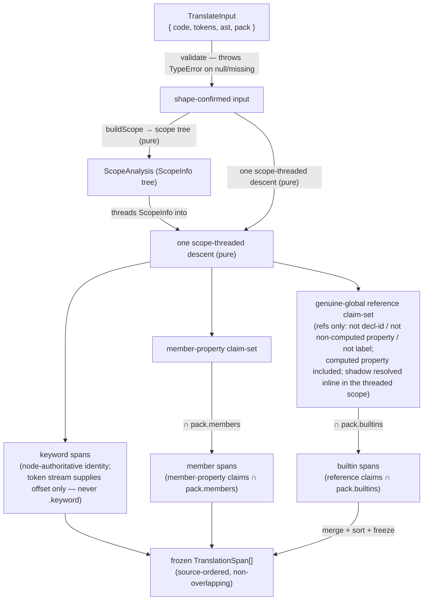
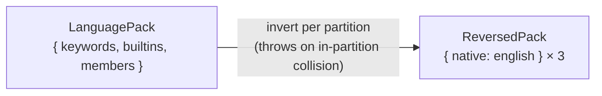

# lib/translating — Architecture & Decisions

## Why this module exists

JEJ's audience-reach minimalism makes English keywords a barrier for learners
who do not speak English first. Legesher's insight is that the barrier is
removable without forking the language: store canonical English, render the
native language, translate losslessly. This module is that translation core,
re-implemented natively in TypeScript for the JEJ surface and sitting beside the
acorn token stream the embodiment already produces — so the buffer, AST, runner,
and every position-anchored lens keep working on canonical English while a
consumer paints native glyphs. See [`./README.md`](./README.md) for the
taxonomy, the public API, and the bounded context ("translating produces spans;
consumers paint").

## Architectural sketch

> Written Phase 0, before implementation. The Refactor step is held against this
> document — not what the code does, but what shape it takes.

### Public surface

Four exports, each its own file (newspaper anatomy: export first, helpers
below):

- `translate-tokens.ts` — **forward**:
  `(TranslateInput) → readonly TranslationSpan[]`.
- `reverse-pack.ts` — **reverse**: `({ pack }) → ReversedPack` (per-partition,
  collision-checked).
- `load-pack.ts` — `({ language }) → LanguagePack | null` (static-import switch;
  no barrel).
- `languages.ts` — `LANGUAGE_METADATA` constant registry
  (`Record<LanguageCode, LanguageMetadata>`).

Plus `packs/{es,fr,de,ar}.ts` — const files, each a `LanguagePack` (`en` is
identity; no pack).

### Execution phases — `translateTokens` (the forward path)

1. **Validate inputs** (sync, throws) — `code` a string, `tokens` a non-null
   array, `ast` a non-null node, `pack` a non-null pack. Throws `TypeError`
   otherwise; the module's only forward throw site (boundary only — it sits
   behind a `status.parsed` gate, like `../classifying/`).

2. **Build the scope tree** (pure) — `buildScope(ast)` returns a `ScopeAnalysis`
   (the `ScopeInfo` tree). This is a **prerequisite** the descent consumes: the
   descent threads the current `ScopeInfo` down that tree, so the tree must exist
   first. Scope boundaries are `Program`/`BlockStatement`/`ForOfStatement`
   (`build-scope.ts`). Lexical shadow resolution — § Decisions D3.

3. **One scope-threaded descent** (pure — the sibling's `collectAstRefinements`
   single-descent shape, sharpened to the
   `check-undeclared-globals.ts::walkForGlobals` scope-threading). A single
   parent-aware traversal, carrying the current `ScopeInfo`, does three things in
   one pass:
   - **emits keyword spans**, per keyword-role node — **identity from the node
     type**, **location from the keyword token** at the node boundary. The three
     keywords with no owning node position (`else`, binary `in`, and the do-while
     tail `while`) are located by the single keyword token in the node's
     child-gap. No `.keyword` flag is read.
   - collects the **member-property claim-set** — the name + `[start, end)` of
     every non-computed `MemberExpression.property`.
   - collects the **identifier-reference claim-set** — every `Identifier` in
     _reference_ position (not a declaration id, not a non-computed member
     property, and **not a label** — `LabeledStatement`/`BreakStatement`/
     `ContinueStatement` labels are excluded, a mandatory addition since the
     mirrored walk has no label case; computed member properties **are**
     references, so `x[Math]` is included), **with its shadow resolved inline
     against the threaded scope**. Because the walk threads scope the way
     `walkForGlobals` does — a `for…of` iterable is walked in the **parent**
     scope — `for (const console of console)` keeps the RHS `console` a genuine
     global while the binding and body references resolve to the binding.
     Resolution is `isNameDeclared` upward from the **threaded** `ScopeInfo`,
     **not** a positional innermost-scope lookup. `findChildScope`/`isNameDeclared`
     are module-private in `check-undeclared-globals.ts` → export additively or
     mirror (an AR-3 call).

4. **Emit member + builtin spans** (pure, membership filtering) — the two
   pack-dependent triggers over the phase-3 claims: a **member** span for every
   member-property claim whose name is a `pack.members` key (total and safe while
   JEJ admits no user-defined properties); a **builtin** span for every
   _genuine-global_ reference claim (shadow already resolved in phase 3) whose
   name is a `pack.builtins` key. Keyword spans were already emitted in phase 3.

5. **Merge + freeze** (pure, shape finalization) — concatenate the span lists,
   sort ascending by `range[0]`, deep-freeze via `@utils/freeze-in-place.js`.
   Non-overlap is a structural consequence of the Identifier classification
   (§ Structural constraints), so ordering is total.

### Execution phases — `reversePack`

Invert each partition independently: for `keywords`, `builtins`, `members`,
build `{ native: english }`, throwing on an in-partition collision (two English
keys → one native value → lossy). Returns a frozen `ReversedPack`.
Cross-partition homonyms do not collide (§ Decisions D2).

### Data flow

### Structural constraints

- **Range anchoring, never text matching.** Every span comes from a token/node
  `[start, end)`; the module never regex-replaces `\bword\b` (Legesher's toy
  path corrupts strings and comments). `english === code.slice(range)` is
  invariant.
- **Pack membership is necessary but not sufficient.** Each partition carries a
  role guard (keyword: **AST node identity**, located by token offset, never
  `.keyword`; member: `MemberExpression.property`; builtin: scope-resolved global
  reference, label-excluded). A user token that merely shares a name is never
  translated.
- **Categories are pack-partition, not classifying-semantic.** The trigger keys
  on which pack map a token's text is in — NOT on `../classifying/`'s `keyword`
  category (which excludes `typeof`/`in`/`null`/`true`/`false`, all of which ARE
  translated).
- **Pure on frozen inputs.** No mutation of `code`/`tokens`/`ast`; the module
  runs unchanged on deep-frozen embodiment data. Deterministic — no randomness,
  no config.
- **Non-overlapping spans (structural, pack-content-independent).** Every
  `Identifier` is classified by the descent into **exactly one** of
  {declaration-id, non-computed member property, label, reference}, so member
  claims and reference claims are disjoint by construction. Keyword spans occupy
  keyword-lexeme ranges owned by distinct keyword-role nodes (or the gap-token
  between distinct nodes — do-while owns `do` at its start _and_ a tail `while`,
  different ranges), which are never `Identifier` ranges. The value-literal
  keywords (`true`/`false`/`null`) originate **only** from `Literal` nodes, whose
  ranges never coincide with the `Identifier` ranges of the same words used as
  property names (`x.null`'s `null` is an `Identifier`, a distinct occurrence).
  No source offset is claimed by two spans, so merge-by-`range[0]` is total.
  Unlike the superseded token-pass design, this needs **no** member-property
  cross-reference: `console.if` cannot collide with anything because it produces
  a `MemberExpression`, never an `IfStatement`.
- **Keyword location is token-pinned; gap keywords are bounded.** A keyword
  span's range is a keyword **token**'s `[start, end)`, never a character-scan.
  Node-boundary keywords take the token at the node's start; the three
  gap-located keywords (`else`, binary `in`, do-while tail `while`) take the
  single keyword-surface token in the node's child-gap. The gap between two
  adjacent keyword-role child nodes holds exactly one such token, and comments
  and stray `)` (from a parenthesized operand — `raw.ast` carries no
  `ParenthesizedExpression`) are their own tokens, matched-by-text and skipped. A
  _mis-location_ here would mis-**paint** but cannot mis-**identify** — a strictly
  smaller failure class than the over-translation the old `.keyword` design
  risked.
- **Closed registry.** `LanguageCode` is a closed union;
  `Record<LanguageCode, LanguageMetadata>` is exhaustive. Pack availability (not
  registry membership) gates a language — `load-pack` returns `null` for a
  registered-but-unpacked language.

### Out of scope

- **Painting.** Decoration overlays, Prism/parsons render helpers, RTL CSS —
  consumers (`orchestrate/`, `lenses/`), later milestones.
- **Native authoring round-trip.** Source maps, a native tokenizer,
  `unicode_guard` — Milestone 4.
- **The dropdown + its JEJ-validation gate.** Orchestrator concern; this module
  only supplies registry metadata.
- **Scope analysis beyond binding resolution.** Read/write usage counts, type
  inference, and control-flow reachability are out of scope; the builtin guard
  needs only lexical binding resolution (§ Decisions D3).
- **Pack content authoring quality.** Native word choice is a linguistic concern
  refined with the Legesher lead; this module guarantees only structure (drift +
  round-trip), not fidelity.

## Decisions

Recorded per AR-1 (verdict CONSIDER — response to each concern documented here,
per DEV.md).

- **D1 — Surface anchors, not `collect-jej-surface.ts`** (AR-1 C1).
  `collect-jej-surface.ts` exports only a collector function, not reusable
  constants. The drift-guard anchors on the three real constant modules exactly
  as `../documenting/`'s test does: `KEYWORDS`
  (`completing/completing-keywords.ts`), `CURATED_MEMBERS`
  (`completing/curated-members.ts`), and `allowedGlobals`
  (`embody/lib/validating/just-enough-js.ts`) minus `SUPPRESSED_GLOBALS`
  (`completing/suppressed-globals.ts`) minus `KEYWORDS`. Promoting the surface
  to a single shared export (AR-1 counter-proposal A) is a cross-module change
  deferred as a post-M1 follow-up.

- **D2 — Reverse is per-partition** (AR-1 C2). `reversePack` returns
  `ReversedPack` (`{ keywords, builtins, members }`), each
  `{ native: english }`, collision-checked within a partition, mirroring
  `token_mapper.reverse()`. A flat map would wrongly reject a legal
  cross-partition homonym; forward translation is already category-aware, so
  per-partition reverse composes with it and gives M4's native tokenizer
  category-scoped lookup for free.

- **D3 — Builtin shadow = lexical scope resolution** (AR-1 C3; human ruling at
  the Phase-0 gate — lexical over coarse). A `builtins` span is suppressed iff
  the identifier resolves to an in-scope binding at its position, via a
  scope-chain walk over `buildScope(ast)`'s `ScopeAnalysis` — the same
  resolution `check-undeclared-globals.ts` uses to decide
  allowed-global-vs-user-binding. Its `findChildScope` + `isNameDeclared` are
  **module-private today**, so the builtin increment exports them (additive) or
  mirrors the walk — an AR-3 call. Chosen over coarse flat-name suppression
  (which under-translates a genuine global sharing a name with an unrelated
  block-local) and over no-scope (which mistranslates a real shadow). Errs
  toward not-translating a true shadow. The `lib/` peer rule permits the
  `embody/lib/scope/` + `embody/lib/validating/` imports; the siblings already
  take them.

- **D4 — Keyword identity is node-authoritative; the token stream is
  location-only** (supersedes the committed D4, verified broken against acorn
  8.16). A keyword span is emitted because an AST node of the corresponding type
  is present (`IfStatement`→`if`; `VariableDeclaration.kind`→`let`/`const`;
  `NewExpression`→`new`; `UnaryExpression`→`typeof`; `BinaryExpression`→`in`;
  value `Literal`→`true`/`false`/`null`; and the remaining statement keywords by
  their statement nodes, except the gap-located `else` / binary `in` / do-while
  tail `while` which have no owning node position, § Execution phases), **never**
  because a token carries acorn's `.keyword` flag; the token stream is read only
  to pin each keyword's `[start, end)` offset. **Why the committed D4 failed
  (both verified):** (1) `embody`'s `raw.tokens` comes from a context-free
  `acorn.tokenizer()` pass (`embody/index.ts` `runAcorn`), so `console.if`'s `if`
  is tagged `[keyword:if]` — keying on `.keyword` mistranslates a property (the
  bug that shipped three times); (2) `let` is a contextual keyword emitted as a
  `name` token with `.keyword === undefined`, so a `.keyword` guard misses it
  entirely. Node-authoritative identity is immune to both by construction, and
  its failure mode is safe under-translation. It also makes contextual-keyword
  widening (`of`, `var`, `instanceof`) need **no `.keyword`-guard re-audit** —
  identity rides the node type, never a lexical flag — though a genuinely new
  keyword still needs its own node→keyword identity + location rule and the
  `KEYWORDS`/drift-guard surface change (it is not a pack-only edit). The token
  stream is re-admitted for **location only** (comments are not tokens, and the
  stray `)` of a parenthesized operand — `raw.ast` carries no
  `ParenthesizedExpression`, since `runAcorn` omits `preserveParens` — are their
  own tokens, matched-by-text and skipped) — which is why this graft deletes the
  pure-AST alternative's fragile hand-rolled trivia/paren scanner.

- **Anti-regression pin (never read `.keyword`; never re-parse).** `raw.tokens`
  is embody's context-free `acorn.tokenizer()` output; its `.keyword` flag is
  wrong for a keyword-as-property and `undefined` for `let`. The trigger keys on
  **node identity + token offsets only**, never `.keyword`. Never re-parse
  `code`; never change embody's token source — the parser-authoritative variant
  was unanimously rejected (it breaks `classify-tokens`'s `homeCategory` and
  embody's two-stage tokenize/parse-fail discrimination). The
  unreachable-in-valid-JEJ constructs carry **no live tests**, but for two
  different reasons: top-level `return`, `with`, and bare `let;` are **parse
  errors** under `sourceType: 'module'` (strict); `for…in` **parses** but is
  rejected by the node allowlist (`just-enough-js.ts` has no `ForInStatement`). A
  `ForInStatement` could therefore reach this module only if a caller skipped the
  `validation.isJeJ` gate — so keeping it in the identity mapping is a defensive
  entry, not dead code against an impossible node.

- **D5 — `LanguageCode` is a closed union** (AR-1 C5), ported closed from
  Legesher (no `| string`), so `Record<LanguageCode, LanguageMetadata>` stays
  exhaustive. M1 ships a closed subset (`en`/`es`/`fr`/`de`/`ar` — LTR + one
  RTL); porting the full 51-entry registry is a later mechanical expansion,
  still closed.

- **D6 — Input contract `{ code, tokens, ast, pack }`** (AR-1 C7; deliberate
  divergence from the plan's `{ classified, pack }`). `ClassifiedToken` exposes
  no AST-node link and no scope, and its `keyword` category excludes exactly the
  reserved-word operators/literals JEJ translates — so member identification and
  builtin shadow resolution are impossible from `ClassifiedToken[]`. Re-walking
  `tokens + ast` (mirroring `ClassifyInput`) is necessary, not duplicative:
  translating and classifying answer different questions over the same raw
  inputs; they share the input shape, not the output.

- **D7 — Round-trip guard is test-time only.** Forward translation needs no
  runtime round-trip guarantee — it emits spans anchored to English ranges and
  never produces English-corrupting output. The round-trip (reverse ∘ forward
  === identity) is a pack-authoring property, enforced by a test over
  `sandbox-programs/*.js`; `reversePack`'s in-partition collision throw is the
  runtime guarantee that matters.

- **D8 — Single scope-threaded descent; keyword spans are node-derived, not a
  token pass** (updates the committed D8). Member-property and
  identifier-reference claims are still collected in one AST descent (the
  `classify-tokens.ts` `collectAstRefinements` shape), now scope-threaded in the
  `walkForGlobals` shape so a `for…of` iterable resolves in the parent scope. The
  keyword phase no longer cross-references the member-property set — keyword spans
  are emitted per keyword-role node during the same descent — so the data-flow
  diagram carries **no** `facts → keyword` edge. The reference set explicitly
  excludes labels (`LabeledStatement`/`BreakStatement`/`ContinueStatement`) — a
  mandatory addition, since the mirrored `walkForGlobals` has no label case and
  would leak a builtin-named label. `findChildScope`/`isNameDeclared` remain
  module-private → export additively or mirror (an inc-3 AR-3 call, per D3).
  `LanguagePack.language` is a self-identification tag (drift-test failure
  messages + `load-pack` sanity), read by no forward phase. Splitting
  `translate-tokens` TDD into keyword / member / builtin trigger sub-increments
  is carried to AR-3.

_(D6 stays valid — `tokens` is kept in `TranslateInput`; its role narrows from
"keyword source" to "location only", recorded in D4 above. D3 stays valid and is
exactly the **threaded** resolution phase 3 now makes explicit — its "the same
resolution `check-undeclared-globals.ts` uses" clause already means the
parent-scope-for-a-for-of-RHS walk, not a positional innermost lookup.
D1/D2/D5/D7 unchanged.)_
