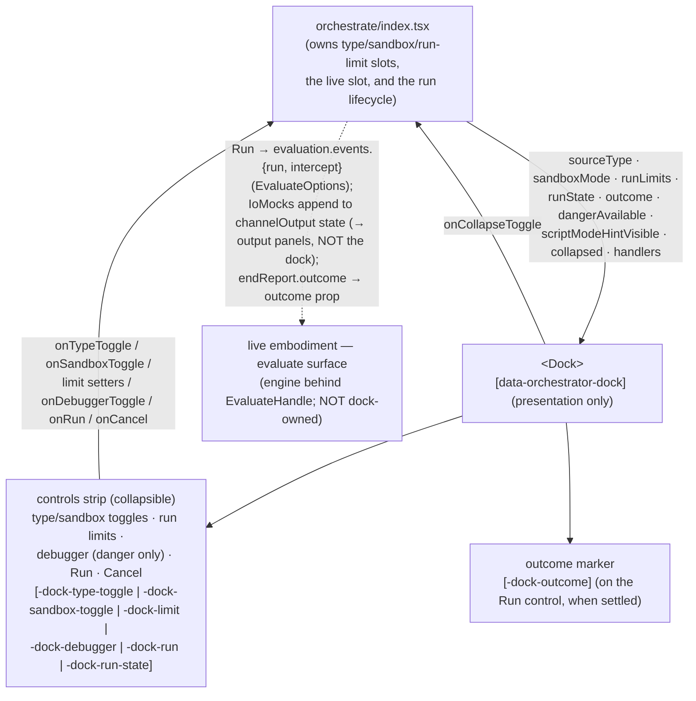

# dock — Architecture & Decisions

## Why this module exists

The omnipresent region's run/debug surface is a **collapsible affordance
container** (controls only — the run output moved to the output panels), not part of
the editor or the panel: running and
inspecting a program is a distinct activity from authoring it or reading the
lifecycle. Module-folder presentation keeps that surface separable from the
orchestrator's state machine — the orchestrator decides WHAT runs and owns the
run lifecycle; this module decides only HOW the controls and output render.

The locked design — the affordance set, the per-backend run-limit semantics, the
danger-only debugger option, the selector contract —
lives at [`../README.md` § The dock](../README.md) and
[`../DOCS.md` § The omnipresent region](../DOCS.md). This sketch covers the
module-internal structure only.

## Data flow

## Structural constraints

- **Presentation only.** No `embody` import, no `evaluation.events.*` call, no
  EventBus dispatch, no orchestrator-state ownership, no `Snippet` access. The
  component is a pure function of its props; every behavior is testable with
  inline fixture props in jsdom (the canned `EVAL_*` scenarios drive real
  outcomes at the orchestrator boundary in integration tests).
- **Owns no execution backend.** The orchestrator invokes
  `evaluation.events.{run, intercept}` on the live embodiment and feeds the dock
  `runState` / `outcome` (the accumulated channel output crosses to the **output
  panels**, not the dock). The worker engine and the deferred danger-iframe backend
  live behind the `EvaluateHandle` contract, off this surface entirely.
- **`run-state` (transport) and `outcome` (result) are orthogonal axes.**
  `runState ∈ {idle, running, settled}`; `outcome` is the seven-way
  `EndReportOutcome`, present only when `settled`. The dock never collapses the
  two into one attribute.
- **Outcome rendered verbatim.** The dock renders whatever `outcome` it is
  handed — `not-runnable` for below-parse leaves, the real outcome for parsed
  code — with no special-casing. (`run()` serves any parsed snippet per the
  embody contract; the current run-adapter code lag that returns `not-runnable`
  for parseable real code is the eval campaign's to close, invisible to the
  dock.)
- **Danger-gated affordances are absent, not disabled.** The debugger option and
  the danger toggle position render conditionally on `sandboxMode` /
  `dangerAvailable` (mirrors the panel's "hidden = fully removed").
- **Collapse acts on the controls.** Collapsing hides the controls strip; the
  Run affordance stays reachable (there is no output surface in the dock now — output
  lives in the output panels). Exact visual treatment is a Phase-1 presentational
  choice; tests anchor on attributes, never label text.
- **One IoMocks builder.** The orchestrator constructs the `IoMocks` whose callbacks
  append to the two channels' `channelOutput` state and threads it as
  `EvaluateOptions.io`; the **output panels** render the accumulated lines (the dock
  no longer does). For the interactive User Interface channel the mocks are **async**
  (set a pending interaction, await the learner's answer) — see
  [`../output-panels/DOCS.md`](../output-panels/DOCS.md).

## Out of scope

- **The run lifecycle + bus dispatch** — the orchestrator
  ([`../index.tsx`](../index.tsx)): invoking `evaluation.events.*`, building
  `EvaluateOptions` from the run limits, accumulating channel output,
  dispatching `type-toggled` / `sandbox-toggled`, re-keying the live slot on a
  type toggle.
- **The evaluate engine** — owned by [`../../embody/`](../../embody/) (the
  worker backend) and its deferred danger-iframe sibling.
- **`trace.*` tiers** — lens-internal evaluation; the dock uses only
  `{run, intercept}`.
- **The actual `debugger;` source-wrap and the danger-iframe backend** —
  deferred-backlog (named, not built); the dock surfaces the debugger _option_
  and the danger _toggle position_ (typed-before-wired) but the wrapping +
  iframe execution land with the danger backend.
- **The embedded guide** — a sibling region module
  ([`../embedded-guide/`](../embedded-guide/)).
