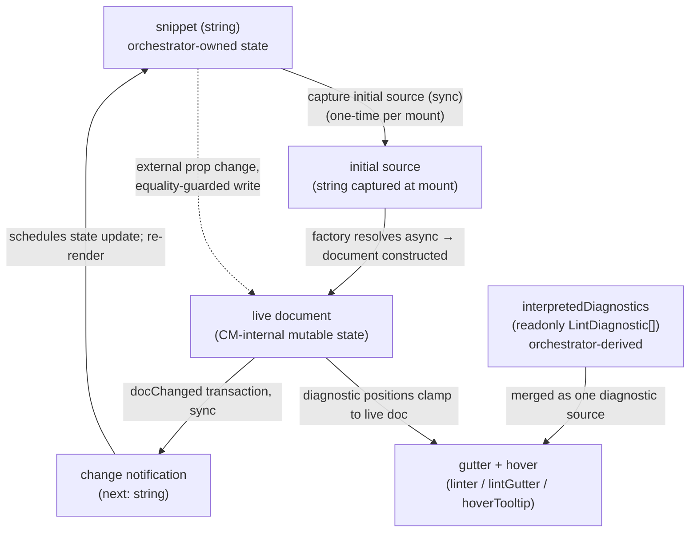

# editor — Architecture & Decisions

## Why this module exists

`orchestrate/editor/` is the orchestrator's **home base** — the always-mounted
React surface where learners edit the snippet string. Per the locked
single-writer state model in [`../README.md`](../README.md) § Conventions and
[`../DOCS.md` § Why the editor is a peer subdir, not a lens](../DOCS.md), this
is the only surface in the package that mutates snippet source. Lenses are
read-only views over a frozen embodiment; the lens-picker selects but does not
write.

The editor is **not** a `LensModule`. It is **not** registered in the lens
registry. The orchestrator's editor-mode UI mounts [`./index.tsx`](./index.tsx)
directly as a peer React component; when the orchestrator transitions to lens
mode it unmounts the editor and mounts a `<LensModule.Component>` instead (per
[`../DOCS.md` § Lifecycle modes](../DOCS.md)). The two surfaces never co-render.

## Single-component module

| File        | Purpose                                                                                                                                                                   |
| ----------- | ------------------------------------------------------------------------------------------------------------------------------------------------------------------------- |
| `index.tsx` | React home-base component (default export). Renders the orchestrator-controlled host `
` into which CodeMirror mounts a writable `EditorView`. |

The home base is a single React component; there is no second "React adapter +
`LensModule` stub" layer. The post-refactor `LensModule` contract (per
[`../../lenses/types.ts`](../../lenses/types.ts)) requires `Component` +
`applicableTo` fields, which a home-base surface has no business carrying — the
editor is structurally distinct from a read-only lens and the type system keeps
the two apart.

## Architectural sketch

### Data flow

The orchestrator's snippet state seeds the live document at mount; from then on,
the document is the mutable source of truth for editor content and the
orchestrator state is the immutable propagated truth. Every `docChanged`
transaction inside the live document produces one change notification carrying
the new content as a plain string; the editor component routes that notification
through to the orchestrator's state setter (the `onSnippetChange` prop). The
single-writer invariant is preserved because no other surface mutates the
snippet state.

The dashed loopback is the external-sync path. When the snippet state changes
from outside the editor's own write loop (e.g. lens → editor return with the
original snippet preserved), the prop-sync effect writes the new value into the
live document — guarded by an equality check so the round-trip from the editor's
own writes does not echo back.

The right-hand branch is the **diagnostics** path. The editor surfaces gutter
markers and hover tooltips from its own structural linter (`lintJej`) and from
the orchestrator-supplied `interpretedDiagnostics` prop — a
`readonly LintDiagnostic[]` the orchestrator derives from its live embodiment's
`errors`. The editor merges both feeds through the same `linter()` /
`lintGutter()` / `hoverTooltip()` machinery; CodeMirror clamps each diagnostic's
positions to the live document.

Domain terms used above (and their concrete shapes are pinned in
[`../lib/editing/types.ts`](../lib/editing/types.ts)): the **editor handle** —
`EditorInstance` per the editing/ types — is the React component's reference to
the live document; the **factory** is
[`createEditor`](../lib/editing/create-editor.ts) (async); `LintDiagnostic` is
the editing layer's diagnostic shape consumed by the linter pipeline.

### Execution phases

> **Vocabulary seam.** The phases below name the **editor's** half of the
> lifecycle (its own mount / edit / prop-sync / teardown). The orchestrator-side
> counterparts — seed embodiment, debounced live re-embody, flush-on-transition,
> interpreted-diagnostic derivation — are catalogued as the orchestrator's
> effect categories in [`../DOCS.md` § Live embodiment](../DOCS.md). Where a
> phase below references an orchestrator-owned action (debounced embody, mode
> flip), that action is the orchestrator's; the editor only sees its prop
> effects.

1. **Mount initiation (async, fires once per mount)** — orchestrator is in
   editor mode; the editor component renders an empty host div and schedules a
   mount effect. The effect invokes the editing/ factory with the current
   snippet string (as initial source) and the editor's change-notification
   callback.
2. **Mount resolution** — the factory's promise either resolves to an editor
   handle (`EditorInstance` per
   [`../lib/editing/types.ts`](../lib/editing/types.ts), stored for later sync
   and destroy) or rejects with a construction error (stored in a fallback state
   slot, rendering a minimal error notice — see § Render-on-rejection). The
   load-bearing **async-boundary constraint** is that a component destroyed
   before _or_ after the factory resolves never leaves a live `EditorView` in
   the DOM: the mount effect's cleanup tears down whatever the resolution
   produced, so a resolution that lands after unmount is reaped rather than
   mounted. This is what makes the surface safe under StrictMode's intentional
   mount → unmount → mount cycle (and any other mid-flight unmount).
3. **Learner edit (sync inside transaction)** — the live document accepts an
   edit through CodeMirror's input pipeline; the registered update listener
   fires once per `docChanged` transaction with the new document content as a
   plain string. The change-notification callback the factory was given is the
   editor component's pass-through to `onSnippetChange`, so the orchestrator's
   state setter receives the new value. React schedules a re-render of the
   orchestrator subtree. The editor's per-keystroke firing is 1:1 with
   `docChanged` transactions and is **not** debounced; the orchestrator
   debounces only its own `embody()` reaction to those updates (see
   [`../README.md` § Live embodiment](../README.md)), which is what eventually
   refreshes the `interpretedDiagnostics` the editor renders.
4. **Prop sync (external write)** — when the snippet state changes from outside
   the editor's own write loop (e.g. lens → editor return with the original
   snippet preserved), a second effect watching the snippet prop writes the new
   value into the live document — but only when the editor handle is resolved
   AND the prop value differs from the document's current content. Both guards
   are load-bearing: the resolved-handle check prevents a no-op crash during the
   gap between component mount and factory resolution; the equality check
   prevents the orchestrator's own round-trip from echoing back into the
   document.
5. **Diagnostics refresh (external prop)** — when the orchestrator's live
   embodiment settles (its debounced re-embody fires) it recomputes
   `interpretedDiagnostics` and re-renders the editor with the new array. The
   editor feeds the array into its diagnostic pipeline alongside `lintJej`'s
   structural markers; CodeMirror re-paints the gutter and hover surface.
   Because the orchestrator's embody reaction is debounced, the interpreted feed
   is at most one debounce-window stale relative to the live buffer; during the
   transient overshoot this relies on the editing layer's assumption that
   out-of-range diagnostics are clamped (not dropped or thrown), and markers
   re-locate on the next settle (see [`../lib/editing/`](../lib/editing/)).
6. **Teardown / re-mount (editor half)** — when React unmounts the editor
   component (the orchestrator left editor mode), the mount effect's cleanup
   runs the editor handle's destroy method (idempotent per the editing/
   contract), tearing down the live document and releasing CodeMirror's internal
   DOM. A later return to editor mounts a **fresh** editor component, kicking
   off a new mount cycle (phases 1–2) against the orchestrator's preserved
   snippet state; editor-internal state (cursor position, scroll, undo history)
   is per-mount and nothing carries across. The orchestrator side of these
   transitions — the mode discriminator flip and what mounts in the editor's
   place — is owned upstream; see [`../DOCS.md` § Lifecycle modes](../DOCS.md).

### Structural constraints

- **CodeMirror live document, single-writer dispatch.** The CodeMirror update
  listener is the **only** path that updates snippet state in the package — the
  orchestrator threads its state setter through the editor's `onSnippetChange`
  prop, the editor component passes it as the change-notification callback to
  the factory, and lenses are read-only views. Each `docChanged` transaction
  produces exactly one change-notification invocation (1:1
  transaction-to-callback, no batching, no debouncing **in the editor**).
  (CodeMirror semantics: multi-cursor edits, paste, undo, and programmatic
  dispatches each produce one transaction covering N character changes; IME
  composition can produce zero transactions for several keystrokes followed by
  one covering the composed grapheme. The contract is transaction-based, not
  keystroke-based.) The orchestrator debounces its embody reaction to these
  per-keystroke notifications; that debounce lives upstream and is invisible to
  this component.
- **No `embodiment` prop on the editor — ever; only diagnostics cross.** The
  editor never receives a `Snippet`. Embodiment is owned by the orchestrator; in
  lens mode it is handed to `<LensModule.Component>`, not to this editor. In
  editor mode the orchestrator derives `interpretedDiagnostics` (a
  `readonly LintDiagnostic[]`) from its live embodiment's `errors` and passes
  **only that array** down — the editor renders located explanation strings
  without ever inspecting the embodiment that produced them. The `createEditor`
  factory accepts `(initialCode: string, options)` precisely so the editor home
  base doesn't need to fabricate a Snippet wrapper.
- **Lens-mode re-entry correctness is flush-on-transition, not cache
  invalidation.** The editor does not invalidate anything on edit and does not
  participate in embodiment freshness. The orchestrator owns the live-embodiment
  slot and guarantees the slot reflects the exact current buffer on an editor →
  lens transition (flush-then-read: embody synchronously inline when
  `liveEmbodiment.snippet !== currentSnippet`, else reuse; cancel any pending
  debounce). The editor's only contribution to that guarantee is that every edit
  it accepts fires `onSnippetChange`, so the orchestrator's `snippet` state is
  always current at transition time. See
  [`../README.md` § Live embodiment](../README.md) and
  [`../DOCS.md` § Live embodiment](../DOCS.md).
- **No `LensModule` registration.** The editor is not enumerated by the picker
  and not present in the lens registry. The orchestrator imports the component
  directly.
- **Async mount via `useEffect`.** `createEditor` is async (dynamic
  language-module loading). The mount effect's cleanup calls `editor.destroy()`
  for StrictMode-safe teardown. The async surface lives **inside the
  component**, never in the prop contract — `<EditorComponent>` is always
  renderable synchronously; the CodeMirror DOM appears after the promise
  resolves (typically <10ms).
- **Prop-change-during-mount race.** If `snippet` changes between first render
  and the `createEditor` promise resolving, the in-flight mount uses the
  original `initialCode`; the post-mount prop-sync effect writes the latest
  `snippet` value into `editor.content` once mount completes (one extra dispatch
  on initial mount, equality-guarded thereafter). The catch-up write fires
  `onSnippetChange` once with the new content — orchestrator round-trip is
  benign (idempotent setState), but side-effecting consumers (analytics,
  logging) should de-dupe by content.
- **Single host element.** The component renders one host element carrying the
  `data-orchestrator-host` attribute; CodeMirror's `EditorView` mounts into it.
  The host is the `
` element — there is no `<textarea>`. The data attribute
  is the test / dev-sandbox handle for "this is the home base surface".
  CodeMirror's content element is a child of the host; consumer code reading
  editor content via DOM should target the editor handle's `.content` property
  (the public API), not the host's descendants.
- **Sync-effect resilience.** The prop-sync effect must no-op when the editor
  handle is not yet resolved. This is the load-bearing guard for the
  StrictMode-double-mount × prop-change-during-mount intersection: if the
  snippet prop changes between the first StrictMode mount (cancelled) and the
  second mount's factory resolution, the sync effect may fire against a
  still-null handle. Without the resolved-handle check, the effect would crash.
- **`onSnippetChange` is optional.** Components mounted purely as display
  surfaces (in tests, fixtures, or future read-only flows) may omit the
  callback; when omitted, the `onChange` option is not passed to `createEditor`,
  so the update listener fires no consumer callback — CodeMirror still accepts
  edits at the DOM level but typed characters do not propagate to any parent
  state. The orchestrator always passes the callback in production.
- **`interpretedDiagnostics` is optional.** When omitted (display-only mounts,
  tests that don't exercise the gutter), the editor renders only its own
  structural `lintJej` markers. The orchestrator always supplies the array in
  production editor mode (possibly empty when the live embodiment has no
  `errors`).

### Diagnostic surface

The editor renders gutter markers and hover tooltips from two diagnostic feeds,
merged through one pipeline (`linter()` + `lintGutter()` + `hoverTooltip()` in
[`../lib/editing/build-extensions.ts`](../lib/editing/build-extensions.ts)):

- **Structural — `lintJej`.** The editor's own live JEJ-subset + parse marker
  feed. `lintJej` calls
  [`validate(code)`](../../embody/lib/validating/validate.ts) directly — a pure
  parse + JEJ-subset walk that constructs no `Snippet` — so the editor remains
  embodiment-blind. See § Deferred callback wiring → `linters` and
  [`lib/linting/DOCS.md`](../../lib/linting/DOCS.md).
- **Interpreted — `interpretedDiagnostics`.** Located explanations the
  orchestrator derives from its live embodiment's `errors` (via
  [`interpretError`](../lib/error-interpreting/interpret-error.ts),
  orchestrator- side — the editor never sees the embodiment). Each carries a
  concise plain-prose `message` (the `whatWentWrong` interpretation) in Cycle 1;
  rich multi-section / markdown hover is deferred because the editing layer
  renders hovers via `textContent` with no markdown parser.

Both feeds populate the same `LintDiagnostic` shape, so the merge is uniform.
Three rules govern coexistence:

- **Source-tagged rendering, not blanket dedup.** Each `LintDiagnostic` carries
  its `source` (syntax / JEJ-compliance / interpreted), so the three render with
  distinct severity + gutter presentation and may coexist on the same buffer.
- **Supersede the same error only.** The editor suppresses **only** the case
  where the _same_ error appears both terse (raw `lintJej`) and interpreted; the
  interpreted message supersedes the raw terse one for that error. Unrelated
  diagnostics from the two feeds are not deduped against each other.
- **Line targeting.** A diagnostic's `(line, column)` comes from the error's
  `loc` when present, else is derived from `source.offsets` + the error's
  character offset, else falls back to a file-level notice. This is computed
  orchestrator-side before the array crosses; the editor just renders the
  located markers.

> **What lights up now.** Because embody's real-composition validating /
> creation slices are stubbed, interpreted gutter errors are demonstrable today
> for tokenize / parse (syntax) errors on the real acorn path, plus the scenario
> fixtures. Genuinely non-JEJ code (e.g. `var x = 1`) still shows `lintJej`'s
> live structural marker but no embodiment-derived _interpretation_ until the
> validating / creation slices land — this is expected, not a bug.

### Render-on-rejection

If `createEditor` rejects (e.g. CodeMirror construction throws on a malformed
extension), the mount effect catches the rejection and stores the error in a
fallback state slot. The component then renders a minimal error notice — a host
element carrying both `data-orchestrator-host` and `data-orchestrator-error`
attributes (`[data-orchestrator-host][data-orchestrator-error]` as a CSS
selector). Preserving the host attribute means test / sandbox selectors still
locate the surface. The underlying error is also logged to the console for
diagnosis. The orchestrator's mode machine is unaffected; the learner can still
toggle to lens mode and back to attempt a fresh mount.

### Out of scope

- **Execution-derived diagnostics.** Diagnostics that require running the
  program — runtime / evaluation errors, or anything that only exists after
  `evaluation.events.run` — are **out of scope** for the editor. Program
  execution stays lazy (a future Run affordance owns it); the editor's
  interpreted feed is derived only from the **static** embodiment's `errors`
  (tokenize / parse / validation / creation phases). Runtime-error
  interpretation surfaces elsewhere (the future Run dock's console), not in this
  gutter.
- **Static, errors-derived diagnostics are IN.** To be explicit about the cut:
  what crosses the editor boundary is the orchestrator-computed
  `interpretedDiagnostics` array (located explanation strings derived from the
  static embodiment's `errors`) plus the editor's own `lintJej` structural
  markers. What does **not** cross is the embodiment itself and anything
  execution-derived.
- **Recommend-time analysis.** The editor is not a lens; it has no `recommend()`
  surface. Recommendation is a deferred backlog concern and never touches the
  editor.
- **Snippet ownership beyond mount-time seed.** The orchestrator owns snippet
  state via `useState`; the editor reads from props and writes via
  `onSnippetChange`. The editor never holds local snippet state of its own (no
  uncontrolled fallback).

## External contract

The home-base component holds the following surface invariant. Internal
implementation may evolve (extension stack, callback wiring, diagnostic
pipeline) without changing these:

- **File path:** [`./index.tsx`](./index.tsx).
- **Default export shape:** a React function component.
- **Prop surface:** `{ snippet, onSnippetChange?, interpretedDiagnostics? }`.
  `snippet` is the controlled initial-value and external-sync source;
  `onSnippetChange` is the single-writer callback; `interpretedDiagnostics` is a
  `readonly LintDiagnostic[]` (the orchestrator's live-embodiment-derived
  interpreted feed). The editor never receives an `embodiment`.
- **Data attribute on the host element:** `data-orchestrator-host`. The host is
  the `
` element that CodeMirror's `EditorView` mounts into. When rendering
  an error fallback (per § Render-on-rejection), the same attribute lives on the
  error notice element so selectors stay consistent.

The orchestrator's call site in [`../index.tsx`](../index.tsx) reads the prop
surface only; internal CodeMirror details are not part of the orchestrator's
contract surface.

## Module ownership

This module owns:

- [`./index.tsx`](./index.tsx) — the React home-base component.

Consumers:

- [`../index.tsx`](../index.tsx) — the orchestrator imports the component for
  editor mode.
- [`../../../../pages/editor-smoke.tsx`](../../../../pages/editor-smoke.tsx)
  — dev-only Docusaurus smoke page; deep-imports the editor for live
  wired-callback verification on the running site. Not a production consumer.

No other production consumers. Lenses do not consume the editor.

## Deferred callback wiring

The CodeMirror factory at [`../lib/editing/`](../lib/editing/) exposes slots for
`linters`, `docLookup`, `completions`, and `format` callbacks (plus the wired
`onChange`). All four callback slots are now wired:

- `linters` — **wired** to [`lintJej`](../../lib/linting/lint-jej.ts) from the
  JEJ-package [`lib/linting/`](../../lib/linting/) module. This is the editor's
  **structural** gutter feed (live JEJ-subset + parse markers). `lintJej` calls
  [`validate(code)`](../../embody/lib/validating/validate.ts) directly — a pure
  parse + JEJ-subset walk that constructs no `Snippet` — so the editor stays
  embodiment-blind: it consumes a string, never a `Snippet`. The
  orchestrator-supplied `interpretedDiagnostics` are a _separate_ feed merged
  through the same pipeline (see § Diagnostic surface). See
  [`lib/linting/DOCS.md`](../../lib/linting/DOCS.md).

- `format` — **wired** to
  [`formatJej`](../../lib/formatting-editor/format-jej.ts) from the JEJ-package
  [`lib/formatting-editor/`](../../lib/formatting-editor/) module. Thin
  delegating wrapper around the canonical formatter
  [`format()`](../../embody/lib/formatting/format.ts) — the same
  Prettier-standalone function the runtime gate
  [`checkFormat`](../../embody/lib/formatting/check-format.ts) validates
  against. What the editor formats is byte-identical to what `isJej` considers
  canonical, by construction. No JEJ-subset gate at this boundary — any
  parseable JS gets formatted; the linter (above) surfaces JEJ violations.
  Learner triggers via `Ctrl-Shift-f` / `Cmd-Shift-f` registered in
  [`build-extensions.ts`](../lib/editing/build-extensions.ts). See
  [`lib/formatting-editor/DOCS.md`](../../lib/formatting-editor/DOCS.md).

- `completions` — **wired** to
  [`completeJej`](../../lib/completing/complete-jej.ts) from the JEJ-package
  [`lib/completing/`](../../lib/completing/) module. Substantive JEJ-aware
  adapter composing the validation feed, scope analysis at the cursor,
  regex-based dot-receiver context detection, and a curated 14-entry
  stumbling-list into a single `CompletionCallback`. Identifier context:
  keywords ∪ JEJ-allowed globals (minus easter-egg `eval`) ∪ scope-tree locals
  via [`buildScope`](../../embody/lib/scope/build-scope.ts). Dot-receiver
  context: a curated 28-entry member union (no type inference). Blocked tokens
  (`var`, `class`, `function`, etc.) surface in the popup with
  `type: 'blocked'`, `detail: '(not in JEJ)'`, a curated `info` tooltip, and
  `apply: 'noop'` so the keystroke does not insert blocked text — the linter
  (above) catches the manual override. See
  [`lib/completing/DOCS.md`](../../lib/completing/DOCS.md).

- `docLookup` — **wired** to
  [`documentJej`](../../lib/documenting/document-jej.ts) from the JEJ-package
  [`lib/documenting/`](../../lib/documenting/) module. Pure table lookup against
  a module-level frozen partition (16 JEJ keywords, 16 JEJ-allowed globals, 28
  curated member methods, 12 blocked-stumble entries). Blocked stumbles carry
  full pedagogical content (description + example + whenToUse + commonMistakes)
  flagged via `category: 'not in JEJ'` — JEJ scopes the editor's positive
  surface, not the learner's universe. The advisory stumbles (`null`, `new`)
  live in the keyword partition with their caveats woven into `whenToUse` and
  `commonMistakes`. The surface mirrors the completer's `KEYWORDS`,
  `allowedGlobals` (minus `SUPPRESSED_GLOBALS`), and `CURATED_MEMBERS`; a
  drift-guard test in `lib/documenting/tests/` asserts the keysets stay in sync.
  See [`lib/documenting/DOCS.md`](../../lib/documenting/DOCS.md).
