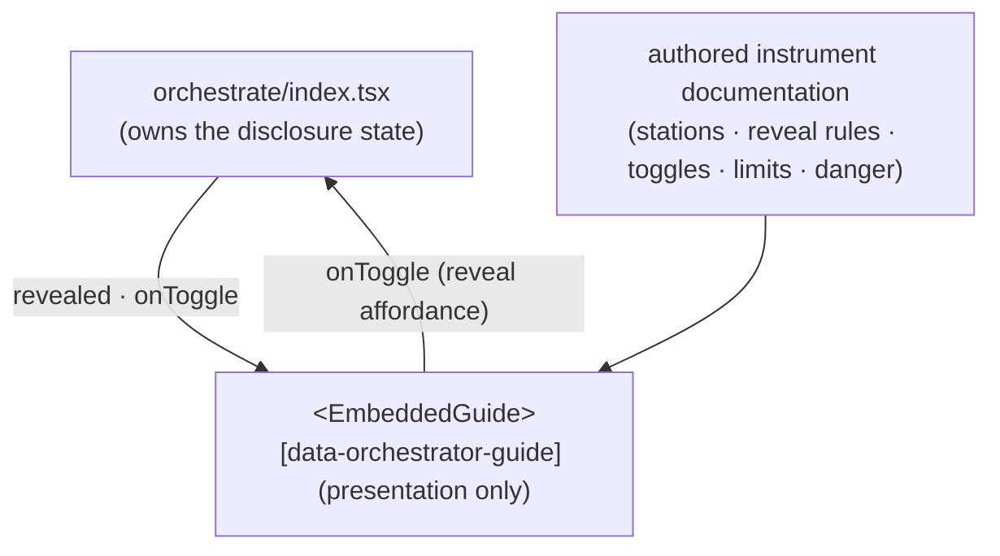

# embedded-guide — Architecture & Decisions

## Why this module exists

Every other affordance in the package teaches _through_ the program — lenses,
the panel's lifecycle display, the dock's run output. The embedded guide is the
one **meta** surface: it teaches the **instrument** (why stations appear and
vanish, what the toggles and limits do, what danger mode risks), so a learner
who is confused by the environment itself has somewhere to look. It is
orchestrator-resident and program-independent. Module-folder presentation keeps
the authored content separable from the orchestrator's state machine.

The locked placement and tool-kind classification live at
[`../README.md` § The omnipresent region](../README.md) and
[`../DOCS.md` § The omnipresent region](../DOCS.md). This sketch covers the
module-internal structure only.

## Data flow

The guide takes **no program input** — there is no embodiment edge. That absence
is the architecture: a meta tool is a pure function of authored content + a
disclosure flag, never of the snippet.

## Structural constraints

- **Presentation only + program-independent.** No `embody` import, no embodiment
  access, no EventBus dispatch, no orchestrator-state ownership beyond the
  disclosure flag the orchestrator threads in. A pure function of `revealed` +
  authored content.
- **Meta, not reactive.** The guide is not `error-interpret` (the reactive
  explainer that attaches where errors appear). It is a standalone,
  always-present account of the environment.
- **Authored content is real.** The guide ships genuine instrument
  documentation; it is not stub-bridged on any unbuilt dependency. Content is
  sourced from the instrument's own design (the README sections it explains).

## Out of scope

- **The disclosure state** — the orchestrator ([`../index.tsx`](../index.tsx))
  owns whether the guide is revealed; always-shown-vs-reveal and the visual
  treatment are Phase-1 presentational choices.
- **`error-interpret`** — the reactive explainer (a shared utility surfaced in
  the editor gutter / dock console), NOT a button and NOT this module.
- **The dock** — a sibling region module ([`../dock/`](../dock/)).
