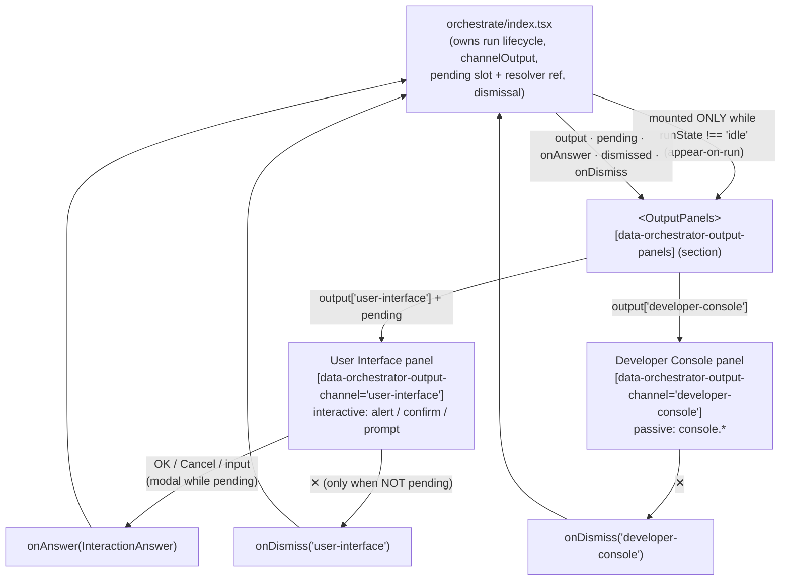

# output-panels — Architecture & Decisions

## Why this module exists

The run's two I/O channels need a home that is (a) spatially beside the code
that produced them — the content row, right of the active surface — and (b)
**interactive** on the user-audience side. Pulling them out of the dock into
their own presentation-only module keeps the dock a pure controls surface and
gives the interactive User Interface panel a single, testable boundary: the
orchestrator owns the run, the channel output, the pending-interaction slot, and
the resolver; this module renders them and routes the learner's answer +
dismissal up.

The canonical design — appear-on-run, dismissal, the native-faithful interactive
contract, the selector surface — lives at
[`../README.md` § The output panels](../README.md). This sketch covers the
module-internal **prop flow** only (a presentation component: no derivation, no
state).

## Data flow

(Prop-flow, not data-state: this is a **presentation component** — it owns no
derivation and no orchestrator state, so the diagram wires props down and intent
up, mirroring [`../dock/DOCS.md`](../dock/DOCS.md).)

> **Increment status.** The full prop surface is now wired: `output` + the
> interactive `pending` / `onAnswer` (the dialog after both panels) +
> `dismissed` / `onDismiss` (per-panel ✕) under the appear-on-run gate
> (`runState !== 'idle'`). The remaining gap is engine-side, not here:
> `embody`'s `intercept` is still a stub, so the real worker is not reached
> end-to-end — see [`./README.md` § Build status](./README.md).

## Structural constraints

- **Presentation only.** No `embody` import, no bus dispatch, no orchestrator
  state, never sees the `Snippet`. A pure function of its props.
- **Mounted only on run.** The orchestrator conditionally renders
  `<OutputPanels>` iff `runState !== 'idle'` (appear-on-run); within it, each
  panel renders iff its channel is not `dismissed`. A run that printed nothing
  still shows the (empty) panels — they are where output would go.
- **The User Interface panel is a faithful, modal native-dialog match.** `alert`
  → OK → `onAnswer(undefined)`; `confirm` → OK / Cancel → `onAnswer(boolean)`;
  `prompt` → input + OK / Cancel → `onAnswer(string | null)`. While
  `pending !== null` the panel is **modal** — the per-panel ✕ is suppressed; the
  only mid-run escape is the dock's **Cancel** (outside this module), which the
  orchestrator wires to `intercept.cancel()` + resolve-pending. The Developer
  Console panel is passive (no `onAnswer`).
- **The resolver is NOT in this module.** `onAnswer` carries only the value; the
  orchestrator holds the awaited Promise's resolver in a ref (single-pending
  invariant) and resolves it. This module **cannot deadlock the worker** — it
  has no resolver to drop.
- **Selectors are additive + value-bearing.** `-output-panels` (root),
  `-output-panel="<ChannelKind>"` (each per-channel panel wrapper),
  `-output-channel="<ChannelKind>"` (each log region inside it),
  `-output-panel-dismiss="<ChannelKind>"` (each ✕). The interactive controls
  (`-pending-dialog` + input + OK / Cancel) carry stable test selectors; tests
  anchor on attribute, never label text.
- **The two panels are laid out by a vertical `<Splitter>`**
  ([`../splitter/`](../splitter/DOCS.md)): User Interface (the sized pane) above
  Developer Console (the flex pane), with a draggable divider between them; the
  pending dialog renders AFTER the Splitter (still inside the section, so it
  stays answerable even when both panels are dismissed). A presentational
  wrapper — it changes DOM nesting (the panels sit in `-splitter-pane` wrappers,
  no longer adjacent siblings), not the prop flow. Single-pane with no handle
  when one channel is dismissed; renders nothing when both are (the section root
  stays).

## Out of scope

- **The run lifecycle, the io mocks, the pending slot + resolver, the dismissal
  state** — all the orchestrator's (`index.tsx`): `handleRun` / `handleCancel`,
  `buildIoMocks`, the `useState` / `ref` slots.
- **The IO execution model** (async mocks, SAB pause, cancel-latency caveat) —
  embody's
  [`../../embody/lib/evaluating/intercept/`](../../embody/lib/evaluating/intercept/).
- **`crossOriginIsolated` / SharedArrayBuffer platform requirements** — the run
  engine's, surfaced at the Sandbox checkpoint.
