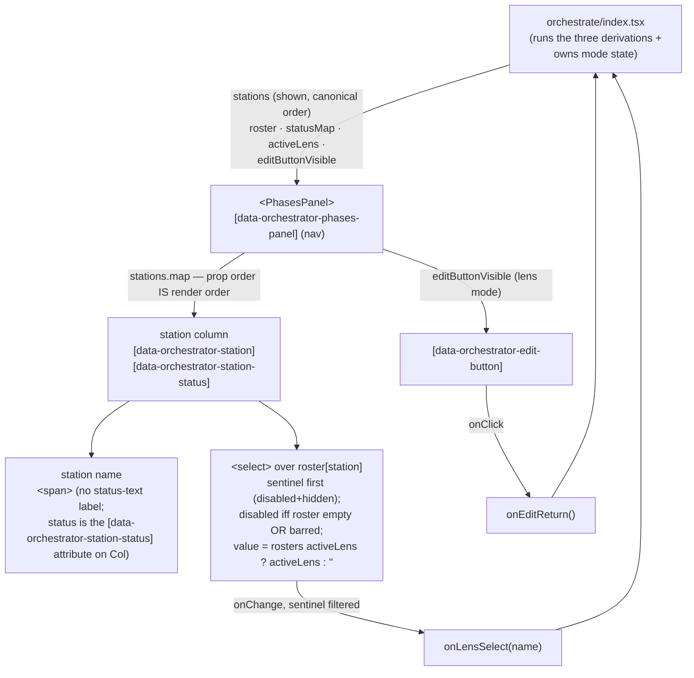

# phases-panel — Architecture & Decisions

## Why this module exists

The orchestrator's affordance container is a **notional-machine lifecycle
instrument**, not a single picker: the layout itself teaches the lifecycle, and
the per-station status display shows the machine's progress through it.
Module-folder presentation keeps that surface separable from the orchestrator's
mode machine: the orchestrator decides WHAT is shown (derivations + mode state);
this module decides only HOW it renders.

The locked design — the three derivations, the station-status value-space, the
availability rule, the selector contract — lives at
[`../README.md` § The phases panel](../README.md) and
[`../DOCS.md` § The phases panel](../DOCS.md). This sketch covers the
module-internal structure only.

## Data flow

## Structural constraints

- **Presentation only.** No derivation calls, no `LENS_REGISTRY` import, no
  EventBus dispatch, no embodiment access. The component is a pure function of
  its props; every behavior is testable with inline fixture props in jsdom.
- **Prop order is render order.** The orchestrator hands `stations` in canonical
  order; the panel renders exactly that sequence and imposes no ordering of its
  own (a non-canonical prop order renders as given — the ordering contract lives
  with the availability derivation, not here).
- **Disabling is roster-empty OR barred** (reverses the prior "roster-driven only"
  rule) — `roster[station].length === 0 || statusMap[station] === 'barred'`. A
  `barred` station (an upstream machine error left it unreachable —
  **error-downstream**, not the stubbed `pending` case) is non-interactive even when
  staffed. `barred` arises only on `creation` / `evaluation`, so `source` / `parse` /
  `realm` stay interactive; the disable clause is a no-op today (only `source` is
  staffed, and it is never barred) — locked for future prediction lenses. Canonical
  rule: [`../README.md` § The phases panel](../README.md).
- **Per-station value derivation is independent** —
  `roster[station].includes(activeLens) ? activeLens : ''` per column, no
  cross-station coupling; a multi-station lens therefore reads as active in each
  station that rosters it.
- **One shared change handler** filters the sentinel (`''`) and forwards the
  lens name; the orchestrator supplies the `source: 'panel'` attribution at its
  own dispatch site (provenance is the orchestrator's concern, not the panel's).
- **Status is a compact cue, no text.** The per-station status renders **only** as
  the `data-orchestrator-station-status` attribute (a styleable state — no plain-text
  label); the **compact visual cue** (colour / dot / border) lives in the
  orchestrator's `orchestrate.css`, which also realizes the left → right column row
  (this module is raw block elements without it). The exact pixels are a Phase-1
  detail; tests anchor on attributes, never label text.

## Out of scope

- **Which stations are shown / what status they wear** — the orchestrator's
  derivations
  ([`../derive-station-availability.ts`](../derive-station-availability.ts),
  [`../derive-station-status.ts`](../derive-station-status.ts),
  [`../derive-station-roster.ts`](../derive-station-roster.ts)).
- **Mode transitions + bus dispatch** — the orchestrator's transition handler
  (`mode-changed` / `lens-switched` ordering, `source: 'panel'`).
- **Per-station applicability filtering** (`applicableTo`) — a backlogged seam;
  the panel renders the roster as handed.
- **The dock** (type toggle, sandbox toggle, run limits, Run) — Cycle 3's
  omnipresent region, a sibling surface.
