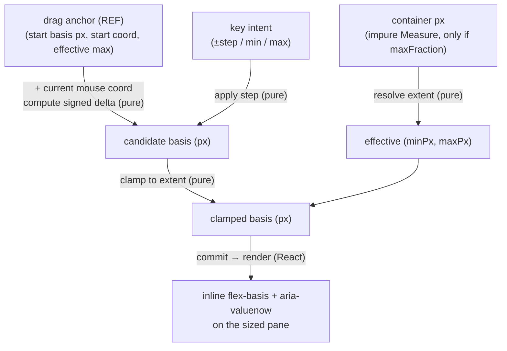

# splitter — architectural sketch

The design target for `<Splitter>`. See [README.md](./README.md) for the
contract and selectors; this is the data flow and the pure/impure boundary.

## Named execution phases (the size pipeline)

Every size change — drag or keyboard — runs the same four phases. Only phase 1
touches the DOM; phases 2–3 are pure (`./geometry.ts`); phase 4 is React.

1. **Measure** (impure, React glue — the ONLY DOM read; skipped entirely unless
   `maxFraction` is set). Runs at `mousedown` / `keydown` AND on mount +
   container resize (feature-detected `ResizeObserver` — jsdom lacks it),
   reading `containerPx = containerRef.getBoundingClientRect()[width|height]`
   (`0` when unmeasured). The resolved `effectiveMaxPx` is held in state so
   `aria-valuemax` reports the reachable ceiling (not the raw `maxPx`) and
   drag/keyboard clamp to the same value.
2. **Resolve extent** (pure — `resolveMaxBasisPx`).
   `effectiveMaxPx = (maxFraction == null || containerPx <= 0) ? maxPx : min(maxPx, containerPx * maxFraction)`.
   The `containerPx <= 0` guard is the ratified gate decision.
3. **Compute basis** (pure — `nextBasis` / `nextBasisFromKey`). The signed drag
   delta (or the key step) applied to the anchor's start basis, then
   `clampBasis`-ed into `[minPx, effectiveMaxPx]`.
4. **Commit + paint** (React). `setBasisPx(...)` → inline
   `flex-basis: ${px}px` + `aria-valuenow={px}` on the sized pane. This is what
   the `fireEvent` tests observe.

## Data-state flow

Nodes are the shapes the size data takes; edges are the transforms. (The pointer
lifecycle — `mousedown → dragging → mouseup` — is the prose below, not this
diagram.)

## Drag lifecycle (the pointer state machine)

Mouse events + window listeners (see README § Drag transport for why, not the
pointer/`setPointerCapture` path):

- **`mousedown` on the handle** — Measure + Resolve extent, then write the
  **anchor ref** `{ startBasisPx, startCoord, effectiveMaxPx }` and flip a
  `dragging` state. `preventDefault()` suppresses text selection.
- **`dragging` effect** — attaches `mousemove` + `mouseup` listeners to `window`
  (so tracking survives the pointer leaving the thin handle). The effect ALWAYS
  returns its cleanup (no early return — consistent-returns + idle-safe), so an
  unmount mid-drag tears the listeners down (no leak). The move handler reads
  the anchor ref (never stale) → Compute basis → Commit.
- **`mouseup`** — flips `dragging` off; the effect cleanup removes the
  listeners.
- **Keyboard** (`onKeyDown` on the handle) — a one-shot Measure → Resolve →
  Compute → Commit per handled key; no listeners, no anchor.

## Container resize (fill-chain + resizeMode)

- **Fill-chain** (`orchestrate.css`): each pane is a flex host and its single
  child fills both axes, so a NESTED splitter fills its host pane. This is what
  lets the vertical UI/console splitter divide the height the horizontal
  splitter's pane provides — without it the flex child collapses to 0.
- **`resizeMode`**: a `ResizeObserver` on the container (feature-detected)
  re-runs Measure on resize. With `resizeMode: 'proportional'` the effect also
  rescales the basis by the container-extent ratio (pure `rescaleBasis`, via a
  functional `setBasisPx` so the latest/dragged basis is scaled), preserving the
  split ratio; `fixed` leaves the px basis alone. jsdom has no `ResizeObserver`,
  so this path is pure-tested + Sandbox-verified.

## The pure/impure boundary

- **Pure** (`geometry.ts`, jsdom-independent, exhaustively unit-tested):
  `clampBasis`, `resolveMaxBasisPx`, `nextBasis`, `nextBasisFromKey`,
  `rescaleBasis`. The correctness surface.
- **Impure** (`index.tsx`): the container Measure (`getBoundingClientRect` +
  `ResizeObserver`), the disposable `basisPx` state, the anchor ref, and the
  window drag listeners. The component tests pin WIRING and DIRECTION only —
  jsdom computes no layout, so exact geometry / feel is Sandbox-only.
