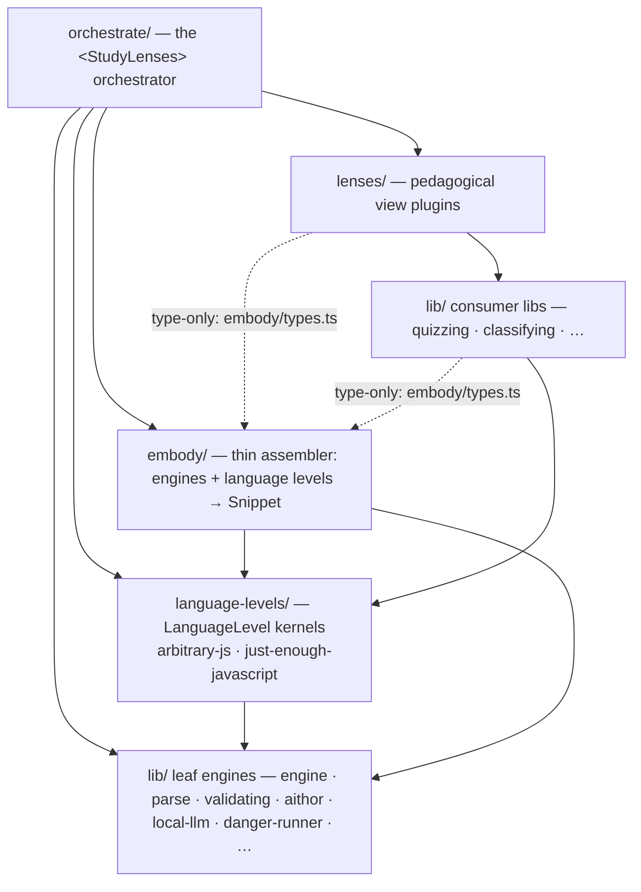

# study-lenses — Architecture

> **Architectural sketch** (see repo `DEV.md` § Directory Documentation
> Convention): this document describes the package's intended end-state
> structure — module docs and implementation are conformed to it. Campaign
> status and doc precedence during the language-levels inversion: see
> [ROADMAP.md](./ROADMAP.md).
>
> Division of labor: this file is the newcomer orientation tour (layer map, core
> concepts, extension points). [DOCS.md](./DOCS.md) holds package-level
> decisions and rationale. [README.md](./README.md) is the pedagogical front
> door.

## What this package is

StudyLenses turns any JavaScript snippet into a study object: `embody(code)`
produces a frozen, event-streaming **Snippet** (the _embodiment_), pedagogical
**lenses** render views onto it, and the `<StudyLenses>` **orchestrator** wires
editor, phases, and lenses together for the learner. A **language level** is an
injected plugin of semantic models and constraints that dials scaffolding up or
down — the pedagogical control surface the whole architecture serves.

**Reading order for newcomers:** [README.md](./README.md) (why — the pedagogy) →
this file (how — the shape) → [DOCS.md](./DOCS.md) (decisions + rationale) → the
README/DOCS pair inside whichever module you are working on.

## The layer map

Dependency direction is the load-bearing invariant: arrows point strictly
downward. The boundaries lint (`eslint-plugin-boundaries`, repo
`eslint.config.mjs`) encodes these arrows as element types — the executable form
of this diagram and of
[DOCS.md § Dependency rules (one-way)](./DOCS.md#dependency-rules-one-way) (the
element-type model is designed and enabled by [ROADMAP.md](./ROADMAP.md) P2).

Solid arrows are runtime imports; dashed are the sanctioned type-only Snippet
seam. Sibling edges within a tier (leaf → leaf, consumer → consumer) and the
full element-type × element-type edge table are pinned by P2's lint design note.

- **Pure leaf engines** (`lib/engine`, `lib/parse`, `lib/validating`,
  `lib/aithor`, `lib/local-llm`, `lib/danger-runner`, …) are language-agnostic
  and import nothing upward — not even types. Each is generic machinery
  parameterized by data.
- **Language-level kernels** (`language-levels/<name>/`) hold every
  level-specific fact — validation spec, scope/realm/creation models, notional
  machine docs, trace semantics, editor-support data. A kernel imports leaves
  and `@-utils`, never `embody`, `lenses`, or `orchestrate`.
- **embody** is the thin assembler: it composes the leaf engines plus an ordered
  array of injected `LanguageLevel`s (resolved by the orchestrator — see §
  Desired vs current vs mode) into a Snippet, populating each phase iff a
  provided level supplies that capability (precedence = array order). Its
  three-layer data framework (Data → Entwined → NMEvent) is specified in
  [embody/DOCS.md](./embody/DOCS.md#three-layer-framework).
- **lenses** receive the embodiment via props — level data included: the Snippet
  carries its level, so lenses never import embody or a kernel at runtime
  (type-only imports of the Snippet contract are the sanctioned seam).
  **orchestrate** derives stations, availability, and recommendations and is the
  package's public entry point.
- `lib/` holds two element types the lint distinguishes: **leaf engines** (no
  upward imports ever) and **consumer libs** (may type-import the Snippet
  contract from `embody/types.ts` — the documented consumer seam — and consume
  kernels).

## Core concepts

### Snippet (the embodiment)

`embody(code, { levels })` returns a deep-frozen Snippet: static phase data plus
replayable event streams, ECMAScript-spec-aligned. The type contract lives in
[embody/types.ts](./embody/types.ts) and is the package's widest internal seam —
consumers import its types directly. The Snippet carries a per-level **verdict
record** keyed by level name (each provided level's membership verdict). Phase
objects are nullable on two distinct axes: **status-gated** (the phase, or a
phase upstream of it, failed — e.g. `parseAST` is null when parsing failed) and
**capability-gated** (no provided level supplies that phase — e.g. `realm` is
null when no provided level has a realm model). `tokenize` and `parseAST` are
generic, status-gated; `realm` is capability-gated only (it has no failure
mode); `creation` is capability-gated, then status-gated; `evaluation` is always
present.

### LanguageLevel

A language level is a bundled kernel that declares its capabilities —
validation, admissible snippet types, and optional semantic models (scope,
realm, creation, evaluation lenses, editor support). The definition is
[semantic, not syntactic](./README.md#a-language-level-is-semantic-not-syntactic):
syntax restrictions derive from what the models cover, and the identity level
fits it vacuously — a validator that always passes and an empty set of models.
Levels are layered constraints on a permissive base: `arbitrary-js`
(learner-visible label: **"Full JavaScript"**) is that identity level;
`just-enough-javascript` (JEJ) layers the full notional-machine model on top.
embody always receives at least the identity level; there is no "no language
level" branch. The `LanguageLevel` interface is a first-class DDD'd contract —
the level-side analogue of the lens contract in
[lenses/types.ts](./lenses/types.ts) — and lives with the static registry in
`language-levels/` (see [ROADMAP.md](./ROADMAP.md) for the campaign that lands
them).

### Desired vs current vs mode — the pedagogical dial

Three load-bearing concepts every level-aware surface builds on:

- **Current** (derived, per level): which levels this code satisfies _now_ — a
  tri-state per level: **member / non-member / undetermined** (pre-gate failure,
  e.g. unparseable code). Membership derives from three inputs: snippet-type
  admission (a level whose `snippetTypes` exclude the snippet's type is an
  **explicit non-member** — rendered "not applicable" on target-facing surfaces,
  and capability-gated on the Snippet: the assembler consults a level's
  capabilities only when the level admits the snippet's type), parse status
  (unparsed ⇒ undetermined), and the level's validate verdict.
- **Desired** (declared): the level the author or learner targets. Meaningful in
  blocking mode — "this isn't JEJ" only exists against a declared target.
- **Enforcement mode** (`blocking` | `detected`): whether the level is an
  enforced target or dynamically detected. **Detected** (the default): no
  declared target — the environment adapts to the code; every conforming level
  is active (at minimum the identity level), so all study features the code
  supports are available. **Blocking**: the desired level alone is active and
  enforced — violations warn, and the level's machine withdraws for out-of-model
  code (e.g. "this exercise is JEJ-only").

The **active levels** — the ordered array embody receives — are mode-resolved by
the orchestrator: blocking → `[desired]`; detected → all current member levels,
most-specific first (capability precedence follows array order). Phase presence
follows the active levels: a station appears iff some active level provides the
capability AND admits the code. Only an explicit non-member verdict withdraws a
surface; undetermined keeps the machine shown with the failure rendered through
the status model (failures _inside_ the machine teach; only _out-of-model_ code
withdraws the machine). Lenses may additionally self-gate via their own
`applicableTo`.

Both the dial and the mode are set by `<StudyLenses>` props (initial defaults)
and by learner controls which **always override, session-scoped** — there is
deliberately no author-side lock (learner autonomy; see
[DOCS.md § Philosophy](./DOCS.md#philosophy)). The pair is the scaffolding-fade
control
([README.md § Pedagogical first principles](./README.md#pedagogical-first-principles))
and the guided/unguided axis made literal: blocking = a guided placement;
detected = the environment follows the learner.

Which of desired / current / mode each surface reads:

| Surface                              | Reads              | Behavior                                                                                                                                                                                                                                                                                                           |
| ------------------------------------ | ------------------ | ------------------------------------------------------------------------------------------------------------------------------------------------------------------------------------------------------------------------------------------------------------------------------------------------------------------ |
| Stations: `realm`, `creation`        | Active levels      | Appear iff some active level provides them and admits the code; disappear (never grey) on explicit non-member. The `source`/`parse`/`evaluation` stations are always shown, status-gated only. Detected mode: stations track what the code satisfies; blocking mode: dialing down fades them.                      |
| Editor gutter, "not in level" badges | Desired (blocking) | Blocking mode only — violations reported against the desired level; detected mode declares no target, so no violation warnings exist (syntax errors still surface generically).                                                                                                                                    |
| Lens dropdown                        | Neither directly   | Disappearance is station-mediated only. Within shown stations the dropdown lists the full roster; per-lens `applicableTo` feeds the recommender's applicability filter and the lens's own refusal rendering (ranking is `recommend`'s job) — never dropdown removal.                                               |
| Station greying (status)             | Neither            | Error-downstream signal, orthogonal to levels.                                                                                                                                                                                                                                                                     |
| Run button                           | Neither            | Never level-gated — Full JavaScript runs with minimal ceremony (the low floor).                                                                                                                                                                                                                                    |
| Level indicator                      | Current + mode     | Unordered badge set of detections (levels overlap; no total order), with hover-read docs per level. Blocking mode additionally highlights the desired target; when desired is non-applicable it renders distinctly as a target ("not applicable in script mode — switch to module to pursue JEJ").                 |
| Level selector (radio + prop)        | Sets desired       | Governs in blocking mode; prop = initial default; learner override wins, session-scoped. "Full JavaScript" checked by default.                                                                                                                                                                                     |
| Mode toggle (checkbox + prop)        | Sets mode          | Blocking ⇄ detected; prop = initial default (`detected`); learner override wins, session-scoped.                                                                                                                                                                                                                   |
| Type toggle (script ↔ module)        | SnippetType        | Free both ways. Each level declares the snippet types it admits (JEJ: module-only), so "script ⇒ no constraining level" is derived, not special-cased. At desired=JEJ + script the dial is kept and the indicator explains; never auto-reset, never disabled.                                                      |
| Dock nudge                           | Current + mode     | The invite fires only while the dial and mode sit at untouched defaults AND the detections contain a non-identity member ("your code satisfies JEJ — enforce it?"); any explicit dial or mode action silences it (no nagging a deliberate fade). Desired-not-satisfied is explained by the indicator, not a nudge. |
| Evaluation tracers                   | Active levels      | A level's `evaluationLenses` (tracers) appear only when that level is active and the code is a member — the models-never-lie guarantee. Otherwise the evaluation station shows bare run output.                                                                                                                    |
| Editor-support surfaces              | Active levels      | Completion, hover docs, and format read the most-specific active level's `editorSupport` (blocking → desired; detected → most-specific detection). The violations gutter above is the one blocking-only surface.                                                                                                   |
| Generate (code generation)           | Active (default)   | Generates against the most-specific active level by default, with a per-invocation override dropdown.                                                                                                                                                                                                              |

### Lenses

Stateful "mini web apps"
([DOCS.md § Locked decisions](./DOCS.md#locked-decisions)) receiving the frozen
embodiment via props. Each lens self-describes through
`applicableTo(embodiment)` and `recommend(embodiment)`
([lenses/types.ts](./lenses/types.ts)) — the recommender holds no per-lens
knowledge. The recommender is an applicability filter + ranking engine
organizing recommendations into the 3D grid of **block-model level** × scope ×
NM components ([DOCS.md § 3D Block Model space](./DOCS.md#3d-block-model-space)
— "block-model level" is a comprehension depth, unrelated to language levels;
the NM-components axis is populated per language level and empty at the identity
level).

### Execution backends

Two parallel backends converge at the consumer contract — neither wraps the
other:

- [`lib/engine`](./lib/engine/README.md) — the worker-isolated streaming engine;
  single operation `evaluate(spec): EngineHandle`. embody's run / intercept /
  trace tiers are assembler-level modes built on it; trace _harness_ machinery
  is generic, trace _semantics_ are the level's (`evaluationLenses`).
- [`lib/danger-runner`](./lib/danger-runner/README.md) — the same-origin iframe
  backend trading isolation for a real `window`, native dialogs, and `debugger;`
  stepping.

## Public surfaces

Three surfaces are the package's public, versioned contract — documented and
stable for external use ([ROADMAP.md](./ROADMAP.md) P1/P5a land the level
surfaces); everything else is internal:

1. **The `<StudyLenses>` prop API** —
   [README.md § Public API](./README.md#public-api-studylenses).
2. **The `LanguageLevel` interface** — `language-levels/types.ts`.
3. **The language-level registry** — a static frozen record of the shipped
   levels; no runtime registration API exists (and none will until a third-party
   level does).

## Extension points

Each extension is a self-contained recipe touching only its own unit — never the
core.

- **Add a language level.** Create `language-levels/<name>/` implementing
  `LanguageLevel`, add exactly one line to the registry module
  (`language-levels/registry.ts`; the exact filename is P1's call) — nothing
  else, plus a cspell entry if the name is a new word (repo convention). Every
  orchestrator level surface enumerates the registry, and the lint element types
  are glob-based, so no other edit exists. One hard bound: a level can only
  **constrain** parseable JavaScript — the parse leaf is standard JS; levels
  never extend syntax. Canonical exemplar: `language-levels/arbitrary-js/`. If a
  design seems to need arbitrary-JS semantics for a phase, that is a design
  smell, not a gap — the identity level provides no optional capabilities.
- **Add a lens.** Implement the `LensModule` contract
  ([lenses/types.ts](./lenses/types.ts)): `name`, `Component`, `config`,
  `applicableTo`, `recommend`, optional `phase`. Register it; the panel,
  dropdown, and recommender pick it up from the roster.
- **Add a leaf engine.** A new `lib/` leaf: language-agnostic machinery,
  parameterized by data, zero upward imports, README + DOCS per the repo's
  per-module convention. Canonical exemplar: `lib/parse`.

The contribution process (docs-first → test-first → review-before-merge) lives
in the repo-root [CONTRIBUTING.md](../../../CONTRIBUTING.md) and repo `DEV.md`
([ROADMAP.md](./ROADMAP.md) P6 distills the study-lenses recipes into it).
