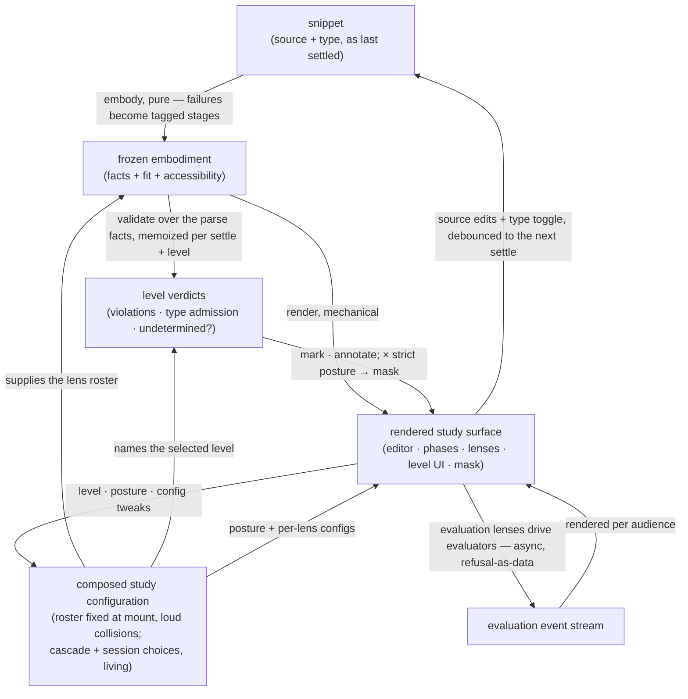

# study-lenses — Architecture & Decisions

Package-level architecture for the study environment described in
[README.md](./README.md): what shape a correct implementation takes, at the root
abstraction level. Each region's own DOCS.md zooms into its internals; this
document constrains only the package-level shape.

## Architectural sketch

> Written Phase 0, before implementation. The Refactor step is held against this
> document — not what the code does, but what shape it takes.

## Execution phases

1. **Compose** — two cadences. At mount (sync, loud failure): the default lens
   roster is joined with everything the host injects; name or level-key
   collisions fail loudly here. Input: host-provided rosters and defaults.
   Output: the joined roster, fixed for the session. Continuously: the
   configuration cascade re-resolves per lens name whenever a layer changes,
   with the learner's session choices and tweaks always the final layer. Input:
   cascade layers + session choices. Output: the composed study configuration,
   session-living.

2. **Derive** (sync, pure) — once per settle, and again when the snippet type
   toggles. The fact stages are derived once from the settled snippet; two
   consumers of those facts follow:
   - **Embody** — derive each lifecycle phase's accessibility from the tagged
     stages (downstream phases barred, cause carried), run every phase-declaring
     lens's applicability over the Facts, attach the fitting lenses to their
     phases, freeze. Level-blind throughout. Input: the settled snippet + the
     joined roster. Output: the frozen embodiment.
   - **Validate against levels** — a level's validator consumes the embodiment's
     parse facts — never a second parse, one parse truth — memoized per settle
     and per level. The selected level yields the working verdict; the
     selector's open list runs the same consultation for each registered level.
     Input: the embodiment's parse facts + the registered levels. Output: level
     verdicts (violations · type admission · undetermined while unparsed).

3. **Render** (mechanical) — the five lifecycle phases render from the
   embodiment: barred phases visibly barred with their cause; accessible phases
   list their fitting lenses. Level surfaces render from the verdicts. The
   enforcement mask derives here, from the selected level's verdict crossed with
   the strict posture — an inert overlay; mounted lenses keep their state
   beneath it. An initial-focus request also mounts here: a phase-declaring lens
   when its phase is accessible, a panel-excluded lens after its applicability
   runs at mount; recommendation rendering passes through the mask. Input:
   embodiment + verdicts + composed study configuration. Output: the rendered
   study surface.

4. **Interact** (async at the edges) — the learner opens lenses, edits, and
   toggles; each control re-enters its own phase. Source edits re-enter Derive
   at the next settle; the snippet-type toggle re-enters Derive immediately;
   level selection, posture, and configuration tweaks re-enter through the
   composed study configuration with no re-parse. Evaluation-phase lenses drive
   evaluators, which execute the program and emit events rendered per audience;
   a settle that unmounts an evaluation lens cancels its in-flight evaluation.
   Input: the rendered surface + learner intent. Output: a new settle or a
   re-render.

## Data flow

## Structural constraints

- **The embodiment is level-blind.** No level knowledge in its data or its
  pipeline; level logic runs only inside individual utilities' internals. A gate
  that throws degrades to not-applicable with a loud development-mode report.
- **One parse truth.** A level's validator consumes the embodiment's parse
  facts; nothing in the package parses the same settled source twice.
- **Mask, not filter.** Enforcement never edits fit or accessibility — it covers
  what fit produced, and it derives at render time from the selected level's
  verdict crossed with the strict posture. Mask state follows the settled
  verdict, so it never flaps mid-keystroke; while the verdict is undetermined
  (the code doesn't parse), the mask names no violation and the parse phases'
  supports stay uncovered.
- **Semantic honesty lives at the lens gate.** A lens that renders a level's
  semantic models gates itself on that level's validator — one shared predicate,
  so the level-bound lens family appears and withdraws as a unit, and no lens
  lies about a program beyond its level.
- **One immutability boundary.** The embodiment freezes what it built and only
  what it built; attached lens refs remain owned by their defining modules and
  are attached as refs, never as pre-bound wrappers.
- **Loud versus graceful.** Loud: injection collisions, and any failure of the
  embodiment's own machinery. Graceful: a lens that doesn't fit is silently
  absent; a fact stage's failure renders inside its owning phase; a utility
  given input it cannot serve returns a structured refusal — nothing in the
  study surface ever throws at the learner.
- **Single writer, settle-bounded life.** Only the editor mutates the program
  source; every derived state re-derives per settle, and no evaluation event
  stream outlives the settle that unmounts its lens.
- **The embodiment knows no consumers.** Lens refs arrive as arguments;
  evaluators are imported by the lenses that drive them. Nothing in the
  embodiment reaches toward components or execution.
- **One composition root.** The orchestrator joins the rosters and resolves the
  configuration cascade; injection is append-only, and built-ins are never
  replaced or shadowed.

## Out of scope

- **Learner identity, progress, grading, sequencing** — the embedding LMS's
  layers, above and below this package's middle slice.
- **Executing code that does not parse** — the parser is the execution ceiling;
  execution is reached only through the lifecycle's phases.
- **The evaluator contract as a public surface** — evaluators are internal
  machinery consumed by lenses.
- **Reporting back to the host** — no data or telemetry channel leaves the study
  surface, and no session choice persists beyond the session.
- **Region internals** — each region (orchestrator, lenses, evaluators, language
  levels, the embodiment factory, shared leaves) owns its own architecture in
  its own DOCS.md; this sketch binds only the package-level shape and the seams
  above.
