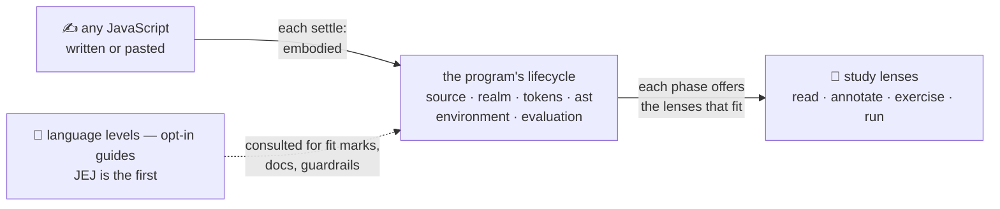

<!-- cspell:ignore Explorotron Koli consultable Yoshi -->

# study-lenses

An interactive JavaScript study environment. One program at a time is embodied
as structured study data and rendered through **pedagogical lenses** arranged
over the program's own lifecycle. Learners read, predict, probe, and run code
where they write it; educators and embedding sites shape the study environment
through configuration without ever locking the learner out of their own
controls.

## Why lenses?

Understanding code is not one skill but many: predicting what the machine will
do, spotting the grammar of the language, tracing values, explaining a program's
purpose to another person. A **study lens** makes one of those perspectives
tangible — think of a kit of magnifying glasses 🔬, each lens revealing a
different aspect of the same program. Some lenses turn a program into an
exercise (fill in the blanks, reorder the lines), some annotate or visualize it,
some run it and let you interrogate what happened.

The learner carries the kit with them. Any JavaScript they meet — pasted from
anywhere, not just curriculum content — can be studied here. That is the
package's central pedagogical bet: the study skills, not the curated content,
are what learners take with them.

## How a program is studied

The learner writes in the editor. Every time typing settles, the program is
re-embodied — parsed and analyzed into study data — and laid out along its
**lifecycle**: the six-phase journey the language specification itself
describes, from raw text to a running program.

There is no top-level Run button: **the phases are the interaction model**. Each
phase offers the lenses that fit the current code, and running a program is
itself a lens — opened inside the `evaluation` phase, where output renders per
audience. When code doesn't parse, the `tokens` and `ast` phases speak the
parser's own voice: their lenses show the real error together with a
learner-worded explanation — spelling mistakes in `tokens`, grammar mistakes in
`ast`. The machine's implicit judgments become explicit, visible places to
study.

## Guardrails, not cages

A **language level** is a curated slice of JavaScript — small enough that a
learner can hold a precise model of the machine in their head. **JEJ (Just
Enough JavaScript)**, the first level, is just enough to write imperative,
text-and-number interactive programs on a bounded, learnable notional machine.

Levels are guides, never gatekeepers. Selecting one gets you: fit marks in the
level selector (does my code fit this level?), violation markers in the editor
gutter, documentation on hover, and — only if you opt into **strict** — a
guardrail that masks the study surfaces until the code returns to the level. The
default posture is **warn**: nothing is ever blocked, warnings simply appear
where you edit. Even under strict, the editor and every control that could
restore conformance stay alive, and a typo never reads as a level violation —
while code doesn't parse, the level honestly says it cannot judge.

The point is guardrail-up, not scaffolding-down: keeping code inside a level
keeps that level's lenses available, and the boundary is always explained,
always learner-liftable.

## Two hats, four audiences

- 🔬 **The Frogrammer** studies the machine: predict what a phase will do, open
  its lenses, compare. The lifecycle phases are their instrument panel.
- 🎨 **The Vibetoader** studies outcomes: run first, observe, iterate. The same
  environment serves them — a run-first initial focus drops the learner straight
  into the evaluation phase's run lens.

Neither hat is better; they are a spectrum, and the environment never forces
one. When a program runs, its output speaks to **four audiences** — the
learner-as-user (dialog interactions), the developer (the console), the machine,
and the reader — and run output renders per audience, so learners see whom each
line of their program is talking to.

## Pedagogical grounding

This package implements the middle layers of the framework described in Yoshi
Malaise and Beat Signer (2023), _Explorotron: An IDE Extension for Guided and
Independent Code Exploration and Learning_, Proc. of Koli Calling '23
([PDF](https://wise.vub.ac.be/sites/default/files/publications/Malaise_KoliCalling2023.pdf)).

The framework's curated/uncurated × guided/unguided axes apply at two scopes:
this package owns the **snippet scope** (one mounted instance), the embedding
LMS owns the **curricular scope** (which snippets, in what order, with what
configuration).

| Pyramid layer          | Snippet scope (this package)                | Curricular scope (the LMS)      |
| ---------------------- | ------------------------------------------- | ------------------------------- |
| Progress modelling     | —                                           | learner state, knowledge graph  |
| Lenses & defaults      | the lens kit; recommendations ranked by fit | _(subsumed)_                    |
| Path generation        | —                                           | sequencing snippets into a path |
| Manual recommendations | the initial-focus lens request              | the LMS picks the snippet       |
| Crafted paths          | —                                           | the full curriculum             |
| Monitored learning     | —                                           | grading, reports, integrity     |

Three principles from the paper are load-bearing:

- **Skill transfer** — learn where you'll work. Lenses live in the same editing
  environment learners use for real code, not a separate school tool.
- **Learner autonomy is structural.** Every lens the orchestrator offers is
  learner-reachable regardless of what the host curated; recommendations and
  initial-focus requests suggest, never confine. Educators structure learning
  _for_ learners and learners structure their own — both through the same
  component, differing only in configuration.
- **The fade is pull, not push.** Nothing is imposed, so support withdraws by
  not being opened: as mastery grows, learners stop reaching for the early
  phases' lenses. Level scaffolding follows the same grain — in warn posture
  nothing is ever blocked; strict is a visible, learner-liftable guardrail that
  keeps code where the level's lenses can serve it.

## What this package does not own

- **Progress modelling and learner state** — knowledge graphs, learner profiles,
  ZPD positioning. The package never knows who the learner is.
- **Curricular sequencing** — which snippet comes next. This package renders one
  stepping stone; the embedding LMS arranges the path.
- **Monitored learning** — grading, reporting, LMS integration, cheating
  detection.
- **Executing code that does not parse** — by design, the parser is the study
  environment's execution ceiling. Execution is reached through the lifecycle's
  parse phases, whose lenses explain the parser's own errors; source-phase study
  serves any text.

## What crosses the boundary

**In** — from the embedding site: the program source; its initial snippet type;
an optional initial-focus lens request (a focus request, never a bypass: a
phase-declaring lens is honored when its phase is accessible, and a
panel-excluded lens is honored by running its applicability at mount — the
enforcement mask applies to a focus-mounted lens identically; the run-first
posture for curated examples is this request naming the run lens); configuration
(the top layer of a cascade the orchestrator resolves per lens by name, with the
learner's own tweaks always the final layer); additional lenses; additional
language levels; an initially selected level; an initial enforcement posture.
Injection is **append-only** — name and key collisions fail loudly, and
replacing or shadowing built-ins is out of scope. Every initial choice is a
default, not a lock: the learner can override level, strictness, snippet type,
lens choice, and configuration for their session.

**Out** — a rendered study environment: one mounted component, everything else
internal.

The public, versioned surface is the host boundary above, the lens contract, and
the language-level interface. The evaluator contract is internal.

## The model

> The sections above tell the story; the sections from here down state the
> domain model precisely. They are the naming contract for contributors and
> agents working in this package.

### One envelope, kinds by their main operation

Every study utility — whatever its kind — declares the same envelope: a name, an
applicability predicate, a main operation — and, for the lens kind, optional
configuration, lifecycle phase(s), and recommendations. Kinds differ in the
shared shape of the main operation. There are two kinds: **lenses** (components
that render views of the embodiment) and **evaluators** (headless generators
that execute code and emit events). Kind contracts carry no level fields — a
utility's level affinity, if any, lives privately inside its applicability and
main operation.

### The embodiment: facts + fit + accessibility, level-blind

Embodying a program derives its Facts as tagged stages, derives each lifecycle
phase's accessibility from those stages, runs every phase-declaring lens's
applicability over the Facts, attaches the fitting lenses to their phases, and
freezes the result. The embodiment is **level-blind**: it contains no language
level knowledge — level logic runs only inside individual utilities' own
internals. The frozen embodiment owns its structure, not the attached lens
modules; those remain owned by where they were defined.

### The lifecycle is the interaction model

Learners interact with a program only through its lifecycle phases. Each phase
presents the lenses that fit it. A barred phase renders as barred, with its
cause; within an accessible phase, lenses that don't fit simply don't appear.
Evaluation-phase lenses drive evaluators behind refusal-as-data.

### Language levels: consulted, never in charge

Level validation is memoized per settle and per level. The selected level's
verdict feeds the editor gutter (selected level only), the enforcement mask, and
the selector's closed face; the selector's open list shows per-level fit marks —
the same consultation run for each registered level. The selector is permanent
whenever levels are registered — it is the discovery and self-assessment
channel, with fit marks and documentation on hover. Whether a level admits the
current snippet type is checked the same way as code conformance.

Enforcement is **mask, not filter**: fit computation never changes when a level
is active — under strict, the mask covers what fit produced. Editor surfaces
always stay alive, and so does every control whose change can itself restore
conformance (the selector, the strict toggle, the snippet-type toggle, the
guide). While the code doesn't parse, the level's verdict is undetermined: the
mask never names a violation it can't know, and the parse phases' supports stay
available.

### The orchestrator

The orchestrator is the one component the host mounts. It renders: the editor —
the single writer of the program's source, from which everything re-derives per
settle — the six-phase study panel, the permanent level selector, the
selected-level gutter, the strict toggle, the snippet-type toggle, and an
embedded guide. It is also the composition root: it owns a default roster of
lenses and appends whatever the host injects.

## Glossary — the ubiquitous language

These terms are the naming contract for the whole package: functions, types,
documents, and UI copy use them consistently.

- **embodiment** — the frozen study object produced when a program's source is
  embodied: facts + fit + accessibility. The canonical name every lens receives
  it under.
- **snippet** — the program under study: the source text a learner or host
  brings, together with its snippet type.
- **Facts** — the synchronous fact slice of the embodiment: the source text, its
  tokens, its syntax tree, the entwined source⇄tree binding, and the snippet
  type. Each is a **fact stage**: a tagged result holding either its value or a
  structured cause of failure. A stage's own failure renders inside the
  lifecycle phase that owns it.
- **lifecycle** — the six flat phases every program moves through:
  `source → realm → tokens → ast → environment → evaluation`. The phases are
  peers, matching the language specification's own shape; the split between
  `tokens` (spelling) and `ast` (grammar) follows the parser's practical
  behavior. Phase names are data; learner-facing display labels are
  presentation, owned by the orchestrator's UI.
- **phase accessibility** — a property of each lifecycle phase on the
  embodiment: a phase is **barred** when an upstream fact stage failed, and it
  carries that cause. Distinct from a lens simply not applying.
- **applicability** — the gating predicate every study utility declares: a pure,
  synchronous function of the utility's input domain answering "does this
  utility apply to this input?". Its internals are the utility's own business —
  no consumer knows or cares how it decides. For lenses the input is the Facts.
- **fit** — the outcome of running a lens's applicability over the Facts;
  fitting lenses are attached to their declared phases. Not the same thing as
  the level selector's **fit marks**, which are a language-level verdict about
  the code: fits / doesn't fit / not applicable for this snippet type /
  undetermined while unparsed.
- **study utility** — anything sharing the one utility envelope: a name, an
  applicability predicate, a main operation — and, for the lens kind only,
  optional configuration, declared lifecycle phase(s), and recommendations. A
  **kind** of utility is defined by the shared shape of its main operation.
- **composed study configuration** — the session-living result of composition:
  the lens and level rosters joined once at mount (collisions loud), plus the
  configuration cascade resolved per lens name — with the learner's session
  choices and tweaks always the final layer, re-resolved as they change.
- **lens** — the component kind of study utility: its main operation renders a
  pedagogical view of the embodiment. Lenses are read-only views — they never
  mutate the embodiment. A lens that declares no phase is panel-excluded: it
  mounts only by explicit request.
- **evaluator** — the headless generator kind of study utility: its main
  operation executes code and emits events. Evaluators are consumed by lenses
  and never rendered themselves; a lens is never an evaluator.
- **refusal-as-data** — the main-operation convention: on input it cannot serve,
  a utility returns a structured refusal result, never a throw. The refusal
  shape is part of each kind's shared contract.
- **language level** — a curated slice of JavaScript packaged as a passive,
  consultable library: a validator over the parse facts (the tokens/ast portion
  of the Facts), the snippet types the level admits, reference and
  notional-machine documentation, editor support, and semantic-model builders. A
  level answers when consulted — it is never a plugin and never an actor — and
  levels never ship lenses.
- **notional machine (NM)** — a language level's semantic model of how
  JavaScript executes: the bounded conceptual machine a learner can hold in
  their head. NM content lives with its level.
- **JEJ (Just Enough JavaScript)** — the first language level: just enough
  JavaScript to write imperative, text-and-number interactive programs on a
  precise, bounded notional machine.
- **none-state** — the reserved empty level key meaning "no constraining level
  is selected". Its selector entry is a label, not a level; generic JavaScript
  editing applies.
- **settle** — the debounced moment after typing pauses when the editor buffer
  is re-embodied; **per-settle** means once per re-embodiment.
- **snippet type** — whether the program is treated as a script or a module. The
  host chooses the initial type; the learner can toggle it for the session.
- **strict / warn** — the two enforcement postures for a selected language
  level. Warn (the default) blocks nothing: warnings surface on the editor's
  surfaces and the study panel is untouched. Strict masks the study surfaces
  until the code conforms to the level.
- **enforcement mask** — the strict-posture overlay across the maskable
  surfaces. Its trigger is the selected level's verdict; what it covers is what
  lens fit produced — it never edits fit or accessibility.
- **four-audiences pedagogy** — a program's run output speaks to distinct
  audiences: the learner-as-user (dialog interactions), the developer (the
  console), the machine, and the reader. Run output renders per audience.

## Navigation

- Parent: [`src/lib/`](../README.md)
- The package decomposes into six regions, each documenting itself in its own
  README and DOCS: the **orchestrator** (the mounted component: editor, panel,
  level UI, composition root), **lenses**, **evaluators**, **language levels**,
  the **embodiment factory**, and **shared leaf libraries** (parsing, engine,
  configuration merging).
- [`DOCS.md`](./DOCS.md) — the package-level architectural sketch: execution
  phases, data flow, structural constraints.
