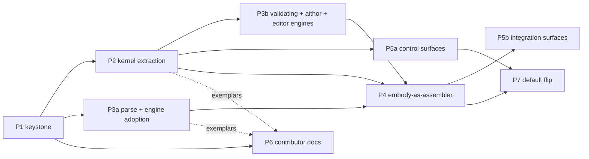

# study-lenses — Language-Levels Inversion ROADMAP

> **Deletable campaign map.** This file plans one refactor campaign — the
> language-levels ↔ embody inversion — as delegable phases toward the end-state
> in [ARCHITECTURE.md](./ARCHITECTURE.md). It describes the **desired end-state
> and migration strategy only**: no current-state inventories, no gap lists —
> each phase's tasked agent reconciles current-vs-desired just-in-time at phase
> start. When the campaign completes, this file is deleted (see § Deletion
> checklist). Orientation docs: [README.md](./README.md) · [DOCS.md](./DOCS.md)
> · [ARCHITECTURE.md](./ARCHITECTURE.md).

## Vision

embody is a thin composition root: it assembles pure, language-agnostic
capability engines plus an orchestrator-resolved array of `LanguageLevel`s into
a Snippet, populating each phase iff a provided level supplies it — this
campaign builds that shape, retiring the JEJ-baked god-object it replaces.
Generic engines become pure `lib/` leaves; every level-specific fact becomes
data/semantics in a `language-levels/` kernel. Language levels are layered
constraints on a permissive base: `arbitrary-js` ("Full JavaScript") is the
identity level, JEJ a more-constrained level above it. This completes the
"language-levels-as-plugins" shape embody's own contract already declares
([embody/DOCS.md](./embody/DOCS.md#language-levels-as-plugins), including the
[three-layer Data → Entwined → NMEvent framework](./embody/DOCS.md#three-layer-framework)
that validates the vision).

**Why:** the language level becomes a pedagogical control surface — a
scaffolding dial (the theory:
[README.md § Pedagogical first principles](./README.md#pedagogical-first-principles),
[DOCS.md § Philosophy](./DOCS.md#philosophy)). The new delta this campaign adds:
the **desired-level dial IS the scaffolding-fade control**. Desired-level is a
new instrument on the snippet-scope guidance axis alongside lens-path guidance —
an extension of the existing two-axis grid
([README.md § The two-axis grid](./README.md#the-two-axis-grid--the-layered-pyramid)),
not a redefinition of it.

**Every phase is checked against both North-Star tests:**

- **Pedagogy test:** does it let an author set a low floor (Full JavaScript),
  raise the ceiling (add a level / its phases), and fade scaffolding (dial
  desired down) — without special-casing?
- **Collaboration test:** could a new contributor own this unit from its
  README + boundary contract alone, and does adding the next
  level/lens/capability touch only its own kernel, never the core?

## Desired end-state model

The durable model (desired vs current, the per-surface table, the layer map)
lives in [ARCHITECTURE.md](./ARCHITECTURE.md). Target decisions the phases build
toward:

1. **`arbitrary-js` is the base identity level, not `null`.**
   `embody(code) ≡ embody(code, { levels: [arbitraryJs] })`; embody always
   receives at least the identity level; no `if (level === null)` branching. The
   identity level provides `name`, `label: 'Full JavaScript'`, `validate`
   (always passes), `snippetTypes` (both) — and **no optional capabilities** (it
   fits the canonical semantic definition vacuously: an always-true validator
   and an empty set of models).
2. **embody receives an ordered ARRAY of levels, orchestrator-resolved.**
   Detected mode → every conforming level, most-specific first (all study
   features the code supports are available); blocking mode → `[desired]` only.
   Capability precedence follows array order (union semantics pinned by P1).
   Lenses may additionally self-gate via `applicableTo`.
3. **`run` IS the evaluation phase.** Phase axis: `tokenize`/`parseAST` are
   generic and status-gated; `realm` is capability-gated only (it has no failure
   mode); `creation` is capability-gated then status-gated; `evaluation` is
   always present. Two nullability axes, named: **status-gated** (the phase, or
   a phase upstream of it, failed) vs **capability-gated** (no provided level
   supplies it).
4. **Tracers are evaluation lenses.** `run` and `trace` are sibling modes over
   the one shared execution engine (`lib/engine`, sole op
   `evaluate(spec): EngineHandle`); the trace _harness_ is generic, trace
   _semantics_ belong to the level (`evaluationLenses`). `lib/danger-runner`
   remains a parallel backend converging at the consumer contract.
5. **aithor is a pure leaf generator** (`lib/aithor`) with no embody dependency:
   it accepts a bare feature list OR a language-level validator.
6. **Levels overlap partially** — no total order. The indicator shows the full
   applicable set as unordered badges. Membership is **tri-state** (member /
   non-member / undetermined); only an explicit non-member verdict withdraws
   presentation.
7. **Desired vs current vs mode** per
   [ARCHITECTURE.md § Desired vs current vs mode](./ARCHITECTURE.md#desired-vs-current-vs-mode--the-pedagogical-dial),
   including the enforcement-mode toggle (blocking ⇄ detected, default
   `detected`), the full per-surface read table, the control rule (props =
   initial defaults, learner overrides session-scoped, author lock explicitly
   deferred), and the type-toggle conflict rule.
8. **Type × level are orthogonal axes.** Each level declares the `snippetTypes`
   it admits (JEJ: module-only); "script ⇒ no constraining level" is derived,
   never special-cased. The assembler maps SnippetType onto the engine's
   `execution: 'function' | 'module'` axis.
9. **Applicability computation:** the orchestrator resolves the active-levels
   array before embodying — detected mode runs the conforming-set derivation per
   edit; blocking mode validates eagerly against the desired level only, with
   the full detection set derived **lazily** for the indicator. The Snippet
   carries a per-level **verdict record keyed by level name** for the levels it
   received — `Validation.isJeJ` is retired in favor of this record (a named
   exception to the no-field-removed rule; see § Migration strategy).
10. **Three public surfaces** (documented, versioned): the `<StudyLenses>` prop
    API, the `LanguageLevel` interface, the level registry. The registry is a
    static frozen record — no runtime registration API until a third-party level
    exists.
11. **Add-a-level acceptance:** a new level touches its kernel directory plus
    exactly one registry line — nothing else. Orchestrator level surfaces
    enumerate the registry; lint element types are globs.

## Target architecture

The layer map and dependency-direction rule live once, in
[ARCHITECTURE.md § The layer map](./ARCHITECTURE.md#the-layer-map).
Campaign-only enforcement notes:

- **Lint staging.** P2 designs the complete element-type model (including the
  `leaf-lib` / `consumer-lib` split of `lib/`) but error-enables **new arrows
  only** (kernel imports, embody → kernel). Encoding the pre-existing tree-wide
  rules at error level is a follow-on ratchet work-package, not a P2 gate.
- **Interim-violation ledger.** Any temporarily sanctioned arrow violation is
  allowlisted in the lint config with an inline comment naming the owning phase
  and the removal condition — never silently exempted.

## The keystone: `LanguageLevel` (seed for P1)

This sketch seeds P1's DDD. `language-levels/types.ts` becomes canonical when P1
lands; this sketch is then superseded.

```ts
interface LanguageLevel {
	// ── locked spine ──────────────────────────────────────────────
	name: string; //          internal id, e.g. 'arbitrary-js'
	label: string; //         learner-visible, e.g. 'Full JavaScript'
	description: string; //   hover-read docs + indicator
	docs: LevelDocs; //       reference + notional-machine documents
	snippetTypes: readonly SnippetType[]; // which program types it admits
	validate(ast: Program): Violations; // admission gate + membership verdict
	// ── phase capabilities — presence adds a Snippet phase ────────
	realm?: RealmModel; //                adds the realm phase
	creation?: (ast: Program) => CreationModel; // adds the creation phase
	// ── augmentation capabilities — parameterize existing machinery ──
	scopeModel?: ScopeConfig; //          parameterizes the generic scope builder
	evaluationLenses?: readonly EvaluationLens[]; // tracers: level views on evaluation
	editorSupport?: EditorSupport; //     lint/completion/docs/format DATA,
	//                                    consumed by the generic editor engines
}

// embody(code, { levels }) — an ORDERED array, orchestrator-resolved
// (detected → conforming levels, most-specific first; blocking → [desired]).
// Capability precedence follows array order.
```

- `provides(phase)` is defined over the **phase capabilities** (`realm`,
  `creation`) only and derives from field presence — never a separate flag.
  Augmentation capabilities parameterize existing machinery; they add no Snippet
  phase.
- The capability **payload types** (`ScopeConfig`, `RealmModel`,
  `CreationModel`, `EvaluationLens`, `EditorSupport`) and `LevelDocs` +
  `Violations` (which adopt the existing violation/docs shapes) are **declared
  open holes** (the discipline of
  [embody/DOCS.md § Open holes](./embody/DOCS.md#open-holes-in-the-contract)):
  P1 does not design them; P2 **adopts the existing shapes as they move** into
  the kernel.
- Named questions P1's DDD must answer: (a) the shape of the Snippet's per-level
  verdict record (keyed by level name — the `isJeJ` successor) and how the
  Snippet references its provided levels (lean: the Snippet carries them —
  preserves props-only lenses), (b) the registry read API, (c) where
  desired-level + enforcement-mode state live under the single-writer model and
  how they interact with the event bus, (d) the capability **union semantics**
  across the ordered levels array (precedence = array order; what happens when
  two provided levels supply the same phase).
- Baseline editor pin: ordinary JS editing (highlighting, generic diagnostics,
  standard completion) is engine-default and level-independent; `editorSupport`
  data augments/constrains it. `arbitrary-js` declares none.

## Revised decisions

This campaign ratifies revisions to previously locked decisions. Each revised
section carries a one-line pointer here; this list is authoritative until the
per-phase conforming edits land.

| Previously locked                                                                                                                                                                                                    | Revised to                                                                                                                                                                                             | Conformed by |
| -------------------------------------------------------------------------------------------------------------------------------------------------------------------------------------------------------------------- | ------------------------------------------------------------------------------------------------------------------------------------------------------------------------------------------------------ | ------------ |
| Language levels are semantic plugins **inside embody** ([DOCS.md](./DOCS.md#language-levels-are-semantic-plugins-inside-embody), [embody/DOCS.md](./embody/DOCS.md#language-levels-as-plugins) "why inside embody/") | Kernels move to top-level `language-levels/` so orchestrate/aithor consume level data without embody (lenses receive it via props — the Snippet carries its levels); the plugin _concept_ is unchanged | P2           |
| Script type ⇒ **no language level** ([DOCS.md](./DOCS.md#module-is-the-nm-study-default-script-is-the-low-floor-escape))                                                                                             | Every snippet has at least the identity level; each level declares admissible `snippetTypes`; script ⇒ the applicable set contains no constraining level (derived)                                     | P4           |
| A language level **provides** semantic models + a non-trivial admission gate ([README.md § A language level is semantic, not syntactic](./README.md#a-language-level-is-semantic-not-syntactic))                     | The definition generalizes vacuously: the identity level is an always-true validator with an empty set of models — "never lie about admitted programs" holds trivially                                 | P2           |
| `evaluation` is an **LL station** (hidden with realm/creation)                                                                                                                                                       | `evaluation` is always shown, status-gated only — Full JavaScript code gets bare run output; JEJ layers tracers on top (the peel-away)                                                                 | P5b          |
| New types belong in `embody/types.ts` ([DOCS.md § Contributor guidelines](./DOCS.md#contributor-guidelines))                                                                                                         | Level types belong in `language-levels/types.ts`; the Snippet contract stays in `embody/types.ts`                                                                                                      | P1           |
| `parse` categorized into `embody/lib/parse/` ([DOCS.md § Categorization rationale](./DOCS.md#categorization-rationale-which-lib-modules-go-where))                                                                   | The parse builder is a pure leaf at `lib/parse`                                                                                                                                                        | P3a          |
| Scaffolding appears/fades **automatically from code** only ([README.md § Why this architecture](./README.md#why-this-architecture))                                                                                  | The desired-level dial adds learner/author-controlled fade alongside the automatic current-level derivation                                                                                            | P5a          |

## Migration strategy

Strategy, not steps — each phase derives its own steps at phase start.

- **Do NOT big-bang embody.** The inversion proceeds capability-at-a-time behind
  embody's existing shape-stable dispatch. `embody/types.ts` is the seam:
  **shape-compatible, not byte-stable** — no field is removed, renamed, or
  retyped, with **one named exception**: `Validation.isJeJ` (a JEJ-only
  leftover) is superseded by the additive per-level verdict record keyed by
  level name. During migration `isJeJ` is retained as a derived compatibility
  field (equal to the JEJ key of the record); the P5 rewiring sweep migrates its
  readers and removes it. JSDoc semantics are deliberately revised where the
  end-state falsifies them (validation under non-JEJ levels;
  `status.validated`/`created` under capability-gating; realm/creation
  nullability **widens** — module no longer implies present). The verdict record
  is the single authoritative "member of level X" source.
- **The identity-level default flips last — it is its own phase (P7).** P4 lands
  the `levels` parameter with every production call site pinned to `[JEJ]` —
  behavior-preserving end-to-end. The identity/detected default is P7, a
  deliberate terminal increment gated on P4 + P5a (the flip is only safe once
  the dial exists). Caveat the lever honestly: the identity level is
  superset-compatible on **admission** but subset on **capabilities** — it
  de-risks admitting more programs, not removing phases.
- **Class-B re-export shims** (deletable domain-named accessors — the module's
  established seam pattern) stand at old `embody/lib` paths while consumers
  migrate; P4 deletes them. Existing Class-B seams (e.g. quizzing's realm
  accessor) re-point to the kernel with callers untouched.
- **Boundaries-lint is the enforcement, not an afterthought** — designed with
  the kernel extraction (P2), staged per § Target architecture.
- **N=1 YAGNI cut.** Build the inversion now (it pays off at one level:
  Full-JavaScript embodiments, un-smearing JEJ, killing the god-object). Defer
  multi-level lattice/selector _machinery_ until a second real constraining
  level exists — but the desired-vs-current-vs-mode + applicable-set model is
  designed at N=2 (arbitrary + JEJ) because the pedagogical dial needs it
  immediately.

## Phases

Status: ⬜ not started · 🔄 in progress · ✅ complete. Marks are per
deliverable: **[GFI]** good first issue · **[core]** deep core. Every phase
entry names its boundary contract at module granularity; concrete file lists
belong to the phase's DDD stub, authored at phase start.



### ⬜ P1 — The keystone contract [core]

- **Goal:** the `LanguageLevel` contract DDD — the level-side analogue of the
  lens contract in `lenses/types.ts`, run through the full Phase-0 ceremony
  (glossary → README → AR-1 → types → DOCS sketch → AR-2 → human gate). Lock the
  spine, the registry shape, and the two-axis nullability model; answer the four
  named questions (§ Keystone).
- **Boundary:** owns `language-levels/` (new: README, DOCS, types.ts — the DDD
  stub). Design only; no code moves.
- **Conforms:**
  [DOCS.md § Contributor guidelines](./DOCS.md#contributor-guidelines)
  types-home rule.
- **Depends:** nothing.

### ⬜ P2 — Language-level kernel extraction [core spine; doc moves GFI]

- **Goal:** `language-levels/{arbitrary-js,just-enough-javascript}/` own every
  level-specific fact: validation spec, scope model, realm model, creation model
  (likely coincident with the scope model — the stub says which),
  notional-machine + reference docs **[GFI]**, trace semantics /
  `evaluationLenses`, `editorSupport` data. Existing Class-B seams re-point.
  Lint element types designed in full; new arrows error-enabled.
- **Boundary:** owns the kernels + the level-data extraction from embody's
  validating/scope modules (serialization point with P3b — see below) + the lint
  design note. **Exemplar:** `arbitrary-js` is the add-a-level recipe's tested
  example.
- **Stubs:** per-kernel README/DOCS ×2 + lint design note.
- **Conforms:**
  [embody/DOCS.md § Language levels as plugins](./embody/DOCS.md#language-levels-as-plugins)
  (the "why inside embody/" rationale),
  [DOCS.md § Directory layout](./DOCS.md#directory-layout),
  [DOCS.md § Dependency rules](./DOCS.md#dependency-rules-one-way), the two
  revised § Locked decisions entries.
- **Depends:** P1.

### ⬜ P3a — parse leaf + engine adoption [mostly GFI]

- **Goal:** `lib/parse` builds the parse-phase slice of embody's
  [three-layer framework](./embody/DOCS.md#three-layer-framework) in two build
  layers: a **static builder** producing the L1 Data + L2 Entwined layers for
  **tokenize and parseAST** (tokenize is in scope — the parse machinery owns
  `TokenData`/`TokenizeData`) plus the `byPath`/`byOffset` indexes, and an
  **events generator** — `parseAST.events()` replaying the static graph as L3
  `NodeNMEvent`. Engine: **docs-only adoption** — `lib/engine` is already the
  execution leaf; zero renames or moves while the live parallel engine campaign
  is mid-flight (its wiring is that campaign's deliverable; see `lib/engine`
  README/DOCS for the contract).
- **Boundary:** owns `lib/parse` (new) + engine doc conformance. In
  `embody/types.ts`, P3a fills the **L1 placeholder interfaces only**
  (additive); every other types.ts edit is P4's. **Exemplar:** `lib/parse` is
  the add-a-leaf-engine recipe's tested example.
- **Stubs:** `lib/parse` README/DOCS.
- **Conforms:**
  [DOCS.md § Categorization rationale](./DOCS.md#categorization-rationale-which-lib-modules-go-where)
  parse row.
- **Depends:** P1. Parallel-safe with P2.

### ⬜ P3b — validating leaf + aithor + editor engines [core-adjacent]

- **Goal:** `lib/validating` (the generic `validateProgram` engine +
  `SyntaxAllowlist` types; may co-house with `lib/parse` if extraction finds
  them cohesive); aithor relocates to `lib/aithor` pointing at leaves + the
  level kernel (its evals move along — they consume only the generator's public
  contract). The aithor admission-gate contract states whether it includes the
  format check (the formatting engine is a generic leaf; prettier-config is
  level data). Editor-adapter engines (linting, completing, documenting,
  formatting-editor) become level-parameterized; `*-jej` entry names retire.
- **Boundary:** owns `lib/{validating,aithor}` (new) + the editor-engine
  parameterization. **SERIALIZED after P2** — shares embody's validating module
  with P2's data extraction, and aithor's gate needs the JEJ kernel.
- **Stubs:** `lib/validating` + `lib/aithor` README/DOCS.
- **Depends:** P1 + P2.

### ⬜ P4 — embody-as-assembler [core]

- **Goal:** the inversion. `embody(code, { levels })` populates each phase iff a
  provided level supplies the capability (precedence = array order); SnippetType
  → engine execution mapping; the additive per-level verdict record + the JSDoc
  semantic revisions (§ Migration strategy); Class-B shims deleted.
- **Strategy:** capability-at-a-time behind the existing dispatch — each
  increment swaps one hardcoded JEJ import for a level capability with the
  levels array pinned to `[JEJ]`, verifiably behavior-preserving; the default
  flip is **P7's**, not P4's. Depends on the engine campaign's **contract**, not
  its completion — stubs behind the stable contract are acceptable inputs.
- **Boundary:** owns embody's factory + `embody/types.ts` (additive +
  JSDoc-semantic edits only; the L1 placeholder fills are P3a's).
- **Stubs:** embody README/DOCS conforming sketch.
- **Conforms:**
  [DOCS.md § Module is the NM-study default](./DOCS.md#module-is-the-nm-study-default-script-is-the-low-floor-escape),
  [DOCS.md § Three evaluation-engine isolation models](./DOCS.md#three-evaluation-engine-isolation-models),
  README conceptual-chain mermaid + directory tables.
- **Depends:** P2 + P3b (P3a for parse wiring).

### ⬜ P5a — Level control surfaces [mix]

- **Goal:** the pedagogical dial, front-loaded: level selector (radio + the
  `<StudyLenses>` desired prop) **[core]**; the **enforcement-mode toggle**
  (checkbox + prop, default `detected`) **[core]**; the level indicator with
  detection badges, blocking-mode target rendering + hover docs **[GFI]**;
  gutter rewired to the desired level via the kernel (blocking mode only)
  **[core]**; the nudge with its suppression rule (the desired-not-satisfied
  direction renders via the indicator, not the nudge) **[GFI]**; dial + mode
  state per P1's answers. The indicator ships the **minimal N=2 dial** (badges +
  tri-state); the unordered-set framing is the forward-compatible shape, not
  lattice machinery to build now.
- **Boundary:** owns orchestrate's level surfaces. Runs **parallel to P3/P4**
  behind Class-B seams where embody wiring is missing (the module's established
  pattern). Points at — never restates — the lens-availability constraint in
  `lenses/types.ts` (its canonical wording is owned by the quiz-gate increment;
  see § Coordination).
- **Stubs:** orchestrate level-integration DDD.
- **Conforms:**
  [README.md § Why this architecture](./README.md#why-this-architecture)
  expertise-reversal paragraph.
- **Depends:** P1 + P2.

### ⬜ P5b — Integration surfaces [mix]

- **Goal:** dynamic phase columns (the station repartition: evaluation
  always-shown) **[core]**; generate-with-level (most-specific active level
  default + per-invocation override) **[GFI]**; the recommender **[core]** —
  applicability filter + ranking engine over self-describing lenses
  (`applicableTo`/`recommend`), organized into the 3D grid (block-model level ×
  scope × NM components; NM axis populated per level, empty at identity;
  "analysis is JEJ-only" generalizes to per-level). Contract:
  [DOCS.md § Recommender](./DOCS.md#recommender--applicability-filter--ranking-engine),
  [DOCS.md § 3D Block Model space](./DOCS.md#3d-block-model-space).
- **Boundary:** owns `orchestrate/lib/recommender/` + the phases-panel
  repartition + the generate surface (generates against the most-specific active
  level by default, per-invocation override). One named seam: whether the
  NM-components vocabulary (`NMCategory`) stays a shared contract type or
  becomes level-data — P5b pins it, consulting P2 (the grid treats it as an
  opaque per-level set either way).
- **Stubs:** recommender DDD.
- **Conforms:** README recommender/pyramid rows.
- **Depends:** P4.

### ⬜ P7 — The default flip [core]

- **Goal:** the moment learner-facing behavior changes. embody's no-argument
  default becomes the identity array, and the orchestrator's mode default
  becomes `detected` — the JEJ-pinned call sites from P4 sweep to
  orchestrator-resolved arrays; the migration-era `isJeJ` compatibility field is
  removed after its readers migrate (§ Migration strategy).
- **Boundary:** embody's default + the orchestrator's resolution wiring + the
  call-site sweep. Small in code, large in consequence — gated on the dial
  existing so no learner is stranded without a way back up.
- **Depends:** P4 + P5a.

### ⬜ P6 — Contributor docs [GFI]

- **Goal:** extend repo-root `CONTRIBUTING.md` (no second CONTRIBUTING file)
  with the human-legible contribution path (docs-first → test-first →
  review-before-merge, distilled from `DEV.md` in human terms); the three
  extension recipes live in
  [ARCHITECTURE.md § Extension points](./ARCHITECTURE.md#extension-points), each
  naming its tested exemplar (`arbitrary-js` kernel · a designated existing lens
  · `lib/parse`).
- **Acceptance:** cold validation — a context-free reader can execute each
  recipe from the docs alone.
- **Depends:** P1 (recipes); exemplars land with P2/P3a.

## Glossary (campaign vocabulary)

Only terms this campaign introduces. Established terms link to their canonical
homes: language level →
[README.md](./README.md#a-language-level-is-semantic-not-syntactic); notional
machine → [README.md § The story](./README.md#the-story-the-conceptual-chain);
pedagogy terms →
[README.md § Pedagogical first principles](./README.md#pedagogical-first-principles);
AR-1..5 → repo `DEV.md`.

- **Desired vs current level** — the declared target vs the derived membership;
  the dial. See
  [ARCHITECTURE.md](./ARCHITECTURE.md#desired-vs-current-vs-mode--the-pedagogical-dial).
- **Enforcement mode (blocking ⇄ detected)** — whether the level is an enforced
  target (warnings, withdrawal) or dynamically detected (the environment
  adapts). Default `detected`. Same ARCHITECTURE section.
- **Kernel** — a language level's directory (`language-levels/<name>/`): the
  bundled data + semantics implementing the `LanguageLevel` contract.
- **Status-gated vs capability-gated** — the two phase-nullability axes:
  the-phase-or-upstream-failed vs no-provided-level-supplies-it.
- **Class-B accessor / re-pointable seam** — a deletable domain-named function
  whose body re-points to a real surface later, callers untouched (e.g.
  `lib/documenting/document-jej.ts`).
- **SyntaxAllowlist ≠ LanguageLevel** — the allowlist is a level's _derived_
  syntax surface; the level is the semantic plugin
  ([embody/DOCS.md](./embody/DOCS.md#language-levels-as-plugins)). One name per
  concept.
- **Block-model level** — the comprehension-depth axis of the recommendation
  grid (text surface → execution → purpose). Unrelated to language levels.
- **WS2** — the recommender work stream, folded into P5b.

## Coordination

- **Quiescent-tree precondition.** Authoring this roadmap was safe on the shared
  tree; **executing P1+ waits until the maintainers pause the parallel in-flight
  campaigns.** Check with the repo owner before starting a phase.
- **Engine campaign.** Run/intercept wiring into `lib/engine` is owned by a live
  parallel campaign; this roadmap treats it as an inbound dependency edge (P3a
  adopts docs-only; P4 depends on the contract, not the completion).
- **Quiz-gate increment (independent).** A separate in-flight increment gates
  the quiz lens behind a re-pointable validation seam and owns the
  lens-availability constraint wording in `lenses/types.ts`. Its seam is an
  expected inbound Class-B re-point when the kernel lands (P2/P4); this campaign
  points at that constraint, never restates it.
- **Superseded planning docs** (deleted by this campaign's authoring commit):
  - `EMBODY-ROADMAP.md` — its end-state content lives on: the plugins framing +
    three-layer framework were already canonical in
    [embody/DOCS.md](./embody/DOCS.md#language-levels-as-plugins); the parse
    two-layer model (builder + `parseAST.events()`) is carried in P3a. Its gap
    inventories were implementation-time knowledge — each phase re-derives its
    own at phase start.
  - `02-analysis-and-recommender.md` — its end-state content lives on: the
    recommender contract was already canonical in
    [DOCS.md § Recommender](./DOCS.md#recommender--applicability-filter--ranking-engine)
    and [DOCS.md § 3D Block Model space](./DOCS.md#3d-block-model-space); the
    lens-side contract (`applicableTo`/`recommend`, three-tier gating) lives in
    [lenses/types.ts](./lenses/types.ts); the per-level generalization and grid
    assembly are P5b.

## Deletion checklist

When the campaign completes, delete this file and clean every seeded pointer
(verify with a **full-output** repo grep for `ROADMAP.md` — never truncate):

- [README.md § Navigation](./README.md#navigation) — the ROADMAP entry.
- [ARCHITECTURE.md](./ARCHITECTURE.md) — the banner's campaign-status pointer
  plus the lands-in-Pn parentheticals (layer-map lint note, Public surfaces,
  Extension points closing line).
- [DOCS.md](./DOCS.md) — the ratified-revision pointer lines (Locked decisions
  ×2, Directory layout, Dependency rules, Contributor guidelines, Categorization
  rationale) and the § 3D Block Model space P5b pointer.
- [embody/DOCS.md](./embody/DOCS.md#language-levels-as-plugins) — the
  ratified-revision pointer line.
- [README.md § A language level is semantic, not syntactic](./README.md#a-language-level-is-semantic-not-syntactic)
  and [README.md § Why this architecture](./README.md#why-this-architecture) —
  the ratified-revision pointer lines.
- The files re-pointed here when the superseded planning docs were deleted (grep
  finds them): `embody/index.ts`,
  `embody/lib/evaluating/trace/semantics/index.ts`, `orchestrate/README.md`,
  `lenses/debug-props/DOCS.md`, `orchestrate/lib/README.md`, `lenses/types.ts`,
  `lenses/README.md`, `lenses/blanks/README.md`, `lenses/annotate/README.md`,
  `lenses/annotate/core.ts`, repo-root `eslint.config.mjs`.
