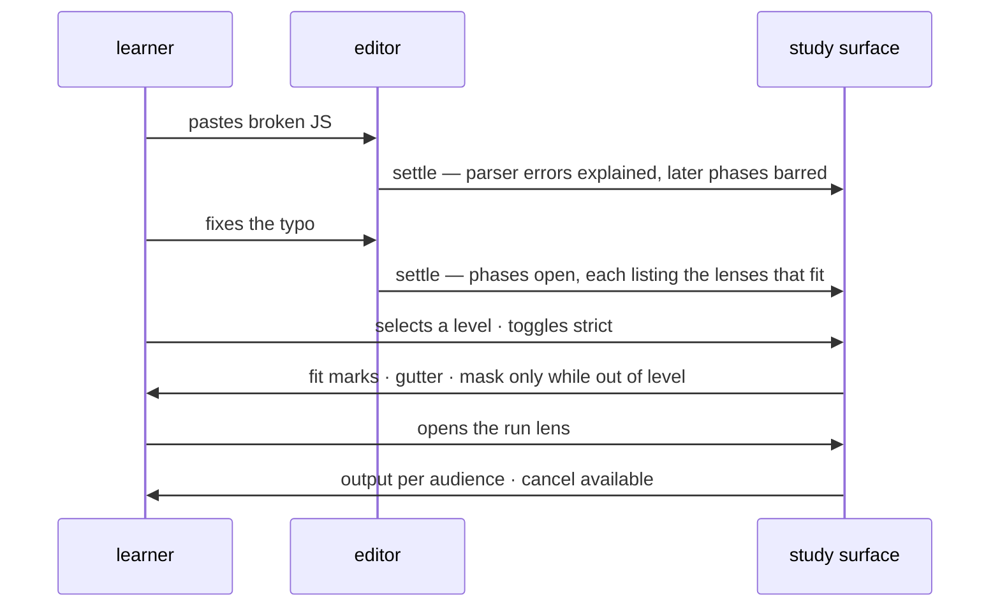

# study-lenses — Workflows

Two walkthroughs showing the domain model in motion. [README.md](./README.md)
owns the model and its glossary; [DOCS.md](./DOCS.md) owns the architectural
shape; this document follows the two people who meet at the package boundary —
the **author** embedding a snippet and the **learner** studying one — step by
step through that model.

## An author curates a snippet

An educator embeds a program on their site. They hand the study environment: the
program source; its snippet type; an initial-focus request naming the run lens
(the run-first posture); per-lens configuration; a selected language level with
the default **warn** posture.

```mermaid
sequenceDiagram
    participant A as author site
    participant O as orchestrator
    participant L as learner
    A->>O: program + type + run-first focus + configs + level (warn)
    O->>O: join rosters (collisions loud) · resolve cascade per lens name
    O->>L: rendered environment — evaluation phase, run lens focused
    L->>O: switches lens · changes level · tweaks config (session-scoped)
    Note over A,L: the author curates the start; the learner owns the session
```

What happens, in the model's terms:

1. **At mount**, the orchestrator joins the default lens roster with anything
   the author injects — a name or level-key collision fails loudly, right here,
   at the author's desk. The configuration cascade resolves per lens name; the
   learner's own tweaks will always be its final layer.
2. **The focus request is honored, not obeyed.** The request is honored only
   when the run lens is attached to an accessible `evaluation` phase — fit and
   accessibility both. If the curated program didn't parse, the environment
   falls back to normal rendering — the parse phases explain why — because an
   initial focus is never a bypass.
3. **Every curated choice is a default, not a lock.** Level, posture, snippet
   type, lens, configuration: all learner-overridable for the session. There is
   no author-side lock anywhere in the surface.
4. **Injection is append-only.** An author can add lenses and add language
   levels; nobody can replace or shadow a built-in, and a level's machine-facing
   lenses come from that level's own author.
5. **What the author never gets:** learner identity, progress, grades, or a
   telemetry channel. Curating the stepping stone is the whole job; the path
   belongs to the embedding LMS.

## A learner studies pasted code

A learner pastes a program they found — any JavaScript, currently broken.



1. **The broken text is already worth studying.** The `source` phase serves any
   text; the `tokens` and `ast` phases show the parser's real error with a
   learner-worded explanation — spelling versus grammar. Downstream phases
   render barred, carrying the cause the upstream failure gave them.
2. **A level never blames a typo.** With a level selected, the verdict over
   unparsed code is undetermined: the gutter and mask name no violation, and the
   parse phases' supports stay available even under strict — the level honestly
   says it cannot judge yet.
3. **Fixing the typo is the transition.** Typing settles; the program is
   re-embodied; phases open, each listing the lenses that fit the code as it now
   stands. Lenses that don't fit simply aren't there.
4. **Levels are self-assessment, on demand.** The selector shows a fit mark per
   registered level — the learner discovers where their code sits. Selecting one
   lights the gutter for that level only; hovering surfaces its documentation.
   Toggling **strict** turns the level into a guardrail: the study surfaces mask
   while the code is out of level, the editor and every restoring control stay
   alive, and the toggle lifts the guardrail at any time.
5. **Running is studying.** The run lens lives in the `evaluation` phase: output
   renders per audience — dialogs speak to the learner-as-user, the console to
   the developer — and a run can be canceled. An edit that settles unmounts the
   lens and cancels the in-flight run: every settle is a fresh program.
6. **The kit leaves with the learner.** Nothing above depended on the snippet
   being curated — the same environment, phases, and lenses serve whatever code
   they meet next.
