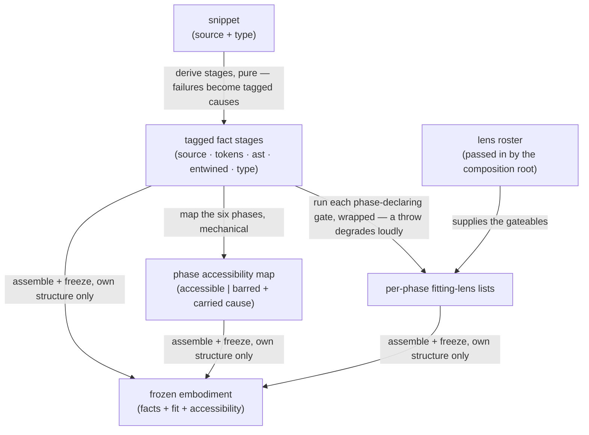

<!-- cspell:ignore Gateable entwine entwined entwining gateables -->

# embody — Architecture & Decisions

Region-level architecture for the embodiment factory described in
[README.md](./README.md). The package sketch ([../DOCS.md](../DOCS.md)) owns the
package-level shape; this document constrains only this region, at its root
abstraction.

## Architectural sketch

> Written Phase 0, before implementation. The Refactor step is held against this
> document — not what the code does, but what shape it takes.

## Execution phases

1. **Derive the fact stages** (sync, pure) — the five stages derive once, in
   dependency order: source and type restated from the snippet; tokens — the
   token stream plus the set-aside comments — from the source; ast from the
   tokens; entwined from ast, tokens, and source. Every result is tagged — a
   value or a structured cause — and a failure never stops the walk: a stage
   whose input is missing fails carrying the upstream cause, whose origin stays
   named inside it. Input: the snippet. Output: the Facts.

2. **Derive phase accessibility** (sync, mechanical) — the six lifecycle phases
   get their accessibility from the tagged stages by fixed rules: `source`,
   `realm`, and `tokens` always accessible; `ast` barred by a tokens failure;
   `environment` and `evaluation` barred by a tokens, ast, or entwine failure —
   barred phases carry the upstream cause. A phase's own-stage error never bars
   it. Input: the Facts. Output: the accessibility map.

3. **Gate and attach** (sync, wrapped) — each phase-declaring lens in the roster
   has its applicability run exactly once over the Facts; a gate that throws
   degrades to not-applicable with a loud development-mode report. Fitting
   lenses are grouped, as refs, under each phase they declare. One roster pass —
   the README narrates it as gate, then attach. Input: the Facts + the roster.
   Output: per-phase fitting-lens lists.

4. **Freeze** (sync) — the built structure — stages, map, lists — is frozen, and
   only that structure: attached refs are never recursed into. Input: the three
   prior outputs. Output: the frozen `Embodiment`.

## Data flow

## Structural constraints

- **Level-blind.** No level knowledge in the region's data or pipeline; level
  logic runs only black-boxed inside individual gates.
- **One derivation pass.** Stages derive once per snippet, in dependency order;
  nothing retries and nothing parses the same source twice. The tokens and ast
  stages are the parse facts every outside consumer reads.
- **Loud versus graceful.** A learner program that does not parse is quiet data.
  Defects in embody's own machinery are loud to the developer and graceful to
  the learner: an entwine failure raises a development-mode report and bars
  downstream phases like any failed stage; a throwing gate degrades to
  not-applicable and is reported the same way.
- **Freeze-what-you-own.** The freeze covers the structure this region built;
  attached lens refs are attached as module objects — never pre-bound wrappers —
  and are never recursed into.
- **The embodiment knows no consumers.** Lens refs arrive as arguments, typed
  structurally; the region imports no component machinery, no evaluator, no
  language level. The parser's types are the only foreign vocabulary — imported
  type-only, so ownership of that vocabulary can move to the shared parse leaf
  without touching callers.
- **Sync and pure throughout.** No I/O, no async, no shared mutable state: the
  same snippet and roster produce the same embodiment.

## Out of scope

- **Rendering and display labels** — the orchestrator's.
- **Level validation** — a level's validator consumes the parsed values the
  tokens and ast stages carry, from outside this region and never through this
  region's stage envelope (one parse truth; no type edge from levels into
  embody).
- **Execution** — evaluators belong to the lenses that drive them; the
  embodiment carries no execution handles.
- **Roster composition** — joining, injection, collision handling, and the
  configuration cascade happen at the composition root; embody receives the
  finished roster.
- **The lens kind's full contract** — the lenses region extends `Gateable` with
  everything a component needs.
- **Internal decomposition** — the factory's internal libraries document
  themselves at their own abstraction level.
