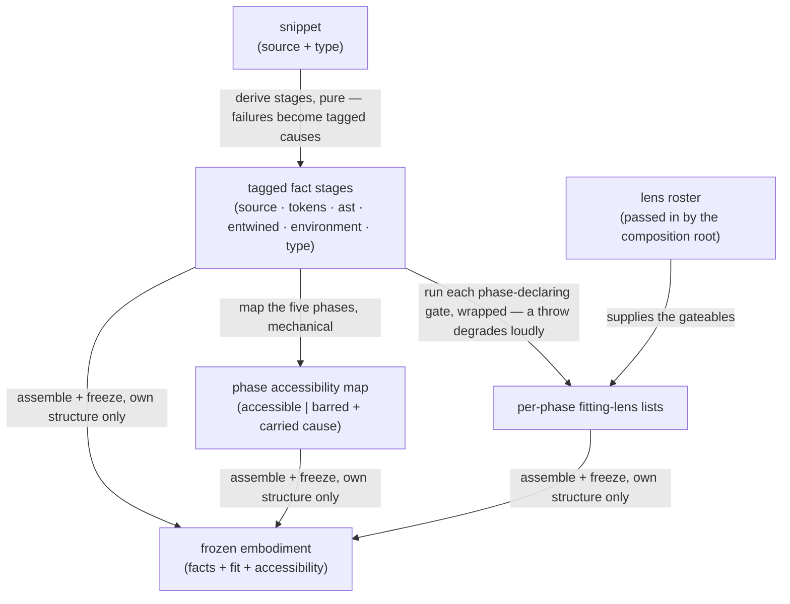

<!-- cspell:ignore Gateable entwine entwined entwining gateables -->

# embody — Architecture & Decisions

Region-level architecture for the embodiment factory described in
[README.md](./README.md). The package sketch ([../DOCS.md](../DOCS.md)) owns the
package-level shape; this document constrains only this region, at its root
abstraction.

## Architectural sketch

> Written Phase 0, before implementation. The Refactor step is held against this
> document — not what the code does, but what shape it takes.

## Execution phases

1. **Derive the fact stages** (sync, pure) — the six stages derive once, in
   dependency order: source and type restated from the snippet; tokens — the
   token stream plus the set-aside comments — from the source; ast from the
   tokens; entwined from ast, tokens, and source, together with the parse's own
   record of where grouping parentheses sat; environment — the static scope
   structure — from the ast, the source⇄tree binding, and the snippet type.
   Every result is tagged — a value or a structured cause — and a failure never
   stops the walk: a stage whose input is missing fails carrying the upstream
   cause, whose origin stays named inside it. Input: the snippet. Output: the
   Facts.

2. **Derive phase accessibility** (sync, mechanical) — the five lifecycle phases
   get their accessibility from the tagged stages by fixed rules: `source` and
   `tokens` always accessible; `ast` barred by a tokens failure; `environment`
   and `evaluation` barred by a tokens, ast, or entwine failure — barred phases
   carry the upstream cause. A phase's own-stage error never bars it: a grammar
   error renders in `ast`, a scope-analysis defect renders in `environment`.
   Input: the Facts. Output: the accessibility map.

3. **Gate and attach** (sync, wrapped) — each phase-declaring lens in the roster
   has its applicability run exactly once over the Facts; a gate that throws
   degrades to not-applicable with a loud development-mode report. Fitting
   lenses are grouped, as refs, under each phase they declare. One roster pass —
   the README narrates it as gate, then attach. Input: the Facts + the roster.
   Output: per-phase fitting-lens lists.

4. **Freeze** (sync) — the built structure — stages, map, lists — is frozen, and
   only that structure: attached refs are never recursed into. Input: the three
   prior outputs. Output: the frozen `Embodiment`.

## Data flow

## Structural constraints

- **A phase is a function of the program.** A lifecycle phase is a step the
  specification names AND a step whose content different programs reach
  differently. A step every program meets identically is reference material, not
  a phase — it has nothing to show that changes when the program changes. A step
  whose content only narrows another phase's belongs to that phase, not beside
  it. The lifecycle admits a phase on both counts.
- **A fact is common, generic, and needed across consumers.** As the constraint
  above gates what earns a phase, this gates what earns a fact: a fact spares
  every consumer the same traversal, or it stays a consumer's own projection.
  Beyond that shared bar the two tiers differ in what they carry. A fact
  **projected faithfully** from an analyzer carries that analyzer's authority;
  the region still selects which of its fields are common enough to expose. A
  fact the region **derives itself** carries embody's own judgment, and enters
  only when ALL hold: (a) it is computed solely from structures the facts
  already hold; (b) it is a cross-cutting truth that consumers of different
  kinds would independently want — differing in what they DO with it, not in how
  they phrase the question; and (c) its approximations, and any deliberate
  departure from the specification, are documented at the field. A derived
  enrichment failing any of these stays a consumer's projection. Two
  corollaries. A cross-index key is not a derived enrichment: a `path` carries a
  name back into the source⇄tree binding and answers to the indexing constraint,
  not to this test. And an admitted enrichment lives on the stage whose
  structure it enriches, computed from that stage's own inputs — it never earns
  its own stage, never adds a bar to phase accessibility, and so never changes
  the data flow above. The scope structure carries two: `usedBeforeBound` and
  `exportedNames`, each documenting its own boundaries and departures at its
  field. The entwined binding carries one fact of the first tier with the
  residence of the second: the grouping-parentheses record is the parser's own
  reading — projected authority, nothing derived — and it lives on the entwined
  stage because it is path-keyed data: paths are born in the binding, and the
  ast fact's value is contractually the bare tree, never an envelope.
- **Level-blind.** No level knowledge in the region's data or pipeline; level
  logic runs only black-boxed inside individual gates.
- **Truth, not permission.** This region states what is TRUE about the program;
  a language level decides what is ALLOWED. No verdict, threshold, or policy —
  an allow-or-deny, a rule to enforce — is derived here, level-related or not: a
  derivation wanted only in order to enforce a rule belongs to whoever enforces
  the rule. The region hands over the machine's own reading, plus at most the
  decidable structural truths it computes from that reading itself — never a
  permission judgment.
- **One derivation pass.** Stages derive once per snippet, in dependency order;
  nothing retries and nothing parses the same source twice. The tokens and ast
  stages are the parse facts every outside consumer reads.
- **Facts index; they never copy the tree, and never wall it.** Each fact is a
  pre-indexed way into the syntax tree that already exists — its nodes are the
  very nodes the parse built, held by reference, never reproduced. The derived
  graphs that tie further structure onto those nodes — the source⇄tree binding
  and the scope projection — are the region's own lightweight wrappers around
  the same nodes, built once and shared, so identity followed from one fact into
  another always lands on the same node. Each fact exposes the whole structure
  it indexes: a consumer the indices do not answer can always reach past them
  and walk it — the region's own structure is never walled; only a foreign
  library's private objects are left off the contract rather than held and
  exposed. The scope structure carries this one step further: each of its
  references and definitions holds the `NodePath` of its identifier, so a
  consumer follows that key into the source⇄tree binding and reaches the name's
  place, neighbors, and children — one more expression of the shared identity,
  not a second copy of it.
- **Loud versus graceful.** A learner program that does not parse is quiet data;
  a defect in embody's own machinery is loud — an entwine or scope-analysis
  failure raises a development-mode report, and a throwing gate degrades to
  not-applicable and is reported the same way. What a failure bars follows
  dependency, not loudness: spelling, grammar, and the source⇄tree binding
  underpin every later surface, so a tokens, ast, or entwine failure bars the
  phases below it; the scope structure is terminal — no later phase reads it —
  so an environment failure renders inside the `environment` phase alone,
  leaving `evaluation` reachable.
- **Freeze-what-you-own.** The freeze covers the structure this region built —
  the wrappers and indices — and reaches deeply into the syntax and scope
  objects the facts index: allocated fresh per derivation and held by nobody
  else, they are the region's to freeze deeply. Only objects it did not allocate
  stay outside — attached lens refs (foreign module objects, never recursed
  into) and any process-global singletons the derivation borrowed. Ownership
  here is sole reference, not authorship.
- **The embodiment knows no consumers.** Lens refs arrive as arguments, typed
  structurally; the region imports no component machinery, no evaluator, no
  language level. The parser's types are the only foreign vocabulary the region
  imports — type-only, so ownership can move to the shared parse leaf without
  touching callers. The scope structure is expressed in the region's own type
  names, named against the parser's node type; its field vocabulary mirrors the
  analyzer's, but the analyzer's own types and objects never cross the boundary
  — the region projects the fields it exposes into its own plain objects (a
  frozen `Map` is not immutable, so a borrowed analyzer object could not be
  honestly frozen; see DEV.md § 13).
- **Sync and pure throughout.** No I/O, no async, no shared mutable state: the
  same snippet and roster produce the same embodiment.

## Parse decisions

Settled decisions on the shape of the parse facts (human ruling 2026-07-30; the
parenthesis record extended by human ruling 2026-08-04). Test suites across the
package pin these by short id — **Q1** the ESTree-shaped tree, **Q2** stable
paths, **Q6** span parity across the fact stages — and each resolves to its
bullet below:

- **Q1 — The published tree carries no parenthesis nodes.** Grouping parentheses
  are source text, not structure: every downstream analyzer speaks the ESTree
  shape, which deliberately has no node for them, and the path identities below
  stay stable because no wrapper ever lengthens them. The source and token facts
  still carry every parenthesis, as text and as tokens.
- **The entwined binding records where grouping parentheses sat.** The parse
  itself recognizes each pair of grouping parentheses — the pair an expression
  carries, as distinct from a call's, a parameter list's, or a control head's —
  and the published tree folds it away; the entwined stage publishes the
  parser's record: for each wrapped node, its paren spans, keyed by that node's
  path. A span is `start` at the `(`, `end` one past the `)` — half-open offsets
  in UTF-16 code units, the region's one position vocabulary. A node wrapped
  more than once carries one span per pair, outermost first — ascending `start`,
  the order the source reads; a node with no grouping parentheses has no entry,
  and an empty list is never published. The record is the parser's reading,
  complete: parentheses that change what the program means are recorded like any
  other, and no judgment about which mattered is derived. It adds no parse
  setting a consumer must mirror — parsing with the shared leaf's published
  settings reproduces the published tree shape; where the parentheses sat is the
  region's own record beside that shape, not a parse-shape difference. At a
  parenthesis's own offset the offset index resolves to the enclosing node; a
  consumer needing paren→node builds the one-pass reverse index from the record.
- **Q6 — Nodes, tokens, and comments all carry source spans.** The scope
  analyzer reads node ranges and throws without them; tokens and comments carry
  the same span vocabulary so every parse fact cross-navigates in one currency —
  offsets into the one source.
- **Offsets, never line/column, in the fact values.** Offsets are the region's
  position vocabulary; line/column is presentation arithmetic a consumer
  derives, holding the source as it always does. The one exception: a failed
  stage's cause restates the parser's reported line and column as plain fields
  beside the offset — plain data, never the parser's own position object, whose
  class API the contract does not publish.
- **One shared numeric language year.** The scope analyzer's version gate is a
  numeric comparison that silently degrades on a string; one shared numeric year
  keeps the tokenizer, the parser, and the scope analysis reading the source at
  the same language version, so they cannot drift.
- **Q2 — Paths are the canonical node identity across the package — a published,
  stable contract.** Consumers may persist and compare them within one tree; a
  change to the published tree's shape is a breaking contract change, never a
  configuration tweak. Stability is what Q1 buys: no wrapper node ever lengthens
  a path, so a path recorded against one reading of the source still names the
  same node under another.

## Out of scope

- **Rendering and display labels** — the orchestrator's.
- **Level validation** — a level's validator consumes the parsed values the
  tokens and ast stages carry, from outside this region and never through this
  region's stage envelope (one parse truth; no type edge from levels into
  embody).
- **Execution** — evaluators belong to the lenses that drive them; the
  embodiment carries no execution handles.
- **Roster composition** — joining, injection, collision handling, and the
  configuration cascade happen at the composition root; embody receives the
  finished roster.
- **The lens kind's full contract** — the lenses region extends `Gateable` with
  everything a component needs.
- **Niche analytics** — a fact spares every consumer the same common, generic
  traversal; anything niche a consumer derives itself from the structures the
  facts already expose. What earns a fact is the fact-admission constraint
  above.
- **Internal decomposition** — each file documents its own mechanics at its own
  level; this sketch constrains only the region's root abstraction.
