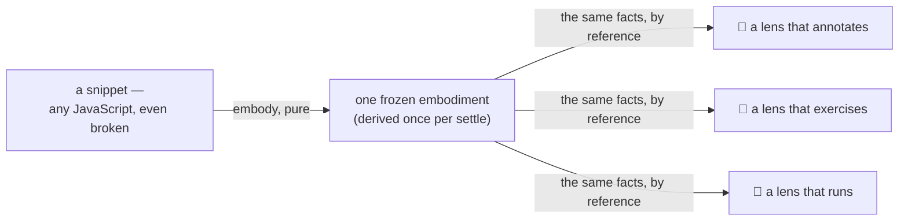

<!-- cspell:ignore Gateable entwine entwined entwining spellme -->

# embody

The embodiment factory. Every region that renders or consults the program works
from one question — _what is true about this program?_ — and this region is
where the answer is built. Given a snippet (the raw text a learner or host
brings, plus whether to read it as a script or a module) and a lens roster,
`embody()` derives the program's facts, works out which lifecycle phases those
facts leave reachable, attaches the lenses that fit, and freezes the result: the
**embodiment** — facts + fit + accessibility — that every other region renders
or consults.

Embody decides nothing about pedagogy. The contract is _accuracy_: the region
publishes the machine's own reading of the program — the tokenizer's tokens, the
parser's tree, the analyzer's scopes — and the few truths it derives itself are
marked as its own, documented at the field that carries them. Lenses choose what
to teach; embody guarantees that what they teach from is true.

The derivation is synchronous and pure, and it is **level-blind**: nothing in
this region knows what a language level is. A program that does not parse is not
an error here, either — a failed derivation is itself a fact, carried as data
and studied in place, never thrown.

The package [README](../README.md) owns what these words mean; this document
owns how the embodiment is built and where this region's boundary lies. The
contract, compactly (the full doc-commented version is
[`types.ts`](./types.ts)):

```ts
type Embodiment = {
	facts: Facts; // source · tokens · ast · entwined · environment · type — tagged stages
	study: Readonly<Record<LifecyclePhaseName, LifecyclePhase>>; // per phase: { accessible, cause?, lenses }
};
// the factory's boundary: embody(code, { type, lenses }) → frozen Embodiment
```

## Why an embodiment

Every settle re-embodies the program — the package
[README § How a program is studied](../README.md#how-a-program-is-studied) owns
that story. At each settle a dozen lenses may need the same truths about the
same program: where its tokens sit, what shape its tree takes, how its names
resolve. If each lens parsed for itself, one program would have as many readings
as it has lenses — and two lenses telling the learner subtly different things
about one program is not a glitch, it is a reason to stop trusting the
instrument.

So the region derives the truths once, indexes them generously, freezes them
hard, and shares them by reference:



The freeze is what makes the sharing safe — no consumer can bend the shared
truth for the next reader. And "even broken" is load-bearing: a program that
does not parse still embodies, its failed stages carried as structured causes
into the phases that own them. Study material, not an error.

## The boundary

**In** — a snippet (the raw program: source text plus its snippet type) and the
lens roster the composition root passes in. Embody imports no roster of its own
— lenses always arrive as an argument, and an empty roster is valid: the
embodiment then carries facts and accessibility with nothing attached.

**Out** — the frozen `Embodiment`: the Facts, each lifecycle phase's
accessibility, and the fitting lenses attached per phase.

**Depends on** — one shared leaf: the scanning derivation
([`../lib/scanning/`](../lib/scanning/README.md)), called at the tokens stage to
derive `inputElements` — this region's first runtime dependency on the `lib/`
tier. No cycle exists: the leaf imports no package region, not even for types.
The dependency is also a guarantee only embody can give: the leaf's one
precondition — source, tokens and comments from one reading of one source — is
satisfied by construction, because the derivation that calls it holds the
snippet's source and produced both arrays in a single tokenizer pass.

**Not owned** — rendering (the orchestrator's job); language-level knowledge (a
level's validator consumes this region's parse facts, and that consumption
happens outside embody — one parse truth); evaluator knowledge (evaluation-phase
lenses import their own evaluators; the embodiment carries no execution
handles); roster composition and the configuration cascade (the composition
root's — embody receives the finished roster); learner-facing display labels
(presentation, owned by the orchestrator's UI).

## Load-bearing principles

Six promises every consumer may build on. Their grounds — why each is this way
and not otherwise — are recorded by id in
[DOCS.md § Embodiment decisions](./DOCS.md#embodiment-decisions).

1. **Pure frozen plain data** (E1 · E2 · E3). Everything published is plain
   objects, arrays, and primitives — deep-frozen, with no methods, no getters,
   nothing to call; indexes are `Record`s and sequences are arrays — never a
   `Map` or `Set` at the public surface, which a freeze cannot honestly reach. A
   lens reads data; it never operates an API.
2. **Failures are data** (E7). Every derivation failure is a value carrying a
   structured cause; nothing the embodiment publishes ever throws at a reader.
3. **One tree, shared by reference** (E6). Within one embodiment, every fact
   holds the same node objects by reference — identity followed from one fact
   into another lands on the same node. Across embodiments no identity holds:
   persist paths, never objects. At most one tree holds the path grammar per
   embodiment — the machine's, or, when its parse fails, the recovered tree the
   failure arms carry ([§ Failure grammar](#failure-grammar)); the two never
   coexist.
4. **Per-instance, no shared state** (E5). One embodiment knows nothing of
   another — no module-level cache, no cross-instance communication.
5. **Level-blind** (E8). Nothing in the region's data or pipeline knows what a
   language level is; a lens's gate may consult a level privately, and embody
   neither knows nor cares.
6. **Freeze-what-you-own** (E4). The freeze reaches everything the embodiment
   holds the sole reference to — the wrappers and indices it built, and the tree
   and scope objects the facts index — and stops at objects with other owners:
   attached lens refs, and the process-global singletons the derivation borrowed
   (acorn's token types). Anything mutable reachable from the embodiment is, by
   construction, someone else's object carrying that owner's contract.

## The build

Five steps, in order; each step's output is the next step's input. The walk is
synchronous and pure: the same snippet and roster always build the same
embodiment.

1. **Derive the fact stages.** Each of the six Facts — source, tokens, ast,
   entwined, environment, type — is published as a tagged stage: its value, or a
   structured cause of failure. The given stages — source and type — restate the
   snippet; the derived stages derive once, leaning on one another in dependency
   order — the tokens spell out the source, the tree resolves the tokens, the
   binding ties tree back to text, the scope structure reads tree, binding, and
   snippet type together. A failure never stops the walk: a stage whose input is
   missing fails carrying the upstream cause, its origin still named inside it —
   and where the failed input carries an account
   ([§ Failure grammar](#failure-grammar)), the stage derives over that account
   instead and publishes the result as its own failure arm's value, the upstream
   cause still carried. A learner's typo stops nothing — the failed stage is
   itself a fact, rendered inside the lifecycle phase that owns it. The tokens
   stage's value carries the token stream together with the comments the
   tokenizer sets aside — those two emerge from one pass, so they travel
   together. On a successful tokenization the value also carries
   `inputElements`: the same source re-read in the specification's own
   vocabulary, derived over the stream by calling the shared scanning leaf
   ([`../lib/scanning/`](../lib/scanning/README.md)) — optional in the contract,
   absent only when that derivation itself defects
   ([§ Failure grammar](#failure-grammar)).
2. **Derive phase accessibility.** From the tagged stages, each of the five
   lifecycle phases learns whether it can open. The rules are fixed and follow
   dependency: a phase is never barred by its own stage's failure, only by a
   failure it depends on. `source` and `tokens` are always accessible — a
   tokens-stage failure renders inside the `tokens` phase itself, where a
   learner can study it; `ast` is barred only when the tokens stage failed — a
   grammar error leaves the `ast` phase accessible and renders there;
   `environment` and `evaluation` are barred when tokens, ast, or entwining
   failed. A barred phase carries the upstream cause with it, so what a learner
   meets at a closed door is the reason it is closed.
3. **Gate the phase-declaring lenses.** Every roster lens that declares a
   lifecycle phase has its applicability run once over the Facts. The call is
   wrapped: a gate that throws is treated as not-applicable — the learner's
   surface degrades gracefully — with a loud development-mode report, because a
   throwing gate is a lens defect, not a program state. Panel-excluded lenses
   (no declared phase) are not consulted here; they mount only by explicit
   request — the orchestrator's concern.
4. **Attach what fits.** Fitting lenses attach to their declared phases as refs
   — the lens objects themselves, never pre-bound wrappers — so configuration
   can resolve at render time and each module stays owned by where it was
   defined.
5. **Freeze.** The embodiment freezes deeply — the stages, the accessibility
   map, the per-phase lists, and the tree and scope objects the facts index —
   and stops where ownership ends (principle 6): attached lens refs and acorn's
   process-global token types stay outside the freeze boundary, and whatever
   immutability they promise is their defining modules' contract, not embody's.

## Entwining — the source⇄tree binding

The parser answers what a program says; it does not answer where. A lens almost
always needs both directions at once: the learner's cursor sits at offset 41 —
which node is that? this `if` statement — which tokens does it own, and what
exact slice of the source is it? that name the scope analysis flagged — where
does it get highlighted? **Entwining** is the region's verb for building the
answer once: the derivation stage that ties the source text, the token stream,
and the syntax tree into one navigable graph — the **entwined** binding, the
fourth fact stage.

The graph has one wrapper per node path — each wrapper holding its node, its
`path`, its parent, its children, and the tokens and comments whose starts its
span contains. Ties follow containment, and nothing else; the normative
statement of the rule lives at the tokens contract in [`types.ts`](./types.ts),
and the [glossary's entwining entry](#glossary--region-terms) summarizes it.
Tokens and comments are wrapped once and shared — two wrappers' token sets may
overlap, but the graph never copies. And the binding's token side is
first-class: each token wrapper carries its stream neighbors (`previous` /
`next`) and the innermost node whose span covers its start, so "which token
comes next" and "which node holds this token" are one property read each —
comments ride the same geometry.

Four members give the binding its reach — two entry points, one source-side
index, and one record:

- **`root`** — the wrapped Program node: the canonical entry point for walking
  the whole graph top-down.
- **`byPath`** — from a carried identity to its node. A `NodePath` names exactly
  one node, survives `postMessage`, and is the one identity consumers persist
  and compare; `byPath` resolves it back in O(1).
- **`byOffset`** — from a place in the text to the deepest node whose span
  covers it. Every offset in the source resolves — never a hole — so "what is
  under the cursor" is one array read.
- **`parenSpans`** — not an entry point but a record about the source: where the
  parser recorded grouping parentheses, keyed by the path of the node each pair
  wrapped. The published tree is ESTree-shaped and carries no parenthesis nodes;
  this record preserves what the parser saw without bending the tree's shape.

This binding is where mechanics turn into explanation. Why does `1 + 2 * 3` read
as `1 + (2 * 3)`? The tree already says so — the multiplication sits deeper —
and the binding ties each node to its exact span, so a lens can show the
grouping in the learner's own source rather than assert it. The same walk
answers highlighting, token ownership, and "what did the parser see here" — one
graph, built once per embodiment, under every lens gesture that points at the
source.

> The sections above tell the region's story. The sections from here down state
> its contract precisely — what a contributor checks a change against.

## Level-blind, by structure

The embodiment's data and pipeline contain no level knowledge. A lens's gate may
consult a language level privately inside its own applicability; embody neither
knows nor cares — the wrapped predicate is the whole interface embody has onto a
lens's level reasoning. The tokens and ast stages are the parse facts a level's
validator consumes, so the one-parse-truth constraint is satisfied by
construction: whoever needs a parse reads this region's stages instead of
parsing again. One ruled exception sits beside it, not against it: on a failed
parse the recovering reader re-reads the source once, and its output is an
account on a failure arm, never the parse truth
([§ Failure grammar](#failure-grammar), human ruling 2026-09-01: one derivation
pass per instrument).

## Failure grammar

Every failure keeps the learner surface graceful — barred-with-cause,
not-applicable, or rendered in place, never a raw throw. What varies is whether
the failure also raises a loud development-mode report:

- **A learner's program that does not parse is not a defect.** The failed tokens
  or ast stage carries its structured cause, downstream phases render barred
  with it, and nothing is reported loudly — a broken program is a normal state
  worth studying.
- **A failed stage may still carry its value — partial or recovered — and
  `ok: false` is the label** (human rulings 2026-09-01: the facts serve the
  whole lens roster, each publication justified by a named consumer's need; a
  partial stage stays `ok: false`; the account lives under the same `value` name
  its trustworthy sibling uses, distinguished by the arm that carries it). A
  failure is studied in place, and what renders there is more than the cause.
  The tokens stage's failure carries the **token prefix** as its value: the
  tokens the scanner had produced, and the comments it had set aside, when the
  turn that failed was reached — the same shape a successful tokenization
  publishes, marked untrustworthy by the arm it rides. The prefix also carries
  the same reading re-read in the specification's own vocabulary: a **bounded**
  input-element sequence over exactly what the completed turns reach — the
  source cut at the account's own extent (the end of the last token or set-aside
  comment, whichever is later) and handed to the same scanning leaf under its
  unchanged tiling contract (human ruling 2026-09-01: input elements too,
  bounded by slicing). Where the cause reports an `offset`, the extent sits at
  or before it — the offset is the machine's report; the extent is the account's
  own, defined even when the machine reports none.
- **A grammar failure may carry the recovering reader's account — a different
  instrument's, never the machine's** (human rulings 2026-09-01: an invented
  tree is admissible only as a labeled, separate account — and the label is the
  failure arm itself; one derivation pass is per instrument — the machine parses
  once, and a failed parse may be re-read once by the recovering reader, whose
  output never enters a trustworthy value). When the program lexes but does not
  parse, the ast stage's failure carries as its value the **recovered tree** —
  the tree the **recovering reader** builds by inventing the least structure
  that lets reading continue — with its **invented nodes** enumerated beside it,
  so a lens renders real structure and invention distinguishably. The account
  flows downstream the way a trustworthy value would, published exactly when the
  recovered tree is: the entwined stage's failure carries the entwined binding
  of the recovered tree with the real token stream — one path grammar, and the
  only `byPath` this embodiment has — and the environment stage's failure
  carries the analyzer's reading over the recovered tree, every element that
  rests on an invented node marked as such in the structure (human ruling
  2026-09-01: the environment account is included, invention marked). A tokens
  failure bars the ast phase, and no recovered account is published anywhere in
  that embodiment.
- **The accounts serve named consumers** (human ruling 2026-09-01): the
  error-interpreting lens the package roster names across both parse phases —
  not yet built; this contract is part of what it will be built on — reads the
  prefix and the recovered accounts; the scanner's-stopping-point lens of the
  spellme family reads the prefix. The environment account is published for the
  same roster by explicit ruling rather than a named reader (human ruling
  2026-09-01) — publication stays justified per consumer or per ruling, never
  maximal by default.
- **The label is a discriminant, not a wall — an accepted cost, weighed** (human
  ruling 2026-09-01). Under one shared `value` name, a read that skips the
  narrowing can reach an account where it once reached nothing; "the accounts
  never blend into the trustworthy stages" is kept by the `ok` discriminant a
  consumer must respect — and by nothing stronger.
- **Every account is optional in the type, permanently** (human ruling
  2026-09-02). The `undefined` a skipped narrowing meets is the standing
  mechanical guard behind the accepted cost above — never scaffolding to tighten
  away. Presence at runtime follows one grammar: the token prefix is published
  on every tokens failure (a stop before any complete turn yields empty
  channels); the recovered tree exactly when the program lexes but does not
  parse; the recovered binding and the analyzer's reading over it exactly when
  the recovered tree is published; and each is absent past that only when its
  own derivation defects — loudly, degrading that account alone (the defect
  bullet below).
- **A defect in embody's own machinery is loud to the developer, graceful to the
  learner.** An entwining or scope-analysis failure over the machine's valid
  tree raises a loud development-mode report; a throwing applicability gate is
  degraded to not-applicable and reported the same way. **Loudness follows the
  cause's own `stage`, never bare `ok: false`**: a failure arm carrying an
  upstream cause is not this stage's defect, whether or not it also carries an
  account. A defect while deriving an account degrades that account alone — the
  arm keeps its cause, the member is absent, and the development-mode report
  speaks of the account failing, never of a broken machine invariant (the same
  grammar as the input-element enrichment below). What a failure bars follows
  dependency: the source⇄tree binding underpins every later surface, so an
  entwining failure bars the phases below it; the scope structure is terminal —
  no later phase reads it — so an environment failure renders inside the
  `environment` phase alone, leaving `evaluation` reachable.
- **A defect in the input-element derivation degrades the enrichment alone.**
  The leaf call is embody machinery: a throw from it raises the same loud
  development-mode report, the tokens stage still publishes its value, and
  `inputElements` is simply absent — no stage fails, no phase is barred, because
  nothing downstream depends on it. Absence of the member and this defect are
  one and the same state.

## Reading the embodiment

Consumers meet two shapes — tagged stages and phase payloads — and one seam
rule:

- **A fact stage narrows on `ok`.** Read `facts.ast.ok` before
  `facts.ast.value`. The given stages — `source` and `type` — type as
  success-only, so their values read directly; only `tokens`, `ast`, `entwined`,
  and `environment` carry a failure arm.
- **A phase payload narrows on `accessible`.** A barred phase adds its `cause` —
  whose `stage` field names the true origin; both arms list the lenses that fit.
- **The parse facts are values, not envelopes.** What a language level's
  validator consumes is `facts.tokens.value` and `facts.ast.value` — never this
  region's stage envelope.
- **The input-element sequence narrows on presence.**
  `facts.tokens.value.inputElements` is optional: present on every successful
  tokenization except when the derivation itself defected
  ([§ Failure grammar](#failure-grammar)). A consumer that needs it checks for
  it; absence is a reported embody defect, never a property of the program.
- **A failure arm's `value` is its account — same name, same shape, never the
  same trust.** After `ok` narrows false, `value` where present is the partial
  or recovered account ([§ Failure grammar](#failure-grammar)); a consumer that
  needs one checks for it, and every consumer that only narrows `ok` reads
  exactly what it always read. Read `value` without narrowing and the type hands
  back the union with `undefined` — the discriminant, not the name, is what
  separates trustworthy from recovered. And the accounts live on the fact
  stages, never on the phase payloads: a lens rendering at a barred phase
  reaches into the facts for them.

## What lives here

| File                                           | Audience       | What it is                                                                             |
| ---------------------------------------------- | -------------- | -------------------------------------------------------------------------------------- |
| `README.md` (this)                             | contributors   | the region's domain model + navigation                                                 |
| [`DOCS.md`](./DOCS.md)                         | developers     | the architectural sketch, structural constraints, and decisions                        |
| [`notional-machine.md`](./notional-machine.md) | contributors   | the machine twin — the factory model, the scanner in full                              |
| [`data-model.md`](./data-model.md)             | contributors   | the data twin — what the region's shapes are, who holds them, and for how long         |
| [`types.ts`](./types.ts)                       | every consumer | the keystone contracts — `Snippet` · `Facts` · `Gateable` · `Embodiment`               |
| `index.ts`                                     | consumers      | the factory's boundary — `embody()`                                                    |
| `derive-facts.ts`                              | implementers   | the six fact stages, threaded once in dependency order                                 |
| `derive-tokens.ts`                             | implementers   | token stream + set-aside comments + the input-element sequence (via the scanning leaf) |
| `derive-ast.ts`                                | implementers   | the syntax tree + the parse's grouping-paren record                                    |
| `derive-entwined.ts`                           | implementers   | the source⇄tree binding                                                                |
| `derive-environment.ts`                        | implementers   | the static scope structure                                                             |
| `derive-accessibility.ts`                      | implementers   | the per-phase accessibility map                                                        |
| `gate-lenses.ts`                               | implementers   | run each phase-declaring applicability, wrapped                                        |
| `attach-lenses.ts`                             | implementers   | group fitting lenses under their declared phases                                       |
| `join-study.ts`                                | implementers   | join accessibility + attachments into the study layer                                  |
| `ecma-version.ts`                              | implementers   | the one shared numeric language year                                                   |
| `is-node.ts`                                   | implementers   | the membership rule every generic walk here shares                                     |
| `node-at-span.ts`                              | consumers      | offset span → the deepest exact-match entwined node, or null — a total lookup          |
| `lifecycle-phase-order.ts`                     | implementers   | the five phases, in specification order                                                |
| `to-stage-cause.ts`                            | implementers   | parser error → structured StageCause                                                   |
| `sandbox.html`                                 | developers     | permanent dev page — renders byPath wrappers for inspection                            |
| `tests/`                                       | implementers   | the region's unit tests                                                                |

## Glossary — region terms

The package glossary owns the shared meanings; these entries add the mechanics
this region owns.

- **fact stage** — one tagged derivation result inside the Facts: either the
  stage's value, or a structured cause of failure. The unit applicability
  predicates test and accessibility reads from.
- **account** — what a failed stage publishes beside its cause: its own `value`,
  partial or recovered, under the same name and shape a trustworthy value
  carries, distinguished only by the `ok: false` arm that holds it (human ruling
  2026-09-01). Every account is attributed to an instrument — the machine's own
  partial reading, or the recovering reader's — and the arm is the attribution.
- **token prefix** — the machine's account of a tokens-stage stop: the tokens
  the scanner had produced, and the comments it had set aside, when the turn
  that failed was reached — the tokens failure arm's `value`. A prefix of the
  scanner's own reading, not of any completed stream — the program has none. Its
  **extent** is the end of the last token or set-aside comment, whichever is
  later — the account's own boundary, defined even when the cause carries no
  `offset`; where the cause reports one, the extent sits at or before it. The
  prefix also carries the same reading in the specification's own vocabulary: a
  bounded input-element sequence over the source cut at that extent, handed to
  the same scanning leaf under its unchanged tiling contract (human ruling
  2026-09-01: bounded by slicing, the leaf untouched) — optional under the same
  single absence condition as the success arm's member: absent exactly when that
  derivation defects, the same reported defect.
- **recovering reader** — the second instrument a grammar failure may bring in:
  a reader that re-reads the source the machine's parse refused, bridging what
  the source lacks by inventing the least structure that lets reading continue.
  Not the machine — its output is an account, never a trustworthy value, and the
  machine twin models the machine alone (the reader owes its own section there
  when it is installed).
- **recovered tree** — the recovering reader's tree over a program that lexes
  but does not parse: the ast failure arm's `value`, with its invented nodes
  enumerated beside it (human ruling 2026-09-01: admissible only as this
  labeled, separate account). Downstream — published exactly when it is — the
  entwined failure arm carries its entwined binding with the real token stream,
  and the environment failure arm the analyzer's reading over it — together the
  recovered account of the program.
- **invented node** — a node of a recovered tree with no source of its own: the
  recovering reader supplied it where the grammar demanded something the source
  lacks. Enumerated on the ast failure arm; every environment element resting on
  one is marked in the structure. Never present in the machine's tree.
- **input elements** — the tokens stage's `inputElements` member: the same
  source re-read in the specification's own vocabulary — ECMA-262's
  input-element sequence, one named element per span — present on a successful
  tokenization and absent only when the derivation itself defects
  ([§ Failure grammar](#failure-grammar)). Derived at embodiment time by calling
  the shared scanning leaf ([`../lib/scanning/`](../lib/scanning/README.md)),
  which owns the vocabulary: the fourteen element kinds and their grounds. Each
  element carries its element kind, its half-open span, its verbatim source
  slice, and the indices of the parser tokens it wraps — indices into
  `facts.tokens.value.tokens`, never token objects, which is what lets the
  sequence live inside the embodiment's deep freeze (an acorn token's type is a
  process-global the freeze must not reach) and what joins the two derivations
  on one stream. The sequence tiles the source; tiling is a property of the
  sequence, never evidence it is the specification's — the leaf records its one
  deliberate departure and its one known upstream mis-read (a slash after
  `await`), and the field's own doc repeats them. In prose say **element kind**
  for which production an element is — never bare "kind", which the package
  glossary owns for a kind of study utility (the leaf's published field is
  `kind`, read inside an element where no ambiguity arises; its type is
  `InputElementKind`). Embody's own contribution is the coherence guarantee: the
  leaf's precondition — source, tokens and comments from one reading of one
  source — is satisfied by construction, because the derivation that calls it
  holds the snippet's source and produced both arrays in one tokenizer pass.
  (Summarized here; the normative statement lives at the `inputElements` field
  in [`types.ts`](./types.ts).)
- **entwining / entwined** — the derived source⇄tree binding: the stage tying
  each syntax-tree node to its exact place in the source text. Built at
  embodiment time, in this region. A tie is containment: a node ties every token
  and comment whose start lies in its half-open span, through one shared wrapper
  each; a node the parse reuses at two paths carries one wrapper per path, and a
  zero-width span ties none. (This entry summarizes the rule; its normative
  statement, with ordering and edge cases, is at the tokens contract in
  [`types.ts`](./types.ts).) Beside its node, token, and comment ties, the
  binding carries the parse's own record of grouping parentheses: for each node
  the parentheses wrapped, its paren spans, keyed by that node's path —
  path-keyed data, so it lives here, where paths are born.
- **grouping parentheses** — the parentheses the parser itself records around an
  expression (`(1 + 2) * 3`), as distinct from the parentheses that belong to a
  call, a parameter list, or a control head. Some are load-bearing — `(a?.b).c`
  seals the optional chain; `(a) = 5` is legal only because the parser reads the
  assignment target through the parens, while a parenthesized pattern
  (`({x}) = y`) is not — and the record carries them all: it is the parser's
  reading, never a judgment about which parentheses mattered. The published tree
  stays ESTree-shaped — no node for them, and no path ever traverses one — and
  the entwined stage records where they were. Source text, not structure.
  (Distinct from `lib/classifying`'s `grouping` token role, which is assigned by
  elimination and can claim a parenthesis the parser records no expression
  around — dynamic `import()`'s, for one.)
- **paren span** — where one pair of grouping parentheses sat: `start` at the
  `(`, `end` one past the `)` — half-open offsets in UTF-16 code units, the same
  `start`/`end` vocabulary every node and token carries. Within the machine's
  binding, the parser's own recorded positions, never re-derived from the text;
  a node with no grouping parentheses has no entry at all — the absence is
  itself the parser's reading. Within a recovered account the record is the
  **recovering reader's** own, of whatever it recovered — possibly nothing — and
  a missing entry there is the reader's silence, never an assertion about the
  source (human ruling 2026-09-02). A node wrapped more than once carries one
  span per pair, outermost first. At a paren's own offset, `byOffset` resolves
  to the enclosing node — a consumer needing paren→node builds the one-pass
  reverse index from this record.
- **environment** — the derived static scope structure, pre-execution: the stage
  resolving how each name is bound across the program's nested scopes, toggled
  for scripts or modules. Built at embodiment time, in this region, from the
  syntax tree, the source⇄tree binding, and the snippet type. It reports the
  analyzer's reading, every field of it common enough to expose: each **use** of
  a name records how it touches the binding — read, written, or both — and, for
  a write, whether it is the binding's own initialization (the
  write-of-initialization flag, not the syntactic initializer node) and, when
  the write carries one, the expression written; each **definition** records the
  enclosing statement, the declarator's position, and — for a variable
  declaration — the `let`/`const`/`var` keyword. Every scope identifier carries
  its node path into the source⇄tree binding, so a consumer reaches the
  identifier's place, neighbors, and children through the entwined index. Two
  signals are embody's own rather than the analyzer's. The external names a
  **binding** is exported under — its contribution to the module's export
  interface, read from the export declarations themselves rather than inferred
  (eslint-scope models no export status), empty for a script or a purely local
  binding. And how a use relates to its `let`/`const`/`class` binding when it
  precedes initialization — evaluated `eager` (at a fixed point) or `deferred`
  (in a later-running function or an instance field initializer) — a static
  fact, offered as a convenience, from which a consumer draws any runtime
  inference, never embody.
- **phase accessibility** — the derived per-phase map: accessible, or barred
  with the carried upstream cause. (The package glossary owns its distinction
  from lens fit.)
- **fit / attachment** — a phase-declaring lens whose applicability holds over
  the Facts is attached, as a ref, to each phase it declares.
- **Gateable** — the minimal structural view embody has of any lens: a name, an
  applicability over the Facts, and optionally declared phase(s). No main
  operation — embody never types or loads a component. The lens kind extends
  this contract in its own region.
- **freeze boundary** — the deep freeze reaches what the embodiment holds the
  sole reference to; attached lens refs and borrowed process-global singletons
  (acorn's token types) sit outside embody's immutability contract — whatever
  guarantees they carry are their defining modules' business.
- **Snippet** — the raw program passed in: source text plus snippet type.
- **Embodiment** — the frozen output: the Facts plus the five phase payloads.

## Navigation

- Package root: [`../README.md`](../README.md) — the domain model and the
  package glossary.
- [`DOCS.md`](./DOCS.md) — this region's architectural sketch, structural
  constraints, and decisions.
- [`notional-machine.md`](./notional-machine.md) — the machine twin: the
  factory's machine model, with the scanner modeled in full.
- [`data-model.md`](./data-model.md) — the data twin: identity, ownership, and
  lifetime for every shape the region produces, holds, or hands on.
- [`types.ts`](./types.ts) — the keystone contracts: `Snippet`, `Facts`, the
  lifecycle vocabulary, `Gateable`, `Embodiment`.
