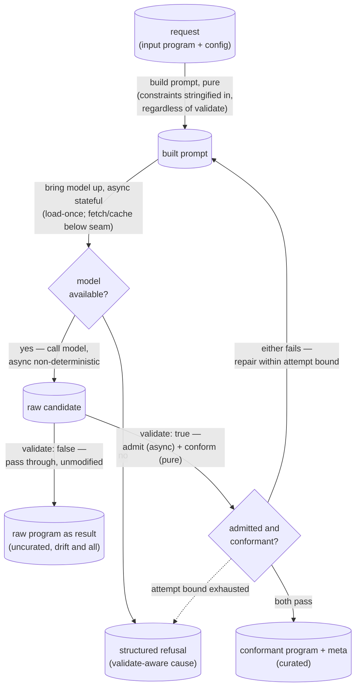

# aithor — Architecture & Decisions

> Architectural sketch — written Phase 0; the structural target the module's
> implementation is held against.

The pedagogy — the quad, the four config→quadrant mappings — lives in
[`./README.md`](./README.md); this sketch covers only the module's own
structure: a pure core and the two impure seams it isolates. One operation,
`aithor(program, config)`, shapes a program to a config seeded by an input
program — an empty input composes from scratch, a non-empty one varies. The
point of the sketch is to keep the model interaction — a non-deterministic call
and a stateful loader — on the far side of a seam, so prompt construction, the
conformance check, the validate-gated loop, and result-shaping stay pure.

## Execution phases

Four phases, cut by structural seam — the two impure points each get their own
boundary so the rest is data-in, data-out:

- **Prompt construction** — input: a request (input program + config); output: a
  built prompt. **Pure, sync.** Concatenates the ask, the input program, and the
  stringified constraints — composing from an empty input, varying a non-empty
  one — independent of `validate`. On a repair turn the same phase folds the
  located refusal reason into the next prompt.
- **Model bring-up** — input: a model name; output: a model handle, or
  _no-model-available_. **Async, stateful (seam 1 — load-once).** The named
  local model is brought into memory on first need and reused thereafter; the
  runtime's one-time fetch and on-device cache sit below this seam, invisible.
  When the device cannot bring a model up, the request short-circuits to a
  refusal.
- **Candidate generation** — input: a built prompt + a model handle; output: a
  raw candidate. **Async, non-deterministic (seam 2 — the model call).** The
  same request yields different candidates; the only non-reproducible point.
- **Disposition** — input: a raw candidate (+ request); output: a conformant
  program + meta, a raw candidate as-is, or a structured refusal.
  **Validate-forked.** Under `validate: true` the candidate faces admission (the
  level's gate, async) then conformance (the aithor's pure check, sync); on a
  pass it is shaped into a result with meta, on a fail it routes to a repair
  turn within an attempt bound, and the exhausted bound shapes a refusal. Under
  `validate: false` the candidate is shaped unmodified — no admission, no
  conformance, no repair.

## Data flow

The repair edge returns to prompt construction — the same pure phase, now seeded
with the specific out-of-subset construct or out-of-bounds metric. The loop is
bounded; the dotted edge is the join where the bound is spent. Both refusal
causes converge on one refusal state.

## Structural constraints

- **The two seams are the only impure points** (load-bearing): the stateful
  loader (name → handle, load-once) and the non-deterministic model call (handle
  → candidate). Everything else — prompt construction, conformance, the validate
  fork, the attempt bound, result-shaping, refusal-cause selection — is pure
  given those two injected. Conformance never reaches the model.
- **The curated boundary holds, fail-loud.** Under `validate: true` a candidate
  becomes a result only when admission AND conformance both pass; one that fails
  either is repaired or refused, never returned. There is no degrade-to-
  non-conformant result.
- **The uncurated rawness is preserved, by design.** Under `validate: false` the
  candidate passes through unmodified — admission and conformance do not run,
  and any cleanup would be a defect.
- **Refusal causes are validate-aware.** Curated: _attempt-bound-exhausted_ or
  _no-model-available_. Uncurated: _no-model-available_ only — with no loop
  there is no attempt-bound refusal.
- **The result follows the `BaseResult` `ok`-boolean convention** — consumers
  check `ok`, not a discriminated tag. The only failure surface is a structured
  refusal; conformance violations stay internal to the repair loop.
- **The feature subset resolves by contract:** an empty `include` permits all of
  JEJ minus `exclude`; a non-empty `include` permits only those, minus
  `exclude`; on overlap `exclude` wins.
- **Admission is reused unchanged.** The level's gate runs on the curated path
  only; the aithor never widens or re-derives it — conformance only ever narrows
  below admitted JEJ.

## Out of scope

- **The language level's admission gate** — `isJej` and its allowlist live in
  [`../../../lib/validating/`](../../../lib/validating/), reused unchanged; this
  module never edits, extends, or re-implements it. Conformance is a separate,
  narrower, aithor-owned check.
- **The model runtime** — how a local model is fetched, cached on the device,
  and executed sits below the bring-up seam. This module names _which_ local
  model and drives _when_ its lifecycle runs, not _how_; the runtime is
  injected.
- **Embodiment, lenses, execution** — once a program exists it is an ordinary
  JEJ source string; embody / orchestrate / engine own it from there.
- **Authoring for its own sake** — this module produces programs _to study_, not
  finished programs to keep; a non-empty input is a seed it reads, not a
  document it maintains. (The uncurated path is squarely in scope — the Q1/Q2
  generative surface, not an excluded mode.)
- **Reproducibility and faithfulness** — generation is non-deterministic and a
  variation is related, not rule-bound; a caller needing a fixed program stores
  the program, and one needing an exact transform will not find it here.

## Related

- [`./README.md`](./README.md) — what this module is (the quad, config→quadrant,
  the ubiquitous language).
- [`./types.ts`](./types.ts) — the contract in TypeScript (config, `validate`,
  the `complexity` metric, the result + refusal shapes).
- [`../DOCS.md`](../DOCS.md) — the language level's architecture (admission, the
  never-lies invariant).
- [`../../../lib/validating/`](../../../lib/validating/) — `isJej`, the
  admission gate reused unchanged.
- [`../../../types.ts`](../../../types.ts) — `Features` / `Metrics`, the level's
  measured analyses (`Metrics.maxNestingDepth` is the primary `complexity`
  ordinal).
- [`../../../../README.md`](../../../../README.md) — the package's Explorotron
  quad treatment; the aithor is its generative arm.
