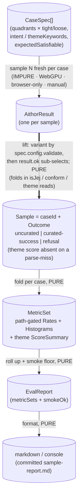

# aithor — Eval Harness (EVAL.md)

> Phase-2 design spec. **Measured, not asserted.** This file specifies the
> harness that runs `aithor(program, config, realRuntime)` against a **real
> local model** over a sample of requests and reports **statistical rates** —
> never golden-pair assertions (generation is non-reproducible; evals sample
> fresh). The architectural sketch (pure core ↔ impure driver, the data-flow
> diagram) is the [§ Architecture](#architecture) section below; the eval
> contract in TypeScript is [`./types.ts`](./types.ts).

## What this is, and the charter it honors

The module's [`../README.md`](../README.md) § Testing posture commits to an eval
it has not yet built:

> **Measured, not asserted.** Only the program's content, quality, and _theme_
> fidelity are statistical rates over a real model (an eval). Feature and size
> conformance are _asserted_ on the curated path — they are gated by `conform`,
> not measured.

Everything aithor built in Phase 1 is deterministic or faked (fake models, fake
runtimes). Nothing measures real generation. This harness does — and it does so
under the module's standing design commitments ([`../README.md`](../README.md) §
Design commitments): generation is **not reproducible** ("the same request
yields _different_ programs … Evals sample fresh; there are no golden pairs"),
and a variation is **related, not faithful**. So an eval is a roll-up of **rates
over fresh samples**, with provenance — not a fixture of expected outputs.

## Scope — a whole-eval design, a tight v1 implementation boundary

The charter's **named** targets — _content_, _quality_, _theme fidelity_ — are
**semantic**: the reused gates (`isJej`, `conform`) do not measure them, and a
small local model judges them unreliably (a 0.5B judge rating a 0.5B generator
is two weak models in a mirror). The metrics that are mechanically
**trustworthy** (admission/conformance/drift on the uncurated path;
refusal/attempt load on the curated path) are not the charter's named targets.
This spec resolves the tension by separating what is **designed** from what is
**built in v1**:

- **Designed here (the whole eval):** the objective metrics, the injected
  **judge seam**, the three per-target measurement mechanisms, the judge-model
  option-table, calibration against a human-labeled anchor set, and the
  human-rating protocol. See
  [§ The deferred judge seam](#the-deferred-judge-seam-v2--designed-not-built).
- **Built in v1 (the implementation boundary):**
  1. the **objective backbone** — mechanical rates reusing `isJej` + `conform` +
     aithor's own `Meta`/`Refusal`; and
  2. **one heuristic theme floor** — a deterministic theme-keyword-presence
     metric, **honestly labeled** (it is not "theme fidelity"; see below).
- **Deferred to v2 (gated on a human decision + a passing calibration run):**
  the LLM-judge for true content / quality / theme fidelity. The seam is
  designed and typed now; no judge is implemented or reported in v1.

**Honesty guard, stated once and load-bearing:** v1's numbers are _drift &
refusal-load + theme-keyword presence_. They are **not** the charter's named
content/quality/theme **fidelity**. The report names itself accordingly and
never calls a v1 number "the quality eval." What v1 delivers is an objective
characterization of how a real model behaves through aithor's two paths.

## Ubiquitous language (the eval nouns)

The contract is [`./types.ts`](./types.ts); this is the vocabulary.

- **CaseSpec** — one fully-specified request we sample, plus the eval-author
  truth the config cannot carry.
  `{ id, quadrant, program, config: AithorConfig, intent, themeKeywords, expectedSatisfiable }`.
  The `config` is the verbatim request `aithor` receives; `intent` and
  `themeKeywords` are **author metadata** — theme is soft prose inside
  `config.prompt` ("…about robots…"), so the only honest source of the
  _requested_ theme is the author writing it down (load-bearing for the
  heuristic). `expectedSatisfiable` records whether _any_ program could satisfy
  the (subset × size × intent) — some curated requests are unsatisfiable by
  design ("sum a list with no loops"), for which a refusal is the **correct**
  outcome.
- **Sample** — one execution of a CaseSpec against the real model:
  `{ caseId, outcome }`. Non-reproducible — a fresh draw, no seed, no golden
  pair. (Distinct from the level's `Metrics.samples`, a numeric-observation
  count.)
- **Outcome** — the mechanically-readable distillate of one Sample, produced by
  the impure driver and consumed by the pure core (so the core never touches a
  runtime). A discriminated union over the three terminal shapes aithor can
  reach: _uncurated_ (raw, with the admission/conformance **gap** read off it),
  _curated success_ (admitted + conformant **by construction**, so those are not
  re-read), and _refusal_ (a named cause). See [`./types.ts`](./types.ts).
- **Rate** — `{ numerator, denominator, proportion }`. Honest about its
  denominator — never a bare float. `proportion` is `NaN` when the denominator
  is zero, rendered `—`.
- **Histogram** — a frequency count over a small closed key set (refusal causes,
  attempt counts {1,2,3}, drifting features/dimensions). Named `Histogram` (not
  `Distribution`) to avoid collision with the level's exported `Distribution`
  (`embody/types.ts` — a min/max/mean/median stats summary), an unrelated
  concept.
- **MetricSet** — the per-case roll-up of Outcomes into Rates and Histograms.
  Uncurated-only and curated-only fields are path-gated (the by-construction
  omission below).
- **EvalReport** — the run-level roll-up:
  `{ generatedAt, model, totalSamples, metricSets, smokeOk }`. `generatedAt` is
  provenance, **never** a reproducibility claim.
- **Mechanism** — the provenance stamped on every measured number:
  `'objective' | 'judge' | 'human'`. A heuristic theme-keyword floor
  (`objective`) is **never** pooled with a future judge's fidelity rating
  (`judge`).
- **Judge / Rating / Target** (v2, designed not built) —
  `Target = 'content' | 'quality' | 'theme'`; a **Judge** is an injected,
  value-not-throw seam (mirrors `AithorRuntime`) turning a (program,
  intent/theme) into a `Rating` (a 0..1 score + its `mechanism` + optional
  rationale).
- **Anchor set** (v2) — a small, fixed set of human-labeled (program, intent,
  theme) triples a judge is **calibrated** against before any judge number is
  reportable as a rate.

## What v1 measures — and pointedly does not

Reusing, verbatim, the module's own objective computers: admission `isJej`
([`../../../../lib/validating/is-jej.ts`](../../../../lib/validating/is-jej.ts)),
conformance `conform` ([`../conform.ts`](../conform.ts)), and aithor's own
result `Meta`/`Refusal`. No new judgment. Reuse signatures (verbatim, so wiring
is unambiguous): `conform(code, subset, size): ConformResult` ·
`isJej(code): Promise<boolean>` · `parseProgram(code, 'module')`.

| Metric                                      | Path           | Numerator / Denominator                                           | Mechanism       |
| ------------------------------------------- | -------------- | ----------------------------------------------------------------- | --------------- |
| admission (drift)                           | uncurated      | `isJej(program)` true ÷ non-bring-up uncurated samples            | objective       |
| conformance (drift)                         | uncurated      | `conform(raw, subset, size).ok` ÷ same                            | objective       |
| feature / size drift                        | uncurated      | Histogram of violated features / dimensions over drifting samples | objective       |
| theme-keyword presence                      | both (success) | mean keyword-overlap 0..1 over samples whose program parsed       | objective floor |
| success rate                                | curated        | curated-success ÷ non-bring-up curated samples                    | objective       |
| attempt-bound refusal rate                  | curated        | `attempt-bound-exhausted` ÷ same                                  | objective       |
| attempt distribution                        | curated        | over {1,2,3} for curated-success samples                          | objective       |
| bring-up refusal rate                       | both           | (`no-model-available` + `unknown-model`) ÷ all samples            | objective       |
| ~~content / quality / true theme fidelity~~ | —              | **v2 — deferred judge**                                           | judge / human   |

The two uncurated `(drift)` rows characterize the **model's drift on output
aithor never gates** ("the gap between asked-for and got is real and
intentional"), so they are _not_ aithor's conformance; they measure how far raw
generation departs from the request. (`Meta.attempts` is absent on a refusal, so
an `attempt-bound-exhausted` refusal silently spent the full bound; the attempt
distribution reads successes only, and the attempt-bound refusal rate captures
the spent-and-refused load — together they are exhaustive.)

**The by-construction omission (how v1 honors "asserted, not measured on
curated").** On the curated **success** path a returned program is admitted
**and** conformant by construction — the loop guarantees it (the README's "the
boundary holds, fail-loud"). There is therefore nothing to _measure_ about
curated admission/conformance: it is 100% by definition. So a curated
`MetricSet` carries **no** `admissionRate`/`conformanceRate` — encoded as a test
(they are `undefined` on a curated MetricSet). v1 measures the **gap** where
conformance is _not_ gated (the uncurated path — "the gap between asked-for and
got is real and intentional") and the **refusal/attempt load** where the loop
pays for tightness (the curated path — "tight curated requests cost more"). This
is the literal shape of "measured, not asserted."

## The heuristic theme floor

The charter's first option for measuring theme (E2): a
**keyword/identifier-presence heuristic**.
`themeKeywordOverlap(program, themeKeywords) → 0..1`, pure:

- Parse `program` with the shared `parseProgram(code, 'module')`
  ([`../../../../lib/parse-old/parse-program.ts`](../../../../lib/parse-old/parse-program.ts),
  the same value-not-throw parser `conform` uses). If it does not parse
  (uncurated raw may be prose/markdown), the score is **absent** (`undefined`) —
  a datum ("theme not assessable"), **never zero**.
- From the AST, collect the program's **surface**: `Identifier` names and the
  contents of string and template literals — exactly the README's "theme = a
  domain/subject for the program's surface (names, scenario)". (Keywords and
  syntax are not the surface; comments are dropped by the parser — both
  correctly excluded.)
- Tokenize + lowercase both the surface and `themeKeywords`; the score is the
  fraction of `themeKeywords` present in the surface.

**This is a floor, not fidelity.** It is easily gamed and shallow — a program
that merely _names_ a `robot` variable while doing nothing robot-like scores
high. It is reported as **"theme-keyword presence,"** never "theme fidelity,"
and it serves two honest purposes: a sanity floor a real model should clear, and
the **baseline a future LLM-judge must beat** to earn its place. Its `mechanism`
is `objective`.

## The deferred judge seam (v2) — designed, not built

The charter's named targets need a judge or a human. v1 does not build one; the
**seam** is designed now so the core stays fake-testable and v2 is a plug-in,
not a reshape. The judge mirrors `AithorRuntime`: an injected,
**value-not-throw** seam.

- **Per-target mechanism (E2, for the human to choose at the v2 gate):**
  - _theme_ — heuristic (shipped in v1, above) **or** LLM-judge **or** human.
  - _content_ ("does it do what was asked?") — a mechanical floor (does it
    parse/run?) **plus** an LLM-judge **or** human; no full mechanical proxy.
  - _quality_ (readability / trace-load / learning-suitability) — LLM-judge
    **or** human; no honest mechanical proxy beyond crude metrics.
- **Judge-model option-table (unresolved — the human decides at the v2 gate):**
  - _same small local model_ — cheap, but circular and untrustworthy (two weak
    models in a mirror).
  - _a larger local model_ (4B–7B) — better, heavier GPU, still uncalibrated for
    quality.
  - _a quarantined cloud model_ — strongest, but **breaks the module's
    local-only invariant**. Permissible only because the eval is **dev-tooling**
    (never bundled, never imported by `aithor.ts`, env-gated, stamped
    `mechanism: 'judge'` with a cloud `JudgeDescriptor`). A guard test would
    assert `aithor.ts`'s import graph never reaches it. If that guard feels
    heavy, that is the signal the cloud judge should not exist.
- **Reliability design (why a judge number would not be decoration):**
  1. **Provenance** — `mechanism` on every number; the aggregator refuses to
     pool across mechanisms for the same target.
  2. **Dispersion is mandatory** — every judge rate carries a standard
     deviation + `n`; a mean with no spread over a non-deterministic generator
     **and** a non-deterministic judge is the canonical lie.
  3. **Calibration gate** — a judge target rate is reportable as a "fidelity
     rate" only if its mean-absolute-error against the human-labeled **anchor
     set** is below a human-set threshold; otherwise the number is printed but
     flagged `uncalibrated` and never promoted to a headline. In practice
     `quality` will fail calibration for small local judges — the correct,
     humbling outcome.
  4. **Human fallback** — when calibration fails, degrade to **human rating over
     small N** (more honest than a judge over large N), via a static rating page
     (sibling to
     [`../../../../../lib/local-llm/sandbox.html`](../../../../../lib/local-llm/sandbox.html))
     that loads a run's samples and records 0/0.5/1 labels as committed JSON.

## Sample protocol (E3)

- **Cases** — the four quadrants (`validate` × seeded/from-scratch), each in a
  **tight** variant (small `include`, low `lines`/`complexity` — where
  attempt-bound load shows) and a **loose** variant (empty `include` = full JEJ,
  no bounds) → ~6–8 CaseSpecs. At least one tight curated case is
  `expectedSatisfiable: false`, so the report can separate "refused something
  satisfiable" (a signal) from "refused the unsatisfiable" (a contract
  **pass**).
- **Samples** — `SAMPLES_PER_CASE = 5` for v1. Generation is non-reproducible,
  so a rate needs replication; 5 keeps a full GPU run to single-digit minutes.
- **Aggregation** — rates report raw `n/d`; the harness prints **no** confidence
  interval at N=5 (false precision). v1 conclusions are **directional, not
  significant**, and the report says so. No seeds, no golden pairs — each Sample
  is a fresh draw.

## Models (E4)

Default `Qwen2.5-Coder-0.5B-Instruct-q4f16_1-MLC` — the smallest catalog coder,
with no required GPU features (so an explicit pick never feasibility-refuses),
and already proven through aithor's seam in
[`../tests/aithor-webllm.browser.test.ts`](../tests/aithor-webllm.browser.test.ts).
The harness is parameterized by a single `DEFAULT_MODEL` const so a
**size-sweep** (→ 1.5B / 7B, to characterize the README's "smaller … weaker
programs, larger the reverse") is a config edit, not a redesign. A sweep is
confirmatory, not required for v1. A near-zero curated success-rate on a tight
case is **the model, not the harness** — expected for the 0.5B.

## Report, not gate (E6)

"Measured, not asserted" means the harness **reports**; it never fails a build
on a quality number (a non-reproducible rate would flake CI). The **only**
assertion is a **smoke floor**:

- `smokeOk` = **every case produced `SAMPLES_PER_CASE` well-formed Outcomes
  (success _or_ refusal)** — _not_ "≥1 success." A legitimately-hard curated
  case may correctly refuse every sample; that must keep the floor green. The
  floor proves the harness executed and aithor returned structured values
  end-to-end, nothing about quality.

Results are recorded two ways: the GPU driver **prints** the formatted table to
the test console, and a real run is **committed** as
[`./sample-report.md`](./sample-report.md) — the manual attestation, mirroring
the campaign's "commit a real GPU run" discipline (cf. the browser-fidelity
tests). There is no quality floor-gate in v1; a regression-watch threshold, if
ever added, would be advisory only.

## Run environment & file layout (E5, E7)

A real model needs **WebGPU → browser-only** (Node has no GPU). The harness
splits along that line — the [§ Architecture](#architecture) below details the
seam:

- a **pure core** (rate computation + aggregation) — Node-fake-testable with
  hand-authored Outcomes, red-first, deterministic, no GPU; and
- an **impure driver** — a GPU-gated `*.browser.test.ts` that runs the real
  model, reusing the established pattern (`navigator.gpu?.requestAdapter()`
  gate, `it.skipIf(!gpuAvailable)`, a generous timeout, a single load-once
  runtime), so it auto-skips off-GPU and the unit/CI lanes stay green.
  Manual/periodic.

Files live in a new **`aithor/evals/`** directory (plural — distinct from the
unrelated learner-trace engine `embody/lib/evaluating/`, and from JS `eval`):

```text
aithor/evals/
  EVAL.md                  # this spec (whole-eval design)
  types.ts                 # the eval contract: CaseSpec, Outcome, Sample, Rate,
                           #   Histogram, MetricSet, EvalReport
                           #   + v2 seam (designed, not built): Target, Judge,
                           #   JudgeVerdict, Rating
  metrics.ts               # computeMetricSet (pure) — the richest unit surface
  aggregate.ts             # aggregate(specs, samples) → EvalReport (pure) + smokeOk
  heuristic-theme.ts       # themeKeywordOverlap(program, themeKeywords) → 0..1 (pure)
  lift-outcome.ts          # liftOutcome(...) → Outcome (the one boundary-lift)
  format-report.ts         # formatReport(report) → string (pure markdown/console)
  cases.ts                 # the v1 CaseSpec[] (quadrants × tight/loose)
  sample-report.md         # committed attestation from a real GPU run
  tests/                   # Node fake-tested units (metrics, aggregate,
                           #   heuristic-theme, lift-outcome)
  run-eval.browser.test.ts # GPU-gated driver: real runtime, prints + smoke-asserts
```

## Architecture

One operation set — the pure core (`computeMetricSet` → `aggregate` →
`formatReport`) — held against two impure points the harness isolates behind a
single boundary, mirroring `aithor`'s own pure-core / two-seam shape
([`../DOCS.md`](../DOCS.md)). The impure points are the **real-model call**
(`aithor` against a WebGPU runtime, non-deterministic) and the **async admission
gate** (`isJej`, Prettier-backed). Everything downstream — rate computation,
histogram folding, the smoke floor, report formatting — is pure,
data-in/data-out, so it is exercised in Node with hand-authored {@link Outcome}s
and no GPU.

The one place the seam is crossed is **`liftOutcome`**: the driver hands it a
real `AithorResult` plus the externally-computed `isJej` / `conform` / theme
reads, and it maps the pair to a plain-data {@link Outcome}. **The variant is
selected by `spec.config.validate`** — curated vs. uncurated — not by the
result: `AithorResult` carries no path tag, so `result.ok` only sub-selects
success vs. refusal _within_ that path, and a bring-up refusal's `path` is
stamped from `validate` (the cause alone cannot tell —
`no-model-available`/`unknown-model` arise on either path). `liftOutcome` is
itself pure given those inputs (the impurity is the driver's, in _producing_
them), so it too is Node-testable — only the driver that calls `aithor` for real
needs the browser.

### Data flow

Nodes are data states; edge labels are the transformations and their structural
constraint — the same axis as [`../DOCS.md`](../DOCS.md). The thick edge is the
pure-core boundary: everything below it is Node-fake-testable.



### Structural constraints

- **The pure core never touches a runtime.** `metrics.ts` / `aggregate.ts` /
  `format-report.ts` import no `aithor`, no `isJej`, no `conform`, no runtime —
  only the eval types and the parsed-data {@link Outcome}. A Node test
  hand-authors `Outcome[]` and asserts exact `Rate`s / `Histogram`s. This is the
  load-bearing cut: it is why the whole roll-up is fake-testable red-first, the
  same way `conform` is `aithor`'s richest no-model unit.
- **The Outcome is the only boundary value.** It carries the
  mechanically-readable distillate (admitted, conform verdict, theme score,
  attempts, model, cause) and nothing impure — no `AithorResult`, no handle, no
  AST. The driver lifts; the core folds.
- **No read aborts a run.** `conform` is value-not-throw (unparseable →
  `{ ok: false, violations: [] }`); `themeKeywordOverlap` returns `undefined` on
  a parse miss (a datum, never zero); only `isJej` (async) is wrapped in the
  driver, a throw folding to `admitted: false`. A degenerate raw candidate is
  data, not a crash.
- **The by-construction omission is structural, not optional.** A curated
  success is admitted + conformant by construction, so `CuratedSuccessOutcome`
  carries neither — the `MetricSet` of a curated case has no `admissionRate` /
  `conformanceRate`. The shape encodes the charter's "asserted, not measured."
- **The driver reports; it does not gate.** Its sole assertion is the `smokeOk`
  floor (every case produced its full `samples` count of well-formed Outcomes);
  the rates are printed and committed, never turned into a pass/fail quality
  gate.
- **Curated attempt load is exhaustive over _non-bring-up_ curated samples
  only.** Each such sample is either a success (counted in `attemptDistribution`
  by its `Meta.attempts`) or an `attempt-bound-exhausted` refusal (which carries
  no `Meta`, so its attempt count is _inferred_ = `MAX_ATTEMPTS`, counted in
  `attemptBoundRefusalRate`) — no third bucket. A bring-up refusal on the
  curated path carries neither and is excluded from both denominators. The
  exhaustiveness rests on `Meta` being absent on a refusal; it would break if
  `attempts` were ever added to a refusal's meta.
- **The theme floor is absent, never zero, on a parse-miss.** `ScoreSummary.n`
  counts only samples whose program parsed; a `themeScore` of `undefined` is
  excluded from the mean, never coerced to `0` (an unparseable raw is "theme not
  assessable," not "theme score zero").
- **`Histogram` is in-memory only.** It is a `ReadonlyMap`, reached **only** by
  `formatReport` (→ string); it never hits `JSON.stringify` (a `Map` serializes
  to `{}` — silent data loss). If a JSON report is ever wanted, the histogram is
  converted to entries at that boundary, not stored as a Map.
- **Provenance rides every number.** v1's metrics are uniformly objective; the
  v2 `Mechanism` on {@link Rating} keeps a heuristic theme-keyword floor from
  ever being pooled with a judge's fidelity rating.

## Risks & honest limits (carry into the code)

1. **Mislabeling.** v1 measures drift / refusal-load + theme-keyword presence —
   _not_ the charter's named fidelity. The report header and § Scope say so;
   never call a v1 number "the quality eval."
2. **The heuristic theme is a floor.** Easily gamed, shallow; reported as
   "theme-keyword presence," never "fidelity."
3. **Unparseable uncurated raw is a datum, not a crash.** `conform` is already
   value-not-throw (parse failure → `{ ok: false, violations: [] }`), and
   `themeKeywordOverlap` returns `undefined` on a parse miss. Only `isJej`
   (async Prettier) warrants a light catch in the driver — a throw there folds
   to `admitted: false`. No read aborts a run.
4. **`smokeOk` means "well-formed outcome," not "success"** — else a correctly
   refusing hard case turns the floor red and someone "fixes" it by loosening
   the charter.
5. **N=5 is thin.** Non-reproducible generation → wide intervals; raw `n/d`, no
   CI; directional, not significant.
6. **Attempt load conflates difficulty with model weakness.** A 3-attempt run or
   a refusal on an `expectedSatisfiable: false` case is a contract **pass**; the
   report separates the two via the tag.
7. **Provenance on every number** (`mechanism`) so a heuristic floor is never
   pooled with a future judge rate.

## Out of scope

- **The settled contract** — [`../types.ts`](../types.ts),
  [`../README.md`](../README.md), [`../DOCS.md`](../DOCS.md) are not changed by
  the eval; a crux that seems to need a contract change is surfaced at the human
  gate, not edited silently.
- **The completed Phase-1 units** — `conform`, `build-prompt`, `load-model`,
  `make-aithor-runtime`, `aithor`, `webllm-runtime` and their tests are reused,
  not touched.
- **Consumer wiring** — lenses/chapters calling `aithor()` belong to
  embody/orchestrate/engine, not this harness.
- **The v2 judge implementation** — designed here, built only after the human
  gate
  - a passing calibration run.

## Related

- [`../README.md`](../README.md) — the module spec; § Testing posture is the
  eval charter, § Design commitments the non-reproducibility ground.
- [`../DOCS.md`](../DOCS.md) — the module's architectural sketch (the pure-core
  / two-seam precedent this harness's § Architecture mirrors).
- [`./types.ts`](./types.ts) — the eval contract in TypeScript.
- [`../conform.ts`](../conform.ts),
  [`../../../../lib/validating/is-jej.ts`](../../../../lib/validating/is-jej.ts)
  — the objective computers reused verbatim.
- [`../tests/aithor-webllm.browser.test.ts`](../tests/aithor-webllm.browser.test.ts),
  [`../../../../../lib/local-llm/sandbox.html`](../../../../../lib/local-llm/sandbox.html)
  — the real-model GPU-lane and human-inspection precedents.
