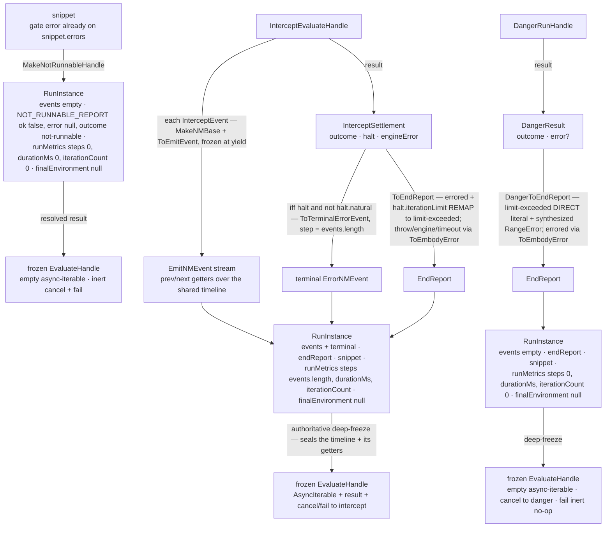

# evaluating/adapter — Architecture & Decisions

The contract: [types.ts](./types.ts). The gate-approved mapping this module is
authored from — the outcome-vocabulary table + the event mapping — lives in the
intercept evaluator's [DOCS.md § Downstream](../evaluators/intercept/DOCS.md).
The embody target types: [`../../../types.ts`](../../../types.ts)
(`EvaluateHandle`, `RunInstance`, `EndReport`, the NM-event union). The danger
backend it also normalizes:
[`../../../../lib/danger-runner/types.ts`](../../../../lib/danger-runner/types.ts).

## Architectural Sketch

> Written Phase 0, before implementation. The Refactor step is held against this
> document — not what the code does, but what shape it takes.

The adapter is the **universal normalizer**:
`(gated | ungated) × (intercept | danger) → EvaluateHandle`. It is the single,
deliberate embody→danger type seam — the ONE module that knows both backends —
so the engine, the intercept evaluator, and the danger runner all stay
backend-agnostic. Its imports are all `import type` (erased; no runtime
coupling).

### Responsibilities

- **Normalize the intercept handle** (`normalizeIntercept`) — stream each
  `InterceptEvent` as an `EmitNMEvent`, append the terminal `ErrorNMEvent`
  reconstructed from an errored throw halt, and assemble the `RunInstance`.
- **Normalize the danger handle** (`normalizeDanger`) — map the result-only
  `DangerRunHandle` onto a full `EvaluateHandle` with an empty event stream.
- **Produce the not-runnable handle** (`makeNotRunnableHandle`) — the gate
  short-circuit, engine never invoked.
- **Own the authoritative deep-freeze** of the `RunInstance` (the engine and the
  evaluator freeze only their own shallow structures).

### Data flow

Nodes are data states; edge labels name the `types.ts` seams that transform
them. Three independent lanes (the admission fork that selects one is decided a
level up — § Why): the not-runnable short-circuit, the intercept normalize, and
the danger normalize.

### Structural constraints

- **Two paths to `limit-exceeded`, both locked.** Intercept reaches it by REMAP
  (`errored` with `halt.iterationLimit === true`); danger reaches it as a DIRECT
  public literal (`DangerOutcome` already carries `'limit-exceeded'` — the
  message-match that detects it happens upstream in danger's classifier). The
  intercept limit halt carries its `EmbodyError`; the danger limit case has no
  `DangerResult.error`, so the adapter SYNTHESIZES a `RangeError` `EmbodyError`
  (the report needs `error` non-null for `limit-exceeded`).
- **Danger normalizes to a FULL `EvaluateHandle` with no event stream.** The
  async-iterable yields nothing and `RunInstance.events` is always `[]`. A
  danger throw surfaces ONLY on `EndReport.error` — there is no terminal
  `ErrorNMEvent` (danger has no per-event surface). `fail` is an inert no-op
  (mirrors embody's `noOpFail`); the adapter never fabricates a `'failed'`
  settlement.
- **The intercept terminal `ErrorNMEvent` keys off the halt, not the outcome.**
  It is appended iff `settlement.halt && !halt.natural` (a real throw). An
  engine-made `errored` (`halt === null`: worker/call/hook error, and — pending
  the engine module-path work package — a `'module'`-path compile `SyntaxError`)
  and a `timed-out` get NO event — only `EndReport.error`. So a consumer must
  NOT assume "the last event is the error": danger runs and these engine-made
  errored runs carry it only on `EndReport.error`. `steps = events.length`
  INCLUDING the appended terminal when present (oracle-faithful).
- **The not-runnable handle mirrors embody's stubs.** `makeStubEvaluateHandle` +
  `NOT_RUNNABLE_REPORT` (`ok: false`, `error: null`, `outcome: 'not-runnable'`);
  `durationMs: 0` on the `runMetrics`, never on the report (`EndReport` has no
  `durationMs`); the gate `EmbodyError` lives on `snippet.errors`, NOT on the
  report.
- **R1 — the NMEvent fields the § Downstream spec is silent on are pinned
  inert.** Every intercept-origin event carries `phase: 'evaluation'`,
  `entwined: null` (no entwinement source until `lib/parse`), and an inert
  `bindings` view that reports every name `unbound` (intercept observes no
  interior). `prev`/`next` are getters over a single-writer timeline array,
  installed at emission (so an already-frozen, already-yielded stream event
  still resolves a `next` that arrives later) and sealed by the authoritative
  deep-freeze. A "final pass that adds prev/next getters" is rejected — accessor
  properties cannot be retrofitted onto frozen stream events (precedent:
  embody's `wireSnippetBackReference`, a contained construction-window
  mutation).
- **The adapter owns the authoritative deep-freeze** of the `RunInstance`. The
  engine and the evaluator freeze only their own shallow structures.

## Why this design

### The admission fork is decided a level up, not in the normalizer

By the time a normalizer runs, a foreign handle already exists — which means the
`gated + JEJ-fail → makeNotRunnableHandle` vs. `pass/ungated → run` fork was
already resolved by the caller. The normalizer's event/outcome mapping is
identical regardless of mode. `NormalizeContext.mode` is carried for provenance
only; `snippet` (also on the context) supplies everything load-bearing. (Open
design question: whether `mode` earns a place absent an output-type sink — see §
Open questions.)

### The danger dependency is a deliberate integration seam, not a layering leak

`danger-runner` is a leaf `lib` that imports nothing; the adapter's whole
purpose is to unify the two backends onto embody's `EvaluateHandle`. The adapter
(inside `embody/`) importing danger's types (outside `embody/`, a
`study-lenses/lib` peer) is `import type` only — erased at compile, zero runtime
coupling — and is the ONE place that knows both backends. Reading it as an
upward dependency mistakes the integration point for a leak.

### The shared loop-guard is a `lib/` peer, not an adapter concern

The loop-guard splicer's home is `lib/loop-guard/` (a `lib/` peer both intercept
and danger import DOWN — danger cannot import from `embody/`). The adapter never
sees guard internals: it normalizes already-run handles, so both backends'
guard-tripped runs arrive as a settled `limit-exceeded` regardless of how the
guard was spliced. The shared contract there is the splicer's guard-call-TEXT
maker parameter; `InterceptHelperProtocol` stays intercept-private.

## Open design questions

Unresolved shape choices (none block the contract):

1. **`NormalizeContext.mode`** — keep (provenance) or reduce the context to
   `{ snippet }`? No output-type sink consumes `mode` today.
2. **Danger `durationMs` source** — `DangerResult`/`DangerRunHandle` carry no
   timing. `0` (honest unknown) vs. the adapter self-timing the `result` settle
   vs. an upstream `DangerResult.durationMs`.
3. **Emit `step` provenance** — pass `InterceptEvent.step` through verbatim
   (oracle-faithful; a dropped malformed message leaves a gap vs. array index)
   or re-index by array position. Low stakes; drops are defensive/unreachable
   for well-formed runs.
4. **Module-path terminal-event asymmetry** — a `'function'`-path compile
   `SyntaxError` is a worker-authored throw halt (→ terminal `ErrorNMEvent`),
   but the `'module'` path (the default source type) likely settles the same
   `SyntaxError` as an engine-made `worker-error` (`halt === null` → no terminal
   event). Accept the asymmetry, or have the engine module-path work surface a
   code `SyntaxError` as a throw halt for uniformity?
5. **`debuggerEnabled` effect + phase** — its documented instrumentation effect
   (skip loc wraps) would live in the instrument pass (phase 1), whose input is
   the source string only; options enter at Assemble (phase 2). Widen phase-1
   input, or relocate the effect to Assemble — pinned when `debuggerEnabled` is
   wired.

## Navigation

- [types.ts](./types.ts) — the contract (the normalizers + the internal seams).
- [`../evaluators/intercept/DOCS.md`](../evaluators/intercept/DOCS.md) — the §
  Downstream spec this mapping is authored from.
- [`../../../types.ts`](../../../types.ts) — the embody target types.
- [`../../../../lib/danger-runner/types.ts`](../../../../lib/danger-runner/types.ts)
  — the danger backend's stable `DangerResult` / `DangerRunHandle`.
