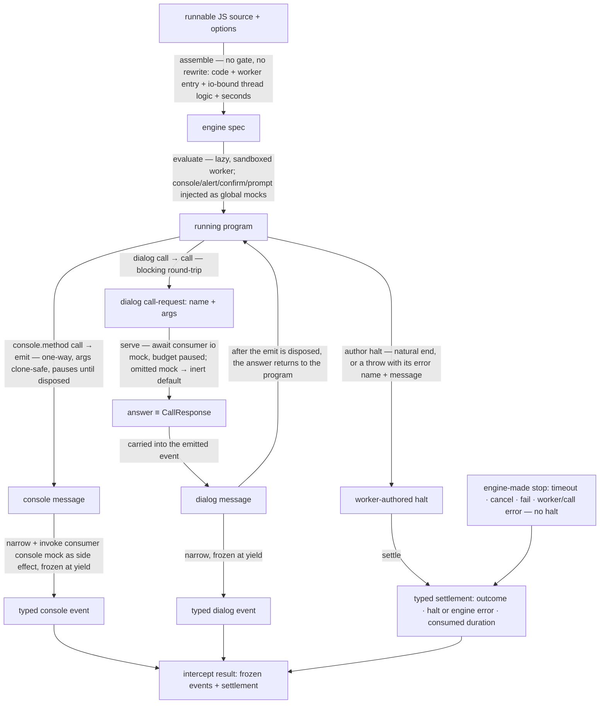

# evaluators/intercept — Architecture & Decisions

Vocabulary and the streamed-event table: [README.md](./README.md). The contract:
[types.ts](./types.ts). The engine this evaluator consumes:
[`../../../../../lib/engine/DOCS.md`](../../../../../lib/engine/DOCS.md).

## Architectural Sketch

> Written Phase 0, before implementation. The Refactor step is held against this
> document — not what the code does, but what shape it takes.

### Execution phases

1. **Assemble** (sync, pure) — build the engine spec. Input: a runnable JS
   source string (pre-admitted; this evaluator does not gate — README § Bounded
   context) plus the options (`seconds`, `io`). Output: the engine spec — the
   code verbatim (no rewrite), the thin worker entry constructed as one adjacent
   `new Worker(new URL(…), { type: 'module' })` expression, the worker logic's
   config, the io-bound thread logic, and the time budget — and a lazy handle.
   Nothing runs until the first pull or `result` access.

2. **Run and emit** (factory call sync and lazy; emission async) — the engine
   runs the program in the sandbox with the console/dialog **global mocks**
   injected as parameters. Input: the spec. Output: a stream of opaque worker
   messages (one per console call and per completed dialog) plus a
   worker-authored halt. A `console.<method>` call **emits** one-way (the
   program pauses until the thread disposes of the message, then resumes). A
   dialog **calls** first (below), then emits the completed event carrying the
   answer. The worker holds the only mutable state — the 1-indexed step counter
   stamped on each event.

3. **Serve dialogs** (per call, async) — the thread answers one dialog
   round-trip. Input: the dialog call-request (`name`, raw arguments). The
   thread picks the consumer's `io` mock for that dialog, awaits it (the program
   is blocked and its time budget paused meanwhile), and returns the answer as
   the engine's `CallResponse`. A dialog whose mock the consumer omitted returns
   the inert native default (`alert` → `undefined`, `confirm` → `false`,
   `prompt` → `null`) so a dialog-bearing program still runs to completion.
   Output: the answer.

4. **Narrow** (per message, sync) — map one opaque worker message to one typed
   streamed event, or drop a malformed one. On a `console` message the thread
   ALSO invokes the consumer's `console` mock as a synchronous side effect (the
   mapping's one impurity; a returned Promise is not awaited). A dialog message
   carries no side effect — its mock already ran in phase 3. Input: an opaque
   message. Output: a frozen typed event on the stream.

5. **Settle** (sync) — surface the run's end. Input: the engine's settlement,
   carrying either a worker-authored halt (on a worker-side stop — a natural end
   or a throw) OR an engine-made stop with no halt (a timeout, a consumer cancel
   or fail, a worker/environment failure, an unserviceable call, or a throwing
   thread hook — `hook-error`). Output: the typed settlement (outcome, the typed
   halt when present, the engine error or fail reason when the engine ended the
   run, consumed duration) carried on the result alongside every event. A throw
   settles `errored` with its halt; the evaluator never wraps the program in its
   own `try/catch`.

### Data flow

### Structural constraints

- **No gate, no instrumentation.** The evaluator assumes a pre-admitted runnable
  string; it never parses, validates, or rewrites the code. A non-JEJ or
  unparseable string is the adapter's to reject (as _not-runnable_) before this
  evaluator is called; if one reached the evaluator anyway it would run in the
  sandbox and settle `errored` (a construction `SyntaxError`), never crash the
  host.
- **The engine owns the `try/catch`; the evaluator never wraps the program.**
  Wrapping the program to catch a throw and emit an error event would mask the
  throw as a natural completion (the engine would settle `completed`, not
  `errored`). The terminal throw is authored as the halt (phase 5) and the
  adapter reconstructs the terminal `ErrorNMEvent` from it downstream.
- **Dialog is call-then-emit, order-critical.** The answer must be obtained (the
  `call`) before the event that records it is emitted; the engine guarantees a
  call round-trip completes before the worker proceeds, so the emit always
  carries the answered `returnValue`. The two are distinct worker operations and
  are never collapsed.
- **`console` emit is one-way; its consumer mock is a synchronous side effect.**
  The engine's `onMessage` hook is synchronous, so an async `console` mock runs
  but is not awaited before the program resumes. Only dialog mocks (the async
  `onCall` hook) are awaited. The panel's `console` mock is synchronous, so this
  is transparent to it.
- **The worker holds the only mutable state; the thread is a mapping.** The step
  counter lives worker-side (one declared mutable module); the thread logic is a
  stateless narrowing whose one impurity is invoking the `console` mock — so it
  is trivially correct and Node-testable through the engine's fake transport.
- **The thread logic is built per run and is not reusable.** It closes over the
  consumer's `io` (the io-bound factory), so — unlike a tracer's
  frozen-singleton thread logic — a thread-logic instance is neither shareable
  nor reusable across runs. A future consumer must build one per run, never
  cache it.
- **Console output reaches the consumer only through the engine's drain.** The
  panel awaits `result` and never iterates the stream, so the engine's on-behalf
  drain is the sole thing that pulls each console emit, and `onMessage` firing
  the `console` mock runs _during that drain_. The browser fidelity test MUST
  assert console side effects fire on a result-only (consumer-undrained) run — a
  drain that settled without invoking the hook would silently swallow all
  console output (the worst failure class, no error surfaced).
- **A stop while a dialog `onCall` is in flight is engine-owned.** The engine
  awaits the in-flight hook, DISCARDS the answer (no write-back), and tears down
  (engine DOCS § Stops block). The evaluator adds no cancel handling; but the
  _consumer_ must resolve a pending dialog mock on cancel, or the paused worker
  (and its paused time budget) never unblocks and teardown hangs — a liveness
  contract the panel already honors (`handleCancel` resolves the pending answer,
  then cancels).
- **Determinism.** Step numbers are assigned worker-side in emission order, so
  the event stream is a pure function of the source and the answers supplied.
- **Clone-safe args pass.** Every emitted argument survives a structured clone;
  an argument the boundary cannot clone (a function, a symbol) rides as its
  `String(…)` form, so an emit never crashes the run.
- **Sandbox torn down on every path** (the engine's guarantee — cancel, fail,
  timeout, natural end, and throw all tear the worker down).

### Out of scope

The full boundary is enumerated in [README.md § Bounded context](./README.md);
the boundaries that are **structural constraints on this sketch** specifically:

- **The JEJ admission gate and the _not-runnable_ shape live in the adapter**,
  not this evaluator (§ Why — the gate lives in the adapter). This evaluator
  assumes a pre-admitted runnable string.
- **No instrumentation**, so no `nodePath`, no `loc`, and no
  `creation`/`execution` error phase are authored here (the engine collapses
  construction and execution into one `throw`).
- **The iteration limit is deferred.** The engine owns only the time budget;
  `iterations` is not enforced and `limit-exceeded` is unreachable until a
  follow-up (README § Bounded context).
- **Sloppy-mode / `scriptMode` is not reproduced.** The oracle toggled a
  `"use strict"` prefix for script-type snippets; this evaluator runs under the
  engine's strict-mode default (`EvaluateSpec.strict` defaults true). Admissible
  JEJ is always strict-safe (the only sloppy construct, `with`, fails the JEJ
  gate), so there is no `strict` option here; the `script` snippet posture is
  the adapter/embody's concern.

### Downstream: the embody adapter (out of scope here; specified for the gate)

The adapter maps this evaluator's foreign handle onto embody's `EvaluateHandle`
(`AnyNMEvent` stream + `RunInstance` result). It is a separate concern (its
module home is a human-gate decision — the evaluator stays embody-agnostic). Its
mapping:

- **Streamed events → `EmitNMEvent`.** `console` →
  `{ category:'emit', kind:'console', method, args, entwined:null, loc:null }`;
  `alert` → `{ category:'emit', kind:'alert', args, entwined:null, loc:null }`
  (no `returnValue` — `alert` yields `undefined`, which
  `EmitNMEvent.returnValue?` represents as absent); `confirm`/`prompt` →
  `{ category:'emit', kind, args, returnValue, entwined:null, loc:null }`.
  `entwined`/`loc` are `null` (no instrumentation supplies them).
- **Terminal halt → terminal `ErrorNMEvent` + `EmbodyError`.** An `errored` halt
  becomes the run's last event
  `{ category:'error', kind:<classified from errorName>, errorName, message, entwined:null }`
  and the `EndReport.error`. This reconstructs the oracle's "error is an event
  in the array" at the `RunInstance.events` level without the evaluator
  streaming it.
- **Outcome vocabulary** (the load-bearing table):

  | evaluator outcome                         | embody `EndReport.outcome` | `ok`  | `error`                       |
  | ----------------------------------------- | -------------------------- | ----- | ----------------------------- |
  | completed                                 | completed                  | true  | null                          |
  | errored (worker throw halt)               | errored                    | false | EmbodyError from halt         |
  | errored (engine worker/call/hook error)   | errored                    | false | EmbodyError from engine error |
  | timed-out                                 | timed-out                  | false | EmbodyError (timeout)         |
  | cancelled                                 | cancelled                  | false | null                          |
  | failed                                    | failed                     | false | null (+ failReason)           |
  | _(adapter gate short-circuit, no engine)_ | not-runnable               | false | null                          |
  | _(deferred: iteration-limit refinement)_  | limit-exceeded             | false | EmbodyError                   |

- **`RunMetrics`.** `durationMs` from the settlement; `iterationCount` 0 (no
  instrumentation); `steps` = `events.length` (or 0) — deferred to the adapter
  DDD to close.
- **`ok` iff `completed`; `RunInstance` deep-freeze** is the adapter's
  authoritative deep pass (the engine and this evaluator freeze only their own
  shallow structures).

## Why this design

### An evaluator, not a tracer — no instrumentation, only global mocks

Intercept observes the program at its **host boundary** — what it prints and
which dialogs it opens — not its interior. A worker has no native
`console`/`alert`/ `confirm`/`prompt`, so replacing those globals with mocks IS
the whole mechanism: no AST rewrite, no per-call wrap, no node-path stamping.
This is the axis that makes it a peer of, but categorically distinct from, a
tracer (which rewrites the program to surface interior lifecycle moments). It is
why the module lives under `evaluators/`, not `tracers/`, and why events carry
no `nodePath`.

### The gate lives in the adapter because `intercept()` may not throw

The variables tracer self-gates and throws on inadmissible input because its
consumer is permitted to throw. The embody `intercept()` member must return a
handle and never throw (canned scenarios and non-JEJ input both return a
handle), so the not-runnable-without-throw decision belongs where the
not-runnable shape is produced — the adapter. Keeping the evaluator gate-free
avoids a redundant double-parse and keeps it a pure code-runner.

### Call-then-emit, not one message, for dialogs

A dialog is two facts: the consumer's answer and the record that it happened.
The answer must reach the program synchronously (the program's control flow
depends on `confirm`/`prompt` return values), which is what the engine's
blocking `call` provides; the record must carry that answer, which is what the
following `emit` provides. Collapsing them would either lose the answer from the
record or block the emit channel on a round-trip it does not need.

### Inert dialog defaults, so a partial io still runs

A dialog whose mock the consumer omitted returns the native default rather than
a call-error, so a program that calls `confirm` runs to completion under an `io`
that only mocked `prompt`. This mirrors the oracle's resolved-io defaults and
the variables tracer's inert dialog stubs; the difference here is that a
supplied mock is _live_ (the consumer answers), where the variables tracer's
stubs are always inert (dialogs are not a variable-lifecycle event).

## Navigation

- [README.md](./README.md) — what this evaluator is, the vocabulary, the bounded
  context.
- [types.ts](./types.ts) — the contract and the two cross-increment seams.
- [`../../../../../lib/engine/README.md`](../../../../../lib/engine/README.md) —
  the engine: the two-sided contract this evaluator's worker and thread logic
  are authored against.
- [`../../tracers/variables/DOCS.md`](../../tracers/variables/DOCS.md) — the
  structural template (a sibling tier that composes the engine).
