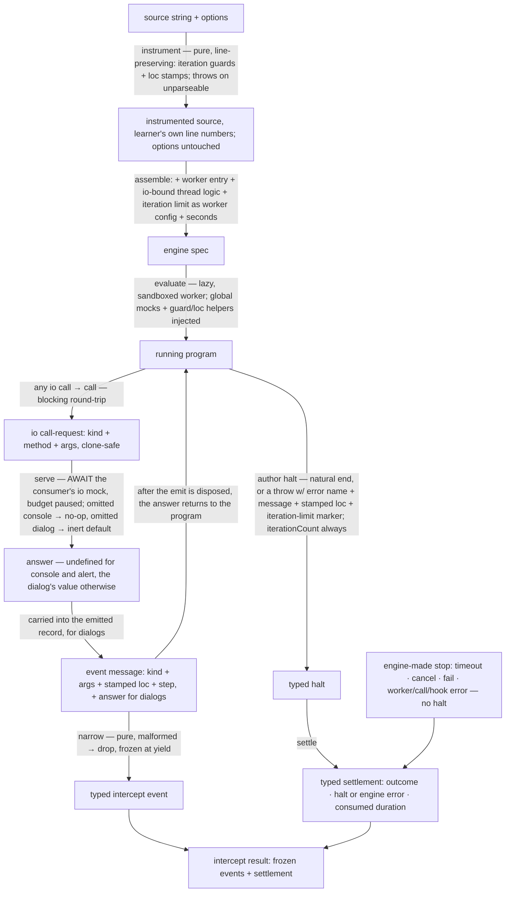

# evaluators/intercept — Architecture & Decisions

Vocabulary and the streamed-event table: [README.md](./README.md). The contract:
[types.ts](./types.ts). The engine this evaluator consumes:
[`../../../../../lib/engine/DOCS.md`](../../../../../lib/engine/DOCS.md).

## Architectural Sketch

> Written Phase 0, before implementation. The Refactor step is held against this
> document — not what the code does, but what shape it takes.

### Execution phases

1. **Instrument** (sync, pure; throws the named boundary error on unparseable
   input — reachable only through misuse, the adapter pre-gates) — the
   evaluator's single line-preserving splice pass. Input: the source string.
   Output: instrumented source with (a) an iteration-guard call — carrying the
   loop's own stamped span — at the top of each guarded loop's braced body plus
   a counter reset after the loop (the guarded set is the oracle's: `while` /
   classic `for` / `do-while` / `for-of` with a braced body; `for-in` and
   brace-less bodies are not guarded), and (b) a same-line loc wrap around each
   `CallExpression` — the oracle's exact node set (`NewExpression` unwrapped) —
   stamping the call's original start/end line:column. No splice inserts or
   removes a newline — the instrumented source has the learner's own line
   numbers. The pass observes nothing.

2. **Assemble** (sync, pure) — build the engine spec. Input: the instrumented
   source plus the options (`seconds`, `iterations`, `io`). Output: the engine
   spec — the instrumented code, the thin worker entry constructed as one
   adjacent `new Worker(new URL(…), { type: 'module' })` expression, the
   iteration limit as the clone-safe worker config, the io-bound thread logic,
   and the time budget — and a lazy handle. Nothing runs until the first pull or
   `result` access.

3. **Run** (factory call sync and lazy; emission async) — the engine runs the
   program in the sandbox with the console/dialog **global mocks** and the two
   instrumentation helpers injected as parameters. Input: the spec. Output: one
   **io round-trip** per trapped call (call-then-emit, below) plus a
   worker-authored halt. The worker holds the only mutable state — the 1-indexed
   step counter, the current-loc stack, and the iteration counters.

4. **Serve io calls** (per call, async) — the thread answers one io round-trip.
   Input: the io call-request (`name`, console `method`, raw arguments). The
   thread picks the consumer's io mock and **awaits it** — every mock, console
   included — while the program is blocked and its time budget paused; it
   returns the answer (`undefined` for console and alert; the dialog's value
   otherwise). An omitted console mock is a no-op; an omitted dialog mock
   returns the inert native default (`alert` → `undefined`, `confirm` → `false`,
   `prompt` → `null`) so a dialog-bearing program still runs to completion.
   Output: the answer. (The worker's emit of the record — carrying the answer,
   for dialogs — and the resume ordering are the round-trip's worker half; the
   call-then-emit constraint below owns that ordering.)

5. **Narrow** (per message, sync, pure) — map one opaque worker message to one
   typed streamed event, or drop a malformed one. No side effects: the
   consumer's mocks already ran during the call half (phase 4). Input: an opaque
   message. Output: a frozen typed event on the stream.

6. **Settle** (sync) — surface the run's end. Input: the engine's settlement,
   carrying either a worker-authored halt (on a worker-side stop — a natural end
   or a throw, including the iteration guard's marked throw) OR an engine-made
   stop with no halt (a timeout, a consumer cancel or fail, a worker/environment
   failure, an unserviceable call, or a throwing thread hook — `hook-error`).
   Output: the typed settlement (outcome; the typed halt with its
   `errorName`/`message`/stamped `loc`/`iterationLimit` marker/ `iterationCount`
   when present; the engine error or fail reason when the engine ended the run;
   consumed duration) carried on the result alongside every event. A throw
   settles `errored` with its halt; the evaluator never wraps the program in its
   own `try/catch`.

### Data flow

### Structural constraints

- **The instrumenter is pure and line-preserving.** One parse, string splices
  only, zero line shift — every stamped loc and every engine-reported line is
  the learner's own. It plants exactly two things (guards, loc wraps) and
  observes nothing. Its throw on unparseable input is the evaluator's only
  boundary throw.
- **No JEJ gate.** The evaluator assumes a pre-admitted runnable string; JEJ
  admission and the embody _not-runnable_ short-circuit live in the adapter. If
  a non-JEJ program reached the evaluator anyway it would either throw at the
  instrumenter's parse (misuse) or run in the sandbox and settle `errored` —
  never crash the host.
- **The engine owns the `try/catch`; the evaluator never wraps the program.**
  Wrapping the program to catch a throw and emit an error event would mask the
  throw as a natural completion (the engine would settle `completed`, not
  `errored`). The terminal throw is authored as the halt (phase 6) and the
  adapter reconstructs the terminal `ErrorNMEvent` from it downstream.
- **Every io round-trip is call-then-emit, order-critical.** The consumer's mock
  is awaited (the call) before the event that records it is emitted; the engine
  guarantees a call round-trip completes before the worker proceeds, so the emit
  always carries the answered `returnValue` and the program never advances past
  an io moment before its mock has settled. The two are distinct worker
  operations and are never collapsed. (Cost accepted: two round-trips per io
  call where the oracle used one — the oracle awaited the console mock inside
  its emit-pause window, a window the generic engine's synchronous message hook
  cannot hold open. Trivial at learner scale.) **At most one io round-trip is
  ever in flight**: the single worker thread is blocked for the round-trip's
  whole span, so a consumer mock is never invoked concurrently and can never be
  re-entered — the guarantee the panel's single-pending resolver rests on.
- **Every io mock is awaited; the message hook is pure.** All mock invocation
  lives in the thread's call hook (async, awaited, budget paused). The message
  hook is a pure narrowing — no side effects, no io. **A throwing (or rejecting)
  mock is an engine-made `call-error` stop** — the run ends `errored`, with no
  halt and no event for the failing call. Deliberate deviation from the oracle,
  which surfaced a terminal in-stream InternalError event instead; consumer
  mocks should not throw.
- **The thread logic is built per run and is not reusable.** It closes over the
  consumer's `io` (the io-bound factory), so — unlike a tracer's
  frozen-singleton thread logic — a thread-logic instance is neither shareable
  nor reusable across runs. A future consumer must build one per run, never
  cache it.
- **The drain is liveness for result-only consumers.** The panel awaits `result`
  and never iterates the stream; the record emits still pause the worker until
  disposed, and it is the engine's on-behalf drain that disposes them. Mock
  invocation does NOT depend on the drain (it rides the call channel), but
  forward progress does. The browser fidelity test MUST cover a result-only run
  end-to-end: mocks fire, the run completes, `result` settles.
- **A stop while an io mock is in flight is engine-owned; resolving the mock is
  the consumer's liveness duty.** The engine awaits the in-flight call hook,
  DISCARDS the answer (no write-back), and tears down (engine DOCS § Stops
  block). The evaluator adds no cancel handling; but a consumer holding a
  pending mock (a dialog awaiting an answer, an animation mid-flight) must
  resolve it on cancel, or the paused worker (and its paused time budget) never
  unblocks and teardown hangs — a contract the panel's `handleCancel` already
  honors (resolve the pending answer, then cancel).
- **The iteration guard enforces; the halt author classifies.** Guard counters
  live worker-side. The **limit is checked against the per-loop-entry counter**
  (reset after the loop exits, so re-entering starts fresh — oracle semantics:
  per entry, never a run total); the separate never-reset run-total
  `iterationCount` rides EVERY halt (natural ends included). The limit throw
  carries a structured marker the halt author recognizes — classification never
  string-matches a name or message — and arrives pre-stamped with the LOOP's own
  span, so a limit halt is always loc-attributed. Classification lives in the
  halt author (worker-side); the engine's thread-side `refineError` channel is
  intentionally unused. No configured limit → count, never throw.
- **Loc is stamped statically, read dynamically.** The instrumenter stamps each
  `CallExpression`'s original span (and each guarded loop's span onto its
  guard); the worker keeps a current-loc stack (wrap enter/exit, restored in
  `finally`); io mocks read the top at fire time; a throw propagating through a
  wrap is loc-stamped once for halt attribution. An unwrapped throw (a
  statement-level throw outside any wrapped call) carries `loc: null` — the
  oracle's residual `Error.stack` fallback is a named cut. No AST index, no
  lookup.
- **The worker holds the only mutable state; the thread is a mapping.** Step
  counter, loc stack, and iteration counters live worker-side (one declared
  mutable module); the thread logic is an awaiting call-server plus a pure
  narrowing — Node-testable through the engine's fake transport.
- **Determinism.** Step numbers are assigned worker-side in emission order and
  locs are stamped statically, so the event stream is a pure function of the
  source and the answers supplied.
- **Clone-safe args pass.** Every argument crossing the boundary survives a
  structured clone; an argument the boundary cannot clone (a function, a symbol)
  rides as its `String(…)` form, so a round-trip never crashes the run.
- **Sandbox torn down on every path** (the engine's guarantee — cancel, fail,
  timeout, natural end, and throw all tear the worker down).

### Out of scope

The full boundary is enumerated in [README.md § Bounded context](./README.md);
the boundaries that are **structural constraints on this sketch** specifically:

- **The JEJ admission gate and the _not-runnable_ shape live in the adapter**,
  not this evaluator (§ Why — the gate lives in the adapter).
- **No interior observation.** No variable/scope/expression/control-flow events,
  no nodePath, no AST location index; `entwined` on the corresponding embody
  events stays `null` until `lib/parse` supplies real entwinement. The two
  splices (guards, loc stamps) enforce and attribute; they observe nothing.
- **No event linking, replay, AST record, or `visitCounts`** (no milestone
  consumer; not required by the embody contract).
- **Sloppy-mode / `scriptMode` is not reproduced.** The oracle toggled a
  `"use strict"` prefix for script-type snippets; this evaluator runs under the
  engine's strict-mode default (`EvaluateSpec.strict` defaults true). Admissible
  JEJ is always strict-safe (the only sloppy construct, `with`, fails the JEJ
  gate), so there is no `strict` option here; the `script` snippet posture is
  the adapter/embody's concern.

### Downstream: the embody adapter (out of scope here; specified for the gate)

The adapter maps this evaluator's foreign handle onto embody's `EvaluateHandle`
(`AnyNMEvent` stream + `RunInstance` result). It is a separate concern (module
home: `evaluating/adapter/`, per the campaign plan — the evaluator stays
embody-agnostic). Its mapping:

- **Streamed events → `EmitNMEvent`.** `console` →
  `{ category:'emit', kind:'console', method, args, loc, entwined:null }`;
  `alert` → `{ category:'emit', kind:'alert', args, loc, entwined:null }` (no
  `returnValue` — `alert` yields `undefined`, which `EmitNMEvent.returnValue?`
  represents as absent); `confirm`/`prompt` →
  `{ category:'emit', kind, args, returnValue, loc, entwined:null }`. `loc`
  passes through from the stamped event; `entwined` is `null` (no entwinement
  source until lib/parse).
- **Terminal halt → terminal `ErrorNMEvent` + `EmbodyError`.** An `errored` halt
  becomes the run's last event
  `{ category:'error', kind:<classified from errorName>, errorName, message, loc, entwined:null }`
  and the `EndReport.error`. This reconstructs the oracle's "error is an event
  in the array" at the `RunInstance.events` level without the evaluator
  streaming it.
- **Outcome vocabulary** (the load-bearing table):

  | evaluator outcome                         | embody `EndReport.outcome` | `ok`  | `error`                       |
  | ----------------------------------------- | -------------------------- | ----- | ----------------------------- |
  | completed                                 | completed                  | true  | null                          |
  | errored (halt, `iterationLimit: false`)   | errored                    | false | EmbodyError from halt         |
  | errored (halt, `iterationLimit: true`)    | limit-exceeded             | false | EmbodyError from halt         |
  | errored (engine worker/call/hook error)   | errored                    | false | EmbodyError from engine error |
  | timed-out                                 | timed-out                  | false | EmbodyError (timeout)         |
  | cancelled                                 | cancelled                  | false | null                          |
  | failed                                    | failed                     | false | null (+ failReason)           |
  | _(adapter gate short-circuit, no engine)_ | not-runnable               | false | null                          |

- **`RunMetrics`.** `durationMs` from the settlement; `iterationCount` from the
  halt (0 when no halt — engine-made stops kill the worker before it can author
  one); `steps` = `RunInstance.events.length` — the embody-visible array,
  INCLUDING the appended terminal `ErrorNMEvent` (oracle-faithful: the old
  engine stamped step numbers on error events too).
- **`ok` iff `completed`; `RunInstance` deep-freeze** is the adapter's
  authoritative deep pass (the engine and this evaluator freeze only their own
  shallow structures).

## Why this design

### An evaluator, not a tracer — the axis is what is observed

Intercept observes the program at its **host boundary** — what it prints and
which dialogs it opens — not its interior. A worker has no native
`console`/`alert`/`confirm`/`prompt`, so replacing those globals with mocks IS
the observation mechanism. Its two splices don't change that: the iteration
guard _enforces_ a limit and the loc wrap _attributes_ boundary events to source
— neither surfaces anything about variables, scopes, or expression values. A
tracer's instrumentation exists to observe the interior; an evaluator's splices
exist so the boundary events are trustworthy (attributed, bounded). That is why
the module lives under `evaluators/`, not `tracers/`.

### Every io mock is awaited — call-then-emit for all four kinds

Three reasons converge. (1) **Contract**: embody's `IoMocks` pins "every mock is
awaited by the engine — learner code holds until the callback settles." (2)
**Fidelity**: the oracle awaited console mocks before releasing the worker. (3)
**Pedagogy**: the await is what lets a quiz pause a program at a `console.log`
or an animation play out per emit — reactive consumers ride the mock, not the
stream. The generic engine's message hook is synchronous (its emit-pause
releases on disposal, not on a hook await), so the only channel that can hold
the program across an await is the call channel — hence every io call rides
**call-then-emit**: call (mock awaited, budget paused) → emit (the record) →
resume. The alternative — changing the engine's message hook to await returned
promises — would complicate the committed engine's drop-vs-yield semantics and
pause protocol for every consumer; routing through the existing async call
channel costs one extra round-trip per io call and changes nothing else.

### The gate lives in the adapter because `intercept()` may not throw

The variables tracer self-gates and throws on inadmissible input because its
consumer is permitted to throw. The embody `intercept()` member must return a
handle and never throw (canned scenarios and non-JEJ input both return a
handle), so the not-runnable-without-throw decision belongs where the
not-runnable shape is produced — the adapter. The evaluator parses only to
splice; admission is one layer up.

### Light instrumentation, re-authored from two oracles

The iteration guard re-authors `shared/guard-loops` (zero-line-shift body
injection, counter resets after the loop) and the loc wrap re-authors
`wrap-call-expressions` (same-line call wrap), both against the
variables-instrumenter's acorn + string-splicing pattern — no recast, no imports
from the excluded old dirs. The one deliberate change of payload: the wrap
stamps **line:column spans directly instead of nodePaths**, which deletes the
oracle's entire AST-linking layer (location index, `ASTNode` graph,
enclosing-fallback lookup) while giving the embody events the `loc` they can
actually carry today. The helpers ride the engine's injected-globals channel, so
learner code cannot shadow them.

### Inert dialog defaults, so a partial io still runs

A dialog whose mock the consumer omitted returns the native default rather than
a call-error, so a program that calls `confirm` runs to completion under an `io`
that only mocked `prompt`. This mirrors the oracle's resolved-io defaults and
the variables tracer's inert dialog stubs; the difference here is that a
supplied mock is _live_ (the consumer answers), where the variables tracer's
stubs are always inert (dialogs are not a variable-lifecycle event). An omitted
console mock is a no-op — the round-trip still happens, so the stream record and
the pause discipline are identical with or without a mock.

## Navigation

- [README.md](./README.md) — what this evaluator is, the vocabulary, the bounded
  context.
- [types.ts](./types.ts) — the contract and the four cross-increment seams.
- [`../../../../../lib/engine/README.md`](../../../../../lib/engine/README.md) —
  the engine: the two-sided contract this evaluator's worker and thread logic
  are authored against.
- [`../../tracers/variables/DOCS.md`](../../tracers/variables/DOCS.md) — the
  structural template (a sibling tier that composes the engine).
