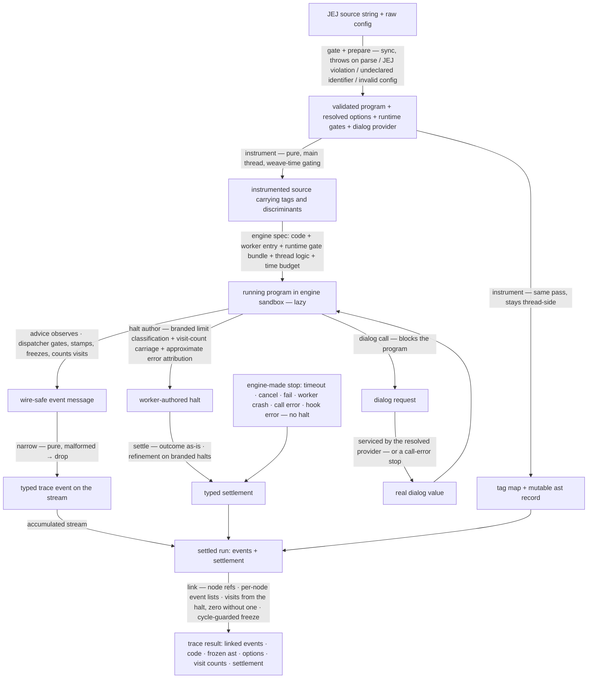

# evaluating/trace/semantics — Architecture & Decisions

Vocabulary and the event-category table: [README.md](./README.md). The public
contract: [types.ts](./types.ts). The engine this tracer consumes:
[`../../../../../lib/engine/DOCS.md`](../../../../../lib/engine/DOCS.md). The
instrumentation pipeline's own architecture:
[`tracing/DOCS.md`](./tracing/DOCS.md).

## Architectural Sketch

> Written Phase 0, before implementation. The Refactor step is held against this
> document — not what the code does, but what shape it takes.

### Execution phases

1. **Gate** (sync, throws) — the admission boundary. Input: a raw source string.
   Output: a validated program, or a typed boundary throw naming its reason
   (parse failure, JEJ violation — `with` included — or an undeclared
   identifier, named). A gated program never reaches instrumentation. This is
   the only phase that throws; everything downstream degrades into a settlement.

2. **Prepare** (sync, throws — part of the gate boundary) — config resolution.
   Input: the raw user config. Output: fully resolved options (no optional layer
   left unexpanded), the source range, the iteration cap, the time budget, and
   the dialog provider — via shorthand expansion, default filling, schema
   validation, and cross-field checks.

3. **Instrument** (sync, pure) — the Aran weave, on the main thread. Input: the
   validated program + resolved options. Output: the instrumented source string
   (carrying the weave-time decisions: which advice calls exist at all, each
   with its tag and discriminants), the tag map, and the mutable ast record
   (every node keyed by path, events empty, visits zero). Layer gating is
   decided here — a disabled gate means no advice call is woven, so disabled
   layers cost nothing at runtime.

4. **Run and emit** (factory call sync and lazy; emission async) — assemble the
   engine spec (instrumented source + thin worker entry + the runtime gate
   bundle as worker config + worker/thread logic + time budget) and hand it to
   the engine factory, returning a lazy handle; nothing runs until the first
   pull. (The entry also forwards the engine's test-only transport seam,
   sibling-style — invisible to the public signature; the Node suites run on the
   engine's fake transport through it.) Worker-side, the advice observes each
   moment, builds the event, and hands it to the dispatcher, which applies the
   runtime gates (range window, name filters), stamps the wire-safe base fields
   and the step, freezes the event, accumulates visit counts, and emits. Dialog
   calls block the worker on the engine's call channel until the thread's
   provider answers with the real value. The loop cap throws the branded limit
   error; the halt author classifies it structurally and carries the visit
   counts on every worker-side stop, natural end included.

5. **Narrow** (per message, pure) — the thread maps one opaque worker message to
   one typed trace event, or drops a malformed one. Stateless; the worker
   authored the complete event.

6. **Settle** (sync) — surface the run's end: the engine's outcome as-is, the
   typed halt when the worker stopped on its own, the iteration-limit refinement
   when the halt carries the brand, the engine error or fail reason when the
   engine or consumer ended the run, and the consumed duration.

7. **Link** (sync, after any settlement) — attach each event's node reference,
   back-fill each node's event list, mirror the halt's visit counts onto the
   nodes (zero when no halt), and deep-freeze the ast record (cycle-guarded).
   Output: the trace result — linked events, source echo, frozen ast, options
   snapshot, visit counts, settlement.

### Data flow

### Structural constraints

- **The gate is the only throwing boundary.** Parse failure, JEJ violation,
  undeclared identifier, and invalid config all throw synchronously, typed,
  before any engine work. Everything after a successful gate degrades into a
  settlement — never an exception.
- **Instrument is pure and range-independent.** Same program + same options →
  same instrumented source. The runtime-checked gates (range window, name
  filters, iteration cap) ride the worker config, never the woven code — a
  highlight change never re-instruments.
- **Weave-time gating is total for layer gates.** A disabled gate produces no
  advice call at all (no runtime check, no invocation). The runtime gate bundle
  carries exactly three things: the range window and the name filters (checked
  by the dispatcher — names and positions may be runtime-known) and the
  iteration cap (checked by the loop-guard advice). TDZ tracking is run STATE
  shaping event construction (declare / initialize / available), not a gate.
- **Gating is worker-side, always.** Every emission costs a full engine pause
  round-trip even when dropped; nothing may be gated in the thread's narrow
  phase. The narrow phase drops only malformed messages.
- **Events are wire-safe until linking.** No event field references the ast; the
  node reference exists only on the linked result. The dispatcher stamps every
  base field so the thread stays stateless.
- **The worker holds the only mutable RUN state; per-message thread processing
  is pure.** Scope stack, counters, provenance ids, visit counts live
  worker-side; the thread narrows, services dialogs, and refines. The single
  thread-side mutation is the one post-settlement linking pass over the
  (deliberately still-mutable) ast record.
- **Limit classification is structural.** The loop cap throws a branded error;
  the halt author recognizes the brand; the refinement types it. Message text is
  never matched, so a learner-thrown error can never be misclassified as an
  instrumentation limit.
- **Dialog values are real or the run fails.** The provider answers with the
  real value; with no provider in reach, the run settles as a call error. A
  fabricated dialog value never enters the data layer.
- **Linking runs exactly once, after any settlement.** It is not idempotent
  (per-node event lists would double); the single call site is the entry's
  result assembly. Visit counts default to zero when the run ended without a
  halt.
- **The error channel never replaces the halt.** The error event is emitted
  (config-gated) and the error re-thrown, so the settlement still carries the
  halt with the same approximate attribution. Disabling the channel suppresses
  the event, never the halt.

### Out of scope

- The sandbox: worker lifecycle, transport, pause protocol, time budget,
  cancellation, settlement classification — all engine-owned.
- The embody adapter mapping, the not-runnable short-circuit, and all lens /
  rendering concerns.
- Console interception (native pass-through; intercept/embody territory).
- Caching of instrumented output or results (caller's concern).
- Precise error attribution (the error location is approximate — a named
  deferred concern).
- Async dialog providers (custom modal UIs). The engine's call hook supports
  promises, but the fake transport every Node suite runs on is sync-only —
  widened signatures arrive when a consumer needs them, with real-transport
  tests.
- `with`, labels-as-gate-concern, user-defined functions: `with` and non-JEJ
  constructs die at the gate; labeled break/continue is traced (the jump event
  carries the label) since the weave handles it faithfully.

## Why this design

### An engine consumer, not a sandbox owner

The former architecture owned its transport: a hand-rolled worker, a
shared-memory pause protocol borrowed from a sibling, a bespoke message pump,
timeout heuristics, and string-matched limit classification. All of that is the
engine's job, done once and conformance-tested. What remains here is exactly the
domain: instrumentation, gating, event vocabulary, non-time limits, dialog
semantics, linking. The worker logic registers the advice on the worker's global
scope (the engine's documented channel for lookup-resolved instrumentation),
wires the dispatcher's emission to the engine's emit, and authors the halt; the
thread logic narrows, services dialogs, and refines.

### The gate rejects undeclared identifiers — stricter than JavaScript

Real JS throws ReferenceError only when the undeclared read executes. This gate
rejects the program statically, naming the identifier. Two forces make the
stricter boundary right here: the woven runtime does not faithfully reproduce
the ReferenceError (an undeclared read resolves through the instrumentation and
coerces into a fabricated value — observed: `"5() => boom"` — which a data
tracer must never present), and a gate rejection that names the identifier
before anything runs explains a typo better than a mid-trace error. The cost —
rejecting a program whose undeclared read sits in a never-taken branch — is a
deliberate, documented deviation suited to JEJ's teaching context.

### `with` is gone

Supporting `with` forked the instrumentation into a second sloppy-mode
configuration, selected by a fragile source regex, and required the engine's
strict prefix to be disabled. The sibling variables tracer never forked; two
siblings with opposite `with` policies is exactly the inconsistency reviews
exist to catch. The gate now rejects `with` with everything else non-JEJ, and
the program always runs strict.

### Runtime gates ride the worker config

The weave must code-generate what advice receives (tags, discriminants, initial
state — an Aran constraint). Nothing forces the runtime-checked gates into the
code, and baking them in would couple the instrumented output to the range
window — making the primary range use case (trace a highlight) a full
re-instrument per highlight change. The sibling delivers its static table
through the worker config; this tracer delivers its runtime gates the same way.

### The settlement mirrors the engine; the iteration limit is a refinement

The engine's five outcomes surface as-is — the sibling set this convention, and
the old four-value remap lost `cancelled` and `failed` while promoting one
instrumentation concern (the iteration limit) into an outcome. The limit is not
how the run ended (the run errored); it is what the error was — a refinement on
the errored settlement, classified from the brand the halt author preserved.

### Dual-perspective emission and the resolve baseline

One assignment fires the operator view, the variable-lifecycle view, and the
data view, sharing one node path — a consumer focused on operators gets the full
picture, one focused on variables gets theirs, and the value itself lives in
exactly one place: the resolve event. Provenance ids live only on resolve
events; the data-flow graph is reconstructable from the resolve stream alone.
Visit counts increment once per logical evaluation (an increment expression is
one visit, not its three desugared sub-events), so they mean what a learner sees
on the page.

### Always linked

The ast record and every streamed event live thread-side by the time any
settlement arrives, so linking is unconditional — a cancelled or timed-out run
still returns navigable, linked events. What an engine-made stop cannot deliver
is the worker's metrics (visit counts ride the halt), so those default to zero —
absence of evidence, stated as such.

## Test taxonomy

Seven tiers; each catches what no other tier catches. Locations and the file
inventory: [`tests/README.md`](./tests/README.md) and
[`tracing/tests/README.md`](./tracing/tests/README.md).

| Tier | Scope                                                                                   | Catches                                            |
| ---- | --------------------------------------------------------------------------------------- | -------------------------------------------------- |
| T1   | one unit (advice, generator, pointcut, prepare stage), co-located                       | internal logic bugs in one layer                   |
| T2   | consumer conformance: worker/thread logic against the engine's fake AND real transports | seam drift between this tracer and the engine      |
| T3   | two adjacent layers, others mocked                                                      | seam bugs (advice → dispatcher, pointcut → advice) |
| T4   | one named config profile, full pipeline, fake transport                                 | config-gate regressions                            |
| T5   | every emitted event validates against its variant contract                              | event-shape drift (incl. per-variant `semantics`)  |
| T6   | equivalent configs (shorthand vs explicit) produce identical streams                    | subtle gating drift                                |
| T7   | end-to-end through `traceSemantics` + real worker, per-settlement                       | transport-fidelity bugs no fake catches            |

A green fake-transport run proves logic, never transport fidelity — T7's
real-worker matrix (one case per transport-distinct settlement: completed,
errored with attribution, cancelled mid-stream, timed-out, iteration-limit
refinement, dialog round-trip) is the fidelity evidence, per the engine's own
conformance doctrine.
