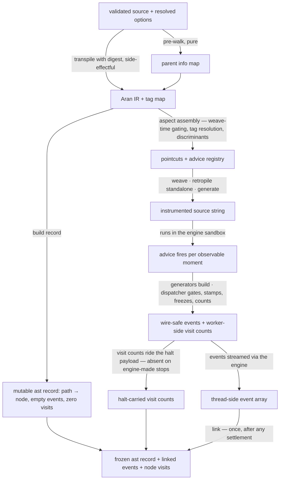

# tracing — Architecture

The instrumentation pipeline: validated source in, instrumented source + tag
map + mutable ast record out, plus the worker-side machinery (advice,
dispatcher, event generators, value representation) that the woven code drives
at runtime and the linking pass that assembles the final result. The sandbox
itself — worker lifecycle, transport, time budget — is the engine's
([`../../../../../../lib/engine/DOCS.md`](../../../../../../lib/engine/DOCS.md));
the enclosing tracer's phase map is
[`../DOCS.md § Execution phases`](../DOCS.md).

## Architectural Sketch

### Execution phases

1. **Pre-walk** (sync, pure) — walk the parsed program to build parent-derived
   metadata (a declarator needs its declaration's binding kind). Needed because
   the digest visits nodes bottom-up. Input: parsed AST. Output: parent info
   map.

2. **Transpile with digest** (sync, side-effectful) — Aran transforms the
   program into its IR while a custom digest captures, per node, the metadata
   the desugaring erases (location, original type, source text, semantic
   properties) into a tag map keyed by node path. Input: AST + parent info.
   Output: Aran IR + tag map.

3. **Build the ast record** (sync) — every node keyed by path, with parent
   references and their scalar path twins, empty event lists, zero visits.
   Deliberately MUTABLE — linking populates and freezes it after the run.

4. **Aspect assembly** (sync, pure) — read the resolved options and the tag map
   to build the pointcuts and the advice registry. Each pointcut is wrapped so
   hash tags resolve to full tag objects (stamped with their node path) before
   pointcut logic runs. Weave-time gating happens here: a disabled gate
   registers no hook, and each intercepted node receives its semantic
   discriminant and its co-gating discriminant.

5. **Weave + retropile + generate** (sync, pure) — Aran injects the advice calls
   the pointcuts asked for, converts back to standard JavaScript (standalone
   mode — the intrinsic record is embedded so learner code cannot break the
   instrumentation), and the generator emits the instrumented source string. The
   program always runs strict; there is no sloppy-mode path.

6. **Execute** (async, in the engine's sandbox) — the woven code drives the
   advice; the advice updates run state and builds events through the event
   generators; the dispatcher gates (runtime gate bundle), stamps, freezes,
   counts visits, and hands each event to the emission callback the worker logic
   installed. The loop guard throws the branded limit error when the cap is
   exceeded. The program-level throwing hook emits the error event (approximate
   location) and re-throws.

7. **Link** (sync, thread-side, after any settlement) — for each streamed event,
   attach the node reference from the ast record; back-fill each node's event
   list; mirror the halt's visit counts onto node visits (zero without a halt);
   deep-freeze the record with a cycle guard. Never called twice.

### Data flow



### Structural constraints

- **Temporal dependency**: the tag map is populated during transpile and must be
  complete before aspect assembly — transpile → aspect → weave, in that order.
- **The tag map never crosses to the worker.** Tags reach advice embedded in the
  woven source (pointcut return arrays are code-generated); the map stays
  thread-side, solely for building the ast record. It can never ride the initial
  state (Aran code-generates state; a Map cannot be expressed).
- **Everything code-generated is JSON.** Pointcut return arrays and the initial
  state are reconstructed as generated code — plain JSON shapes only, no
  functions, Maps, Sets, or class instances. The emission callback is installed
  by the worker logic at setup (a worker global), never part of the generated
  state.
- **The ast record freezes after linking, not after digest.** Parent references
  exist from digest time; event lists and visits arrive at link time; the freeze
  is cycle-guarded (parent and event-node references are circular) and
  single-shot.
- **Value representation runs worker-side.** After the clone boundary an Error's
  prototype is stripped (`instanceof Error` fails), so thrown values and event
  payload values are represented where they are still themselves.
- **Events are structured at emit time.** No post-processing, no parsing of
  output — the config decided at weave time what exists; the dispatcher decides
  at runtime only what the gate bundle governs (the range window and the name
  filters; the bundle's iteration cap is the loop-guard advice's, not the
  dispatcher's). TDZ tracking is run state, not a gate.

### Out of scope

- Worker lifecycle, transport, pause protocol, budgets — the engine's.
- Admission and config preparation — the tracer entry's gate
  ([`../DOCS.md`](../DOCS.md) phases 1–2).
- Event vocabulary rationale — [`../README.md`](../README.md) and
  [`./types.ts`](./types.ts).

## Key design decisions

### BaseEvent is wire-safe and self-contained

```typescript
type BaseEvent = {
	readonly step: number; // 1-indexed, sequential, no gaps
	readonly semantics: EventLayer; // resolve | expression | statement | scope | error
	readonly nodePath: string; // e.g. '$.body.0.test' — ast record key
	readonly type: string; // ESTree node type — syntactic context
	readonly loc: SourceLocation; // source position — editor highlighting
	readonly source: string; // source text — display without ast lookup
};
```

An earlier design carried `node: ASTNode` (a direct reference). The final design
uses `nodePath` plus `type`, `loc`, `source` stamped at emit time:
`ASTNode.parent` is circular, structured clone throws on circular objects, and
events must cross the worker boundary. The full node is recoverable via
`ast[event.nodePath]` after linking (`event.node` on the linked result).

`semantics` is fixed per event VARIANT (encoded in the types — a generator
cannot stamp the wrong layer and still typecheck). The five values map the
config layers of the mental model plus the error channel.

### The dispatcher: emit-expression / emit-resolve / emit-error

Three worker-side emit functions — the single seam between advice and the
engine. Each: applies the range window and name filters (from the runtime gate
bundle), increments the contiguous event step, stamps the wire-safe base fields
from the tag, freezes the event, records it, updates the last-emitted-tag
register (the error event's approximate location), and calls the installed
emission callback. `emit-resolve` additionally bumps the visit count for the
node — BEFORE the range/filter check, so visit counts stay range- and
filter-independent (a node whose advice was weave-time-skipped is still never
counted — visits mean traced evaluations; README § visit counts) — once per
logical evaluation, and assigns provenance ids when enabled. Advice authors
decide WHICH emit to call (driven by the co-gating discriminant); the
dispatchers decide WHETHER the event survives the runtime gates and HOW it is
stamped.

The tag is passed separately from the node path — the UpdateExpression
substitution (below) relies on one tag serving several paths.

### UpdateExpression sub-event context substitution

For `x++` / `++x` / `x--` / `--x`, Aran desugars into read + arithmetic +
assign, each with its own path pointing at the desugared sub-expression. The
tracer substitutes the UpdateExpression's own path for all three sub-events, so
the linked record shows all of them on the node the learner wrote, and the visit
count registers one logical evaluation. The `prefix` tag field gates
`increment.prefix` / `increment.postfix` at weave time.

### ControlFlow split into three granular categories

The old single `controlFlow` category grouped seven event shapes. The design
splits it: `conditional` (if / ternary — with the test's raw value AND the
boolean it coerced to, truthiness made visible; branch may be `'none'` for an if
without an else), `loop` (setup / test / iteration / increment / do, with the
for-of iteration triple: iterable, element value, bound name), and `jump` (break
/ continue, carrying the targeted loop kind). Each has distinct config gates,
distinct layer membership (ternary is expression-layer), and distinct consumer
handling.

### No function-return event

`ResolveEvent(kind: 'call')` carries the return value — a separate return event
would put the same value in two places. Sequence: call event (context: name,
arguments) → argument/body events → resolve carrying the return value.

### visitCounts — counted once per logical evaluation

Incremented inside `emit-resolve`: it fires exactly once per logical expression
evaluation, so an increment expression contributes one visit despite its three
desugared sub-events. Statement/block visits increment in their advice, once per
pass. Counts accumulate worker-side, ride the halt payload (the engine's metrics
channel — natural ends included), and linking mirrors them onto node visits.

### nodePath as the node identity

Stable (same program → same paths), hierarchical (the path encodes the
parent-child structure), static (assigned at digest time). A sequential counter
would be opaque; the path is self-documenting and doubles as the ast record key.

### Comma/SequenceExpression as a context gate

`operators.comma` gates whether sub-expression events fire inside a sequence
expression — no dedicated event type. The sub-expressions fire their normal
chains; the grouping itself is not an event.

### Dual-perspective events on assignment

`x = 5` with both gates on fires the assignment-operator event (operator view),
the binding update event (variable-lifecycle view), and the resolve (data view)
— all sharing one node path. Deliberate: consumers focused on either perspective
get their complete picture, and the value lives in exactly one place.

## Subsystem docs

- [`weaving/DOCS.md`](./weaving/DOCS.md) — tag strategy, tag resolution,
  pointcut gating, co-gating discriminant
- [`event-generators/DOCS.md`](./event-generators/DOCS.md) — event factory
  design
- [`../DOCS.md`](../DOCS.md) — the tracer-level phase map and data flow
