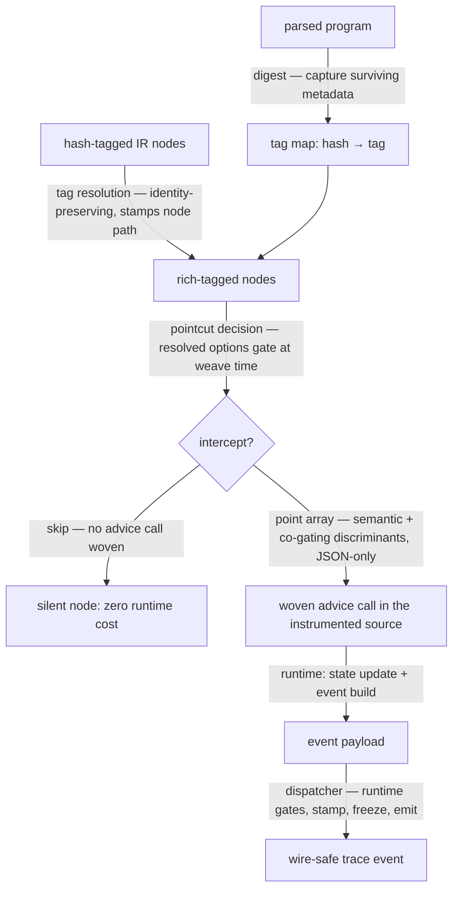

# Weaving — Architecture

## Architectural Sketch

### Execution phases

1. **Tag capture** (during transpile, side-effectful) — the digest extracts each
   node's surviving metadata into the tag map, keyed by hash. Input: parsed
   program. Output: populated tag map.

2. **Tag resolution** (weave time, pure per node) — hash tags on the nodes a
   pointcut inspects are resolved to full tag objects, stamped with their node
   path, preserving object identity for the comparisons pointcuts make. Input:
   hash-tagged nodes + tag map. Output: rich-tagged nodes.

3. **Pointcut decision** (weave time, pure per node) — each registered pointcut
   answers, per node: intercept or skip, and — for intercepted nodes — the
   semantic discriminant (what this is) and the co-gating discriminant (how to
   emit). A disabled layer gate registers no pointcut at all. Input: rich-tagged
   node + resolved options. Output: a point array (JSON-only, code-generated
   into the woven output) or a skip.

4. **Advice dispatch** (runtime, worker-side) — each woven advice call receives
   the run state and its point data, updates the state, builds its event through
   the generators, and hands the payload to the dispatcher — which applies the
   runtime gate bundle and emits.

### Data flow

### Structural constraints

- Point arrays and the initial state are code-generated: JSON shapes only (see §
  Aran constraints below).
- Tag-map resolution must succeed for every hash a pointcut encounters — a miss
  is a digest bug and throws loudly, never a silent default.
- The co-gating decision is made once, at weave time; advice switches on the
  discriminant with no boolean re-derivation at runtime.

### Out of scope

- The dispatcher's own contract (range/filter application, stamping, visit
  counts) — [`../DOCS.md`](../DOCS.md).
- The runtime gate bundle's delivery (engine worker config) — the tracer entry's
  concern.
- Event field vocabulary — [`../types.ts`](../types.ts) and the tracer README.

## Why flexible weave

Aran offers two weave modes. We use **flexible** because it provides
statement/effect/expression-level hooks that standard lacks, giving us room to
grow the trace as pedagogical needs evolve.

## Aran constraints

These are hard requirements from Aran's flexible weave API:

1. **point[] must be Json[]** — pointcut return values are serialized into the
   instrumented code. No functions, Maps, class instances, or circular objects.
2. **initial_state must be expressible as generated code** — Aran reconstructs
   `initialState` at weave time using code generation (not
   `JSON.parse/stringify`). Only JSON-compatible primitives, plain arrays, and
   plain objects work. `Map`, `Set`, class instances, and functions are
   rejected.
3. **expression@after is a value transformer** — advice MUST return the result
   value or the program breaks.
4. **apply@around replaces execution** — advice MUST call Reflect.apply and
   return the result.
5. **apply@around and construct@around: single cut only** — one handler for all
   function calls. Other hooks support multiple cuts.

## Tag strategy

Aran desugars JS into AranLang IR, erasing original syntax. Tags carry ESTree
metadata that survives desugaring:

- `loc`, `node` (ESTree type), `source` — always present
- `operator`, `loopKind`, `bindingKind`, `accessKind`, `literalKind`, `prefix` —
  present only on relevant ESTree constructs. `prefix` on `UpdateExpression`:
  `true` = `++x`/`--x`, `false` = `x++`/`x--`. Used by pointcut to gate
  `expression.operators.increment.prefix`/`.postfix`.

The tag is a single type (Aran's Atom.Tag is one type parameter for all nodes).
The `node` field serves as runtime discriminant for sparse optional fields.

### Tag resolution (digest → map → pointcut wrapping)

Aran's `digest` function must return `string | number`. But pointcuts and advice
need rich JejTag objects. The solution uses three phases:

1. **Digest phase** (during `transpile()`): A custom digest function receives
   each ESTree node, extracts metadata into a JejTag, stores it in a
   `Map<string, JejTag>` keyed by hash, and returns the hash string. Aran
   digests nodes bottom-up (children before parents), so parent-dependent
   metadata (e.g., VariableDeclarator needs parent VariableDeclaration's `kind`)
   is resolved via a pre-walk of the AST before transpile.

2. **Pointcut wrapping** (during `createAspect()`): Each pointcut function is
   wrapped to resolve hash strings → JejTag objects before calling the original
   pointcut. Resolution is **shallow with a whitelist**: `node.tag`,
   `parent.tag`, `root.tag`, plus the known nested positions used in identity
   comparisons: `parent.then?.tag`, `parent.else?.tag`, `parent.try?.tag`,
   `parent.catch?.tag`, `parent.finally?.tag`. The same Map lookup
   (`tagMap.get(hash)`) is used for all resolutions, preserving object identity
   for `===` comparisons in pointcuts like `block-pointcut.ts`. No recursive
   walking — the whitelist is finite and verified by grep against all pointcut
   files.

3. **Runtime** (in advice): The pointcut return array contains the resolved
   JejTag object (not the hash string). Aran JSON-serializes this into the
   instrumented code. Advice functions receive JejTag objects directly — no
   further resolution needed.

### Constraint: tag map lookup must succeed

Tag map lookup must succeed for every hash encountered at pointcut time. A
missing hash indicates a digest/pre-walk bug and should throw an error with the
hash and node type for debugging. Silent fallback (returning undefined or a
default tag) would mask instrumentation bugs and produce events with missing
metadata.

### Constraint: JejTag must be Json-serializable

Because pointcut return arrays are embedded in the instrumented code via JSON,
every field of JejTag must be a Json primitive, array, or plain object. No
functions, Maps, Sets, Dates, or class instances.

## Architecture: one set of advice, conditional dispatch

Not two categories (internal/dispatch). One set of advice functions that:

1. Always update internal state (scope stack, variable maps, step counter)
2. Conditionally call `emitExpression()` / `emitResolve()` based on config

An `if` check before calling the wrapper is simpler than maintaining two
parallel advice systems.

## State design

TracerState is Json-serializable (Aran requirement — the initial state is
code-generated into the woven output). Contains:

- `trace[]` — accumulated events
- `eventStep` — the one step counter: contiguous, dispatcher-owned, assigned
  after the runtime gates (see Step numbering below)
- `scopeStack[]` — scope nesting for depth/creation tracking
- `iterationCounters{}` — per-loop iteration counts (keyed by source location);
  the CAP they are checked against arrives in the runtime gate bundle
- `lastExpressionResult` — most recent expression result (for assignment values)
- `previousExpressionResult` — prior expression result (for short-circuit
  recovery)
- `lastReadValues{}` — last read values per variable (for compound assignment
  operands)
- `variableKinds{}` — name → binding kind, from the instrument pre-walk
- `lastEmittedNodePath` / `lastEmittedTag` — the error event's approximate
  location register, updated by the dispatcher on every emission
- `visitCounts{}` — node path → visit count, bumped by the resolve dispatcher
- `valueIdCounter` — the monotonic provenance counter
- `onEvent?` — streaming callback (installed by the worker logic at setup, never
  part of the generated state)

Config does NOT live in state: weave-time gating is resolved during aspect
assembly on the main thread, and the runtime-checked gates (range window, name
filters, iteration cap) reach the dispatcher via the runtime gate bundle
delivered as the engine spec's worker config (`../../types.ts` seam 2).

### Step numbering: assigned at emission, navigable cross-references

**One counter, owned by the dispatcher.** `eventStep` is the contiguous
1-indexed counter; the dispatcher increments it AFTER the runtime gates pass and
stamps it as the event's `step`. Numbering lives at the emission layer because
more happens in the sandbox than is emitted: iteration counters tick without
emitting, range- and filter-dropped payloads emit nothing, and
weave-time-skipped nodes never fire advice at all. None of those consume a
number, so the delivered stream is always sequential with no gaps: 1, 2, 3, 4…

**Cross-reference fields are navigable.** `scopeCreationStep`,
`declarationStep`, `creationStep`, `parentCreationStep`,
`targetScopeCreationStep`, and `beginStep` each carry the **emitted `step` of
the event they reference** — a consumer can jump straight to it. The run state
records, alongside each tracked scope and binding, the step its create/declare
event was emitted with (or that it was not emitted); advice reads those recorded
steps when building later events.

**Omission rule.** A cross-reference is omitted when the referenced event was
NOT emitted — whether its gate was disabled by config or the runtime gates
dropped it. There is nothing to navigate to, and no substitute key is invented.
One practical exception: template sub-events (evaluation, end) are co-gated with
their begin event, so `beginStep` is never orphaned.

**No second counter.** Internal scope/variable tracking still always runs
(binding events need scope identity even when scope events are off), but it keys
off the run state's own structures — it does not mint a parallel counter, and no
internal identifier ever appears on an event.

## ASTNode lifecycle

ASTNodes are built during `instrument()` with `events: []` and `visits: 0`. They
are **NOT frozen at instrument time** — they stay mutable until `link()`
completes after execution (when `.events[]` and `.visits` are populated and
frozen).

`TraceEvent.nodePath` stores a **nodePath string** — not an ASTNode. Advice
emits events via `emitExpression(state, tag, nodePath, category, data)` and
`emitResolve(state, tag, nodePath, kind, value)`. Both keep events wire-safe.

`block@throwing` advice on the outermost block calls
`emitError(state, tag, nodePath, error)` then returns the error (re-throws).
Location is approximate (last emitted nodePath). Gated by
`config.errors !== false`.

Two-way linking (`ASTNode.events[]`) is built **post-execution** by the internal
`link()` — never during execution. Advice never writes to ASTNode objects.

Cycle guard: `deepFreezeInPlace` uses a `visited: Set` to handle both
`ASTNode.parent` and `events[i].node` circular refs (both formed after
`link()`).

## Pointcut → advice data flow

Pointcut functions inspect AranLang nodes at weave time (static). They extract
node type, tag data, and variable names, then return this as a Json[] point
array. At runtime, the advice function receives
`(state, ...builtinArgs, ...pointData)` and uses the point data to determine
which event to create.

## Aspect assembly

`create-aspect.ts` reads the user's config and builds an Aran flexible aspect
object. Each aspect entry maps an advice global variable name to a
`{ kind, pointcut, advice }` triple. Config-disabled features produce no aspect
entries (zero overhead). Scope tracking hooks are always included because
binding events need scope references even when scope events are disabled.

## Loop guards

The block-level advice tracks per-loop iteration counts and throws the
**branded** limit error when the cap (from the runtime gate bundle) is exceeded.
The brand is a structural marker the halt author recognizes — classification
never reads message text. The guard runs regardless of the statement-layer
config — it is a safety mechanism, not a trace feature.

## Execution time limits

Engine-owned. The engine's time budget counts only while the worker is unblocked
— it pauses while an emitted event awaits its pull (a learner examining a step)
and while a dialog round-trip is serviced. Nothing in the weave measures time.

---

## Co-gating discriminant

Pointcut functions make two decisions per intercepted node at weave time:

1. **What to intercept** (semantic discriminant) — `'literal'`, `'read'`,
   `'shortCircuiting'`, etc. One per intercepted node type.
2. **How to emit** (co-gating discriminant) — one of four values encoding the
   co-gating decision made from config at weave time.

| Co-gating discriminant | What advice does                            | When pointcut returns it                                         |
| ---------------------- | ------------------------------------------- | ---------------------------------------------------------------- |
| `'expression+resolve'` | calls `emitExpression` then `emitResolve`   | expression gate ON + resolve gate ON + `resolve.dependent: true` |
| `'expression-only'`    | calls `emitExpression`, skips `emitResolve` | expression gate ON + resolve gate OFF for this kind              |
| `'resolve-only'`       | calls `emitResolve`, skips `emitExpression` | expression gate OFF + `resolve.dependent: false`                 |
| `'skip'`               | emits nothing; advice returns immediately   | all relevant gates off (or expression OFF + `dependent: true`)   |

**Zero runtime overhead for disabled gates**: the discriminant is decided at
weave time. A node with discriminant `'skip'` has no advice call injected into
the instrumented code — no runtime check, no function invocation at all.

**Why four values, not boolean flags**: a boolean pair
`(emitExpression, emitResolve)` would require two runtime checks per event. A
single discriminant string allows a single `switch` with no boolean logic at
runtime.

**Co-gating suppression** (`RESOLVE_ONLY_COGATED` profile): when
`expression: false` and `resolve.dependent: true` (the default), the pointcut
returns `'skip'` for every node — resolves are suppressed because their paired
expression events are also suppressed. This profile produces zero events despite
`resolve: true` being set.

**Config scenarios**:

| Config                                             | Discriminant returned               |
| -------------------------------------------------- | ----------------------------------- |
| Default (`ALL_ON`)                                 | most nodes → `'expression+resolve'` |
| `expression: false, resolve: { dependent: false }` | `'resolve-only'`                    |
| `expression: false, resolve: { dependent: true }`  | `'skip'` (co-gated + suppressed)    |
| `expression: true, resolve: false`                 | `'expression-only'`                 |
