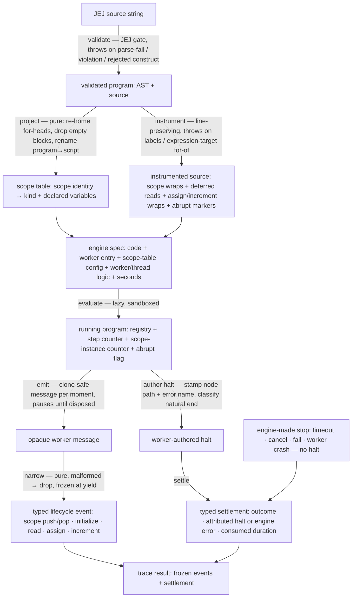

# tracers/variables — Architecture & Decisions

Vocabulary and the event pinning table: [README.md](./README.md). The contract:
[types.ts](./types.ts). The engine this tier consumes:
[`../../../../../lib/engine/DOCS.md`](../../../../../lib/engine/DOCS.md).

## Architectural Sketch

> Written Phase 0, before implementation. The Refactor step is held against this
> document — not what the code does, but what shape it takes.

### Execution phases

1. **Validate** (sync, throws) — the JEJ admission gate at the boundary. Input:
   a raw source string. Output: a validated program (AST + source), or a typed
   boundary throw on parse failure, a JEJ violation, or a construct this tier
   rejects (labels, expression-target for-of). A gated program never reaches the
   engine.

2. **Project** (sync, pure) — fold the package scope analysis into this tier's
   own scope table. Input: the validated program. Output: a clone-safe table
   mapping each scope's source identity to its kind and its declared variables
   in source order. The classic-`for` head bindings are re-homed from the
   enclosing scope into a synthesized for-scope (so sibling loops never
   collide); declaration-less blocks are dropped; the script scope is always
   present.

3. **Instrument** (sync; pure given an instrumentable program; throws on
   rejected constructs) — splice the program into instrumented source. Input:
   the validated program + source + scope table. First rejects, with a typed
   boundary throw, the constructs that pass the JEJ gate but cannot be
   faithfully spliced (labels, expression-target for-of). The scope table
   addresses which scopes are wrapped (its keys are the open/close targets);
   whether an identifier is a traced read is resolved against the program's own
   lexical scope, which the flat table does not carry. Output: a source string,
   line-for-line with the original, carrying scope wraps (open /
   try-catch-finally close), declared-variable reads as deferred thunks, the
   per-form assignment and increment wraps, the declaration-initializer wraps,
   the abrupt-completion markers before break/continue, and the post-loop flag
   clears — every value-bearing splice a call against the worker-side helper
   protocol the contract pins. Line-preserving — no splice inserts or removes a
   newline.

4. **Run and emit** (factory call sync and lazy; emission async) — assemble the
   engine spec (instrumented source + thin worker entry + the scope table as
   worker config + worker/thread logic + seconds) and hand it to the engine
   factory, returning a lazy handle; nothing runs until the first pull. Input:
   the instrumented source + scope table. Output: a stream of opaque worker
   messages plus a worker-authored halt. The worker implements the helper
   protocol the instrumentation emitted calls against, holds the run state — the
   binding registry, the step counter, the scope-instance counter, and the
   abrupt flag the instrumented markers set — and reads the scope table at each
   open / close to author the declared- and final-variable bursts; the thread
   holds nothing.

5. **Narrow** (per message, pure) — map one opaque message to one typed
   lifecycle event, or drop a malformed one. Input: an opaque message. Output: a
   frozen typed event on the stream.

6. **Settle** (sync) — surface the run's end. Input: the engine's settlement,
   carrying either a worker-authored halt (on a worker-side stop — a natural end
   or a throw) OR an engine-made stop with no halt (a timeout, a consumer cancel
   or fail, a worker crash). Output: the typed settlement (outcome, the
   attributed halt when present, the engine error or fail reason when the engine
   ended the run, consumed duration) carried on the result alongside every
   event.

### Data flow

### Structural constraints

- **Validation and instrumentation are the only boundaries that throw.** Both
  fail fast, before any engine work — validation on non-JEJ or unparseable
  input, instrumentation on a construct that survives the JEJ gate but cannot be
  faithfully spliced (labels, expression-target for-of). Everything downstream
  of a successfully instrumented program degrades into a settlement, never an
  exception.
- **Project and instrument are pure.** No I/O, no engine, no shared state — both
  are deterministic functions of their inputs, testable in isolation.
  Instrumentation is pure given an instrumentable program: it inspects for and
  throws on the rejected constructs first, then splices.
- **Instrumentation is line-preserving.** No splice inserts or removes a
  newline, so the instrumented source has the same line count as the original
  and any engine line-report maps back. Most splices wrap a span verbatim; the
  simple `=` form is the one that relocates its right-hand side (to the eager
  `incoming` argument position), staying within its original lines — the binding
  invariant is line count, not byte-for-byte preservation.
- **Only declaring scopes emit scope events** (the script scope always does;
  blocks only when they declare a binding). An empty block pushes no scope, per
  the NM.
- **The abrupt flag is the sole authority for a pop reason.** A `finally` cannot
  observe why it runs, so scope-pop reads the worker-side flag. Value-bearing
  helpers and scope opens clear it (normal evaluation resumed); closes never
  clear it (one break unwinds several scopes, all reporting the same reason); a
  post-loop clear kills a flag left set by a final-iteration break or continue.
- **The registry is read, never the program, for cleanup values.** Scope-pop
  values come from the worker registry; re-reading a binding from the program
  could throw (a still-TDZ binding) and would perturb the trace. Event values
  (`value` / `priorValue` / `nextValue`) are captured live, at the spec-correct
  moment, via the deferred thunks.
- **An event is emitted only after the operation it describes completes without
  throwing.** A TDZ read, a const reassignment, or any throw produces the
  attributed halt and no event. A logical assign that short-circuits (`??=` /
  `||=` / `&&=`) still emits its `assign` — with `wrote: false` and no
  `nextValue` — because a justified no-write is a completed operation, not a
  failure; `increment` is governed by the same discipline as `assign`.
- **Determinism.** Step numbers and scope-instance ids are assigned worker-side
  in emission order, so the event stream is a pure function of the source — the
  property the quiz lens depends on.
- **The worker holds the only mutable state; the thread is pure.** Registry,
  counters, and flag live worker-side (one declared mutable module); the thread
  logic is a stateless mapping, so it is trivially correct and testable.

### Out of scope

The bounded context — what this tier does not own (console/dialog events, the
embody adapter mapping, the quiz lens, realm bindings, per-iteration for-env
copies, labels / `with` / `eval` / expression-target for-of / undeclared
identifiers, the `'limit'` reason, the `tracers/` module docs) — is enumerated
in [README.md § Bounded context](./README.md#bounded-context). Two are worth
restating as structural boundaries: a **timeout or cancel kills the worker**, so
the scopes open at that moment do not pop; and **non-time limits do not exist**
in this tier, so no scope ever pops with reason `'limit'`.

## Why this design

### Thunks, not eager arguments, for reads

A read is wrapped as a deferred thunk so the binding is evaluated INSIDE the
helper. Wrapping it as an eager argument would evaluate the binding before the
helper runs — a temporal-dead-zone read would throw before any code could stamp
the node path onto the error, and the halt would lose its attribution. The thunk
moves the throw to where the path is known. The same reasoning shapes the
assignment forms: each form arranges its prior-read thunk and writer thunk so a
TDZ or const throw fires at the exact moment the real assignment would have
thrown, with the original expression doing all coercion (no operator is
reimplemented).

### Scope reasons need a flag, not a finally

A `try/finally` fires on every exit path, which is why it brackets each scope —
but `finally` cannot tell a normal exit from a break, a continue, or a throw,
and a break never propagates past the loop it targets. The abrupt-completion
flag is the missing observability: set just before the abrupt statement (or by
the scope's own catch on a throw), read by close, and cleared whenever normal
evaluation resumes. This is the single subtlest correctness point in the tier;
the constraint list above and the worker-logic tests enumerate its edge cases.

### A re-homed scope table, not the package analysis verbatim

The package scope analysis places classic-`for` head bindings in the ENCLOSING
scope and overwrites sibling loops that share a head name. Feeding that to the
push payloads would mis-attribute the loop variable and lose sibling loops. So
the tier projects its own table once, lifting each loop head into a synthesized
for-scope. The NM models a fresh environment per for-iteration; this tier models
one for-scope per loop and discloses the simplification — in closure-free JEJ
the per-iteration copies are value-equivalent, and a loop body that declares
bindings still shows its own per-iteration push/pop.

### Emit everything; gate worker-side if it ever matters

Every emit costs a full pause round-trip, but JEJ learner programs are tiny and
the consuming quiz UX wants a pause at every lifecycle moment (stepping is the
engine's backpressure). So the tier emits everything. The honest cost: an
iteration-heavy loop exhausts the time budget through per-emit yield charges and
ends `timed-out`, with the scopes open at that moment never popping. The
pressure valve, if a future consumer needs it, is worker-side aggregation before
emitting — tier discipline the engine cannot enforce.

### Inert dialog stubs

A worker has no native `prompt` / `alert` / `confirm`, so a valid JEJ program
that calls one would crash on a missing global. The worker injects inert stubs
(`prompt → null`, `confirm → false`, `alert → undefined`) so dialog-bearing
programs run to a faithful variable trace. Dialog interaction is not a variable
lifecycle event; pairing it with the trace is the embody-wiring half of the tier
contract, out of scope here.

## Navigation

- [README.md](./README.md) — what this tier is, the vocabulary, the bounded
  context.
- [types.ts](./types.ts) — the contract and the four cross-increment seams.
- [`../../../../../lib/engine/README.md`](../../../../../lib/engine/README.md) —
  the engine: the two-sided contract this tier's worker and thread logic are
  authored against.
