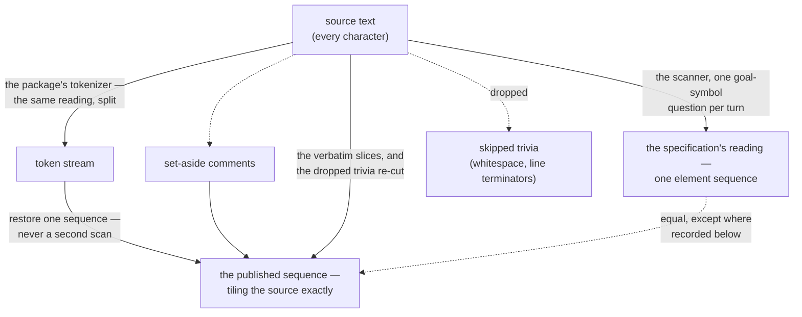

<!-- cspell:ignore Punctuator Punctuators IdentifierName PrivateIdentifier -->
<!-- cspell:ignore NumericLiteral StringLiteral RegularExpressionLiteral -->
<!-- cspell:ignore TemplateSubstitutionTail DivPunctuator LineTerminator -->
<!-- cspell:ignore RightBracePunctuator HashbangComment InputElementDiv -->
<!-- cspell:ignore InputElementRegExp CommonToken ReservedWord tokenizer -->
<!-- cspell:ignore entwined spellme -->

# embody — Notional Machine

This document is the embody region's **machine twin**: the precise, bounded
mental model of the machine reality this region's facts publish. The factory
itself is modeled first, briefly; the **scanner** — the machine behind the
tokens stage's `inputElements` member — is modeled in full. The other stages are
named, not modeled: a later reshape of one of them extends this file with its
own section rather than inheriting this one.

**Which machine, exactly.** At this twin's writing the package glossary defined
the term this file's name carries as _"a language level's semantic model of how
JavaScript executes: the bounded conceptual machine a learner can hold in their
head. NM content lives with its level."_ — and the entry has since been widened
(this campaign's close, 2026-08-19) to say what this file demonstrated: a region
that models a different machine documents it in its own twin, and the entry now
names this one. The level-resident evaluation models remain the term's home
ground (the [JEJ NM](../language-levels/jej/notional-machine.md) is one), and
the package extends the instrument beyond them:
[`../lib/questioning/notional-machine.md`](../lib/questioning/notional-machine.md)
models a utility kind's machine. This document extends it to an earlier phase of
the same machine — the scanner that turns characters into elements before any
tree exists and before anything runs — and it is level-independent, as
everything in this region is. One machine; different phases; a bounded model
each.

**Pedagogy is not decided here.** This document describes what the machine does;
lenses choose what to teach. The contract is accuracy — the same contract the
region's own opener states for every fact.

## The factory, as a machine

`embody()` is a machine a contributor can hold whole: a snippet goes in — raw
source text plus whether to read it as a script or a module — and one frozen
embodiment comes out. Inside, the six facts publish once: `source` and `type`
are given, restating the snippet; the four derived stages derive in dependency
order — `tokens` spells the source out; `ast` resolves the tokens into a tree;
`entwined` ties tree, tokens and text into one navigable binding; `environment`
reads the static scope structure out of tree, binding and snippet type. Every
derivation result is a tagged value — the stage's value, or a structured cause —
and a failure never stops the walk: a learner's unparseable program is quiet
data rendered where it belongs, while a defect in the region's own machinery
reports loudly to the developer and degrades as narrowly as dependency allows.
From the tagged stages the five lifecycle phases learn whether they open; the
roster's lenses are gated and attached; and the whole structure freezes to the
freeze-what-you-own boundary. The region's [README](./README.md) § The build
narrates these steps; [DOCS.md](./DOCS.md) § Structural constraints binds them.

## The scanner — the lexical phase, modeled in full

ECMA-262's scanner reads source text into **input elements** — the sequence the
tokens stage's `inputElements` member republishes. The vocabulary — the fourteen
element kinds and their grounds — is owned by the shared scanning leaf
([`../lib/scanning/`](../lib/scanning/README.md)); this document models the
machine those names come from and does not restate their table. In prose say
**element kind** for which production an element is — never bare "kind", which
the package glossary owns for a kind of study utility.

### The scanner's turn — asked, then read

The scanner does not read unprompted. On every turn it is first **asked a
question** — which **goal symbol** is wanted — and then reads characters until
one input element is produced. The same characters under a different question
become a different element: after `=` a `/` begins a regular expression
(`InputElementRegExp` was asked); after an operand it is division
(`InputElementDiv`); after the `}` that continues a template, a template tail is
possible. The parser never publishes which question it asked — but the answer is
recoverable from the element kind itself: a `DivPunctuator` means the division
goal was asked, a `RegularExpressionLiteral` means the regular-expression goal
was, a `TemplateSubstitutionTail` means a template-tail goal was. That
recoverability is the sharpest thing the input-element sequence adds over the
token stream.

### One sequence, three channels

The specification's scanner produces **one sequence** in which every character
of the source belongs to exactly one element — comments and blank lines
included. The parser this package uses splits that one sequence into channels: a
token stream, a set-aside comment array, and skipped trivia that survives
nowhere. The published sequence is the one sequence restored — derived from the
channels plus the source, never by scanning again — and it equals the
specification's except where this document records otherwise.

### When the scanner stops

A turn that cannot produce an input element ends the reading. The scanner stops
at the character it cannot spend, and everything read before that turn stands:
one element was produced per completed turn, and nothing past the stopping point
was ever read — the machine has no account of it, and this model claims none.
The tokens stage publishes an account of the stop itself: the failure's cause
keeps the machine's own words — and its stopping point where the machine reports
one — and the failure arm's value is the **token prefix**: the tokens of every
completed turn, with the comments set aside along the way (README § Failure
grammar, human ruling 2026-09-01). The one-sequence restoration above extends to
a stopped reading exactly as far as what was kept reaches (human ruling
2026-09-01: the prefix publishes input elements too, bounded by slicing): the
source is cut at the account's own extent — the end of the last token or
set-aside comment, whichever is later — and the same leaf restores over the cut,
its tiling contract unchanged, asserting nothing past the stopping point.

A **recovered tree** — the grammar failure's account — is a second instrument's
output: a **recovering reader**, not the machine this document models. Its
shapes are data the region publishes, so they are modeled in the data twin
([`data-model.md`](./data-model.md)) and labeled at the contract (README §
Failure grammar). The reader itself is not modeled here because it is not
installed; like the stages this file names without modeling, it owes its own
section of this document when it is — extension, not inheritance.

### What the grammar's shape predicts

Two consequences of the lexical grammar that look wrong until the model is held
right — both are the model's teeth, and both are stated with their grounds in
the leaf's README:

- **Every keyword is an `IdentifierName`.** The lexical grammar has no
  reserved-word element: `ReservedWord` is a subset the **syntactic** grammar
  consults later. `if`, `const` — and `null`, `true`, `false` — all name the
  identifier production at this phase, whatever they look like.
- **Four productions sit outside `CommonToken`** — `DivPunctuator` (`/`, `/=`),
  `RegularExpressionLiteral`, `RightBracePunctuator` (`}` outside a template)
  and `TemplateSubstitutionTail`. They are separated precisely because the
  goal-symbol question decides what they are, and they are the visible trace of
  the asked-then-read turn above.

### Where the published sequence parts ways with the specification

- **Runs collapse.** The specification makes each whitespace character its own
  element and a `<CR><LF>` two; the published sequence carries maximal runs (one
  `WhiteSpace`, one `LineTerminator`, never merged) — a reversible projection:
  split a run per character to recover the specification's reading.
- **A slash after `await` can be mis-read upstream.** The tokenizer's known
  defect; the published sequence is then wrong and still tiles — **tiling is a
  property of the sequence, never evidence it is the specification's.**

### Where the published sequence corrects the tokenizer

- **The hashbang.** The tokenizer mis-files `#!…` as a line comment; the
  published sequence names `HashbangComment` by position and opening characters
  together — a correction **toward** the specification, not a departure from it.
  The leaf records its expiry: when the upstream defect is fixed, the correction
  becomes a no-op rather than a conflict.

### What never reaches this model

- **A reserved word spelled with a Unicode escape** — `\u0069f` for `if`, six
  characters — is a well-formed `IdentifierName` at this phase: the restriction
  against it is an early error in the **syntactic** grammar — and in
  property-key position no reserved-word restriction applies at all, which is
  why V8 runs these programs — a direct consequence of "every keyword is an
  `IdentifierName`" above. The tokenizer enforces it while reading, so the
  tokens stage fails and no sequence is published — the phases below tokens
  close on a program V8 runs. The spellme campaign's embody flags record this as
  F4, with the measured cases.

## Spec correspondence

Section numbers are **ECMA-262, 15th edition (ES2024)** — the numbering moves
between editions, and it moved exactly here (the hashbang's insertion as §12.5
in ES2023 pushed every later section down). Rows without a number are
deliberate: this document asserts none it has not verified.

| Model term                              | ES2024 home                     |
| --------------------------------------- | ------------------------------- |
| goal symbols, input elements            | clause 12, preamble             |
| `HashbangComment`                       | §12.5                           |
| `CommonToken` (tokens)                  | §12.6                           |
| `IdentifierName`, `ReservedWord`        | §12.7, §12.7.2                  |
| `Punctuator`                            | §12.8                           |
| `DivPunctuator`, `RightBracePunctuator` | §12.8 (their own productions)   |
| `RegularExpressionLiteral`              | clause 12 (its own production)  |
| template chunk productions              | clause 12 (template components) |

## Navigation

- [`README.md`](./README.md) — the region that publishes the sequence, and the
  glossary entry naming it.
- [`DOCS.md`](./DOCS.md) — the admission grounds and the integration decision.
- [`../lib/scanning/`](../lib/scanning/README.md) — the vocabulary owner and the
  derivation itself.
- [`../language-levels/jej/notional-machine.md`](../language-levels/jej/notional-machine.md)
  — the evaluation-phase model, resident with its level.
