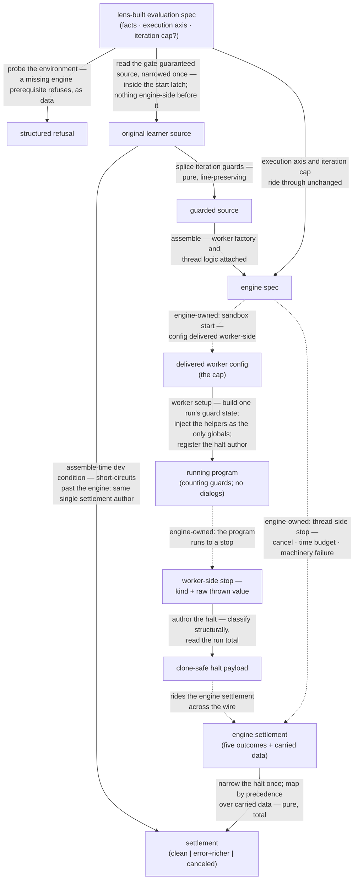

# evaluators/run — Architecture & Decisions

## Context

run is the baseline engine-backed evaluator: it proves the whole seam — the
kind's contract over the shared engine, with the region's iteration-guard
discipline — on the simplest possible member, one that emits nothing and answers
only how the run ended. The vocabulary is pinned in
[README.md § Ubiquitous language](./README.md); the kind's obligations in
[../README.md](../README.md); the engine's machinery in
[../../lib/engine/DOCS.md](../../lib/engine/DOCS.md).

## Architectural sketch

> Written Phase 0, before implementation. The Refactor step is held against this
> document — not what the code does, but what shape it takes.

### Execution phases

(The kind's Gate phase — applicability — is the constant-true verdict here;
nothing to zoom into.)

1. **Probe** (sync, at the kind surface) — the environment is probed for the
   engine's two prerequisites; missing either, main answers with the one
   structured refusal, naming the absent capability. Otherwise main hands back
   the eventless stream — nothing has executed. Input: the evaluation spec.
   Output: the stream, or the refusal.

2. **Guard-and-assemble** (sync, pure, inside the start latch) — on the first
   pull, and never before: the gate-guaranteed source is read (narrowed once),
   iteration guards are spliced into the ORIGINAL source, and the engine spec is
   assembled — the cap and the execution axis riding through unchanged, run's
   own worker factory and thread logic attached. An upstream dev condition here
   (an unreachable failure arm, a splice failure on gate-guaranteed-parseable
   source) short-circuits past the engine and settles the defect arm **through
   the same single settlement-authoring path the mapper feeds** — the settlement
   has exactly one author on every route; never a throw at the learner, never a
   second refusal. Input: the evaluation spec. Output: the engine spec.

3. **Worker setup** (worker-side, once, at sandbox start) — run's worker logic
   receives the delivered config and builds one run's guard state from the cap;
   the guard helpers are injected as the ONLY globals (dialogs are honestly
   absent — a dialog call is the program's own reference error), and the halt
   author is registered. Input: the delivered worker config. Output: a program
   environment armed with counting guards and a halt author.

4. **Drive** (async, engine-owned) — the engine runs the program in the sandbox.
   The run ends worker-side (natural end or throw) or thread-side (cancel, time
   budget, machinery failure). Input: the armed program. Output: a raw stop.

5. **Author the halt** (worker-side, at every worker-side stop) — the raw stop
   is turned into the clone-safe halt payload in the same realm the throw
   happened: the guard's throw classified structurally (never by name or
   message), the run-total iteration count read, a non-Error throw rendered
   honestly. Input: the stop kind and the raw thrown value. Output: the halt
   payload.

6. **Map the settlement** (sync, pure, TOTAL) — the engine's settlement is
   translated onto the kind's three arms by a precedence rule over the CARRIED
   DATA: a well-formed halt **recording a throw** wins — the program's own
   throw, or the guard's trip, by classification; natural-end halts fall through
   — else an engine-made error answers (the budget, or the machinery); else a
   consumer-ended run is canceled and a completed one clean; every remaining
   combination is the defensive defect arm, loudly flagged. The halt payload is
   narrowed exactly once, here. Input: the engine settlement. Output: run's
   settlement, deep-frozen.

7. **Settle once** (teardown) — the companion promise resolves exactly once,
   whatever ended the run. Ceasing to pull tears the run down and resolves the
   canceled arm; teardown latches, so a later pull is inert and never starts a
   fresh run. Teardown before the start latch ever opens settles canceled with
   nothing having existed engine-side. Input: the run's end. Output: the
   settlement.

### Data flow

Dashed edges are consumer- or engine-owned — outside this module, shown for
orientation.

### Structural constraints

- **The kind surface is synchronous; the stream is the only async thing.**
  Nothing engine-side — not even the engine's result surface, whose mere access
  starts a run — exists before the first pull.
- **One refusal, environment-only.** After the probe, every dev condition
  settles on the defect arm; the module never throws at the learner and never
  refuses twice.
- **The settlement has exactly one author.** Assemble-time defects, engine
  settlements, and pre-start teardown all resolve through one authoring path; no
  second site ever writes a settlement.
- **Guard-first, on the original source** — the trip's span stays faithful to
  the learner's own columns.
- **Splice and inject are one obligation, both sides run's.** The spliced calls
  (phase 2) and the injected helpers (phase 3) are the two halves of
  iteration-guard's pairing rule, and both phases are run-owned — the engine
  only carries the config between them.
- **The halt is authored worker-side, in the throw's own realm**; classification
  is structural, never message-matching; the payload crosses the wire as plain
  clone-safe data and is narrowed exactly once, thread-side.
- **The settlement mapping is pure and total by construction** — the precedence
  rule over carried data leaves no combination unanswered; the impossible ones
  are answered loudly, not guessed about.
- **The settlement resolves exactly once; teardown latches.** Cancellation
  interrupts the one pending pull out of band; a pull after teardown is inert;
  teardown before the start latch opens settles canceled having spawned nothing.
- **Everything returned is deep-frozen at the boundary** (the settlement and its
  interior); the engine freezes only its own structures, so the deep pass here
  is run's.

### Out of scope

- **Dialog interaction, console capture, any event** — intercept's; real windows
  — danger's.
- **Guard semantics and loop placement** — iteration-guard's and loop-guard's;
  run consumes the discipline whole.
- **Cap policy** — no validation, clamping, or defaulting exists here (the cap
  rides through unchanged); a nonsense cap is the consuming lens's bug, and its
  consequences are iteration-guard's documented edges.
- **Engine mechanics** — worker lifecycle, pause protocol, budget, draining.
- **Rendering and pedagogy of settlements** — the run lens's.
- **The sandbox page** — permanent dev infrastructure beside the module, not
  part of its contract.

## Why this design

- **An eventless stream, not a bare promise.** The kind's stream shape is what
  makes run interchangeable with its siblings in the run lens's options list —
  and it is where the kind's laziness and cancel-by-ceasing-to-pull live. run
  keeps the shape and simply never yields; the stream exists to carry
  obligations, not events.
- **Hand-rolled iteration.** run's whole life is one pending pull; a generator
  answers teardown only after the pull it queues behind — a deadlock for a run
  that never yields. The iteration is hand-rolled so teardown answers out of
  band and latches (the sibling precedent; the engine's own handle is the
  pattern's origin).
- **The refusal covers both engine prerequisites.** Refusing only on a missing
  worker capability would make a non-isolated page settle every single run as a
  machinery defect — the module's loudest error, as the learner's default
  experience. One probe, both prerequisites, the reason naming the gap; the
  residual (present but failing at spawn) stays a defect, honestly.
- **The defect cause excludes the budget.** The engine's timeout cause would
  restate the reason discriminant — the same no-second-copy rule that keeps the
  boolean trip flag out of the richer error.
- **The trip record rides whole.** Classification and attribution are one fact
  (which loop, where); splitting them into a boolean and a bare location invites
  collision with a sibling's location stamping and forces consumers back to
  message text for the loop index.
- **The engine seam binds the engine's public surface.** run's tests inject an
  engine factory, never a transport — transports are the engine's internals, and
  the engine's own conformance suites already model this exact seam shape.
- **The clean arm stays the kind's floor.** The extension rule names the error
  arm; surfacing the run total on clean settlements is a recorded,
  backward-compatible product option — deliberately not taken here.

## Testing

See [README.md § Testing posture](./README.md): refusal through the kind surface
in Node; logic through the internal factory over the engine seam in Node (the
settlement mapping truth-tabled over synthetic engine settlements, laziness,
cancel, the teardown latch); end-to-end evidence — including the module axis —
browser-tier over the real transport.
