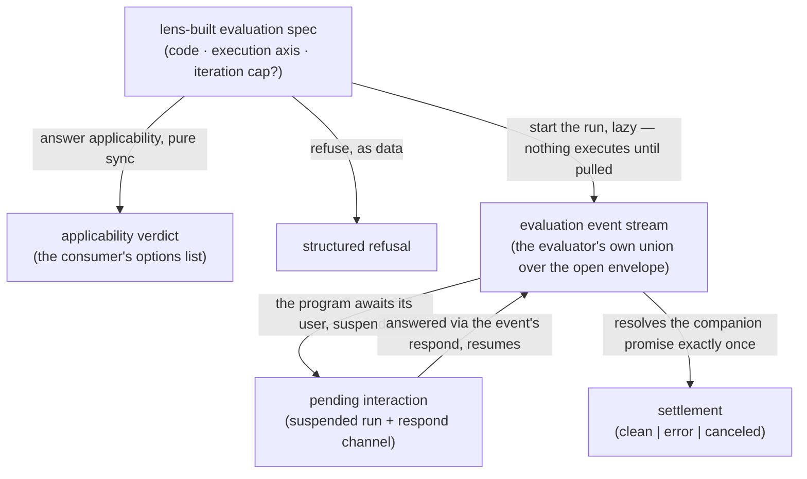

# evaluators — Architecture & Decisions

Region-level architecture for the generator kind described in
[README.md](./README.md). The package sketch ([../DOCS.md](../DOCS.md)) owns the
package-level shape; this document constrains only this region, at its root
abstraction. Each evaluator's own directory zooms into that evaluator.

## Architectural sketch

> Written Phase 0, before implementation. The Refactor step is held against this
> document — not what the code does, but what shape it takes.

**Inbound contract.** A run begins with a lens-built evaluation spec: the
consuming lens mapped the snippet type onto the execution axis and chose any
iteration cap. The code inside the spec is parse-valid — the evaluation phase
gates upstream, and acorn is the run ceiling. Nothing reaches an evaluator
except through a lens driving it.

## Execution phases

1. **Gate** (sync, pure) — the evaluator's applicability answers over the spec;
   the consuming lens uses the verdicts to build its options list. Input: the
   evaluation spec. Output: the verdict.

2. **Start** (sync, lazy) — main returns the evaluation event stream with its
   companion settlement promise, or a structured refusal. No learner code has
   executed yet. Input: the evaluation spec. Output: the stream, or the refusal.

3. **Stream** (async, pulled) — events flow as the consumer pulls. A pending
   interaction suspends the run until the event's own respond channel is
   answered, then the stream resumes. Input: the consumer's pulling. Output: the
   evaluator's events.

4. **Settle** (once) — the companion promise resolves exactly once: clean, error
   (engine-forced stops — a timeout, the iteration cap — land here, in the
   machine's own words), or canceled (the consumer stopped pulling; teardown
   resolves it). Input: the run's end. Output: the settlement.

## Data flow

## Structural constraints

- **Headless.** No rendered view, no component, no DOM ownership; danger's real
  window is execution substrate the run lens zones.
- **Self-contained types.** The kind's contract imports nothing; every evaluator
  publishes its own event union structurally over the open envelope, and foreign
  shapes are mirrored, never imported.
- **Parse-valid input.** No evaluator defends against code that does not parse;
  the lifecycle's phase-gating is the guarantee.
- **Refusal-as-data at main.** A spec an evaluator cannot serve is answered with
  a structured refusal, never a throw at the learner.
- **Laziness is the consumer's.** Nothing executes until the stream is pulled;
  cancellation is ceasing to pull; streams are mount-bounded — they die with the
  mount that started them.
- **Settlement resolves exactly once.** Whatever ends a run — clean exit, error,
  forced stop, cancellation — the companion promise resolves, and only once.
- **The kind knows no consumers.** No evaluator imports a lens, embody, or the
  orchestrator; the execution engine is shared leaf machinery the
  implementations drive, owned elsewhere.

## Decisions

- **Why a parallel kind, not a shared supertype.** The evaluator's applicability
  runs over the spec — a different input domain than the lens kind's Facts — and
  no type edge from evaluators into embody is sanctioned. Per-kind contracts
  realize the envelope convention; nothing structural is shared, so nothing
  couples.
- **Why the settlement is a companion promise.** `for await` consumers never see
  a generator's return value, and a settlement-as-final-event would be
  unenforceable convention — an evaluator could forget it or emit it twice. The
  companion promise is type-distinct, resolved exactly once, and survives a
  broken-out loop.
- **Why resume rides the event.** A `for await` consumer cannot feed values into
  the iterator, so a suspended program's answer must travel on the
  pending-interaction event's own respond channel — the only resume path the
  consumption model allows.
- **Why the envelope stays open.** `{ kind: string }` lets the run lens dispatch
  uniformly over run, intercept, and danger while each evaluator's precise union
  comes from importing it directly. No universal field is hoisted — hoisting
  later widens one envelope; un-hoisting would break every union.
- **Why the iteration cap rides the spec while seconds stay the engine's.** A
  runaway loop never yields, so ceasing to pull cannot stop it: the guard lives
  inside the machinery. The iteration cap is the consumer's pedagogical
  threshold, so it rides the spec; the wall-clock budget is a raw,
  environment-dependent safety backstop, so it stays the engine's own default.
  The run lens renders the limit-exceeded settlement either way.
- **Why the settlement's error arm extends per evaluator.** The three arms are
  the uniform floor every consumer can dispatch on; error richness (a source
  position, a cause) is each evaluator's own, reached by importing it directly —
  the same structural-extension rule as events, stated once for both channels.

## Out of scope

- **Run UI and I/O rendering** — Cancel buttons, output channels, per-audience
  rendering: the run lens's, over these events.
- **The execution engine** — its contract, internals, and home belong to the
  engine's own work; evaluator implementations drive it as shared leaf
  machinery.
- **Per-evaluator event payloads and settlement details** — each evaluator's own
  directory.
- **Wire protocols and clone-safety** — implementation seams inside each
  evaluator, invisible at the kind boundary.
- **Language-level content** — an evaluator may consult a level privately; the
  level's content is its own region's.
