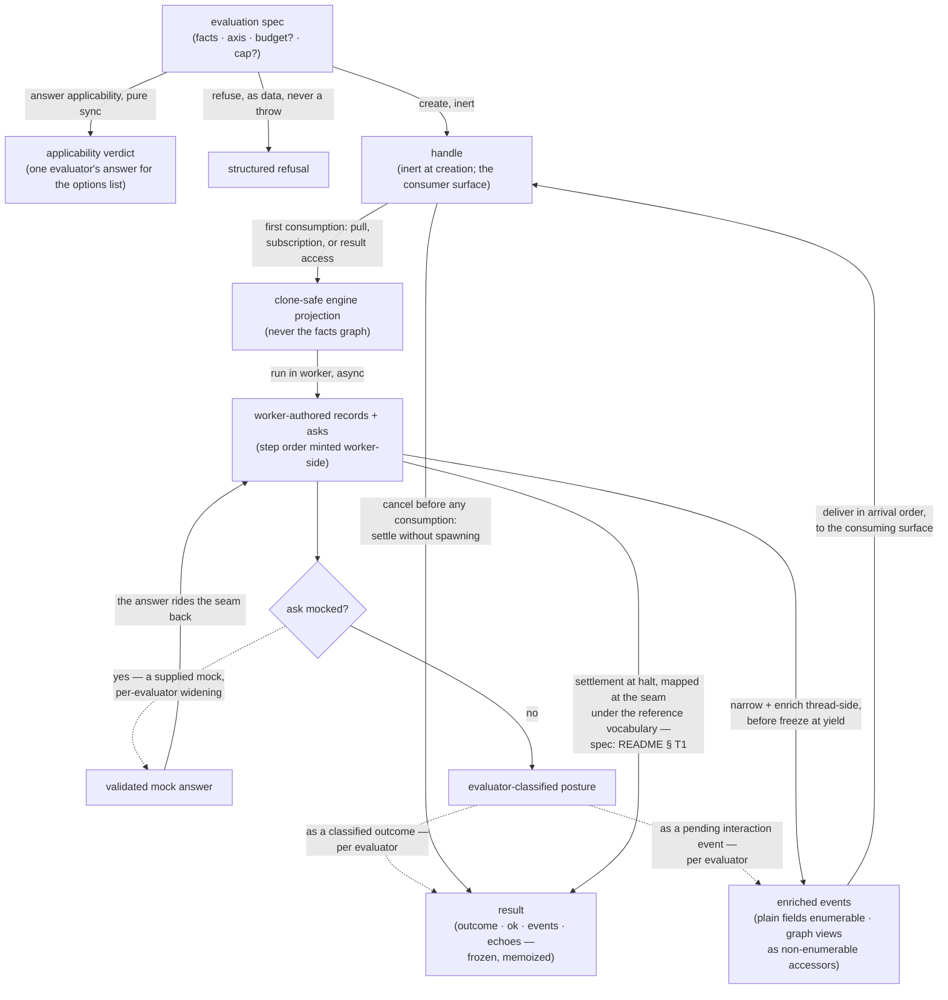

<!-- cspell:ignore bivariance bivariant Subsetting widenings -->

# evaluators — Architecture & Decisions

Region-level architecture for the evaluator kind described in
[README.md](./README.md). The package sketch owns the package-level shape; this
document constrains only this region, at its root abstraction — one evaluator's
internals are its own DOCS's business.

## Architectural sketch

> Written Phase 0, before implementation. The Refactor step is held against this
> document — not what the code does, but what shape it takes.

### Execution phases

1. **Answer applicability** (sync, pure) — the consuming lens builds its options
   list. Input: the evaluation spec. Output: the verdict.
2. **Refuse or create** (sync, inert) — main answers. Input: the spec. Output:
   an inert handle carrying its eager echoes, OR a structured refusal. No
   learner code has run; nothing engine-side exists.
3. **Start at first consumption** (the laziness latch) — the closed three-touch
   list fires: first pull, subscription, or result access. Input: the first
   touch. Output: a clone-safe engine projection — never the facts graph —
   handed to the machinery; the run begins.
4. **Stream, answer, enrich** (async) — the run speaks. Input: worker-authored
   records and asks. Output: enriched events delivered in arrival order; asks
   answered at the evaluator's own seam — a supplied mock answers, an unmocked
   ask takes the evaluator's classified posture.
5. **Settle** (async, exactly once) — the run ends, any route. Input: the
   machinery's settlement. Output: the evaluator's result under the reference
   vocabulary — outcome, ok, events, echoes, the two-value error phase on error
   arms — frozen, memoized; the result fulfills, and teardown answers out of
   band.

### Data flow

Dotted edges are per-evaluator specification, not the kind's: which mocks a spec
widening supplies, and whether an unmocked ask becomes a classified io-error
outcome or a pending-interaction event, are each evaluator's declared posture. A
pending interaction is an event — it rides the delivery flow, never the result;
only its consequences reach the settlement.

### Structural constraints

- **Refusal and results are data.** The result promise fulfills on every path;
  nothing is thrown at the learner.
- **Creation inert; consumption closed.** Nothing engine-side exists before the
  first of exactly three touches; a cancel before any of them settles without
  spawning. Teardown answers out of band, and a torn-down handle latches — a
  later pull is inert, never a fresh run.
- **Classification at the evaluator's seam.** The evaluator validates its own
  mock answers and classifies its own io failures before the machinery can
  mislabel them as machinery defects.
- **Enrichment between wire and yield.** Wire messages are clone-safe; delivered
  events are richer: plain-data fields stay enumerable, live-graph views ride as
  non-enumerable accessors resolving through the embodiment's entwined record,
  installed during message handling before the machinery's freeze-at-yield and
  never written after yield — the named, scoped exception to the
  no-mutable-closures rule. Serializing any event or result stays safe.
- **Worker-authored order is authoritative.** Step numbers and event order are
  minted worker-side; enrichment adds fields, never renumbers.
- **Facts never cross the worker boundary.** Only clone-safe projections do.
- **Level-blind.** No design argument at this layer rests on what any language
  level admits.
- **Instrumentation is assumed sound.** No contract surface reports an
  instrumentation defect; when the premise is violated, the failure presents as
  the learner's own — the cost is stated, not hidden.
- **Loud failure vs. graceful degradation:** a machinery defect is loud —
  discriminated, never disguised as a learner error; an unmocked ask degrades
  gracefully into the evaluator's declared posture; an unanswered interaction
  never hangs the settle channel.

### Out of scope

- Level validation and marking (the orchestrator's, live-wired), and formatting
  (level-shipped editor data).
- Replay and re-iteration (ruled out; the result's events array is the record).
- Per-evaluator surfaces: generator members, io mock shapes, event unions, error
  taxonomies, result types, `ok` truth tables.
- The execution-handle library's construction seams (its own trio), the
  machinery's internals and the error-phase engine increment, the deprecated
  region, and `danger`.
- Sandbox pages (each evaluator chain builds and extends its own).
- A script-semantics execution path (see § Decisions).

## Decisions

- **Why a handle, not a bare stream** (human ruling 2026-08-05): zero current
  consumers to migrate; the handle is a strict superset that leaves
  consumer-paced iteration intact; and an `AsyncIterable<never>` exists only to
  satisfy an interface it does not benefit from — the settle base answers that
  third ground structurally.
- **Why creation is inert against the reference** (human ruling 2026-08-06):
  start-at-first-consumption keeps both consumption modes byte-equivalent from
  first consumption on, adds hold-without-running, and kills the reference's
  one-microtask claim race. The three-touch list matches the machinery's own
  laziness contract and the retained result-access-starts-a-run expectation, so
  the kind, the machinery, and the regression net agree on what "first
  consumption" means.
- **Why the settle base exists, and its name** (ruled 2026-08-17, at this unit's
  design review): the reference's own run handle settles without streaming, so
  constraining every main to the streaming shape would re-commit the sham the
  handle ruling condemned; and a result-only handle must stay constructible.
  `ExecutionBase` is base vocabulary — the reference reserves the `…Handle`
  suffix for per-evaluator widenings, and the region keeps that convention.
- **Why the outcome union is exported, subset-legal** (ruled 2026-08-17): prose
  alone lets two evaluators spell one outcome two ways — the silent drift this
  campaign exists to end — while a closed kind union would pre-answer a future
  tracer's vocabulary question. Subsetting pins the shared spellings at compile
  time; extension in an evaluator's own types keeps the vocabulary open.
- **Why the machinery-defect discriminant is pinned, shape deferred** (ruled at
  this unit's sketch review): the defect channel is kind-level ("three channels,
  never mixed") and consumer-visible across evaluators, so its discriminant
  literal gets the same anti-drift pin as the outcome union; the record behind
  it — causes, names, messages — is seam material each evaluator maps from the
  machinery in its own types.
- **Why no shared result type or settlement type**: the machinery's own contract
  invites the kind to own its settlement vocabulary and leaves arm count and
  naming to it; results are fully evaluator-owned, so the kind pins spellings
  and channels, never shapes.
- **Why io is per-evaluator** (human ruling 2026-08-06): the two evaluators'
  mock surfaces differ in shape AND in no-mock posture — a classified io-error
  outcome on one, a pending interaction on the other — and a shared shape would
  be either wrong or lowest-common-denominator, the exact foreclosure the
  config-richness ruling forbids.
- **Why the axis stays two-valued, and the script-semantics record** (human
  ruling 2026-08-13): the kind names the gap honestly — a script-goal snippet
  posed on the function axis gets function-body semantics — and ratifies no
  path. The candidate on record: indirect eval runs in global scope and takes
  globals by assignment; its live constraints are that strict-mode eval gets its
  own variable environment, that `importScripts` needs a classic worker the
  module bootstrap forbids, and that per-run blob WORKER SCRIPTS are ratified
  out (the module path's per-run blob URL for learner code is a different
  object, and live). **No execution path is ratified.** A third axis value joins
  only through its own design review, with its own review pair and engine
  increment.
- **Why the envelope's members are function properties** (ruled 2026-08-17):
  method-shorthand parameters are bivariant, and bivariance silently erases the
  compile-time misplacement signal the spec-widening rule provides. The syntax
  is part of the contract; the type-contract suite demonstrates both sides.
- **Why enrichment extends the data-only precedent** (human ruling 2026-08-06,
  extension challenged and kept at this unit's design review): the reference's
  newer tracer declined a node reference to keep events immutable and results
  serialization-safe. Non-enumerable accessors are data-equivalent on every
  count that ruling protected — serialization stays safe, enumerable fields stay
  plain, no second node-identity space is minted — and they answer through the
  embodiment's own entwined record, which the older reference lacked. The one
  new cost is named in the README: a result held across a re-embodiment answers
  its accessors from a stale graph; the plain-data node path is the durable
  attribution.
