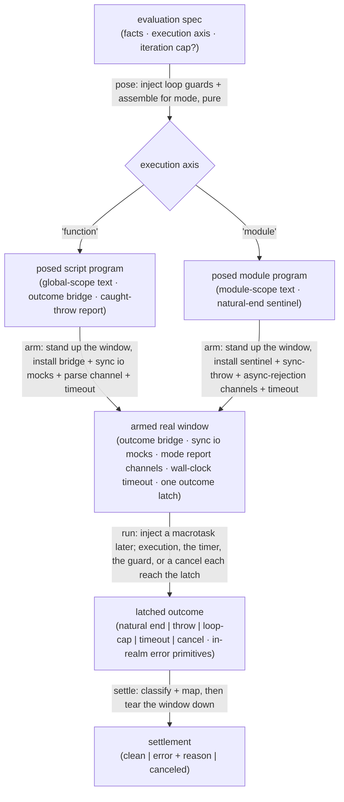

# danger — architecture

> Written Phase 0, before implementation. The Refactor step is held against this
> document — not what the code does, but what shape it takes.

danger wraps a copied real-window backend behind the evaluator kind contract. Its
whole job is to run a learner's program in a live, same-origin iframe and report
only how the run ended. It emits no events; its output is the settlement.

## Execution phases

1. **Pose** (sync, pure) — turn the evaluation spec into an *injectable program*.
   The learner's source is instrumented with the runaway-loop guard (and, if the
   step-from-the-top toggle is on, bracketed for the debugger), then assembled for
   its mode. **Script mode** wraps it as a global-scope program that reports its
   own natural end and any caught throw through the outcome bridge, and preserves
   the learner's line numbers. **Module mode** assembles it as a module-scoped
   program whose last top-level statement is a natural-end sentinel — no wrapping
   report bridge, because a module's `import`/`export` must stay top-level. The
   loop-guard's counters are baked into the program text here and cross no later
   boundary.
   Input: the spec (facts · execution axis · iteration cap?). Output: the
   injectable program text and its mode.

2. **Arm** (impure, ordered) — stand up the real window (an attached-but-hidden,
   same-origin, no-sandbox iframe) and, *before* the program can run, install the
   outcome bridge and any synchronous io mocks on it, arm the mode's report
   channels, and start the wall-clock timeout. Script mode's channels: the bridge,
   plus a pre-execution parse channel. Module mode's channels: the natural-end
   sentinel, a synchronous-throw channel, and — distinct and load-bearing — an
   asynchronous-rejection channel for a rejected top-level `await`. All channels,
   and the timeout and any cancel, feed **one first-write-wins outcome latch**.
   Input: the injectable program. Output: an armed window with a single latch.

3. **Run** (async boundary) — inject the program a macrotask later, so the run's
   "running" state can paint before any settle, then let it execute in the window:
   synchronously for script mode, deferred and asynchronously for module mode.
   Native dialogs block for real; mocked verbs answer synchronously; a learner's
   own `debugger;` is a real breakpoint. Input: the armed window. Output: whichever
   reaches the latch first — natural end, a throw, the loop-cap trip, the timeout,
   or a cancel — with the error's identity read as primitives inside the window's
   realm.

4. **Settle** (once) — classify the latched outcome and map it to the kind's
   settlement, one-to-one: natural end → clean; a throw / loop-cap / timeout →
   error carrying the machine's `{ name, message }` and danger's `reason`
   (`threw` / `loop-cap` / `timeout` respectively — a `SyntaxError` is a `threw`,
   reachable only as an assembler defect since facts are gate-guaranteed parsed);
   a cancel → canceled. Teardown of the window is **cross-phase, two-timed** (see
   the Teardown constraint), not a single post-classify step. Input: the latched
   outcome. Output: the settlement.

**Laziness wraps all four.** `main` returns a stream that runs nothing until the
consumer first pulls it; the first pull drives Pose → Settle, and breaking out of
the pull is the cancel that reaches the latch. Because danger emits no events, the
stream is a hand-rolled iterator whose teardown cancels out of band — an async
generator's teardown would queue behind the single, run-length pull and could not
cancel a live async module promptly.

**Backend options are danger-owned, not spec fields.** The sync io mocks, the
seconds budget, and the debugger-bracket toggle are danger's own (`DangerRunOptions`),
defaulted, and largely absent in production (io is a test affordance; the debugger
bracket defaults off). They fold in at Pose (the toggle) and Arm (the io mocks and
the timeout); the data flow below omits them as danger-owned defaults rather than
inbound spec data.

## Data flow

## Structural constraints

- **The window must be connected.** The iframe is attached to the document
  (hidden, never detached): native dialogs and a real `debugger;` — danger's whole
  substrate — silently fail in a detached frame. A fail-loud dev-mode precondition,
  not an optimization.
- **The bridge is armed before the program runs.** In script mode the program
  settles the instant it is injected, so the outcome bridge, the report channels,
  and the io mocks must be installed on the window *first*; otherwise a natural-end
  or throw report has nowhere to land and the run falls through to a mis-reported
  timeout. A strict ordering invariant.
- **The outcome latch is first-write-wins.** Exactly one outcome settles the run;
  a post-settle late throw, rejection, or timer is inert, never a re-settle. The
  latch receives from four sources — execution (natural end / throw), the guard
  (loop-cap), the timer (timeout), and the consumer (cancel).
- **Module mode must catch the asynchronous rejection channel.** A rejected
  top-level `await` surfaces as an unhandled rejection, not a synchronous throw;
  missing that channel would let the run fall through to the timeout and
  mis-report a learner's real error as "timed out." Fail loud on the rejection —
  do not degrade to a timeout.
- **io mocks must be synchronous.** A real synchronous `<script>` cannot await; a
  promise-returning mock would surface as `[object Promise]`. The mock contract
  admits no promise arm — enforced by the types, not by convention.
- **The run settles no earlier than a macrotask.** Injection is deferred so the
  consumer can paint a "running" state before the settle; a synchronous settle
  during injection would coalesce running and settled into one frame.
- **A synchronous freeze is irreducible.** The loop-guard breaks braced runaway
  loops; an unbraced infinite loop or deep recursion freezes the tab, and neither
  cancel nor the timeout can run. This degrades to a frozen tab by design — the
  price of a real-window, main-thread substrate — and is mitigated only by the
  loop-guard, never eliminated.
- **The outcome bridge is forgeable.** The program shares the window, so it could
  overwrite the bridge it reports through; accepted exposure, as in the classic
  `<script>` posture — documented, not defended.
- **Facts are read directly on the main thread.** danger runs in-thread, so it
  reads the given source directly (no clone-safe projection); it narrows any
  derived fact stage it reads once, treating an unreachable failure as a loud
  dev-mode defect.
- **Teardown is synchronous, on every settle.** The runner removes the window the
  instant the outcome latches — a cancel, a natural end, an error, or the timeout
  alike. The Phase-0 sketch proposed a *two-timed* teardown (deferring the
  non-cancel removal one tick, lest the window be detached from inside its own
  realm's callback); real-browser evidence (the runner's `*.browser.test.ts` in
  Chromium) superseded that precaution — the reporting call (the module's `done()`
  sentinel, or the throw itself) is always the program's terminal statement, so no
  code runs in the torn-down realm after removal, and synchronous teardown is safe.
  The consumer-side cancel (a lens unmount breaking the pull) drives teardown by
  calling the backend's `cancel()`.

## Out of scope

- **Events and pending interactions.** danger emits neither — its real window
  answers its own dialogs. Rendering a program's I/O to the four audiences is
  **intercept's** job, not danger's.
- **The execution engine.** danger does not drive the shared off-thread engine
  (`lib/engine`); a killable worker structurally cannot host a real window, native
  dialogs, or a real `debugger;`. danger is the real-window substrate instead.
- **Import maps / bare specifiers.** Module mode resolves full-URL and (given a
  real iframe base) relative imports; a bare specifier needs an import map —
  deferred, not built here.
- **The run lens's zoning and rendering.** danger's window is execution substrate;
  how the run lens positions or reveals it is the lens's concern.
- **Language-level content and the kind contract itself.** danger conforms to the
  committed `evaluators/types.ts`; it adds no field to the spec (io, debugger, and
  the timeout are backend-owned) and does not edit the kind.
