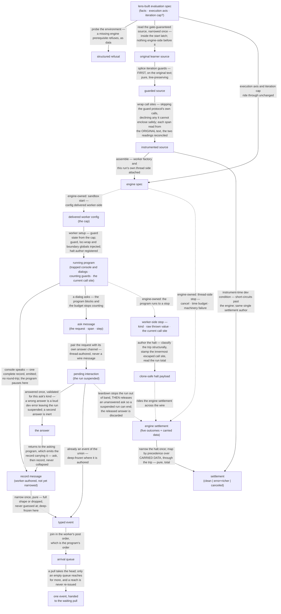

# evaluators/intercept — Architecture & Decisions

## Context

intercept is the boundary evaluator: it proves the kind's event channel and its
distinguished pending interaction on the first evaluator that has either. Where
the sibling evaluator emits nothing and answers only how a run ended, intercept
streams what the program said to its host and what it asked of its user, and
suspends the run at every ask until the consumer answers. The vocabulary is
pinned in [README.md § Ubiquitous language](./README.md); the kind's obligations
in [../README.md](../README.md); the engine's machinery in
[../../lib/engine/DOCS.md](../../lib/engine/DOCS.md).

## Architectural sketch

> Written Phase 0, before implementation. The Refactor step is held against this
> document — not what the code does, but what shape it takes.

### Execution phases

(The kind's Gate phase — applicability — is the constant-true verdict here;
nothing to zoom into.)

1. **Probe** (sync, at the kind surface) — the environment is probed for the
   engine's two prerequisites; missing either, main answers with the one
   structured refusal naming the absent capability. Otherwise main hands back
   the stream, having executed nothing. Input: the evaluation spec. Output: the
   stream, or the refusal.

2. **Instrument** (sync, pure, inside the start latch) — on the first pull, and
   never before: the gate-guaranteed source is read and narrowed once; iteration
   guards are spliced into the ORIGINAL text; the loc wrap then rewrites that
   guarded text, skipping the guard protocol's own calls and declining any call
   it could not enclose without changing what the program means. Each span is
   reported from the learner's own text, not from the guarded text the wrap is
   splicing into, and the two readings are reconciled — a disagreement about
   which calls exist is a machinery defect, never a silently shifted span.
   Input: the evaluation spec's source. Output: the instrumented source.

3. **Assemble** (sync, pure) — the engine spec is built: the instrumented
   source, this run's own worker factory and thread side, the cap and the
   execution axis riding through unchanged. A dev condition from either phase
   short-circuits past the engine and settles the defect arm **through the same
   single settlement-authoring path the mapper feeds**. Input: the instrumented
   source and the spec. Output: the engine spec.

4. **Worker setup** (worker-side, once, at sandbox start) — one run's guard
   state is built from the delivered cap, and the injected globals are the guard
   helpers, the loc-wrap helper, and the trapped console and dialog surfaces: a
   worker has no dialogs at all, and its own console would escape observation,
   so injecting these surfaces IS the observation. The halt author is
   registered. Input: the delivered worker config. Output: a program environment
   that counts, attributes, and speaks.

5. **Speak and ask** (worker-side, per boundary moment) — a console call emits
   one complete record and the program pauses there. A dialog **asks first** —
   the program blocks and the budget stops counting — and only once the answer
   arrives does it emit the record carrying what it received, then return that
   value to the program. The two are never collapsed, and at most one moment is
   in flight. Input: the running program. Output: records and asks, in the
   program's own order.

6. **Serve the ask** (thread-side, per dialog moment) — the ask becomes the
   suspended event with its own answer channel, and the run stays suspended
   until that channel is answered. An answer is validated for its ask's kind, is
   inert the second time, and is inert after teardown — teardown being consulted
   first, so a late answer never throws, and a late answer that would have
   failed validation is diagnosed rather than passing silently. Input: the ask.
   Output: the answer, or nothing.

7. **Narrow the record** (thread-side, per record, pure) — one opaque worker
   message becomes one typed event, deep-frozen by this author; a message
   failing the narrowing is dropped rather than guessed at. Input: an opaque
   message. Output: a typed event.

8. **Serve the pull** (thread-side, per consumer pull) — the engine's stream is
   claimed as the run starts, before its settlement is ever touched. Thread-side
   arrivals — narrowed records from the item path, asks from the call path —
   join ONE arrival queue in the order the worker posted them, which is the
   program's own order. A pull takes the queue's head; only an empty queue
   reaches to the engine for more, and a reach already outstanding is retained
   rather than re-issued, so an event arriving on a retained reach is held for
   the next pull. A pull outstanding when the run ends completes as the stream's
   end. Input: the consumer's demand. Output: one event, or the end.

9. **Author the halt** (worker-side, at every worker-side stop) — the raw stop
   becomes the clone-safe halt in the throw's own realm: the guard's throw
   classified structurally, the innermost call site the throw escaped stamped
   onto it, the run total read, a non-Error throw rendered honestly. Input: the
   stop kind and the raw thrown value. Output: the halt payload.

10. **Map the settlement** (sync, pure, TOTAL) — the engine's settlement is
    translated onto the kind's three arms by a precedence rule over the CARRIED
    DATA, running through the trip: a well-formed trip means the guard stopped
    the run, else a non-natural halt means the program threw; natural-end halts
    fall through — else an engine-made error answers, the budget or the
    machinery; else a consumer-ended run is canceled and a completed one clean;
    every remaining combination is the defensive defect arm, loudly flagged. The
    halt payload is narrowed exactly once, here. Input: the engine settlement.
    Output: intercept's settlement — its error arm carrying the run total and
    either the guard's trip or the throw's call site — deep-frozen.

11. **Settle once, releasing what is suspended** (teardown) — the companion
    promise resolves exactly once, whatever ended the run. Ceasing to pull stops
    the run **out of band** — never through the engine's own stream exit, which
    waits for a settlement the suspended ask is itself blocking — and only then
    releases any unanswered ask, so the released answer is discarded rather than
    resuming a program that is already over. A pull outstanding at teardown
    completes as the stream's end. Teardown latches: a later pull is inert and a
    later answer is a no-op. Teardown before the start latch ever opens settles
    canceled with nothing having existed engine-side. Input: the run's end.
    Output: the settlement.

### Data flow

Dashed edges are consumer- or engine-owned — outside this module, shown for
orientation.

### Structural constraints

- **The kind surface is synchronous; the stream is the only async thing.**
  Nothing engine-side exists before the first pull.
- **One refusal, environment-only.** After the probe, every dev condition
  settles on the defect arm; the module never throws at the learner and never
  refuses twice.
- **The settlement has exactly one author.** Instrument-time defects, engine
  settlements, and pre-start teardown all resolve through one authoring path.
- **Guard-first on the original text; the loc wrap second, blind to the guard.**
  A trip's span is faithful because the guard ran on the learner's own text; a
  call's span is faithful because it is reported from that text rather than from
  the guarded text the wrap rewrites. The wrap skips the guard protocol's own
  calls, so it never wraps them.
- **Instrumentation preserves meaning or declines.** A call the wrap cannot
  enclose without changing what the program means is left alone and carries no
  span. Turning a working program into a syntax error the learner never wrote is
  the one outcome this phase may not produce.
- **Splice and inject are one obligation, twice over** — guard calls with the
  guard helpers, wraps with the wrap helper. Both pairs are intercept's; the
  engine only carries the config between the halves.
- **Console is emit-only; a dialog is ask-then-record**, order-critical: the
  record carries the answer precisely because the ask completed first.
- **At most one boundary moment is in flight**, so an answer channel is never
  re-entered and two interactions are never pending at once.
- **One arrival queue preserves the program's order; a pull takes its head.**
  Records and asks reach the thread on two different engine paths, serviced in
  the order the worker posted them, and they join a single queue in that order.
  Ordering is therefore a property of the queue, not of which source happens to
  be ready when a pull arrives — a rule that races the two sources at every pull
  can deliver a later interaction ahead of an earlier record, which would break
  the adjacency the pairing rests on.
- **The engine's stream is claimed at the start**, before its settlement is ever
  touched: an unclaimed stream is drained by the engine on the consumer's
  behalf, consuming the very records this module exists to yield.
- **A reach for the next engine item is never duplicated**, because the engine
  keeps one waiting pull and a second request would strand the first forever.
- **The hold is exact except across one interaction.** A record's emit-pause
  holds the program until the consumer takes it — that is what demand-driven
  reaching buys — with one bounded exception: a reach retained while an ask is
  answered releases the next event's pause, so at most one event of slack
  follows a pending interaction. It is held in the queue, never lost or
  reordered.
- **Teardown stops the run out of band, then releases what is suspended**, and
  never through the engine's own stream exit — that exit waits for a settlement
  the suspended ask is blocking, which is the deadlock this ordering prevents. A
  pull outstanding at teardown completes as the stream's end.
- **Events are deep-frozen where they are authored** — a record at its
  narrowing, a pending interaction where it is paired with its answer channel;
  both thread-side. The engine's freeze at yield is shallow and reaches only
  what came through its message path, so it is a floor this module exceeds.
  Freezing does not disable an answer channel.
- **The halt is authored worker-side in the throw's own realm**; classification
  is structural, never message-matching; the payload crosses the wire as plain
  clone-safe data and is narrowed exactly once, thread-side.
- **The settlement mapping is pure and total by construction**, its precedence
  running through the trip rather than through the presence of a span.
- **Everything returned is deep-frozen at the boundary.**

### Out of scope

- **Answering interactions** — intercept supplies no answer and has no default
  for one; a backend that answers its own dialogs is the real-window sibling's.
- **Ending a suspended run** — the budget is disarmed while a dialog waits and
  the machinery is blocked behind it, so nothing outside this module can end
  one: answering or tearing down is the consumer's, and the unbounded wait is an
  accepted cost of holding the program.
- **Sizing an answer against the call channel's ceiling** — the consuming
  lens's; an answer the channel cannot carry settles the defect arm.
- **Rendering** — dialog cards, output channels, pairing a card with its record,
  per-audience wording: the run lens's.
- **Interior observation** — variables, scopes, expression values, node paths,
  an index of source positions: the tracers'. The two passes here enforce and
  attribute; they observe nothing.
- **Recovering a location a wrap did not supply** — no stack is parsed.
- **Guard semantics and loop placement**, and any cap policy beyond the
  pass-through — the shared machinery's.
- **Engine mechanics** — worker lifecycle, pause protocol, budget, draining, and
  the call channel's payload ceiling.
- **Worker-side aggregation of records** — the pressure valve against the
  engine's per-yield charge, available if a consumer ever needs it, deliberately
  not built ahead of one.
- **The sandbox page** — permanent dev infrastructure beside the module, not
  part of its contract.

## Why this design

- **Suspension replaces mocks.** The ratified design deletes the behavior
  reference's io-mock surface entirely: there is nowhere to register a handler,
  because holding the program is what reading the stream already does. The
  consequence is that liveness moves inside this module — the reference could
  tell a consumer "resolve your pending mock on cancel", and here the pending
  promise is intercept's own, so releasing it at teardown is intercept's duty.
- **A dialog is two events because the kind's envelope leaves no other shape.**
  The distinguished event's kind is a fixed literal, so it cannot also be the
  record the event union requires. Adjacency then pairs them for free — but only
  if delivery order is the queue's, which is why the queue is a structural
  constraint rather than an implementation detail.
- **Console is emit-only now that mocks are gone.** The reference routed console
  through the same round-trip as dialogs for one reason — the consumer's mock
  had to be awaited. With the mock gone, the round-trip buys nothing and costs
  one pause per console call.
- **The trip carries the loop; the wrap carries the call.** Splitting a limit
  trip into a classification flag and a bare location would put two location
  fields on one halt, and they would disagree the moment a guard throw crossed a
  wrapped call. One record, one attribution.
- **Ordering is not interchangeable.** Guard-first exists so a trip's columns
  are the learner's; the wrap's skip rule exists so it never rewrites the
  guard's own calls. The behavior reference runs the reverse order, and
  reproducing it would quietly corrupt exactly the attribution both instruments
  exist to provide.
- **The per-yield charge is priced, not worked around.** The engine's budget
  measures runtime honestly and pauses for interaction and think-time; the flat
  charge on top is a synthetic valve for render-bound loops, and at one record
  per console call it is what binds first. Naming the cost is the sibling
  tracers' recorded discipline; the narrower fix — no synthetic valve for a
  consumer that owns its own iteration cap — belongs to the engine, not here.

## Testing

See [README.md § Testing posture](./README.md). The split is logic versus
timing, not console versus dialog: the fake transport runs the whole program
eagerly before the first pull is answered, so it evidences everything intercept
computes about the console path and nothing about when. The interaction channel
is Node-tier too, but driven **directly** — never through the fake, which
rejects an asynchronous round-trip outright and would settle a dialog program as
a defect. The hold and its one-event exception, consumer-paced execution, a
mid-stream cancel, the full ask–suspend–answer–record–resume loop, delivery
order across a dialog, and cancel-while-suspended are all browser-tier, over a
program that is still running.
