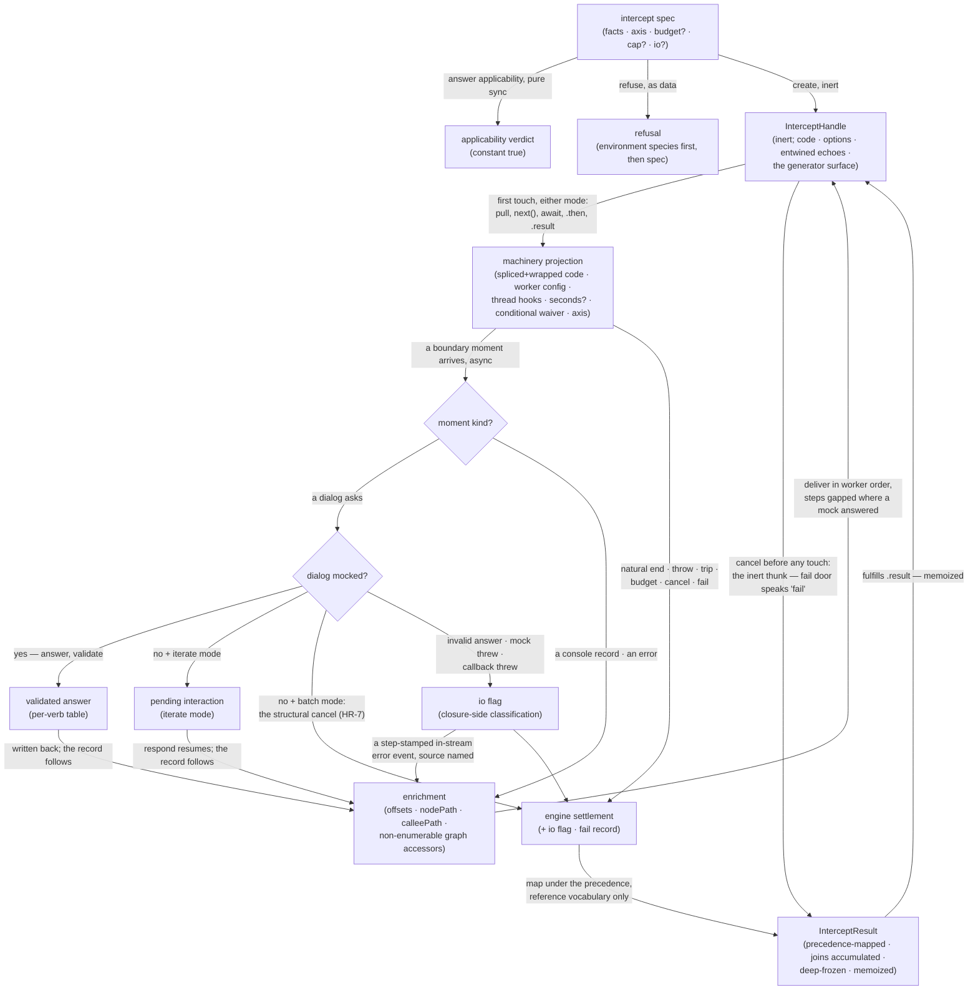

# intercept — Architecture & Decisions

Unit-level architecture for the evaluator described in [README.md](./README.md).
The region sketch owns the region shape; this document constrains only this
unit.

## Architectural sketch

> Written Phase 0, before implementation. The Refactor step is held against this
> document — not what the code does, but what shape it takes.

### Execution phases

1. **Answer applicability** (sync, pure) — constant-true; the consuming lens
   builds its options list. Input: the spec. Output: the verdict.
2. **Refuse or create** (sync, inert) — the environment refusal first (the
   shared wording), then the gate narrowing (`ast` and `entwined` facts), then
   the inert handle: the eager echoes read once, the streaming source built over
   the handle library, the generator-surface extras installed through the
   builder. Input: the spec. Output: the handle or a refusal; nothing
   engine-side exists.
3. **Ignite** (the library's start, either mode) — assemble and go: splice the
   guards on the original text, wrap the calls on the SPLICED text with spans
   read from the ORIGINAL parse, project the machinery spec (wrapped code,
   worker factory, worker config, thread hooks, seconds spread-if-set, the
   conditional fee waiver, the execution axis), begin the run, and RECORD the
   engaged mode — the ask posture reads it. Input: the start call with its mode.
   Output: a running machinery handle the source owns.
4. **Serve asks** (async, inbound, per ask) — the worker's asks are served at
   the io seam: mock first, the answer validated per verb and written back; no
   mock → the pending interaction while stepping, the structural cancel under a
   batch drain; any io failure — invalid answer, throwing mock, throwing console
   callback — RECORDS THE IO FLAG and ends the run through the machinery's call
   channel. Input: an ask. Output: the validated answer written back, the minted
   interaction, or the flagged end.
5. **Enrich and deliver** (async, outbound, per record) — the worker's records
   are narrowed once and ENRICHED (offsets, node path, callee path, the graph
   accessors; a flagged io failure also lands here as a step-stamped in-stream
   error event) before yield. Input: wire messages plus the io flag's stream
   half. Output: enriched events in worker order.
6. **Settle** (async, exactly once) — map the machinery's settlement under the
   precedence (step 0 splits cancel/fail; the io flag; the stop record's throw
   with its attributed call site; the engine-made error; the natural end; the
   defensive defect), accumulate the joins (records counted, every event joined,
   null keys excluded), deep-freeze, fulfill. Input: the engine settlement plus
   the io flag and the fail record. Output: intercept's result under the
   reference vocabulary.

### Data flow

### Structural constraints

- **The io flag and the fail record are the mapper's only evaluator-owned
  inputs** — everything else is the carried settlement; the consumer's stop
  outranks both directions (step 0: cancel route → `'cancel'`, fail route →
  `'fail'`).
- **The stop record is narrowed exactly once, thread-side** — anything failing
  the narrowing routes to the defensive defect arm.
- **Engine spellings never reach the result** — the defect-cause mirror is
  compile-locked inbound; the mapper speaks reference vocabulary only.
- **The deep freeze is intercept's** — with the accessors as the named, scoped
  no-mutable-closures exception: installed at enrichment before the machinery's
  freeze-at-yield, never written after yield.
- **Worker order is authoritative** — enrichment adds fields, never sequence;
  steps are worker-minted, strictly increasing, legally gapped.
- **The consumption laws are the library's** — including the self-iteration
  guarantee the generator surface aliases; intercept re-implements none of them,
  and its ask posture reads the mode the source learned at start.
- **Two settle routes never reach the mapper** — the library's fallback thunks
  are intercept-authored results at the seam: the inert thunk (which reads the
  fail record and speaks `'fail'` or `'cancel'`) and the broken source's
  `'unreachable-outcome'` defect.
- **Facts never cross the worker boundary** — the worker sees wrapped code and
  the worker config; enrichment resolves thread-side through the facts the run
  was driven with.
- **Two named import obligations** — the machinery's seconds default and its
  payload ceiling are imported, never re-declared (shared with run).

### Out of scope

- Caller duties, ruled: a mock's and a responder's liveness (`cancel()` is the
  exit), a mock's side effects, the spec's coherence.
- The join helper (`nodeAtSpan`) — the deepest-exact-span contract is stated;
  the helper builds beside its consumer at the enrichment increment (HR-22),
  which also owes the stack-parse position's spliced-coordinate conversion.
- run's surfaces, the engine's internals, the deprecated region, `danger`.
- The error-phase mechanism beyond the declared vocabulary (E2, the run chain's
  opener; phase rows skipped until it lands).
- `sandbox.html` until the chain's own increments (HR-15 cadence; the deprecated
  page's five checkpoint flows are the named inventory).

## Decisions

- **Why the ask posture is mode-keyed** (HR-7): under a batch drain nobody can
  ever respond, so "unanswered" is structural — no mock for that verb — and the
  run cancels at the ask with the events so far; while stepping, the ask rides
  the stream as the pending interaction. The library's mode latch is the
  delivery mechanism; the posture is intercept's own.
- **Why the generator surface aliases the memoized iterator** (human ruling
  2026-08-19, the library's self-iteration amendment): stepping and looping are
  one consumption path only if there is one iterator; the alias makes `return()`
  literally the function `for await`-break invokes, and `next()` substitutes the
  settled result on every done route.
- **Why `throw(thrown)` is the fail door** (its supersede row): the reference's
  native `.throw` skipped teardown — a latent defect; nothing is ever thrown
  into the learner's program, so the only honest semantics is the structured
  consumer stop.
- **Why the fail door speaks the machinery's own `fail`**: the engine's
  `'failed'` settlement is then real, carried data — the mapping never guesses;
  pre-ignition, the inert thunk reads the fail record instead (the library's
  route, intercept's shape).
- **Why the attribution fallback carries the one sanctioned stack parse** (human
  ruling 2026-08-19): a throw with no live wrapped frame has no other input —
  the alternatives were losing attribution the reference had or a fallback with
  no arm; the parsed position is in spliced coordinates, and its column is
  corrected WORKER-SIDE through the config's per-line splice deltas before
  stamping (human ruling 2026-09-01, ledger `9e692aa7`) — one coordinate space
  on the wire.
- **Why record-only console** (human ruling 2026-08-19): the record IS the
  observation and the lens renders it; the host console stays the machinery's.
  The whole-surface trap with an open-string `method` keeps every legal call
  faithful (HR-18); mock keys stay the closed nineteen.
- **Why the conditional fee waiver** (human ruling 2026-08-19): the waiver's
  premise is that loop safety rests on the cap, so it arrives only with a
  finite, positive cap — one named owner, always; pin :495 stays retained for
  the fee-charged case.
- **Why `visitCounts` counts records**: two moments, one dialog — counting
  delivered events would make the number mock-dependent; the record exists on
  both paths, so the count means what the reference's meant.
- **Why null keys are excluded, not bucketed**: an honest absence is readable
  (run's iteration-count rule, same ground); the event still rides `events` with
  its `loc: null`, so nothing is hidden — it just mints no key.
- **Why the result is discriminated on outcome** (run's HR-4 exception, mirrored
  with citation): each arm carries exactly the fields that exist for it; runtime
  values identical to a flat shape.
- **Why `entwined`, eager** (two ruled departures, 2026-08-19): run's `ast` is a
  real `Program` — one region must not spell two things one way — and the gate
  guarantees the entwining before main is driven, so the reference's Promise
  wrapper is ceremony.
