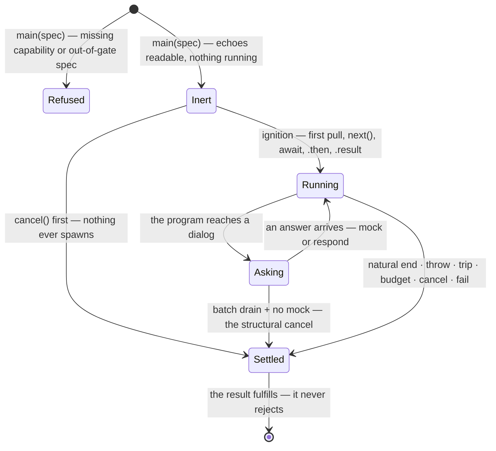

<!-- cspell:ignore steppable unmocked -->

# The intercept machine

intercept's notional machine — the operational model a consumer or contributor
predicts against when holding an intercept handle. The region's
[notional machine](../notional-machine.md) models the consumption surface and
the shared kind signature; this document opens its black box intercept's way —
and the region model names two things as THIS model's own: the generator surface
(`next`/`return`/`throw`) and what an unanswered ask does under a drain. What
stays closed here is the machinery's own machine (worker, transport, budget
mechanics — [`../../lib/engine/README.md`](../../lib/engine/README.md)'s
business) and the handle library's internals (intercept inherits the consumption
laws structurally and restates only what a holder observes).

Everything stated here is committed contract ([README.md](./README.md); the
region root; the handle library's laws) restated as behavior; nothing narrows or
extends it. Pedagogy is not decided here.

## The machine at a glance

intercept is a **conversation machine**: touched into running, it yields the
program's boundary moments one at a time — console records, dialogs, errors —
enriched against the embodiment, and it can be STEPPED, ANSWERED, and ENDED from
the consuming side. A console call is a record: it happened, nothing returns. A
dialog is an exchange: the program suspends on it until an answer arrives — from
a supplied mock, silently, or from the consumer, through a pending interaction
riding the stream. The run settles exactly once, whichever door ends it, and the
result carries every moment that was delivered.

## One run's life

`Running` is the region machine's own state name; `Asking` is intercept's
refinement of it — the program suspended on a dialog, still one run. `Asking`
inherits `Running`'s remaining exits (cancel, fail, the budget, a machinery
defect) beyond the ones drawn.

## The generator surface, as behavior

The handle is steppable — the three generator members are consumer verbs with
specified consequences:

- **`next()`** delivers the next moment, exactly as one turn of a `for await`
  would; the two are ONE consumption path, so a first `next()` ignites the run
  in iterate mode and a later loop continues where stepping left off.
- **`return()`** is the break door: the run tears down — a pending ask is
  released, the machinery stops — and the call resolves with the COMPLETE result
  only after the run has settled. Breaking out of a `for await` routes through
  it: break waits for settlement, and what it leaves behind is a settled
  `'cancel'` result carrying the events so far.
- **`throw(thrown)`** is the fail door in generator clothing: identical to
  `fail(thrown)` followed by settlement — the result answers `outcome: 'fail'`
  with `reason === thrown`, and the call resolves with that result. Nothing is
  ever thrown INTO the learner's program.
- **`cancel()` and `fail(reason)`** work from outside any loop — a Stop button
  and a structured stop, respectively — idempotent, first door wins.

## What is asked and answered

- **Mock first, silently.** A supplied dialog mock answers at the seam BEFORE
  any pending interaction exists; the stream then shows only the answered
  record. The answer is validated per verb — an invalid answer (a number from
  `prompt`, an `undefined` from `confirm`) is an io error, never a silent
  coercion.
- **No mock, stepping consumer: a pending interaction.** The ask itself rides
  the stream as an event carrying `respond`. Its three guarantees: `respond`
  resumes the run from the event itself — never through the iterator; answering
  twice is inert; answering after teardown is a no-op. A wrong answer SHAPE is a
  loud, retryable error at the responder — the run holds, unharmed.
- **No mock, batch drain: the run cancels at that ask.** Nobody is stepping, so
  nobody could ever respond — "unanswered" is STRUCTURAL (no mock supplied for
  that verb), never a timer. The run settles `'cancel'` with the events so far.
  This is the region model's deliberately open cell, closed here: intercept's
  declared posture reads the consumption mode the run ignited under.
- **An unmocked dialog under a stepping consumer is two adjacent moments.** The
  ask (pending interaction), then the answered record — nothing can land between
  them, because the program is suspended for the dialog's whole span. A mocked
  dialog is one moment: the record alone.
- **Console is never an ask.** Every console call is recorded — the nineteen
  standard methods are the documented set, but the trap is whole-surface, so an
  exotic legal call records faithfully; a supplied per-method callback (the
  closed nineteen mock keys) is awaited before the program continues, and a
  callback that throws is an io error — the io layer failed the program,
  discriminated from the learner's own error.
- **Run answers the same silence differently.** The sibling asymmetry is ruled:
  an unmocked verb ENDS a run (classified io error) and CONVERSES here —
  intercept's lens renders interaction; run has no stream to carry an ask.
- A mock's liveness is the consumer's own, and a cancel during an in-flight mock
  discards its answer — both exactly as run's model states them.

## What is delivered, and what is counted

- **Moments arrive in worker order, step-stamped, never renumbered** —
  enrichment adds fields, never sequence; delivered steps are strictly
  increasing, not contiguous (a mocked dialog's ask consumed an ordinal the
  stream never delivers — a gap is meaningful, not a defect).
- **Delivered events are richer than wire messages**: the span and offset pair
  in the learner's own coordinates, the resolved `nodePath`, and the live-graph
  views (`node`, `prev`, `next`, `callee`) as non-enumerable accessors —
  serializing anything stays safe, and `event.node` answers with the real
  entwined node of the facts the run was driven with (stale across a
  re-embodiment; `nodePath` is the durable attribution).
- **A moment the wrap declined has no identity**: `loc`, offsets, and `nodePath`
  are `null` together, the event still rides the stream, and it is EXCLUDED from
  `visitCounts` and `eventsByNode` — an honest absence, never a sentinel bucket.
- **Counting under always-splice**: the iteration total is real on every worker
  halt; a tripped cap carries the guard's whole trip record (accident-proofing,
  not malice-proofing — the guard's own qualification); `iterationCount` exists
  exactly where a halt carried it.
- **Errors land twice, by design**: in the stream as a step-stamped `'error'`
  event (in-timeline rendering, its optional `source` separating an io failure
  from the learner's own throw without waiting for the settle) and on the
  settlement in structured form — attributed to the wrap's innermost live call
  site, or, for a throw with no live wrapped frame, positioned by the campaign's
  one sanctioned stack parse (README § The seam carries the exception and its
  coordinate constraint).

## Settlement honesty

- intercept speaks all six outcomes, and `ok` is true on
  `'complete' | 'cancel' | 'fail'` — cancel and fail are consumer verbs, not
  failures. Knowing the outcome does not give `ok` without this table; run's is
  stricter.
- The consumer's stop outranks everything: a run ended by `cancel()` settles
  `'cancel'` and one ended by `fail(reason)`/`throw` settles `'fail'`, whatever
  else was in flight — even a failing mock (run's step-0 convergence).
- A broken machine is a discriminated machinery defect, never dressed as the
  learner's error — except instrumentation's own failures, which present as the
  learner's under the assumed-sound premise (the region model carries the cost;
  the wrap is part of that premise).
- The result is the whole archive: every delivered event, the echoes, the joins.
  One shot — a settled stream does not replay; the `events` array is the record.

## What the machine never does

- Never streams a moment out of worker order, and never renumbers.
- Never mints a pending interaction where a mock answered, and never hangs the
  settle channel on its own account — the batch posture cancels at the ask; the
  stepping posture waits for its consumer, and a consumer who abandons the
  iterator mid-ask holds the run exactly as the region sanctions (ceasing to
  pull is not a stop; `cancel()` is the exit — the honest carve-out on the
  region's no-hang law).
- Never throws at the learner, into the learner, or out of the result.
- Never shows a native dialog and never forwards to the native console.
- Never replays a settled stream, and never serves data through a torn-down
  handle — a released ask's late answer is inert.
- Never lets the machinery's spellings reach the result.

## Predictions worth making

A holder of this model should be able to answer, before running:

- What `prompt()` does with no mock while stepping (a pending-interaction event
  arrives; the run holds until `respond` — or until cancel).
- What the same silence does under `await handle` (the run cancels at the ask,
  structurally; the result carries the events so far).
- Whether `respond('x')` twice double-answers (no — inert the second time), and
  what a late `respond` after teardown does (nothing).
- What breaking a `for await` leaves behind (a settled `'cancel'` result, after
  settlement — break awaits it).
- What `handle.throw(new Error('wrong'))` teaches (nothing threw in the program:
  the run settles `'fail'` with that reason).
- Whether a `console.log` inside a loop can time out a default budget (yes, when
  the spec set no real `iterations` cap — the per-yield fee still binds there;
  no, when it did — the waiver and the cap arrive together, human ruling
  2026-08-19).
- Where a throw is attributed (inside a live wrapped frame: the wrap's innermost
  recorded call site, never a stack parse; with no live wrapped frame: the
  campaign's one sanctioned stack-parse position, converted and joined to its
  entwined node).
- Why `JSON.stringify(event)` never cycles (the graph views are non-enumerable
  accessors; the plain fields are the wire truth).

## Navigation

- [README.md](./README.md) — intercept's contract; [`DOCS.md`](./DOCS.md) — its
  architecture and decisions.
- [`../notional-machine.md`](../notional-machine.md) — the region machine this
  model extends; its consumption laws are not restated here.
- [`../run/notional-machine.md`](../run/notional-machine.md) — the sibling fill:
  batch-only, the ending posture.
- [`../lib/execution-handle/README.md`](../lib/execution-handle/README.md) —
  where the consumption laws are built.
- [`../../lib/engine/README.md`](../../lib/engine/README.md) — the machinery
  whose machine stays closed here.
