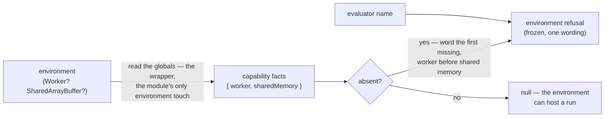

# environment-refusal — Architecture & Decisions

Unit-level architecture for the module described in [README.md](./README.md).

## Architectural sketch

> Written Phase 0, before implementation. The Refactor step is held against this
> document.

### Execution phases

1. **Read** (sync, the wrapper) — probe the two globals into the two capability
   facts. Input: the environment. Output: the facts record.
2. **Decide and word** (sync, pure — the leaf) — on an absence, build the frozen
   environment refusal from the evaluator's name and the FIRST missing
   capability, worker before shared memory. Input: the name, the facts. Output:
   the region's one environment-refusal wording, or `null`.

### Data flow

### Structural constraints

- **The leaf is pure** — facts in, wording out; no global reads, no caching; the
  sentence and the arm order live there and are pinned by exact-equality tests.
- **The wrapper is the module's only environment touch** — every call re-reads
  the globals; its tiers cross the node/browser boundary by moving test files,
  never by mocking.
- **One wording** — the refusal sentence is built in the leaf and nowhere else;
  an evaluator passes its name and never edits the text.
- **Environment species only** — spec refusals are each evaluator's own; this
  module never inspects a spec. The species taxonomy is canonical at the region
  root.

### Out of scope

- Spec validation and spec refusals (each evaluator's `main`).
- Machinery failures after the read passes (the defect channel; the engine's own
  post-spawn `EngineEnvironmentError` is the same fact on a different channel —
  README § The contract carries the seam rule).
- Where the environment read sits in an evaluator's refusal order (each unit's
  own docs).

## Decisions

- **Why a shared module** (human ruling 2026-08-18, P0-R's design review): the
  deprecated port duplicated the probe byte-identical across run and intercept,
  and two parallel Phase-0 units would have re-duplicated it — the hoist is what
  keeps the wordings from drifting while both units are designed in one wave.
- **Why the leaf/wrapper split** (human ruling 2026-08-19, the module's scoped
  design review): the repo's environment-boundary rule forbids mocking the
  globals away, and no single tier can reach every arm (node has shared memory
  without a worker; an isolated browser has both) — a pure leaf makes every arm
  and the exact wording testable with plain fixtures, while the wrapper's two
  thin tier rows keep the deprecated port's real-environment coverage.
- **Why a machinery-level prerequisite extends THIS list** rather than being
  worded per evaluator: a future engine-backed evaluator whose new prerequisite
  is the machinery's (not its own) adds an arm here — wording it locally would
  recreate the two-wordings condition the hoist retired. An evaluator-specific
  prerequisite stays the evaluator's own spec refusal.
- **Why the evaluator's name is a parameter**: the sentence names its speaker
  ("run needs …"), and the one place the sentence is built must not know its
  callers.
- **Why `null`, not a boolean**: the caller's next act on a miss is to return
  the refusal — handing it the built refusal makes the call site a two-line
  guard with no wording of its own.
- **Why the function names stay verb-first** (`refuseMissingCapability`,
  `refuseAbsentCapability`) although the common path refuses nothing: the
  region's verb-first naming convention outranks the euphony concern its design
  review raised; the names say what the non-null answer is.
