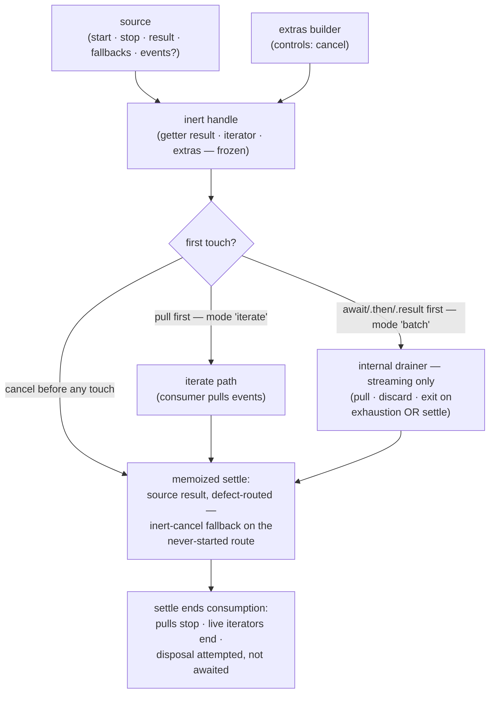

<!-- cspell:ignore backpressure empts -->

# execution-handle — Architecture & Decisions

Unit-level architecture for the factory described in [README.md](./README.md).
The region sketch owns the region shape; this document constrains only this
library.

## Architectural sketch

> Written Phase 0, before implementation. The Refactor step is held against this
> document — not what the code does, but what shape it takes.

### Execution phases

1. **Install** (sync, inert) — the factory wires the handle: builds extras over
   the controls, installs descriptors (ignition getter `result`, non-enumerable
   iterator, extras), freezes last. Input: a source + an optional extras
   builder. Output: an inert handle — unless the builder itself acted: a builder
   that throws does so synchronously out of the factory (a caller bug), and one
   that calls `controls.cancel()` yields an already-settled handle. Nothing on
   the source has been called on any of the three routes.
2. **Ignite** (sync latch) — the first consumption touch closes the start latch
   (before `start` runs — a throwing source is never re-entered), fixes the
   mode, and invokes `start(mode)` once, ever. A teardown latch already closed
   pre-empts this one.
3. **Drive** (async, one of two paths) — iterate: the consumer's pulls forward
   the source's `events`; batch: the internal drainer pulls to relieve
   backpressure, discarding, and exits on events-exhaustion OR the settle,
   whichever first.
4. **Settle** (async, exactly once) — the memoized settle IS the source's
   `result`, routed through the source-defect fallback on rejection; the
   inert-cancel fallback serves the never-started route. Settle ends
   consumption: pulls stop, live iterators end, disposal of the source's
   iterator is attempted once, never awaited.
5. **Teardown** (sync, out of band) — `cancel()` after ignition calls `stop()`
   at most once, never queued behind a pending pull; the latch holds — later
   pulls inert, cancels after settlement or before ignition call nothing on the
   source. Break — the consumer iterator's `.return()` — runs the same teardown
   sequence and resolves only AFTER the settle, never after disposal (the
   ledger-recorded deviation from the quarry's instant `undefined`).

### Data flow

### Structural constraints

- **The latch closes before `start` runs**; assembly lives inside `start`,
  invoked at most once (the restart-guard pins, discharged structurally).
- **The settle is the source's `result`** — the library adds routing (defect
  fallback), memoization, and the two fallback routes; it never authors a
  result.
- **The drainer is one internal loop**, engaged only by a batch ignition of a
  STREAMING source; iteration never engages it, a post-iterate batch touch
  subscribes to the settle instead, and an after-batch iterator is already ended
  — including one created before settlement.
- **Teardown answers out of band** — `stop()` has its own channel; nothing
  routes through the events iterator's exit, and disposal is best-effort.
- **Widening is installed, never composed** — descriptors and freeze are the
  factory's; extras keys are compile-checked against the four reserved keys on
  both overloads.
- **Two named source types** discriminate the overloads (`events` required vs
  `events?: never`), streaming declared first.
- **The handle is self-iterating** — `[Symbol.asyncIterator]()` answers one
  memoized iterator for the handle's life (ruled 2026-08-19), so the stream
  cannot be split by a second call.

### Out of scope

- What any source DOES inside `start`/`stop`/`events` — engine projection,
  worker spawn, ask postures (each evaluator's own unit).
- The handle shapes themselves (the region root's types.ts).
- Replay, auto-start (superseded; README § The laws).
- Watchdogs — liveness is the source's obligation, stated.

## Decisions

- **Why the settle is `source.result`, not events-exhaustion** (2026-08-18, this
  unit's design review): a source that settles mid-stream (intercept's ruled
  drain posture) must settle the handle with no further pulls owed — settling on
  exhaustion would hang the settle channel on the library's account; one await,
  not two.
- **Why disposal is best-effort** (same review): `events.return?.()` on a source
  suspended at its own pending pull is the deadlock route the out-of-band
  teardown pins name; disposal is attempted once, never awaited, errors
  swallowed — a suspended source's cleanup is its own liveness obligation.
- **Why the library installs the widening** (2026-08-18): `result` must be an
  ignition getter, so composing around a live handle (spread) starts the run at
  creation and drops the non-enumerable iterator; one place owns descriptors and
  freeze order.
- **Why a builder over controls, not an extras object**: extras that stop the
  run (`fail`) need the teardown door before any handle exists;
  `(controls) => extras` hands them `cancel` without a live handle.
- **Why one factory with overloads**: a base factory and a streaming factory
  would either duplicate the latch/settle core or open a private channel between
  files; overloads over two named source types keep one core, one file, one
  concept.
- **Why the mode latch**: the engine's own claim rule tolerates an early
  `result` plus a later iterator and documents the mixed case as "one stream,
  silently split"; this library trades that affordance for determinism — the
  ignition touch fixes the mode, and an after-batch iterator is already ended.
