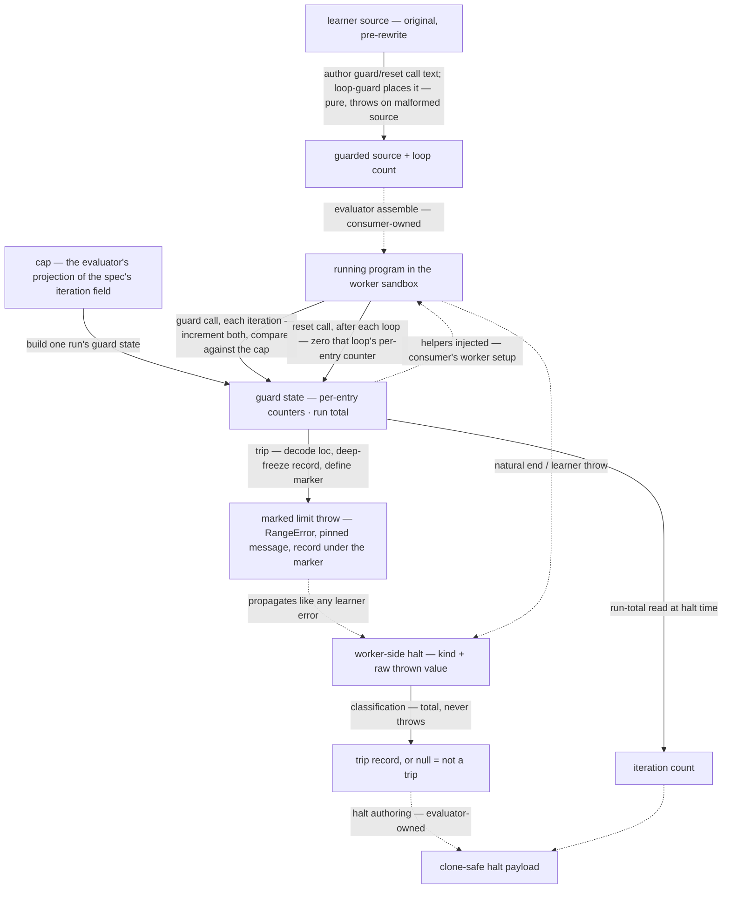

<!-- cspell:ignore callees enumerability instrumenter unforgeability -->

# evaluators/lib/iteration-guard — Architecture & Decisions

## Context

The two engine-backed evaluators (run, intercept) enforce the same
per-loop-entry iteration cap and account the same run total, with the same
worker helpers, and must classify the same trip when authoring their halts. The
package's shared `lib/loop-guard` deliberately excludes all of that — its
contract splices caller-supplied call text and owns only placement. This module
is the shared caller side: it authors the call text, implements the helpers the
text calls, and answers the halt-time classification — one protocol, one home,
consumed by both evaluators.

The protocol spans two execution sites joined only by text and names: the
**thread side** (assemble time — splicing the calls into the learner's source
before it rides the engine spec) and the **worker side** (run time — the
injected helpers counting and throwing, and the halt serializer reading the
trip). Keeping both sides in one module is the design: the spliced name, its
argument order, its loc encoding, the helper implementing it, and the
classification reading its throw can never drift apart.

## The two sides, four phases

The two-sides framing holds; within it the module has four named phases, each
with its own lifetime:

1. **Author-and-splice** (thread side, assemble time — sync, pure, throws loudly
   on a malformed source). In-file factories produce the guard text
   `__$il(n, 'L:C:L:C');` (the loop's own span encoded at splice time) and the
   reset text `__$ir(n);`; loop-guard places them. In: the original learner
   source. Out: loop-guard's result, passed through untouched. This is the
   module's only splice-side surface; pairing raw hooks with the splicer at an
   evaluator call site is the drift hazard the wrapper removes.
2. **Build guard state** (worker side, setup time — sync, once per run). One
   call allocates the closure: per-loop per-entry counters, the never-reset run
   total, the two helpers over them. In: the cap (or nothing). Out: the
   injectable helpers plus the run-total read.
3. **Count-and-trip** (worker side, per-iteration hot path — O(1), the module's
   only mutation site). Each guard call increments both counters and compares;
   each reset call zeroes its loop's per-entry counter. On a trip: decode the
   loc string, deep-freeze the trip record, define the marker, throw the marked
   `RangeError` with the pinned message. In: the spliced calls firing. Out:
   mutated counters, or the marked throw.
4. **Classify-and-account** (worker side, halt time — total, never throws). The
   evaluator's halt serializer hands whatever the program threw to the
   classification and reads the run total. In: the raw thrown value. Out: the
   trip record or `null`, and the iteration count.

## Data flow

Dashed edges are consumer- or engine-owned — outside this module, shown for
orientation; module-level tests hang only on the solid ones.

The cap is a side input to the worker side only; the splice side never sees it
(guards are always spliced — see § Why this design). The two sides join nowhere
at runtime: their only shared artifact is the call-text protocol this module
owns. The reset arrow is load-bearing: it is what makes the cap **per-entry**
rather than per-run, and reset isolation carries its own tests.

## Structural constraints

- **The call text is single-line complete statements.** loop-guard's boundary
  check makes a violation loud (`multiline-injection`), but the invariant is
  authored here — the factories never emit a line terminator, which is why that
  arm is unreachable through this module.
- **Guard-first ordering.** The splice verb runs on the original source; a
  consumer that also rewrites calls must run its rewriter after, and teach it to
  skip `__$`-prefixed callees. The residual column shift on guard-bearing lines
  is the consumer's to account for, and the compact encoding keeps it small.
- **Increment, then compare.** The tripping iteration is counted in both
  counters before the comparison throws — cap `N` means exactly `N` completed
  iterations per entry, and the run total includes the trip.
- **The marker is one own key, defined non-enumerable, non-writable,
  non-configurable, first-write.** Its value is the deep-frozen trip record
  (record, span, and both positions); no bare `loc`/`loopIndex` properties exist
  on the error, so another error stamper can never overwrite the loop span —
  each instrument writes only its own key. The key itself is a shared constant
  both the stamp site and the classification import — the wrap-helper-name
  precedent — never retyped at either site.
- **Classification is total by construction.** The WHOLE body rides one
  throw-guard; accessor-safety (presence checked without invoking getters)
  narrows what the guard must catch, it is not the guard's boundary — a trapping
  proxy whose very property inspection throws is still `null`, never an escape.
  Well-formed means the full trip-record depth with all numbers finite; anything
  less is `null`. It runs inside the halt serializer, where an escaping throw
  would be a worker crash.
- **The hot path is O(1) and allocation-free.** `__$il` runs on every iteration
  of every guarded loop; the counter store mutates in place and allocates only
  on a loop's first-ever entry. This is the module's declared mutable-state
  exception — per-run, closure-confined.
- **Per-run disposability.** One `createIterationGuard` call per run; counters
  can never leak between evaluations.
- **No cap policy lives here.** No validation, no defaulting, no finiteness gate
  — the ruling is that no iteration-cap default exists anywhere: an uncapped
  runaway is the engine wall-clock budget's to stop, and the evaluator owns any
  projection from its spec.
- **Decode at throw time.** The `'L:C:L:C'` form exists only between the splice
  and the throw; everything past the throw is clone-safe structured data.

## Why this design

- **A wrapper verb, not exported hooks.** The house precedent for "two sites
  must not drift" is a shared constant (the legacy instrumenter's
  wrap-helper-name); here the coupled surface is a name, an argument order, AND
  a loc encoding — so the whole call text is authored beside the helpers that
  implement it, and evaluators never touch loop-guard's hook seam directly. The
  factories remain in-file, documented as non-surface.
- **The marker carries the payload.** A sibling instrumenter (intercept's
  call-loc wrap) also stamps errors that propagate through it. Two stampers
  writing top-level `loc` properties is a silent wrong-attribution bug; one key
  per instrument, payload inside, first-write-wins, makes the precedence rule
  stateable in one line — and non-enumerability keeps instrumentation out of
  learner-visible enumeration.
- **A string key, not a symbol.** With the payload private behind
  `readLimitTrip`, a symbol's unforgeability buys nothing a string lacks in
  practice, and the string stays greppable and devtools-visible. The marker is
  accident-proofing, not malice-proofing — deliberate forgery is the sandbox's
  concern.
- **The classification returns the record, not a boolean.** A boolean predicate
  would leave each consumer reading `loc`/`loopIndex` off an `unknown` by
  property name — two unsafe casts, two drift chances. One verb returns the
  typed record; `null` is the recognition answer.
- **Always instrumented.** The halt contract wants a real iteration count on
  every halt, so guards are spliced and helpers count even uncapped — at the
  honest price of one call and two counter writes per guarded iteration. The
  rejected alternative (skip splicing when uncapped — the behavior oracle's
  form) is recorded in the README so it is not restored as an optimization.
- **The message is pinned.** `Loop N exceeded M iterations.` is learner-visible
  pedagogy surface and oracle parity; classification never reads it, so the pin
  costs nothing structurally.

## Out of scope

- **Placement** — loop-guard's, entirely (guarded set, anchors, line
  preservation).
- **Cap policy** — projecting, validating, or defaulting a spec's `iterations`
  is the evaluator's.
- **Halt authoring** — which `LimitTrip` fields ride a halt payload, under what
  names, is each evaluator's serializer.
- **Injection** — delivering `globals` into the program is the evaluator's
  worker setup (splice and inject are one obligation; see README § Design
  commitments).
- **The call-expression loc wrap** (`__$lc`) — intercept's own instrumenter.

## Testing

See README § Testing posture: node-only; factory-level call-text assertions plus
one thin delegation integration; guard-state arithmetic and cap edges driven as
plain functions; classification truth-tabled including the hostile-accessor
throw and the second-stamper precedence pin. Real-worker behavior is each
evaluator's browser-tier evidence.
