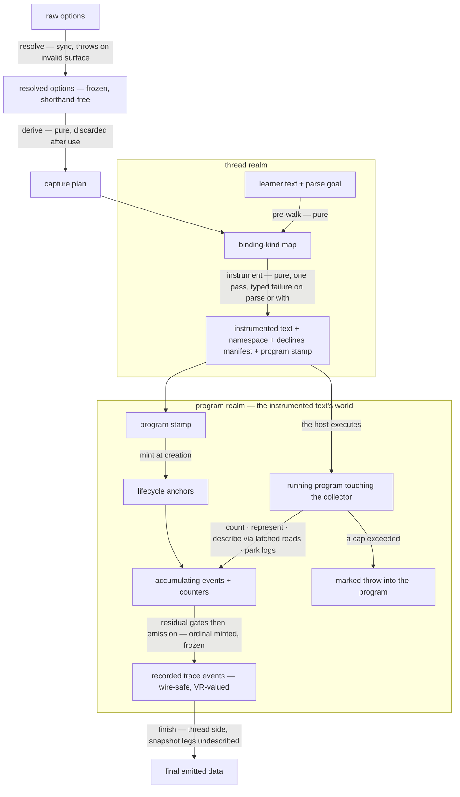

<!-- cspell:ignore klve stepperize undescribe undescribed undescribes undescribing subkind subkinds -->

# step-instrumentation — Architecture & Decisions

Vocabulary, the contracts, and the correspondence tables:
[README.md](./README.md). The machine model:
[notional-machine.md](./notional-machine.md). The data model:
[data-model.md](./data-model.md). The contract in types: [types.ts](./types.ts).

## Architectural Sketch

> Written Phase 0, before implementation. The Refactor step is held against this
> document — not what the code does, but what shape it takes.

### Execution phases

1. **Resolve** (sync, throws — the one validation boundary) — raw options in;
   expanded, defaults-filled, validated, frozen resolved options out. Shorthand
   expansion recurses; the schema refuses unknown keys and duplicate names; the
   cross-field checks refuse the incoherent configurations and enforce the
   per-list include/exclude exclusion. Nothing downstream re-validates; the
   resolved form is the only options shape any later phase accepts.

2. **Plan** (sync, pure, internal) — resolved options in; the capture plan out:
   per-node-kind, per-subkind transform decisions. An intermediate the next
   phase consumes and discards — never a consumer surface, never held.

3. **Instrument** (sync, pure; throws only its typed failure) — the learner's
   text, its explicit parse goal, the plan, and the namespace in; the
   instrumented text, the namespace, the declines manifest, and the program
   stamp out. One pre-walk (the binding-kind map) then one instrumenting pass.
   Every site gets exactly one decision — capture, count-only, or decline — and
   everything the events will need statically (paths, stamps, context, snapshot
   thunks, synthetic lifecycle events) is baked; the meta-control channel is
   baked unconditionally. A real parse/codegen failure and a `with` program
   throw the typed failure; empty code does not.

4. **Collect** (the host executes; the collector accumulates) — the instrumented
   text runs wherever the host runs it, touching the collector through the baked
   calls: counting at every observation point, recording what the plan admitted,
   representing values at capture, describing snapshot legs through latched
   reads, parking and attaching logs, tripping caps as marked throws, and
   minting the anchor family from the program stamp at creation. The residual
   runtime gates (names, range, dt/logs shaping) apply at emission; ordinals are
   minted at emission, so the delivered stream is contiguous.

5. **Finish** (sync, thread side) — the recorded events in; the final emitted
   data out: snapshot legs undescribed into re-minted values, structural marks
   riding through untouched, everything else unchanged. The north-star's
   surface.

### Data flow

Nodes are data states; the two subgraphs are the REALM BOUNDARY — an enforced
import direction (program-realm modules may never import thread-realm ones), not
just a directory:

### Structural constraints

- **One validation boundary.** Only the seam throws on options; every later
  phase takes the resolved form on trust, compile-checked.
- **The transform is pure and total over legal programs.** Same text + same
  plan + same namespace → the same instrumented output; the only throws are the
  typed failure's three reasons (parse, codegen, `with`). Empty code
  instruments.
- **Capture decisions are final at transform time.** No post-filter exists; the
  collector's residual gates shape only what the plan already admitted (names,
  range, dt/logs), never node/subkind admission.
- **The realm boundary is an import direction.** Program-realm modules (the
  collector, the event builders, the value representer, the snapshot describer,
  the trip classifier, the coercion legs, the scope runtime) import thread-realm
  modules NEVER; thread-realm modules may import program-realm types. Trip
  classification is in-realm (the marker does not survive a structured clone).
- **Counting is unconditional; recording is configured.** Every text-derived
  observation point counts (a gated-off point keeps its bare count touch);
  synthetic events emit without counting; the anchor family contributes exactly
  one ratified count. Visit counts bump once per evaluation at the node's entry
  point, before the residual gates.
- **Emission is the ordinal mint.** Steps are assigned at emission, after the
  residual gates; the delivered stream is contiguous; nothing downstream
  renumbers.
- **Events freeze at emission** and are wire-safe by construction; snapshot legs
  are the one described form, finished thread-side.
- **Caps trip inside the program** as marked throws, classified only
  structurally; a learner catch can catch them (the platform's truth).
- **Failures are loud and typed at the boundary; degradations are named.**
  Snapshot reads that would execute learner code degrade to structural marks
  (tdz, exotic); the fake-constructor path degrades under CSP to plain objects
  carrying the class name; nothing degrades silently.
- **The library never executes, poses, budgets, or delivers.** Hosts do.
  Strictness rides the learner's text through the transform untouched.

### Out of scope

- Hosting: workers, sandboxing, budgets, settlement, event delivery, the ast
  record, dialogs — the tracer evaluator unit's (the TRACER-gated ledger rows).
- The engine and the evaluator kind: nothing here imports either.
- The wrapper ecosystem, language routing, and cache ids that did not cross
  (README § What does not cross).
- D1 provenance minting, D2 chain walks, D3 async/generator/class moments, D4
  caught-throw observation, D5 increment sub-events, D6 switch/labels, D7
  destructuring/defaults, D8 module scope — contracts carried or absences named;
  implementations deferred (§ Decisions).

## Decisions

Each must-answer's decision with its trade (the ar-1 record; rulings in
KLVE-LEDGER § Rulings of record).

- **Why the name `step-instrumentation`** — names the whole (transform +
  collector + value machinery); the lineage token `stepperize` stays the
  plugin's own `name` field. Trade: the `klve` token leaves the path;
  attribution rides headers and the README.
- **Why the semantics surface** (Path B) — the 5-layer config/event model was
  litigated against the specification and is the richest lineage (HR-16); klve's
  capabilities remain the differential floor. Trade: a klve consumer's options
  do not type-check here; the correspondence tables are the migration guide.
- **Why the expression/resolve split** — the value lives in exactly one place;
  co-gating is decided at transform time. Trade: klve's one-step shape survives
  only in the differential mapping layer.
- **Why ValueRepresentation on value legs, describe on snapshot legs** — tagged
  honesty (NaN/-0/bigint/symbol) where a value is a datum; deep
  identity-preserving snapshots only where the whole environment is the datum.
  Trade: two value forms, each with one job, stated in the data twin.
- **Why in-place wraps and the decline roster** — the klve reference's rewrites
  were its measured defect surface (r8); leaving constructs native repairs by
  construction, and what cannot be wrapped soundly is declined and
  manifest-listed. Trade: declined sites are uncaptured; the manifest makes the
  absence checkable.
- **Why the lifecycle-anchor family** (the human's own design) — the trace opens
  with the embodiment lifecycle's pre-evaluation phases, asserted markers at the
  whole-program stamp; entwinement rides the embodiment's phase structures.
  Trade: four always-on events per trace; one ratified cap count for the family.
- **Why sites are text-derived observation points** — klve's push basis exactly,
  config-independent (gated-off points keep their count touch; synthetic events
  never count). Trade: sites and ordinals carry no fixed mutual ordering; the
  data twin states the invariant that does hold.
- **Why the programStamp travels through the API** — the anchors need
  whole-program legs the collector cannot derive; returning the stamp from the
  transform extends pairing-by-construction. Trade: one more member on two
  signatures.
- **Why the caps ride the collector** — execution ceilings, not capture shape;
  `maxSites` (the re-lock's spelling), `maxTime` (klve's own clock — zeroed at
  collector creation, a named delta from the reference's at-execution zero),
  `maxIterations` (klve-079's ruled facet, this module's own marker — the
  region-collision FLAG is TRACER-gated, klve-117).
- **Why the fixture oracle** — the differential floor must not depend on one
  machine's filesystem; the committed fixture is generated once by the committed
  probe against the klve package's built dist, and regeneration is a deliberate
  act. Trade: fixture staleness is possible and visible (the probe re-run shows
  drift), never silent.
- **Why latching** — learner reassignment must not undo ruled repairs; the
  engine's own discipline, with its binding-not-object caveat inherited.
- **Why the babel-standalone declaration transports** — the klve package's
  292-line `@babel/standalone` declaration is the proven minimal surface;
  extended as the port needs. The dependency itself lands with Phase 1's first
  importing code (the ledger's deferral bullet; a shared-configuration change,
  human-approved when it lands).
- **D-numbered deferrals** (each an absence named in the contract, never
  silent): **D1** provenance ids (fields carried; minting later); **D2** chain
  walks (PROVISIONAL, transported as marked; inferred when built); **D3**
  async/generator suspension and class lifecycle moments (bodies instrument;
  dedicated events later); **D4** caught-throw observation (v1's error channel
  is uncaught-only; catch-entry scope events show caught flow); **D5** increment
  sub-events (native in-place update; internals unobserved — a named
  semantics↔port delta); **D6** switch and labeled statements —
  `JumpEvent.target` and `ConditionalEvent.kind` are DELIBERATE closed unions
  whose widening paths are documented on the types, named before consumers
  narrow; **D7** destructuring patterns and parameter defaults; **D8** module
  scope and import bindings (module-goal programs instrument; module-scope
  events are withheld rather than claimed as script).

## Test taxonomy

Each tier catches what no other tier catches (the semantics DOCS' discipline,
transported):

| Tier | Scope                                                                                           | Catches                                               |
| ---- | ----------------------------------------------------------------------------------------------- | ----------------------------------------------------- |
| T1   | one seam stage / one builder / one codec half, driven directly                                  | internal logic bugs in one layer                      |
| T2   | transform output executed under a bare node host, events asserted end-to-end                    | wrap/collector protocol drift                         |
| T3   | the DIFFERENTIAL floor: pipeline output vs the committed klve fixture, per config, named deltas | silent capability loss against the ratified rows      |
| T4   | native-semantics rows (r8 facets, the decline roster, the spec lifecycles)                      | the repairs regressing toward the reference's defects |
| T5   | every emitted event validates against its variant contract (compile probes + shape rows)        | event-shape drift, incl. per-variant `semantics`      |
| T6   | equivalent configs (shorthand vs explicit) produce identical streams                            | seam-expansion drift                                  |
| T7   | the sandbox page increments (Phase 1's 🔍 cadence, per feature)                                 | what only a human eye at a running page catches       |

A green T2 run proves the protocol under one host; hosting fidelity on the
engine is the tracer unit's, deliberately out of scope here.

## Navigation

- [README.md](./README.md) — the domain model, contracts, correspondence.
- [types.ts](./types.ts) — the contract this sketch constrains.
- The twins: [notional-machine.md](./notional-machine.md) ·
  [data-model.md](./data-model.md) ·
  [ux/user-journeys.md](./ux/user-journeys.md).
- [runtime/README.md](./runtime/README.md) — the program-realm half.
- Container: [../README.md](../README.md); region root:
  [../../README.md](../../README.md).
