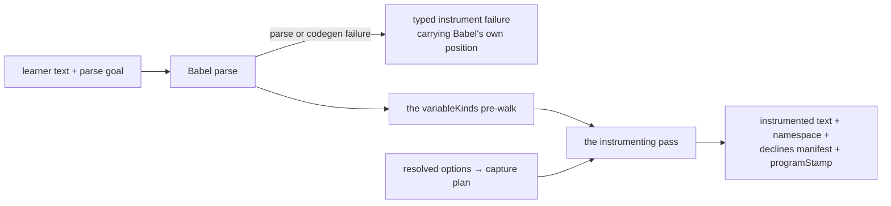

<!-- cspell:ignore klve stepperize undescribe undescribed undescribes undescribing subkind subkinds -->

# The step-instrumentation machine

The notional machine of this library — the operational model a host author or
contributor predicts against. [README.md](./README.md) says what the library is;
[data-model.md](./data-model.md) models the data it produces and holds; this
document models **how it works**, in the two parts the machinery actually has:
the **instrumentation machine** (what happens to a program's text at transform
time) and the **running machine** (what the instrumented program does to the
collector as it executes). The split is the model's spine, because everything an
event carries was decided in one of exactly two places — baked at transform
time, or observed at run time — and every honesty limit below traces to which
side decided it.

This models the machinery a FUTURE tracer evaluator will put inside the
[region machine's](../../notional-machine.md) evaluation black box; it
deliberately does not model hosting — no worker, no budget, no settlement, no
delivery (the host owns all four). **Pedagogy is not decided here** — the
contract is accuracy; [ux/](./ux/user-journeys.md) models the learners a
consuming lens serves.

## Part 1 — the instrumentation machine

**Input**: the learner's text, its parse goal (`sourceType`, explicit — never
sniffed), the resolved options, and the namespace. **Output**: a new program
text, and the namespace it was baked with. Nothing executes; this machine only
reads and writes text.



- **One pass, one decision per site.** At each loc-bearing construct the capture
  plan answers one question — capture, count-only, or DECLINE — and the answer
  is FINAL for this text: an un-configured site has no report wrapper (a bare
  count touch remains); a declined site (the roster: typeof and delete operands,
  direct-`eval` callees, `super` spines, await/yield positions, optional-chain
  interiors, LVals) has nothing at all, because wrapping it would change what
  runs. Changing configuration means instrumenting again; there is no
  post-filter.
- **What gets baked at a captured site**: the report wrapper for its event kind;
  the stamp (`nodePath` + `loc` + `start`/`end`, all from THIS parse); the
  static context an event carries (operator, subkind, names, kinds); the
  snapshot thunks where `data.scopes` is on. **What gets baked regardless of
  configuration** (meta-control): the count channel, receiver caches, the
  return-argument wrap, the function-body try/finally (the one lifecycle moment
  that is not static — a function scope leaving on error), the top-level error
  wrap, and the loop-test iteration counting.
- **Synthetic events are baked where structure is static**: scope
  create/enter/leave for blocks and loops (per-iteration for `for`/ `for-of`,
  per-call for functions), declare bursts from the variableKinds pre-walk (var
  and function bindings initializing at scope entry per the specification;
  let/const/class declaring into the TDZ), branch markers, iteration markers,
  and jump pop-reasons emitted BEFORE the jump (break and continue know
  statically what they unwind).
- **The machine rewrites as little as it can.** Loops, arrows, conditionals,
  returns, updates, and chains stay the learner's own constructs; wraps land in
  expression position inside them. The klve ancestor's restructures are where
  its measured semantic defects lived (the ledger's r8 roster); the ruled
  repairs leave constructs native.
- **Second-parse truth** (klve-027's honesty line): every stamp is Babel's
  reading of the text at instrument time. The instrumented text does NOT align
  with the learner's line-for-line; attribution downstream is stamp-based, and
  offsets — not paths — are the cross-parser join.
- **Failure is loud, typed, and rare.** A text Babel cannot parse is a typed
  instrument failure carrying Babel's own position. **Empty code is not a
  failure** — a legal Program instruments to a program that reports nothing but
  its anchors and scope lifecycle (the klve ancestor threw on it; that was
  re-adjudicated, 2026-09-06). A `with` program IS refused, on this machine's
  own ground: every identifier inside a `with` resolves through a runtime object
  no static kind map or snapshot probe can soundly model — any wrap inside it
  would be a guess.
- **Strictness rides the learner's text.** This machine neither injects nor
  strips a `"use strict"`; the directive prologue survives, and everything baked
  is legal in both modes — the instrumented text preserves the SOURCE text's own
  strictness semantics (ruled 2026-09-06). What a host poses is the host's (the
  honesty line below).

## Part 2 — the running machine

**Input**: the instrumented text, executing wherever the host runs it, with
`collector.global` injected under the agreed namespace. **Output**: the
collector's typed trace events (VR-valued, frozen at emission), its visit
counts, and — where `data.scopes` was on — described snapshot legs finished
thread-side. This machine is the collector plus the baked calls that touch it;
it is NOT the JavaScript engine and not a sandbox.

```mermaid
stateDiagram-v2
    [*] --> Armed : createCollector — intrinsics latched, anchors minted from the programStamp, counters seeded
    Armed --> Running : the host executes the instrumented text
    Running --> Running : count touch — site counter up, nothing recorded
    Running --> Running : report — count, represent, park or attach logs, emit event, hand the value back
    Running --> Tripped : a cap exceeded — marked throw INTO the program
    Running --> Done : the host's execution ends, however it ends
    Tripped --> Done : the throw propagates as the program's own
    Done --> [*] : events() read; snapshot legs undescribed thread-side
```

- **The program runs itself.** Every touch is a call the instrumentation baked
  in, executing as part of the learner's program, in the learner's realm, on the
  learner's stack. A report is transparent — it hands the observed value
  straight back.
- **The split, at run time**: an expression's context event emits, then its
  paired ResolveEvent carries the produced value — the next event on the same
  nodePath. Co-gating was decided at transform time; the collector never
  re-decides it.
- **Observation happens at the moment.** Values are REPRESENTED at capture (the
  tagged VR form — NaN, -0, bigint, symbols, errors all honest); snapshot legs
  are DESCRIBED at capture through latched, getter-safe reads. Later mutation
  cannot rewrite history.
- **Latching**: at `createCollector`, before any learner code runs, the
  collector captures the intrinsics it relies on (`Promise` for the brand check,
  descriptor readers, `Array.isArray`, the console surface). A learner
  reassigning `Promise` changes their program's world, not the collector's
  classifications.
- **Three counters, one discipline**: the site counter — a SITE is one
  TEXT-DERIVED observation point, klve's push basis (a statement's before and
  after are two; an expression's report is one, whatever it emits; synthetic
  events — scope lifecycle, bursts, markers, the anchors beyond their one
  ratified basis count — are emissions, never sites) — counts every executed
  point, captured or not (a gated-off point keeps its count touch), initializing
  at 1 for the anchor family's ratified contribution; per-nodePath visit counts
  (bumped ONCE PER EVALUATION at the node's entry point, before any residual
  gate — a statement's two points are one visit); the emission ordinal (`step`,
  only on emit, so the delivered stream is contiguous). Per-loop-entry counters
  serve `maxIterations` at the loop-test meta-control site.
- **Caps trip inside the program** — a marked `RangeError` at the site that
  would exceed, catchable by learner code (the platform's truth), classified
  only by `readCapTrip`'s structural marker, never by message.
- **Logs park and ride.** The trapped console describes arguments at call time
  and parks them; the next emitted event carries them — a gated-out site cannot
  strand them (the ruled re-attachment delta).
- **The anchor family** — four lifecycle events (`source` → `tokens` → `ast` →
  `environment`, embody's own phase spelling; everything after them IS the
  evaluation phase), each at `nodePath: '$'` with whole-program loc/offsets — is
  minted at `createCollector` from the `programStamp` `instrument` returned
  (asserted lifecycle markers — neither observed nor inferred; the README's
  epistemic line names the category): they mark the phases every engine ran
  before the first evaluation moment, entwinement rides the embodiment's own
  phase structures, and the environment anchor sits immediately before the
  script scope's create/declare burst (the phase, then its observable content).
  They pass every filter and contribute one ratified count to the site cap as a
  family (klve-023/081's capability re-homed); their joins ride the embodiment's
  structures, never a node span — the anchors point at the whole program,
  deliberately.

## The honesty lines — what this machine cannot promise

- **It does not isolate.** The collector lives in the learner's realm, reachable
  and clobberable; the program reaches whatever globals its host exposes
  (klve-083's measured fact, inherited as a fact rather than an executor).
  Sandboxing is constitutively the host's. A learner program that reassigns the
  namespace disables its own observation and keeps running. Latching protects
  the collector's own classifications — not the learner's world — and it fixes
  the BINDING, not the object (the engine's own caveat, inherited): a mutated
  `Promise.prototype` or a hostile `Symbol.toStringTag` is a shared intrinsic no
  capture defends against.
- **A host's pose is the host's** (klve-057's named consequence): this machine
  preserves the source text's own strictness, but the region's kind poses every
  run strict — under that pose, a sloppy program's sloppy-only constructs
  (undeclared assignment creating a global, `this` as `globalThis` in a plain
  call) error differently than the learner's bare run would. The delta lives at
  the pose, is the host's to name to its consumers, and is stated here so this
  machine's "never changes what a program computes" is read at its true
  boundary: the TEXT this machine writes changes nothing; what a host runs that
  text under is not this machine's promise.
- **TDZ versus var — the specification's own split, honored** (the 2026-09-06
  ruling): a `var` binding is initialized to `undefined` at environment
  instantiation, so its pre-declaration snapshot honestly reads `undefined`; a
  `let`/`const`/`class` binding in its temporal dead zone THROWS on read, and
  its snapshot entry records `{ unreadable: 'tdz' }` — structurally, via the
  probe's catch arm — never a fabricated `undefined`. The probe cannot
  distinguish WHY a read threw beyond that (an exotic trapping environment reads
  as tdz); the static kind map keeps that residual honest.
- **Snapshots see own enumerable string-keyed data** — descriptor-read, getters
  never invoked on data properties (observation must not execute learner code);
  built-ins carry their honest arms (an Error's name and message, a Date's
  time), not their internals. **Proxies bound the rule**: descriptor reads on a
  Proxy invoke its traps — learner code — so a binding whose inspection itself
  traps snapshots as `{ unreadable: 'exotic' }` rather than executing further.
- **Represented functions and undescribed snapshot husks are limits, stated**: a
  function is a name and arity; a snapshot promise round-trips never-resolving —
  settlement is unknowable at capture.
- **The collection window is the host's.** The collector accumulates whenever
  reports execute; post-`await` delivery is the tracer unit's ruled question
  (klve-085, TRACER), not this machine's.
- **Inference is labelled** (§ The epistemic line in the README): coercion legs
  and (when built) chain walks are reconstructed per the specification from
  values this machine holds — Aran OBSERVES the operations; this machine INFERS
  them, and a wrong inference presents as the machine's truth (HR-19's cost,
  extended).
- **The error channel is uncaught-only in v1** — a caught throw is visible as
  control flow (catch-entry scope events), not as a dedicated observation; the
  channel's attribution is approximate and labelled (the adopted surface's own
  posture).

## Predictions worth making

- What does a report do to the value it observes? (Nothing — hands it back; the
  expression's result is native.)
- Does turning a gate off make a run cheaper or just quieter? (Cheaper — no
  wrapper is baked; a bare count touch remains.)
- What does `let x` read as, one line above its declaration? (A thrown
  ReferenceError in the program; `{ unreadable: 'tdz' }` in a snapshot. A `var`
  there reads `undefined`, honestly — the spec initialized it.)
- What happens if learner code reassigns `Promise`? (Their promises still
  classify correctly — the brand check latched at collector creation.)
- What happens if learner code reassigns the namespace? (Observation goes dark;
  the program keeps its own semantics.)
- Why can `maxTime` trip on a fast program? (Its clock is the collector's — `t0`
  is set at `createCollector`; a host that creates the collector long before
  executing widens every `dt` by the gap.)
- What does a cap trip look like to a learner `try/catch`? (A RangeError it can
  catch; the marker survives for `readCapTrip`.)
- What does empty code trace to? (The anchor family plus the admitted scope
  lifecycle — never a throw.)
- Where did a non-anchor event's `loc` come from? (Baked from the original parse
  — never measured at run time, never the instrumented text's coordinates.)
- Can two runs of one instrumented text interfere? (Only through a shared
  collector — one collector is one run's; make a fresh one.)

## What this machine never does

- Never executes anything itself — instrumenting is writing text.
- Never changes what a program computes (HR-19's premise; the repaired postures
  and the decline roster are its enforcement; when the premise is violated the
  failure presents as the learner's own — the cost stated once at the region
  root).
- Never renumbers — emission-minted ordinals survive downstream untouched.
- Never message-matches — trips classify by marker, structurally.
- Never fabricates a value — TDZ marks, absences stay absent, husks are husks.
- Never sandboxes, never poses, never budgets, never settles, never delivers —
  hosts do.

## Navigation

- [README.md](./README.md) — the domain model and contract.
- [data-model.md](./data-model.md) — the water to this document's plumbing.
- [ux/user-journeys.md](./ux/user-journeys.md) — the learners downstream.
- [../../notional-machine.md](../../notional-machine.md) — the region's machine,
  whose evaluation black box a future tracer evaluator opens with this machinery
  inside.
