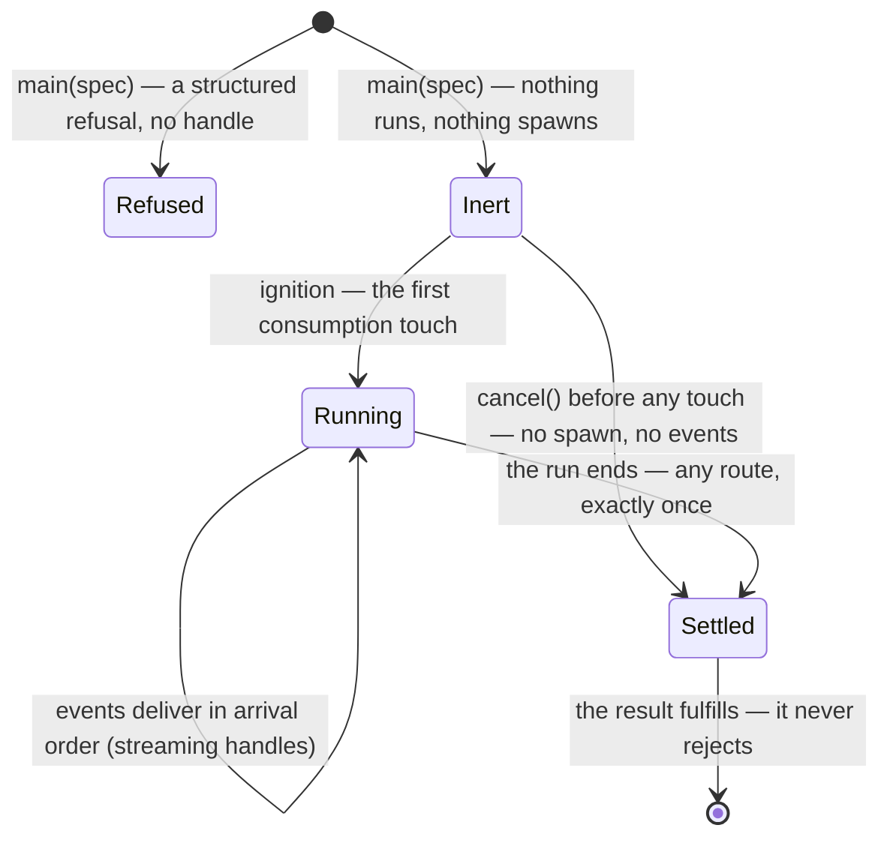

<!-- cspell:ignore kinding -->

# The evaluator machine

The notional machine of the evaluator kind — the operational model a consumer or
contributor predicts against when holding any evaluator's handle.
[README.md](./README.md) says what the kind is; [DOCS.md](./DOCS.md) constrains
the region's structure; this document models how the machine runs, so that "what
will this handle do under this touch?" is predictable in advance. It models the
**handle's consumption surface and the shared kind signature** — including the
posing axis the kind itself fixes — and it deliberately does not model the
**evaluation machinery**: what runs where, what is counted, what is filtered,
what is asked and answered is a black box here, and each evaluator opens it its
own way in its own `notional-machine.md` (human ruling 2026-08-18). This file is
the lattice's root; the per-evaluator models are its extensions. (Intercept's
generator surface proper — `.next`/`.return`/`.throw`, HR-5's — belongs to
intercept's own model, not this one.)

**Which machine, exactly.** The package glossary defines the notional machine as
a language level's semantic model; the package already extends the instrument
beyond the levels, and this document extends it again. The
[JEJ NM](../language-levels/jej/notional-machine.md) and the embody region's
[notional machine](../embody/notional-machine.md) model the language's own
machine at its phases; the
[questioning NM](../lib/questioning/notional-machine.md) models a utility kind's
machine and is the shape this document follows — the second kind-level notional
machine in the package. Everything stated here is committed contract
([README.md](./README.md) § The caller protocol, [types.ts](./types.ts),
[DOCS.md](./DOCS.md) § Structural constraints); nothing here narrows or extends
it.

**Pedagogy is not decided here.** This document describes what the machine does;
lenses choose what to teach. The contract is accuracy.

## The machine at a glance

An evaluator is a **running machine**: it takes an evaluation spec — embody's
gate-guaranteed facts plus how the run is posed — and runs the learner's program
to answer with data. Ahead of the machine sits a pure gate: `applicability`, an
options-list answer with no cause, which runs nothing. It is not a total
pre-check — a true verdict followed by a refusal at `main` is a legal pairing.
`main` itself answers exactly two ways in this region: an **inert handle**, or a
**structured refusal** — data, never a throw at the learner (the evaluators here
refuse; a typed boundary throw stays kind-legal and unexercised). One handle is
one run's whole life: created inert, touched into running, settled exactly once.

## States and transitions

The gate sits ahead of the diagram: a false verdict means the evaluator is
simply not offered, and a refusal at `main` means no handle ever exists.

- **Inert.** Constructing a handle runs no learner code and spawns nothing. The
  evaluator's own eager preparation — echo fields, parsing, instrumentation — is
  not the run; inert bounds the RUN.
- **Ignition (first consumption).** Consumption is a closed touch list, and the
  first touch starts the run: the first iterator pull, an `await`/`.then`
  subscription, or a `.result` property access — three touches on a streaming
  handle, two on a result-only one (no iterator exists to pull). Nothing else on
  the surface is a start: reading `code` or `options` observes, holding the
  handle waits.
- **Running.** On a streaming handle, events deliver in arrival order, minted
  where the run happens — order is never renumbered on the way out. An iterator
  created and then abandoned HOLDS the run: ceasing to pull is not a stop; break
  or cancel is the exit. `cancel()` is the outside door — a Stop button needs no
  iterator, and cancel is idempotent. The base has that one door; a widened
  handle may add a second (`fail`, the mid-stream stop with a reason), per
  evaluator.
- **Settled.** The run ends exactly once, any route, and the result ALWAYS
  fulfills — errors, timeouts, and cancellations are data on the result. The
  `result` promise is memoized: every touch reaches the same settling. Teardown
  answers out of band — ending the run never queues behind a pending pull — and
  latches: a later pull is inert, never a fresh run, never leftover data. One
  shot: a settled streaming handle does not replay its events; the result's
  `events` array is the record.

## The shared vocabulary, as observable behavior

- **Outcomes have one spelling set.** The kind exports six outcome values —
  `complete`, `cancel`, `fail`, `timeout`, `iteration-limit`, `error` — and each
  evaluator's union is a subset or a declared extension. Two evaluators can
  never spell one shared outcome two ways.
- **`ok` is per-evaluator.** Knowing the outcome does not tell you `ok` without
  that evaluator's own truth table (run: `ok` iff `complete`; intercept counts
  `cancel` and `fail` as ok). A named prediction limit of this model.
- **A run can end with no consumer action.** `seconds` absent means the ENGINE's
  default budget applies — a run can time out on a budget the consumer never
  set. `iterations` absent means no cap; where a cap is set, guards always
  splice, so the iteration total is real on every halt.
- **Errors carry a two-value phase.** `'creation' | 'evaluation'` — did the
  program fail before it ran, or while running. Exactly two; nuance within
  creation lives outside this kind.
- **Delivered events are richer than wire messages.** Plain-data fields stay
  enumerable; live-graph views (`node`, `prev`, `next`, `callee`) ride as
  non-enumerable accessors resolving through the embodiment's entwined record —
  so serializing any event or result stays safe while `event.node` still answers
  with the real node.
- **A pending interaction rides the event, never the iterator.** Its three
  guarantees: `respond` resumes the run from the event itself; answering twice
  is inert; answering after teardown is a no-op, never a throw.
- **Three channels, never mixed — with one ruled exception.** Refusals answer at
  the door; learner outcomes ride the result; a broken machine is a machinery
  defect, discriminated — EXCEPT that instrumentation is assumed sound (human
  ruling 2026-08-12): no contract surface reports an instrumentation defect, and
  when that premise is violated the failure presents as the learner's own. The
  model carries the cost so nobody rediscovers it as a surprise.

## Laziness is a law; mode symmetry is not

Creation-inert IS kind law, and it is the region's one deliberate laziness
departure from its reference, which auto-started every run on a microtask at
creation — holding a handle meant the program was already committed to running,
and claiming its stream raced that microtask. Here the closed touch list is the
only ignition, so hold-without-running is real and there is no claim race (human
ruling 2026-08-06).

Mode symmetry is narrower than it looks: `for await` pulls events one at a time;
`await handle` (or `.result`) drains internally and resolves with the complete
result; and two runs — one per mode — are byte-equivalent from first consumption
on. But the kind promises each mode ALONE: one handle driven in both modes in
one run is each evaluator's to specify, not a kind-level promise (the reference
forbade mixing them).

## The posing axis

The spec's `execution` axis is authoritative for how the run is posed:
`'function'` runs the snippet as a function body — top-level `var` and
`function` declarations become locals, a `"use strict"` line is prepended, a
top-level `return` is legal; `'module'` runs a genuine ES module — always
strict, asynchronous natural end. The axis is distinct from the static parse
goal the facts carry, and one pairing is honestly imperfect: a `'script'`-goal
snippet posed on `'function'` gets function-body semantics, not script
semantics. **No script execution path is ratified** (human ruling 2026-08-13);
the gap is named, not papered over.

## What the machine never does

- Never throws at the learner — refusals and results are data on every path.
- Never rejects the result promise — no consumer writes a rejection path.
- Never starts at construction, and never starts from any touch outside the
  closed list.
- Never replays a settled stream, and never serves data through a torn-down
  handle.
- Never hangs the settle channel on an unanswered interaction.
- Never lets the engine's spellings reach a result — seam vocabulary is mapped,
  per evaluator, into the reference vocabulary above.

## The black box, and who opens it

What happens between first consumption and settling — the evaluation machinery —
is deliberately not modeled here. Each evaluator's own `notional-machine.md`
opens the box its own way, modeling what that evaluator does between this
surface and the evaluation: what runs where, what is counted, what is filtered,
what is asked and answered. The openings genuinely differ:

- **run** — batch execution with io answered by mocks; no event stream.
- **intercept** — step-through execution: a live event stream, the full
  generator surface (HR-5's, modeled there), asks that surface as pending
  interactions, enrichment against the embodiment.
- **danger** (future — its re-kinding is its own campaign, human ruling
  2026-08-18) — a real browser window, an iframe rather than the engine's
  sandbox; same envelope, a result-only handle.

The boundary, in one table:

| layer                    | belongs to                                                                                                                                          |
| ------------------------ | --------------------------------------------------------------------------------------------------------------------------------------------------- |
| modeled HERE             | the consumption surface, the shared vocabulary, the posing axis                                                                                     |
| opened by each evaluator | what runs where, what is counted, what is filtered, what is asked and answered; what an unanswered ask does — the evaluator's DECLARED posture      |
| never this document's    | the engine's machine (worker, transport, budget mechanics); where the batch drain's policy lives; intercept's generator surface and drain semantics |

Two of those cells are deliberate non-statements, and silence is the point:
**where the batch drain's policy lives** — in the region's handle library or in
each evaluator's assembly — is the handle library unit's own design question,
settled at its Phase 0; and **what an unanswered ask does under a drain** is
ruled and modeled per evaluator, in that evaluator's own unit. This document
legislates neither. What the contract does fix, mode-agnostic: an unmocked ask
takes the evaluator's declared posture, and an unanswered interaction never
hangs the settle channel.

## Predictions worth making

A holder of this model should be able to answer, before running:

- Whether a true `applicability` verdict guarantees a handle (no — a refusal at
  `main` is a legal pairing; environments and budgets change between the verdict
  and the drive).
- Whether `try/catch` is needed around `await handle` (no — a program that
  throws, times out, or is cancelled still fulfills the result, with the outcome
  saying which).
- What `await handle` answers after the run already settled (the same result
  object, immediately — memoized, not re-run).
- What happens to a run whose iterator the consumer stopped pulling (it holds —
  break or cancel is the exit).
- What `cancel()` before any touch produces (a settled result with the cancel
  outcome and no events; nothing ever spawned).
- Why a run can time out when nobody set a budget (the engine owns the default;
  the resolved value is echoed on the options record).
- Whether two evaluators can disagree on an outcome's spelling (never) — and
  whether the same outcome means "ok" in both (not necessarily; the truth table
  is per evaluator).
- What `event.node` answers on a result held across a re-embodiment (a node from
  the graph the run was driven with — now stale; the plain-data `nodePath` is
  the durable attribution).
- How a broken machine surfaces (a discriminated machinery defect — unless the
  defect is instrumentation's own, which presents as the learner's error under
  the assumed-sound premise, cost stated above).

## Navigation

- [`README.md`](./README.md) — the kind contract and the region glossary.
- [`DOCS.md`](./DOCS.md) — the architectural sketch and decisions.
- [`types.ts`](./types.ts) — the contract this model restates as behavior.
- [`../lib/questioning/notional-machine.md`](../lib/questioning/notional-machine.md)
  — the kind-level precedent this document's shape follows.
- [`../embody/notional-machine.md`](../embody/notional-machine.md) and
  [`../language-levels/jej/notional-machine.md`](../language-levels/jej/notional-machine.md)
  — the language's machine, modeled at other phases.
- [`../lib/engine/README.md`](../lib/engine/README.md) — the machinery beneath
  every evaluator; its machine is not modeled here.
- Each evaluator's `notional-machine.md` — the lattice's next level, authored
  with that evaluator's own Phase 0.
