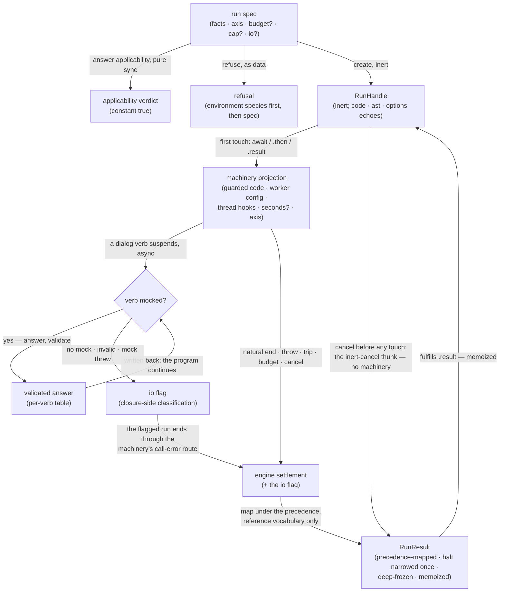

# run — Architecture & Decisions

Unit-level architecture for the evaluator described in [README.md](./README.md).
The region sketch owns the region shape; this document constrains only this
unit.

## Architectural sketch

> Written Phase 0, before implementation. The Refactor step is held against this
> document — not what the code does, but what shape it takes.

### Execution phases

1. **Answer applicability** (sync, pure) — constant-true; the consuming lens
   builds its options list. Input: the spec. Output: the verdict.
2. **Refuse or create** (sync, inert) — the environment refusal first (the
   shared wording), then the gate narrowing (a non-success `ast` fact is a spec
   refusal), then the inert handle: the eager echoes read once, the result-only
   source built over the handle library. Input: the spec. Output: the handle or
   a refusal; nothing engine-side exists.
3. **Ignite** (the library's `'batch'` start) — assemble and go: splice the
   guards on the original text, project the machinery spec (code, worker
   factory, worker config, thread hooks, seconds spread-if-set, the execution
   axis), begin the run. Input: the start call. Output: a running machinery
   handle the source now owns.
4. **Serve asks** (async, per verb) — the worker's dialog trap asks; run's
   wrapper answers from the mock, validates the answer per verb, records the io
   flag on any io failure, and routes. Input: an ask. Output: the validated
   answer written back, or the flagged end of the run.
5. **Settle** (async, exactly once) — map the machinery's settlement under the
   precedence (step 0 cancel; the io flag; the halt's throw; the engine-made
   error; the natural end; the defensive defect), narrow the halt once,
   deep-freeze, fulfill. Input: the engine settlement plus the io flag. Output:
   run's result under the reference vocabulary.

### Data flow

### Structural constraints

- **The io flag is the mapper's one evaluator-owned input** — everything else is
  the carried settlement; the flag is recorded closure-side, at run's wrapper,
  before the machinery can mislabel an io failure as a machinery defect; and the
  consumer's cancel outranks it (precedence step 0).
- **The halt is narrowed exactly once, thread-side** — anything failing the
  narrowing routes to the defensive defect arm, never read field by field.
- **Engine spellings never reach the result** — the mapper speaks the reference
  vocabulary only; the defect-cause mirror is compile-locked inbound.
- **The deep freeze is run's** — the machinery freezes only its own floor; run's
  mapper deep-freezes the result it authors.
- **The consumption laws are the library's** — inert creation, two-touch
  ignition, memoized settle, teardown latch: run builds a source and installs
  echoes through the builder; it re-implements none of them.
- **Two settle routes never reach the mapper** — the library's fallback thunks
  are run-authored results at the seam: the inert cancel (nothing started — no
  engine settlement exists) and the broken source (run's unreachable-outcome
  defect, pin run:289). Every other route flows through phase 5.
- **The echoes read the facts once, at creation** — `code` is
  `facts.source.value`; the spliced text never surfaces.
- **Two named import obligations** — the machinery's seconds default and its
  payload ceiling are imported, never re-declared; the seconds export is its own
  additive engine increment.

### Out of scope

- Caller duties, ruled: a mock's liveness (`cancel()` is the exit) and a mock's
  side effects are the consumer's own; the spec's coherence (axis/facts pairing)
  is the consuming lens's.
- The intercept surfaces (generator members, pending interactions, enrichment),
  the engine's internals, the deprecated region, `danger`.
- The error-phase mechanism beyond the declared vocabulary — the engine's
  try/catch split is the run chain's opening increment (E2); the suite's phase
  rows stay skipped until it lands.
- `sandbox.html` until the chain's own increment (HR-15 cadence).
- Run-side error positions (`line`) — a named future increment, never a stack
  parse.

## Decisions

- **D5b, engaged and answered** (the restore-as-doc row). The reference's own
  DOCS record that throw-on-missing-mock was tried, tested, and RESCINDED in
  favor of native-dialog parity with intercept. This unit takes a THIRD posture
  — no mock ends the run as a classified io error — with the rescission's
  grounds on the table: the rescinded throw failed because it threw at the
  learner mid-run; the restored native fallback blocked the main thread and
  hangs headless contexts. The classified io error does neither — it is data on
  the result, on the channel every other ending already uses. The parity ground
  is answered rather than inherited: intercept answers the same silence with a
  pending interaction (its lens renders interaction), run with an ending — a
  ruled, learner-visible sibling asymmetry, stated in both units' models (HR-9).
- **Why the result is discriminated on outcome** (HR-4 exception, human ruling
  2026-08-18): runtime values identical to the reference's flat shape; each arm
  carries exactly the fields that exist for it, so narrowing never reads an
  absent field — the deprecated port's own commitment, kept at the type level
  the port did not have.
- **Why phase rides only the javascript arm** (human ruling 2026-08-18): it is
  the one arm where the value varies; a discriminant with one reachable value is
  noise, and the defect arm is not a phase of the learner's program at all.
- **Why cancel outranks the io flag** (human ruling 2026-08-19): a Stop pressed
  during an in-flight mock answers `'cancel'` — the outcome the presser already
  knows — never an io lesson nobody asked for; the mirror order (mock fails
  first, cancel second) still answers `'io'`.
- **Why the io flag exists at all**: an io failure reaches the machinery as its
  generic call-error cause; only run knows the exchange it interrupted, so
  classification is recorded where the knowledge is — the closure — and read at
  the seam (plan-of-record § 4's pattern, restored).
- **Why mock liveness is the consumer's** (human ruling 2026-08-18): the
  machinery's budget pauses across io exchanges by design, and neither the
  machinery nor the handle library installs watchdogs; a second timeout
  vocabulary would need its own number and its own arm for a case the consumer's
  own code creates. `cancel()` is the exit.
- **Why the seconds echo imports the machinery's default**: "the engine owns the
  number" (the region's spec rule) plus "always populated" (the ledger's row)
  admit exactly one honest mechanism — import the exported default; the export
  does not exist yet and is named as its own additive engine increment rather
  than smuggled in.
- **Why `RunHalt` stays run's own** (human ruling 2026-08-19): the shared
  halt-shape question is banked to P0-I's design inventory, where both units'
  halt needs are visible; a premature shared type would pre-answer intercept's
  design.
