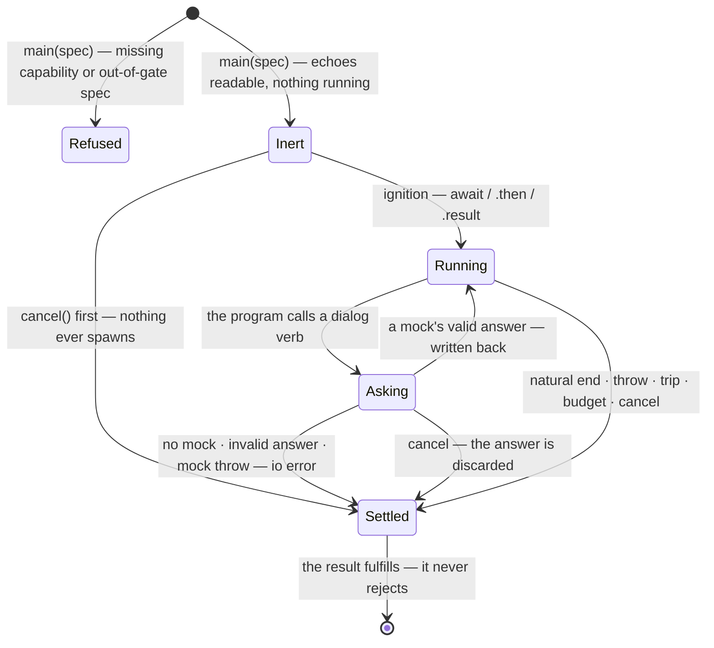

<!-- cspell:ignore catchable trapless unmocked -->

# The run machine

run's notional machine — the operational model a consumer or contributor
predicts against when holding a run handle. The region's
[notional machine](../notional-machine.md) models the consumption surface and
the shared kind signature every evaluator answers to; this document opens its
black box run's way: what runs where, what is counted, what is asked and
answered, and what an unanswered ask does — run's DECLARED posture. What remains
closed here is the machinery's own machine (worker, transport, budget mechanics
— [`../../lib/engine/README.md`](../../lib/engine/README.md)'s business) and the
handle library's internals (the region's consumption laws are built there once;
run inherits them structurally).

Everything stated here is committed contract ([README.md](./README.md);
[`../types.ts`](../types.ts); the handle library's laws) restated as behavior;
nothing narrows or extends it. Pedagogy is not decided here.

## The machine at a glance

run is a **batch machine**: touched into running, it poses the whole program in
the machinery's sandbox, answers its dialog verbs from the consumer's mocks as
they arise, and settles once with the complete result. Nothing streams — there
is no iterator, no event, no step-through; the result is the whole answer. The
consumption surface is the region's two-touch result-only shape: `await handle`
/ `.then`, or `.result` access, and the first touch is the ignition. Reading
`code`, `ast`, or `options` observes and never ignites.

## One run's life

`Running` is the region machine's own state name; `Asking` is run's refinement
of it — the program suspended on a dialog verb, still one run. `Asking` inherits
`Running`'s remaining exits (a machinery defect, the budget) beyond the three
drawn.

- **Running.** The program runs to its natural end unless something ends it
  first. The engine's worker sandbox does the running; run's model does not open
  that box — what run adds is the region guard's splice discipline (every loop
  counts), the dialog traps, and the settlement mapping.
- **Asking.** A dialog verb suspends the program until run answers. A supplied
  mock's return is validated at the seam — an invalid return is classified,
  never silently coerced. No mock for that verb is the end of the run,
  classified as run's io posture: an io error on the result — never a native
  browser dialog, never a bare `ReferenceError` presented as the learner's own,
  never a hang.
- **Settled.** Exactly once, any route. The result always fulfills; `cancel()`
  after settlement is inert; every touch reaches the same memoized record.

## What is counted

Guards always splice, so every guarded loop counts on every run — the cap alone
decides whether tripping ends the run. Consequences a holder can predict:

- The result's `iterationCount` is REAL on every worker-halt-backed outcome —
  natural completion, a learner throw, and a tripped cap alike.
- It is ABSENT on timeout, io error, and machinery defect — no worker halt
  exists there, so no honest count does — and on cancel, where the machinery's
  first-write-wins stop discards any halt a finishing worker authored.
- A tripped cap carries the guard's whole trip record: which loop, at what span.
  A learner-thrown `RangeError` is never classified as a trip — classification
  is structural (the guard's marker), never a message match; the guard's own
  qualification stands: accident-proofing, not malice-proofing.

## What is asked and answered

- The three verbs — `prompt`, `alert`, `confirm` — are the machine's only asks.
  Each is answered independently from the spec's `io` widening.
- A mock may answer with a value or a Promise; the program waits either way.
- A mock that throws or rejects is an io error — run catches it at its own seam
  and classifies it before the machinery can mislabel it as a machinery defect.
  "Your program threw" and "the io serving your program failed" are different
  lessons, and the result's `kind` keeps them apart.
- **Cancel during an in-flight mock discards the answer.** The mock runs to
  completion (its side effects are the consumer's business), its return is
  discarded, and the run settles `'cancel'`. A holder must not expect the
  reference's wait-for-answer-then-deliver behavior — the discard is the
  contract.
- **A mock that never settles holds the run.** The machinery's budget pauses
  across the whole io exchange and no layer installs a watchdog — a mock's
  liveness is the consumer's own obligation, and `cancel()` is the exit.
- Console is not an ask: `console.log` writes to the worker's native console.
  run traps nothing but the three verbs.

## Settlement honesty

- run speaks five outcomes — `'complete'`, `'cancel'`, `'timeout'`,
  `'iteration-limit'`, `'error'` — and `ok` is true exactly on `'complete'`.
  There is no `fail`: cancel is run's one consumer stop.
- The two-value phase — `'creation' | 'evaluation'`: did the program fail before
  it ran, or while running — rides ONLY the `'javascript'` arm, the one arm
  where it varies; every other learner-facing arm is mid-run by construction,
  and the defect arm carries none: a broken machine is not a phase of the
  learner's program.
- No machine ran → no machinery cause is honest: a failure before the sandbox
  existed, or a settlement shape run cannot answer, surfaces as the defect arm's
  own `'unreachable-outcome'` — loud, never a guess dressed as a learner error.
- A run can end with no consumer action: `seconds` absent means the machinery's
  default budget applies, and the resolved number is echoed on `options.seconds`
  either way.

## What the machine never does

- Never streams — no iterator exists; the result is the whole answer.
- Never throws at the learner, and never rejects the result promise.
- Never shows a native dialog, and never lets an unmocked verb hang the run.
- Never renumbers or re-times anything: the halt is authored where the program
  ran, and the mapping adds vocabulary, never facts.
- Never lets the machinery's spellings reach the result.
- Never starts from any touch outside the closed list, and never runs twice from
  one handle.

## Predictions worth making

A holder of this model should be able to answer, before running:

- What `prompt()` does with no mock supplied (ends the run as a classified io
  error — not a dialog, not a `ReferenceError`, not a hang).
- Whether a slow mock blocks `cancel()` (no — cancel settles the run; the mock
  completes but its answer is discarded).
- Whether a never-settling mock blocks everything (yes, except `cancel()` — the
  budget pauses across io exchanges, so no timeout arrives; the mock's liveness
  is the consumer's own).
- What `try { prompt() } catch {}` does with no mock supplied (the run ends as
  an io error; the learner's `catch` never runs — a departure from the
  deprecated port's catchable `ReferenceError`, and from intercept, which
  answers the same silence with a pending interaction instead of an ending — the
  ruled sibling asymmetry).
- Whether `iterationCount` can be trusted on a clean completion (yes — guards
  always splice; the total is real wherever a halt exists).
- Whether an uncapped `while (true)` runs forever (no — the budget ends it as
  `'timeout'`, on the machinery's default if nobody set one).
- What `'a'.repeat(2 ** 32)` settles as with no cap set (`'error'`,
  `kind: 'javascript'` — an unguarded `RangeError` is never a trip).
- Whether `try/catch` is needed around `await handle` (no — every path fulfills
  the result with data).
- What a second `await handle` answers after settlement (the same frozen result,
  immediately).
- Where `console.log` output went (the worker's native console — run captured
  nothing; captured logs are intercept's).

## Navigation

- [README.md](./README.md) — run's contract; [`DOCS.md`](./DOCS.md) — its
  architecture and decisions.
- [`../notional-machine.md`](../notional-machine.md) — the region machine this
  model extends; its consumption laws are not restated here.
- [`../lib/execution-handle/README.md`](../lib/execution-handle/README.md) —
  where the consumption laws are built.
- [`../../lib/engine/README.md`](../../lib/engine/README.md) — the machinery
  whose machine stays closed here.
- `../intercept/notional-machine.md` — the sibling fill: streaming, asks as
  pending interactions.
