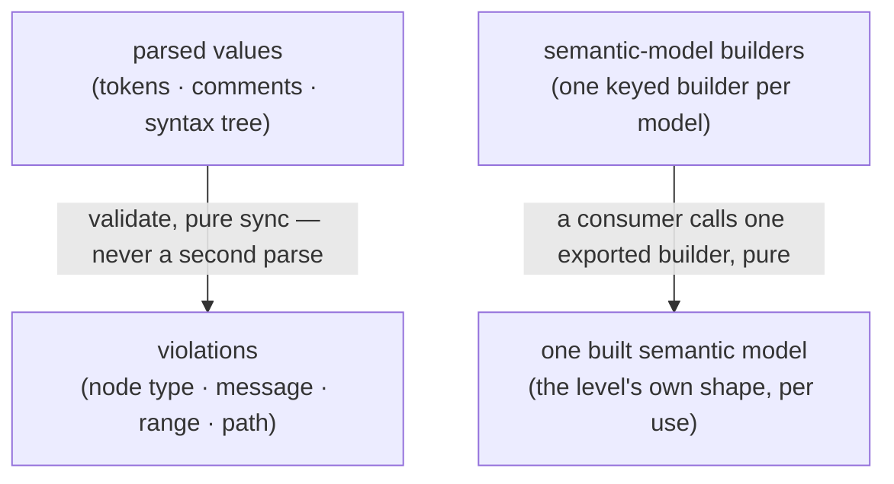

<!-- cspell:ignore consultable gatekeep -->

# language-levels — Architecture & Decisions

Region-level architecture for the passive libraries described in
[README.md](./README.md). The package sketch ([../DOCS.md](../DOCS.md)) owns the
package-level shape; this document constrains only this region, at its root
abstraction. Each level's own directory zooms into that level.

## Architectural sketch

> Written Phase 0, before implementation. The Refactor step is held against this
> document — not what the code does, but what shape it takes.

**Inbound contract.** Every consultation arrives with what it needs: validate
receives the parsed values (the caller — who memoizes one validate per settle
and per level — never consults a level about a program that does not parse); the
editor adapter reads the support data of the selected level; a consumer building
a semantic model calls that model's exported builder itself. A level initiates
nothing.

## Execution phases

1. **Validate** (sync, pure) — the parsed values in, violations out; no parsing,
   no state, no side effects. Three consumers outside this region project the
   one result: any violations? (selector) · where? (gutter) · empty or not?
   (mask). Input: the parse facts. Output: the violations.

2. **Build a model** (sync, pure, per use) — a consumer calls one exported
   builder to construct one semantic model at use time — single algorithmic
   truth, no cached copies. Input: the builder's own input. Output: that model,
   the level's own shape.

These are the region's only two computations. Everything else a level ships —
its docs, its editor-support channels, its admitted snippet types — is static
data read by outside consumers, not an execution phase.

## Data flow

The level's static channels — docs, editor-support data, admitted snippet types
— transform nothing and appear on no data path; consumers read them where they
ship.

## Structural constraints

- **Passive.** A level answers when consulted; it initiates nothing, renders
  nothing, registers nothing, and never acts.
- **Stateless and pure.** Same inputs, same answers; callers own all memoization
  (one validate per settle and per level, orchestrator-side).
- **One parse truth.** validate consumes parsed values and never parses; nothing
  in a level touches the embodiment's stage envelope — no type edge runs from
  levels into embody.
- **Single home for level facts.** Everything a level knows lives in its own
  directory — no copies elsewhere to drift.
- **Lint is an adapter.** Editor diagnostics derive from the same validate
  result — never a second validation source.
- **Levels never ship lenses.** A level's machine-facing lenses come from its
  own author, importing the level directly.
- **Violations never block execution.** Acorn is the run ceiling and enforcement
  posture is global, orchestrator-side — which is why a violation carries no
  severity field.

## Decisions

- **Why a passive library.** One home for level facts kills the
  copies-that-drift pattern; and a level that cannot act cannot gatekeep —
  guides, never gatekeepers, by construction.
- **Why builders instead of built models.** Per-use construction keeps one
  algorithmic truth and no stale caches; each consumer builds exactly the model
  it needs, when it needs it.
- **Why builder signatures stay the level's own.** The named model families
  disagree about inputs — a hoisting model derives from the parse facts, a realm
  model needs no program, a trace interpretation reads execution — and no
  generic caller ever invokes a builder: consumers import the level directly and
  know the concrete shapes. Pinning one input type would fit none of them.
- **Why editor-support shapes belong to the adapter.** The three channels are
  named here; their inner shapes are the generic adapter's contract — the
  consumer of the data owns what the data must look like.
- **Why violations carry no severity.** A violation never blocks execution, and
  the warn/strict posture is global — a per-violation severity would carry zero
  information and a false implication.

## Out of scope

- **The selector, gutter, mask, and enforcement** — orchestrator surfaces
  projecting the one validate result; the memoization that shares it is theirs
  too.
- **Type admission** — the orchestrator's check over `snippetTypes`.
- **The registry read surface** — how registered levels are enumerated is the
  composition root's contract.
- **The generic validating machinery** — a shared leaf a level's validate may
  parameterize internally; the spine sees only the resulting function.
- **The editor adapter** — the consumer of the support data owns its contract.
- **Assembling the parse facts** — destructuring the embodiment's stage values
  into `ParseFacts` is the caller's job, done once where validate is memoized.
- **Each level's content** — JEJ's curation, documentation, and models live in
  `jej/`, documented there.
