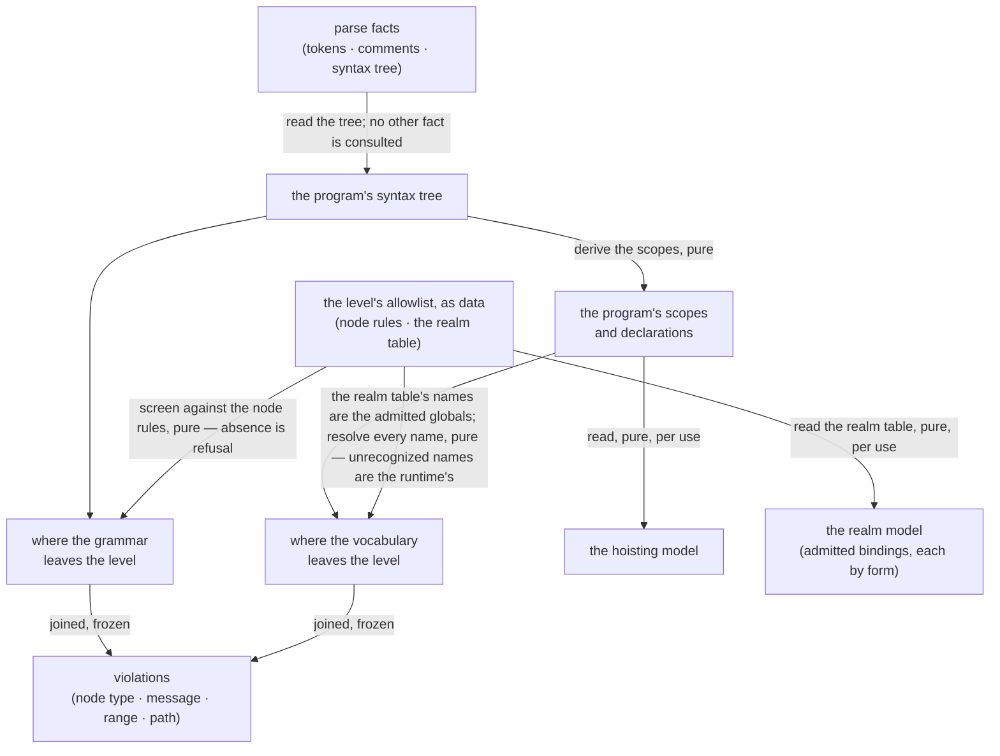

<!-- cspell:ignore unconstructible -->

# jej — Architecture & Decisions

The level described in [README.md](./README.md), at its own abstraction. The
region sketch ([../DOCS.md](../DOCS.md)) owns the level contract's shape; this
document constrains only what is inside this level.

## Architectural sketch

> Written Phase 0, before implementation. The Refactor step is held against this
> document — not what the code does, but what shape it takes.

**Inbound contract.** A consultation arrives with a program already parsed. The
level reads the syntax tree and nothing else — not the token stream, not the
comments, not the source text, none of which it has an opinion about. A consumer
wanting a semantic model calls that model's builder itself. The level initiates
nothing and answers only when asked.

## Execution phases

1. **Screen the grammar** (sync, pure) — every node of the program's tree is met
   by the allowlist's node rules. A node type the allowlist does not name is
   outside the level; one it names conditionally is met by that node type's
   check, which answers legality only. Input: the syntax tree + the allowlist.
   Output: where the grammar leaves the level.

2. **Resolve the vocabulary** (sync, pure) — the program's scopes and
   declarations are derived, then every identifier is met against them in turn:
   a name the program declared is its own; a name the level admits is the
   realm's; a name JavaScript is known to provide but the level does not admit
   is outside the level; anything else is left to the runtime. Input: the syntax
   tree + the allowlist's admitted globals. Output: where the vocabulary leaves
   the level.

The answer is the two outputs together — their union, ordered and frozen. That
is not a third phase: it is what the level returns.

Two further computations are **not** phases of the answer — they are the level's
models, built only when a consumer asks:

- **Build the realm model** (sync, pure, per use) — from the realm table, with
  no program involved.
- **Build the hoisting model** (sync, pure, per use) — the same scope analysis
  phase 2 derives, read by a different consumer at a different time.

## Data flow

The level's static channels — its reference and notional-machine prose, its
editor-support data, the snippet types it admits, its identity — transform
nothing and appear on no path; consumers read them where they ship.

## Structural constraints

- **The level never parses.** It is handed parsed values and consults the tree.
  It is never asked about a program that does not parse — a failed parse leaves
  the parse facts **unconstructible**, so the question cannot be posed.
- **Default-deny.** A node type the allowlist does not name is outside the
  level. New JavaScript is outside by default rather than by oversight.
- **The admitted-node universe is closed over the caller's parse settings, which
  the level does not control.** The allowlist is total over the node types the
  package's one parse emits — not over the whole grammar. A node type reachable
  under the caller's settings and absent from the allowlist is a **false
  rejection**, not a true violation. The level cannot detect this: default-deny
  makes "deliberately excluded" and "never considered" indistinguishable by
  construction. It fails neither loudly nor gracefully — it accuses the learner
  silently, which is why the caller's obligation is named in Out of scope.
- **The realm table is the level's one account of its world.** The admitted
  globals are its names, derived. A second list would be a second truth.
- **Unrecognized names are the runtime's.** A name neither declared nor known to
  JavaScript is left alone. A typo is never a level violation — it is a
  `ReferenceError` the learner meets where it happens.
- **The two findings are independent.** Neither the grammar screen nor the
  vocabulary resolution reads the other's result; the answer is their union.
- **Legality is the check's; position is the walk's.** A check answers what is
  wrong, never where. One place reads a node's range and its path, so a range
  cannot be read two ways.
- **One scope analysis, two readers.** The vocabulary phase and the hoisting
  model derive scopes the same way, through one shared analysis — invoked once
  per answer and once per model build. A second **implementation** would be a
  second truth; a second invocation is not.
- **The models are sound only over a program the level admits.** A model of a
  program beyond the level would describe a machine the level does not claim.
  The level does not enforce this — the lens gate does; the models simply cannot
  represent what they would have to lie about.
- **The level freezes only what it built.** The scopes are its own; the syntax
  nodes they carry are the caller's, and the scope tree is cyclic — so freezing
  recurses into neither.
- **Violations never block execution**, and carry no severity: the parser is the
  run ceiling and enforcement posture is global, orchestrator-side.

## Decisions

- **Why default-deny rather than a denylist.** The level's promise is that it
  can tell the truth about every program it admits. A denylist admits everything
  not yet thought of, so the promise would decay with every language release; an
  allowlist that must name what it admits cannot.
- **Why a check answers with a message, not a violation.** A violation needs a
  range and a node path; only the walk holds both. Letting checks construct
  violations would put a source range in as many places as there are checks, and
  they would drift — which is exactly what happened before, in three copies with
  two different answers for a missing position.
- **Why a source range is offsets.** Every parsed node carries offsets
  unconditionally; line and column depend on a parse option the parse facts
  cannot express, and the level holds no source text to convert from. Offsets
  are the only range always constructible from what the level is given — and the
  editor surfaces that consume them speak offsets natively.
- **Why the realm table is authored and the admitted globals derived.** They are
  the same names. The level's world and the level's vocabulary drifting apart
  would mean either a name the realm teaches gets rejected, or a name the level
  admits appears in no lens — both invisible until a learner finds them.
- **Why member access is allow-all-except.** The level admits every method its
  reference sanctions, and enumerating that surface would mean re-syncing a list
  against prose on every change. Naming the few excluded names tracks the
  reference's own framing and cannot drift the same way. The residual hole is
  accepted and named: the policy governs dot access, and computed access is not
  gated because the level admits guarded dynamic dispatch and a purely syntactic
  check cannot tell that from an escape. The policy protects the taught surface;
  it is not a sandbox. The blocked names are the level's own datum — no
  machinery reads them, so they live with the check that does.
- **Why an unknown identifier is not a violation.** The alternative is accusing
  a learner's typo of being a level violation — the one lie the level must never
  tell. Deferring to the runtime costs a name the level could have caught and
  buys a boundary the learner can trust.
- **Why the hoisting model is the level's own.** What can occur in it is a
  consequence of what this level admits — three scope boundaries and two
  declaration forms, because nothing else is admitted. It is not a projection of
  some general account of JavaScript scoping: no such account exists here, and
  claiming one would make the model a transformation that changes nothing. A
  consumer needing the general case builds the general case; when both exist,
  they reconcile into something shared and narrowed.
- **Why the realm model teaches rather than describes.** A program wakes into a
  full JavaScript realm; the level's world is a slice of it. The model answers
  "what is mine to use?", and says so, because a lens rendering it as "what
  exists" would lie by omission — under the level's own rule against lying.
- **Why the realm's two populations stay distinct.** Intrinsics are the
  language's and always present; host bindings are the browser's. Collapsing
  them would conflate "this is JavaScript" with "this is your browser" — a
  distinction the level exists to teach.
- **Why widening means extending a model first.** The allowlist is not
  free-standing policy: it is the shape of what the models can explain.
  Admitting syntax the models cannot describe would make the level's own lenses
  render a machine for code that machine does not cover.

## Out of scope

- **The generic validating machinery** — the node-rule shape, the default-deny
  walk, violation construction. The level supplies the data it reads; the
  contract sees only the resulting function.
- **Known-JavaScript globals** — which names JavaScript provides is generic
  knowledge, not this level's policy.
- **A general account of JavaScript scoping** — one that models functions,
  classes, catch clauses, and `var`. A consumer needing it builds it; this level
  models only what it admits.
- **The parse, and the options that fix the node-type universe** — the caller's,
  done once where the answer is memoized. The caller **owes** a parse
  configuration fixed to the node-type universe the allowlist was authored
  against: the level cannot detect a change, and will accuse the learner if one
  lands.
- **The selector, the gutter, the enforcement mask, and their shared
  memoization** — surfaces projecting the one answer.
- **Type admission** — the orchestrator's check over the snippet types the level
  admits.
- **Editor diagnostics** — a presentation adapter over the same violations,
  never a second source.
- **Lenses, and executing anything** — a level ships no lenses and runs no code.

## Navigation

- [`./README.md`](./README.md) — what JEJ curates, and its glossary.
- [`./types.ts`](./types.ts) — the level's own model types.
- [`../DOCS.md`](../DOCS.md) — the region's architecture.
- [`../types.ts`](../types.ts) — the level spine.
