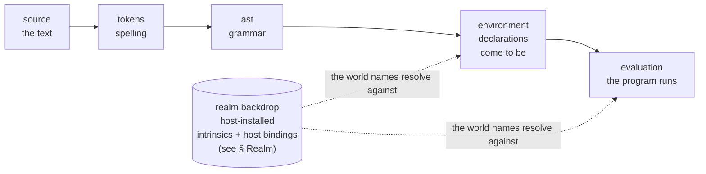
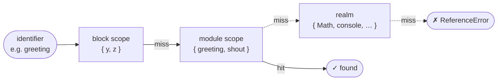
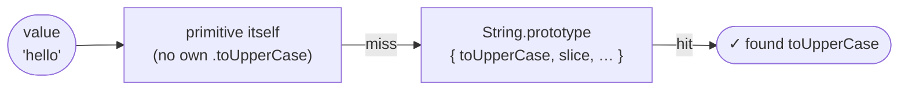
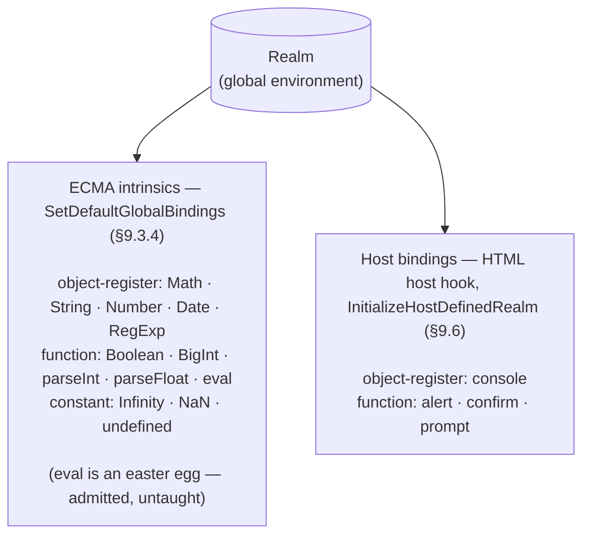
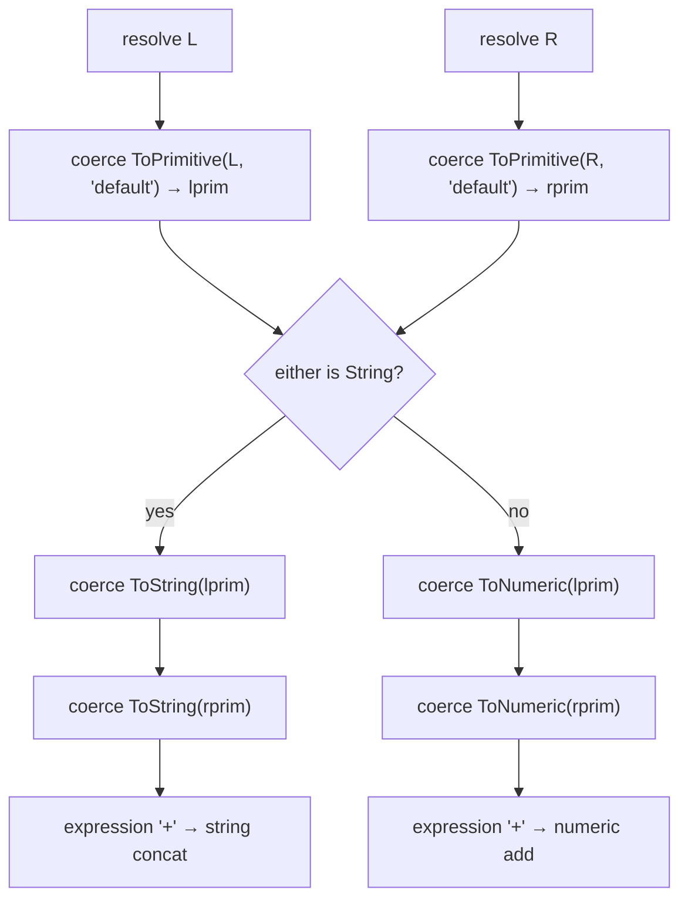

# JEJ Notional Machine

This document defines the **conceptual evaluation model** — the precise, bounded
mental model of how JEJ programs run.

The NM is the **mechanical instrument** that Welcome to Frogramming centers on
(per the [syllabus's mechanical-instrument metaphor][metaphor]): the machine the
🔬 Frogrammer grounds their predictions in. The **machine** is one of the four
audiences a running JEJ program speaks to — the learner-as-user, the developer,
the machine, and the reader; twinning it is the focus of the Frogrammer hat.

For the larger story — **JEJ → NM → embody → study lenses**, the four audiences,
and the Frogrammer's predict-trace-verify practice — see the
[package README](../../README.md). This document is upstream of all of that: get
the NM right and embody / lenses / curriculum follow.

Covers exactly the language features in [reference.md](./reference.md).

**Spec-aligned.** Learner-friendly names in the body; the
[Spec correspondence appendix](#spec-correspondence-appendix) maps every term to
its ECMA-262 (ES2024) abstract operation.

**Pedagogy is not decided here.** This document describes what is _observable_;
lenses choose what to _teach_. The contract is accuracy.

**Scope.** The NM is the conceptual model; embody is the per-snippet operational
data form lenses consume. The system-wide learner state (the "Progress
modelling" base layer of Malaise & Signer's Explorotron pyramid — see
[the package README § Pedagogical grounding](../../README.md#pedagogical-grounding))
is the embedding LMS's responsibility, not the NM's or embody's scope.

See also:

- [the package README](../../README.md) — the conceptual chain and the four
  audiences
- [`./README.md`](./README.md) — what JEJ curates, and its glossary
- [`./DOCS.md`](./DOCS.md) — this level's architecture and decisions
- [`./types.ts`](./types.ts) — this level's own model types
- [`./reference.md`](./reference.md) — the learner-facing reference: what the
  level admits, in the learner's vocabulary

[metaphor]: ../../../../../spiralearn/frogramming-and-vibetoading/README.md

---

## Lifecycle: five phases

**Realm is static data, not a runtime phase.** The realm exists before any user
program runs (host-installed). Strictly, realm setup _precedes_ parse, but parse
does not depend on it — parsing is purely syntactic. The realm is a **reference
a learner consults, not a step code passes through**: its bindings are the same
for every program, enumerated by the level's realm model rather than produced by
running one (see [§ Realm](#realm)).

The lifecycle is **five flat phases**: **source → tokens → ast → environment →
evaluation**. Realm setup is the backdrop they resolve names against, not one of
them.



| Phase           | What the machine does (module semantics)                                                                                                                                                                                                                                                                                              | Errors possible                                                                                                                                                                                                                    |
| --------------- | ------------------------------------------------------------------------------------------------------------------------------------------------------------------------------------------------------------------------------------------------------------------------------------------------------------------------------------- | ---------------------------------------------------------------------------------------------------------------------------------------------------------------------------------------------------------------------------------- |
| **source**      | the raw source text, before the machine reads anything                                                                                                                                                                                                                                                                                | none                                                                                                                                                                                                                               |
| **tokens**      | the text is spelled into the language's words — lexing                                                                                                                                                                                                                                                                                | `SyntaxError` — an invalid character sequence                                                                                                                                                                                      |
| **ast**         | the words resolve into the syntax tree — the module is parsed (`ParseModule`). JEJ splits parse into `tokens` (spelling) and `ast` (grammar) for stepping; the spec runs one op (lexing is folded into the grammar via on-demand `InputElementDiv`/`InputElementRegExp` goal symbols)                                                 | `SyntaxError` — invalid grammar; Early Errors (`break` outside a loop, `let` redeclaration), detected statically before anything runs                                                                                              |
| **environment** | the module's environment record is instantiated before evaluation: one walk reserves every top-level `let`/`const` uninitialized (`tdz` is the access-time consequence, not the state name). Block scopes belong to the program's scope tree, but their environment records are not created here — they push lazily during evaluation | none — a duplicate `let`/`const` is an Early Error, already caught in `ast`                                                                                                                                                        |
| **evaluation**  | the module body is evaluated: statements run in source order; bindings transition `tdz → initialized` when their declaration evaluates; block scopes push and pop lazily (only when they have lexical decls — see [Empty blocks don't push](#empty-blocks-dont-push)); values flow, coercions fire, I/O emits                         | `ReferenceError` (TDZ access, unresolvable name), `TypeError` (call non-callable, property on null/undefined, const reassignment, mixing `bigint` with `number`), `RangeError` (numeric out of range, JEJ iteration-guard `limit`) |

Realm setup — the host installing intrinsics and host bindings — precedes all
five; it is the backdrop the runtime resolves names against, not a phase (see
[§ Realm](#realm)). Each phase's ECMA-262 operation is in the
[Spec correspondence appendix](#spec-correspondence-appendix).

---

## The machine at a glance

The canonical poster — the whole NM at one zoom, organized as **two acts** along
the lifecycle: **setup** (parse the text, then derive the static environment)
and **runtime** (evaluation inside the realm, as `code ⇄ nm ⇄ host`).

![JEJ Notional Machine — the program's lifecycle in two acts. Setup is syntactic: source is spelled into tokens and parsed into an ast, deriving the static environment — the initial scope tree with every binding reserved in the temporal dead zone. Then the program runs inside the realm, the world of intrinsics and host bindings and the top of the scope chain. Evaluation has three interlinked cells: code (the live line), nm (the semantics — the dynamic environment, the block-to-module-to-realm scope chain, the prototype chain, values, coercion), and host (the I/O buckets — the developer console and the user dialogs). The arrows between cells are the observable trace events resolve, emit, and return; coercion is observable within the nm cell.](./notional-machine.svg)

The sections below unpack each piece of the poster in prose, with smaller
diagrams that reinforce specific aspects.

---

## Two viewing levels

These are the poster's two runtime faces — the **code** cell and the **nm**
cell, bridged by `resolve`.

**Visual-syntax level** — anchored to code the learner sees:

- **Expressions** — syntax that produces values through evaluation
- **Statements** — syntax that controls which code runs and when

**Behind-the-scenes level** — what the VM does invisibly:

- **Values** — primitive data flowing through the program
- **Bindings** — named memory slots that hold values
- **Scopes** — containers for bindings, forming a chain
- **Realm** — the world the program is born into (intrinsics + host bindings)
- **Coercion** — implicit type transformations (invisible in code, observable
  only in the trace)

**Control panel vs. machine.** The visible syntax (expressions + statements) is
the CONTROL PANEL — the interface through which the programmer controls the
machine. The behind-the-scenes level (bindings, scopes, values, coercion) is
what JavaScript actually IS — the machine itself. The code text is a
representation designed to help us program the machine; it is not the machine.

**Bridge.** `resolve` captures when an expression produces a value — connecting
which syntax (visual) to which data (behind-the-scenes).

**Cross-cutting.** Errors (abnormal termination).

**External channels.** I/O channels (Developer Console, User Interface) are
host-provided; not part of the computation model. See
[I/O Channels](#io-channels).

---

## Components

### Values

Primitive data: `string`, `number`, `bigint`, `boolean`, `null`, `undefined`.

Values are the currency of the notional machine. They:

- Flow through expressions (as operands and results)
- Are stored in bindings (via initialize and update)
- Are retrieved from bindings (via access)
- Are passed as arguments to function calls and returned as results
- Are transformed by coercion (one type becomes another implicitly)

**Containment model**: primitives use direct containment — "the box labeled `x`
contains 5." Realm-level objects use reference — "Math points to a register of
available methods."

### Bindings

Named memory slots that hold values. Each binding has:

- **name**: the identifier (`x`, `userName`, `i`)
- **kind**: `let`, `const`, or `global`
- **value**: the current value held
- **scope**: which scope this binding lives in
- **status**: queryable state — `'tdz'` | `'initialized'` | `'dead'`

Lifecycle:

1. **declare** — the binding is created in its scope with `status: 'tdz'`. For
   top-level (program-scope) bindings this fires in the `environment` phase,
   when the module's environment record is instantiated; for block-scope
   bindings it fires on block entry, during `evaluation`.
   - Spec uses the term _uninitialized_; **TDZ** ("Temporal Dead Zone") is the
     access-time consequence — reading an uninitialized binding throws
     `ReferenceError`.
2. **initialize** — the binding receives its first value. `let x = 5` → value is
   `5`. `let x;` → value is `undefined`. `status: 'initialized'`.
3. **access** — the binding's current value is read.
4. **update** — the binding's value changes. Fires on assignment (`x = 6`,
   `x += 1`, `x++`).
5. **dead** (block-scope only) — when evaluation leaves the enclosing block,
   block-scope bindings become unreachable. `status: 'dead'`.

`const` bindings: initialize once, never update. Update attempt → `TypeError`
(per ECMA-262, **not** `SyntaxError`).

There is also a visual-syntax `expression: identifier` event that fires for all
identifier nodes in the AST — both scope-chain identifiers (`x`, `Math`) AND
property-key identifiers (`.max`, `.length`). The behind-the-scenes counterpart
for scope-chain identifiers is `binding:access` (binding lifecycle); for
property-key identifiers it's `proto-check` (property resolution).

### Scopes

Containers for bindings. Scopes form a chain — inner scopes can see bindings in
outer scopes via name resolution.

The program opens three kinds of scope (the level's `ScopeKind`); the realm sits
above them all as the backdrop:

- **program** — the program's single top-level scope. At runtime it is the
  **module's environment record**, whose outer is the global environment (the
  realm); all top-level `let`/`const` live here. Created in the `environment`
  phase.
- **block** — created by each `{ }` block (if-bodies, loop bodies, bare blocks)
  **that has lexical declarations**. See
  [Empty blocks don't push](#empty-blocks-dont-push).
- **for-of** — the scope of a `for…of` head: a fresh binding for the loop
  variable each iteration (JEJ iterates strings only).
- _(backdrop)_ **global environment / realm** — the world every program shares:
  realm intrinsics + host bindings, always present, the top of the scope chain.
  Not a scope the program opens — a reference it resolves against (see
  [§ Realm](#realm)).

Lifecycle (per ECMA-262, modelled as `push`/`pop` events on the
LexicalEnvironment chain):

1. **push** — a new env is pushed onto the chain. Bindings declared as TDZ.
2. **pop** — the env is popped. Block-scope bindings become `dead`.

Scope pop reasons: `'normal' | 'break' | 'continue' | 'error' | 'limit'`.

#### Micro-ordering: push → declares → first statement

On `scope:push` for a non-empty block (one with lexical declarations), all
`binding:declare` events for the block's `let`/`const` bindings fire
immediately, in source order, **before** the first statement event inside the
block. This mirrors how the program (module) scope is set up in the
`environment` phase.

```text
scope:push (kind: 'block')
  binding:declare (name: 'x', status: 'tdz')   ← all declares burst here
  binding:declare (name: 'y', status: 'tdz')
statement:enter ...                             ← first body statement
```

The same micro-ordering opens the program scope: one `scope:push` event for the
module scope, followed by a `binding:declare` event for each top-level `let`/
`const` in source order.

`limit` is JEJ-specific (iteration/time guard) — not ECMAScript, but a real
reason scopes exit in our runtime. Internally implemented via thrown
loop-guards; learners never see the throw, only the `limit` pop reason.

#### Empty blocks don't push

Per ECMA-262 §14.2.2, a `Block` only creates a new declarative environment
record if it contains lexical declarations (`let`/`const`). A block like
`{ console.log(1); }` does not push an env — the engine elides the scope.

This is a real case of **syntax behaving differently based on context**: the
`{ }` looks scope-shaped to a reader but the engine optimizes away the unused
frame. Worth surfacing as a teachable moment about syntax-vs-semantics in
curriculum, not as machinery the NM hides.

### Scope chain lookup (name resolution)

When an identifier is evaluated, the engine walks the scope chain. Each scope
checked is a separate observable step — exposed on every `category: 'resolve'`
event with `kind: 'identifier'` as the `scopeChainWalk` array.



```text
scopeChainWalk: [
  { scope: <block>,  hit: false },   // ['y', 'z'] — miss
  { scope: <module>, hit: true  },   // ['greeting', 'shout'] — hit on greeting
]
→ found greeting in module scope
```

Failed lookup = chain of misses ending in `ReferenceError`:

```text
scopeChainWalk: [
  { scope: <block>,  hit: false },
  { scope: <module>, hit: false },
  { scope: <realm>,  hit: false },
]
→ ReferenceError: undeclaredVar is not defined
```

### Prototype chain lookup (method resolution)

When a method is accessed on a value (`str.toUpperCase()`), JavaScript walks the
prototype chain. Parallels scope chain lookup — both are "walk a chain to find a
name." Exposed on every `resolve` event with `kind: 'member'` as the
`protoChainWalk` array.



```text
protoChainWalk: [
  { object: 'hello',           hit: false },   // primitive itself
  { object: String.prototype,  hit: true },    // toUpperCase found
]
→ found toUpperCase on String.prototype
```

For JEJ primitives, the chain is always two steps:

- `string` → `String.prototype` (toUpperCase, slice, trim, includes, …)
- `number` → `Number.prototype` (toString, toFixed, toPrecision, toExponential,
  toLocaleString)
- regex literal → `RegExp.prototype` (test)

The "two chains, same shape" insight is the central pedagogical leverage point
for resolution events — both walks observable as arrays of step records.

### Realm

The realm is "the world your program is born into." It contains everything
JavaScript provides that the learner didn't create. This section is the level's
**one canonical account of that world**: every name below is an admitted global,
and the realm has **two distinct populations**.



Every binding is described two ways — a **form** (how a lens draws it) and a
**population** (which mechanism installed it):

- **form** is one of `object-register` (a box of methods with a prototype — e.g.
  `Math`, `console`), `function` (a callable value, notated with the `ƒ` prefix
  in diagrams — e.g. `ƒ alert`, `ƒ parseInt`, `ƒ Boolean`), or `constant` (a
  bare primitive — `Infinity`, `NaN`, `undefined`).
- **population** is `intrinsic` (the language's, always present) or `host` (the
  browser's). They stay distinct: collapsing them would conflate "this is
  JavaScript" with "this is your browser."

The `ƒ` notation is internal to JEJ visualizations — learners won't see it in
their code or on MDN. It's a typographic cue: "this is callable."

#### ECMA-262 intrinsics

Population `intrinsic`. Set by `SetDefaultGlobalBindings` (§9.3.4), called from
`InitializeHostDefinedRealm` (§9.6). These are always present, regardless of
host environment.

**Object registers** (boxes of methods with a prototype):

- **Math**: `max`, `min`, `abs`, `floor`, `ceil`, `round`, `random`, `PI`, `E`,
  `sqrt`, `pow`, …
- **String**: `ƒ String()` (conversion), `fromCharCode`, `fromCodePoint`.
  Prototype: `toUpperCase`, `toLowerCase`, `slice`, `trim`, `includes`,
  `indexOf`, `replace`, `charAt`, `charCodeAt`, `at`, …
- **Number**: `ƒ Number()` (conversion), `isNaN`, `isFinite`, `isInteger`.
  Prototype: `toString`, `toFixed`, `toPrecision`, `toExponential`,
  `toLocaleString`.
- **Date**: static: `now`, `parse`. Constructor: `new Date()` (the sole `new`
  exception in JEJ). Instance methods: `getFullYear`, `getMonth`, `getDate`,
  `getHours`, `getMinutes`, `getSeconds`, `getTime`, `toLocaleDateString`,
  `toLocaleTimeString`, `toISOString`. Date methods return primitives — no
  mutation, gentle intro to reference types.
- **RegExp**: the **name** is admitted — a reference to `RegExp` is not flagged
  as an unknown global — and its prototype carries `test`, so a regex literal
  (`/pattern/flags`) resolves `.test()` via `RegExp.prototype`. Constructing one
  with `new RegExp(...)` is **refused separately**, by the same node rule that
  makes `new Date()` the sole `new`. Two independent mechanisms: the realm
  admits the _name_; a node rule refuses the _`new`_. (A regex literal's methods
  resolve on the intrinsic `RegExp.prototype` regardless — admitting the name is
  what keeps a bare reference to `RegExp` from reading as a typo.)

**Functions** (callable, marked `ƒ`):

- `ƒ parseInt`, `ƒ parseFloat` — string-to-number parsing.
- `ƒ Boolean()` — explicit boolean conversion (teaches truthiness).
- `ƒ BigInt()` — conversion to arbitrary-precision integers.
- `ƒ eval` — an **easter egg**: admitted but untaught, and absent from
  [reference.md](./reference.md) by design (eggs are for the learner who goes
  looking).

**Constants** (bare primitives): `Infinity`, `NaN`, `undefined`.

`globalThis` is an ECMA intrinsic but **not in JEJ scope**.

#### Host bindings (HTML)

Population `host`. Set by the host hook inside `InitializeHostDefinedRealm`.
These are WHATWG/HTML APIs — **not** part of ECMA-262:

- **console** (object-register) — output by intent: `debug`, `log`, `info`,
  `warn`, `error`; asserting: `assert`; counting: `count`, `countReset`;
  grouping: `group`, `groupCollapsed`, `groupEnd`; timing: `time`, `timeLog`,
  `timeEnd`; utility: `clear`. Routes to the
  [Developer Console](#developer-console).
- `ƒ alert`, `ƒ confirm`, `ƒ prompt` (functions) — synchronous UI dialogs. Route
  to the [User Interface](#user-interface).

Treating host bindings and ECMA intrinsics as a single population conflates
spec-distinct concepts. Lenses can mark them differently to teach the
distinction (e.g., "this is a JS feature, this is a browser feature").

### Expressions

Syntax that produces values through evaluation. Compound expressions have
sub-expressions that evaluate in order (left-to-right, respecting precedence).

Expression kinds in JEJ: operators, short-circuit operators (`&&`, `||`, `??`),
ternary (`a ? b : c`), assignment (`=`, `+=`, `??=`, …), increment/decrement
(`++x`, `x++`), property access (`.`, `[]`, `?.`), function calls, template
literals, identifiers, literals.

### Statements

Syntax that controls which code runs and when.

Statement kinds in JEJ: variable declarations (`let`, `const`), expression
statements, if/else, while, do-while, for, for-of (strings only), break,
continue.

Statements have an exit reason:
`'normal' | 'break' | 'continue' | 'error' | 'limit'`.

### Coercion

Implicit type transformation. Coercion is observable as `category: 'coerce'`
events with `kind: 'ToPrimitive' | 'ToString' | 'ToNumeric' | 'ToBoolean'`
(matching the ECMA-262 abstract operations).

The general pattern for binary operators:

```text
resolve operands → coerce → apply operator
```

`ToBoolean` fires for the test of `if`, `while`, `do-while`, the test clause of
`for`, ternary, `!`, and the **LHS-only** test of `&&` / `||`. Observable as a
single `coerce` event with `kind: 'ToBoolean'`.

`&&` / `||` semantics: the LHS is `ToBoolean`'d only to **decide** which side to
return — the value returned is the _original, un-coerced_ operand, not its
boolean form. So `'hi' && 0` returns `0` (not `false`); `0 || 'hi'` returns
`'hi'` (not `true`).

`??` does **not** invoke `ToBoolean` — its nullish check is an inline `!= null`
test, not a coercion. No `coerce` event fires for the `??` test.

`ToNumeric` fires for numeric operators (`-`, `*`, `/`, `%`, `**`, `<`, `<=`,
`>`, `>=`, `&`, `|`, `^`, `<<`, `>>`, `>>>`).

`ToString` fires for template-literal interpolation: `${value}` calls
`ToString(value)` regardless of type.

#### `+` is special: three coercion clusters

Per ECMA-262 §13.15.3 `ApplyStringOrNumericBinaryOperator`, `+` does not
collapse into the simple "resolve → coerce → apply" pattern. It emits three
coercion clusters in spec order:



Famous gotcha: `'5' + 1` → `'51'` (string path); `'5' - 1` → `4` (numeric path,
because `-` always uses `ToNumeric`). The three-cluster sequence makes the
gotcha explicit.

#### `??=` short-circuit semantics

Per ECMA-262 §13.15.2, when the LHS is non-nullish, `??=` performs **no
`PutValue`** at all — the assignment is fully skipped, not "performed with no
update":

```text
LHS resolve → not nullish → skip RHS evaluation, skip PutValue entirely
```

Observable as: a `resolve` event for the LHS, no further events from the `??=`
expression. Same shape applies to `&&=` and `||=`.

#### Postfix update event ordering

Per ECMA-262 §13.4.3 `UpdateExpression`, postfix and prefix differ only in which
value is returned by the expression. The event sequences:

**Postfix `x++`:**

```text
1. binding:access (x) → oldRefValue
2. coerce ToNumeric (oldRefValue) → oldNumeric
3. compute newNumeric = oldNumeric + 1
4. binding:update (x, newNumeric)
5. expression (kind: 'update', returnedValue: oldNumeric)   ← OLD
```

**Prefix `++x`:**

```text
1. binding:access (x) → oldRefValue
2. coerce ToNumeric (oldRefValue) → oldNumeric
3. compute newNumeric = oldNumeric + 1
4. binding:update (x, newNumeric)
5. expression (kind: 'update', returnedValue: newNumeric)   ← NEW
```

The `returnedValue` field is on the **expression** event (the moment the
expression produces a value), not on the resolve event. `resolve` then flows the
expression's result to its consumer. Easy to invert — postfix returns OLD,
prefix returns NEW.

### Resolve

The moment an expression produces a value. Bridges the two viewing levels: which
syntax (visual) produced which data (behind-the-scenes).

Resolve kinds:
`'identifier' | 'member' | 'literal' | 'operator' | 'shortCircuit' | 'conditional' | 'assignment' | 'increment' | 'call' | 'template'`.

Every resolve event carries chain-walk data when relevant:

- `kind: 'identifier'` → `scopeChainWalk: ScopeChainStep[]`
- `kind: 'member'` → `protoChainWalk: ProtoChainStep[]`

Resolves are traceable in isolation — filtering only resolves shows the complete
data flow through a program, including provenance (which value came from which).

### Errors

JEJ has no `try`/`catch` — every runtime error is unhandled.

Error type to phase mapping:

| Error                           | Phase        | Cause                                                                                                                                                                            | Spec             |
| ------------------------------- | ------------ | -------------------------------------------------------------------------------------------------------------------------------------------------------------------------------- | ---------------- |
| `SyntaxError`                   | tokens / ast | Invalid character sequence (`tokens`); invalid grammar or Early Errors — `break` outside a loop, `let` redeclaration (`ast`)                                                     | §13.7.3          |
| `ReferenceError` (TDZ)          | evaluation   | Access of binding declared but not yet initialized                                                                                                                               | §9.1.1.1.1       |
| `ReferenceError` (unresolvable) | evaluation   | Identifier not in any scope on the chain                                                                                                                                         | §9.1.1.1.7       |
| `TypeError`                     | evaluation   | Call non-callable, property on null/undefined, **const reassignment**, mixing `bigint` with `number` in arithmetic, `for-of` on a non-string (JEJ restricts `for-of` to strings) | §13.6.1, §10.1.1 |
| `RangeError`                    | evaluation   | Numeric out of range; JEJ iteration-guard `limit`                                                                                                                                | §6.2.5           |

Const reassignment is `TypeError`, **not** `SyntaxError` — common misconception
worth flagging.

**Validation rejection** — distinct from JS errors. The JEJ learning environment
rejects valid JavaScript that uses features outside the JEJ subset (user-defined
functions, arrays, `var`, etc.). This is a **learning constraint**, not a
JavaScript error. Surfaced as the level's **violations** (what its `validate`
returns), not as a runtime error.

Validation requires a successful parse. A program that does not parse — a
`tokens` (spelling) or `ast` (grammar) failure — is never handed to the level at
all: the parse facts cannot be built, so there are no violations to report, and
the verdict is undetermined. The parse error surfaces in the `tokens` or `ast`
phase, where its lens explains it.

|             | SyntaxError        | Validation rejection                 |
| ----------- | ------------------ | ------------------------------------ |
| Detected by | The JS parser      | The JEJ learning environment         |
| Cause       | Invalid JavaScript | Valid JavaScript outside JEJ's scope |
| Example     | `const = 5`        | `function foo() {}`                  |
| Fixable by  | Fixing the syntax  | Removing or replacing the feature    |

### I/O Channels

Two host-provided channels through which a JEJ program communicates with the
outside world. Not part of the computation model — these are where the program's
effects become visible to humans.

`console.*`, `alert`, `confirm`, `prompt` are **host bindings**, not ECMA-262.
See [Realm: Host bindings](#host-bindings-html).

#### Developer Console

An append-only output stream, visible to the developer in browser devtools. Does
not pause evaluation. Accessed via the `console` object.

`console.*` calls write to this stream — the method signals intent:

| Group     | Methods                                               | When to use                                   |
| --------- | ----------------------------------------------------- | --------------------------------------------- |
| Output    | `debug`, `log`, `info`, `warn`, `error`               | Trace-level detail through broken output      |
| Asserting | `assert(condition, message)`                          | Claims about what the program should be doing |
| Counting  | `count(label)`, `countReset(label)`                   | How many times a path has been reached        |
| Grouping  | `group(label)`, `groupCollapsed(label)`, `groupEnd()` | Hierarchical output structure                 |
| Timing    | `time(label)`, `timeLog(label)`, `timeEnd(label)`     | Rough duration measurements                   |
| Utility   | `clear()`                                             | Reset the stream                              |

#### User Interface

A synchronous dialog channel. Pauses evaluation until the user responds. Visible
to the user as a browser dialog.

| Function       | User sees                        | Program receives   | Direction    |
| -------------- | -------------------------------- | ------------------ | ------------ |
| `alert(msg)`   | message + OK button              | `undefined`        | one-way →    |
| `confirm(msg)` | message + OK/Cancel              | `boolean`          | two-way ←──→ |
| `prompt(msg)`  | message + text field + OK/Cancel | `string` or `null` | two-way ←──→ |

The User Interface channel is the primary subject of Chapter 2 (Vibetoading):
writing programs that communicate with users via these three functions.

**Tracer visibility.** I/O channel interactions are observable as
`category: 'emit'` events with
`kind: 'console' | 'alert' | 'confirm' | 'prompt'` carrying the method, args,
and (for confirm/prompt) the return value.

---

## The memory picture is derivable, not an event

The full picture of scopes and bindings at any point in `evaluation` is not a
separate event type — there is no `category: 'environment'` event. It is
**derivable** from:

1. the **initial scope snapshot** — the frozen state the `environment` phase
   produces before the first statement runs: the realm (intrinsics + host
   bindings) as the backdrop, plus the program's top-level `let`/`const` in TDZ.
2. `category: 'scope'` events — push/pop frames as block scopes enter and exit.
3. `category: 'binding'` events — declare → initialize → access → update.

Lenses building a "memory diagram at step N" fold the scope and binding events
from that initial snapshot up to step N. The state is fully queryable through
pure data — no event needs to encode "the whole picture now," because the deltas
already do.

This is more parsimonious than diff events: the running memory picture is not a
separate thing that _happens_ — it is the substrate the other events happen in.
The `environment` phase is where that substrate is first built; this section is
about reading its state at any later step, during `evaluation`.

---

## Cross-component interactions

The richest moments in the notional machine are where multiple components
interact simultaneously:

| Moment                            | Visual-syntax             | Behind-the-scenes                                                                                                                                                                                                                                              |
| --------------------------------- | ------------------------- | -------------------------------------------------------------------------------------------------------------------------------------------------------------------------------------------------------------------------------------------------------------- |
| `let x = 5;`                      | statement enter/exit      | binding `declare` (environment if top-level, or block entry) → `initialize`                                                                                                                                                                                    |
| `x` in expression                 | `expression: identifier`  | scope chain walk → `binding:access` → `resolve(identifier)`                                                                                                                                                                                                    |
| `x = x + 1`                       | expression (= and +)      | scope walk → `binding:access` → coerce(+) → `binding:update` → `resolve(assignment)`                                                                                                                                                                           |
| `'5' + 1`                         | expression (+)            | resolve operands → `coerce ToPrimitive×2` → `coerce ToString×2` → expression `'+'` (string concat, result `'51'`)                                                                                                                                              |
| `'5' - 1`                         | expression (-)            | resolve operands → `coerce ToNumeric×2` → expression `'-'` (numeric, result `4`)                                                                                                                                                                               |
| `if (x > 0) {…}`                  | statement (if)            | resolve test → `coerce ToBoolean` → `scope:push` (only if body has lexical decls) → … → `scope:pop`                                                                                                                                                            |
| `Math.max(3, 7)`                  | expression (call)         | scope walk (Math) → proto-check (.max) → call → `resolve`                                                                                                                                                                                                      |
| `str.toUpperCase()`               | expression (call)         | scope walk (str) → proto-check (String.prototype) → call → `resolve`                                                                                                                                                                                           |
| `x++` (postfix)                   | expression (update)       | `binding:access(x) → coerce ToNumeric(old) → compute new → binding:update(new) → expression(kind: 'update', returnedValue: OLD) → resolve`                                                                                                                     |
| `++x` (prefix)                    | expression (update)       | `binding:access(x) → coerce ToNumeric(old) → compute new → binding:update(new) → expression(kind: 'update', returnedValue: NEW) → resolve`                                                                                                                     |
| `x ??= 5` (LHS non-nullish)       | expression                | `resolve(x)` → not-nullish → **no PutValue, no RHS eval**                                                                                                                                                                                                      |
| `x ??= 5` (LHS nullish)           | expression                | `resolve(x)` → nullish → resolve RHS → `binding:update(x, 5)`                                                                                                                                                                                                  |
| `for (let i = 0; i < n; i++) {…}` | statement (for)           | outer `scope:push` (decl env for `i`) → for-init evaluates → per-iteration: fresh `scope:push` (CreatePerIterationEnvironment) → `scope:push` (block body if non-empty) → body events → `scope:pop` (block) → `scope:pop` (per-iter) → … → `scope:pop` (outer) |
| `break;`                          | statement (`exit: break`) | enclosing loop's `scope:pop` with `reason: 'break'`                                                                                                                                                                                                            |
| `console.log(x)`                  | expression (call)         | scope walk (console) → proto-check (.log) → call → `emit { kind: 'console', method: 'log', args: [x] }` → resolve(undefined)                                                                                                                                   |
| `prompt(msg)`                     | expression (call)         | scope walk (prompt) → call → **evaluation pauses** → `emit { kind: 'prompt', args: [msg], returnValue: '…' }` → resolve(string\|null)                                                                                                                          |

---

## Determinism

Definition: **observable values are a pure function of source.** A deterministic
JEJ snippet produces the same observable values on every run.

Sources of nondeterminism (each tracked as a boolean on
`static.nonDeterminism`):

| Source      | What triggers it                                                                     | Why                                             |
| ----------- | ------------------------------------------------------------------------------------ | ----------------------------------------------- |
| `random`    | `Math.random()`                                                                      | Spec-allowed randomness                         |
| `clock`     | `Date.now()`, `new Date()` (no args)                                                 | Real-world time                                 |
| `userInput` | `prompt(…)`, `confirm(…)`                                                            | User-supplied values                            |
| `locale`    | `toLocaleString` variants, `Date.parse(string)`, `new Date(string)`, `localeCompare` | Implementation- and locale-dependent (ECMA-402) |

`alert(…)` is **effectful but deterministic** from the program's POV — no return
value depends on the user, only a side-effect.

`isDeterministic` is a derived flat boolean: `!any(nonDeterminism)`.

Mocks (`options.io`) can pin nondeterministic programs to specific behaviors,
but doing so doesn't change the static `isDeterministic` flag — it just makes
the run reproducible.

---

## JEJ language scope

**In scope**: primitives (including `bigint`), `let`/`const`, all operators in
[reference.md](./reference.md), block scope, conditionals, all loop types,
break/continue, template literals, optional chaining, `in` operator, property
access on built-ins, built-in function calls, regex literals, `Boolean()`,
`String.fromCharCode`/`fromCodePoint`, `Number.isNaN`/`isFinite`/`isInteger`,
`Number.prototype` methods (`toString`, `toFixed`, `toPrecision`,
`toExponential`, `toLocaleString`), `Date.now()`, `Date.parse()`, `new Date()` +
all Date instance methods, all `console` methods.

Note: `new Date()` is the sole `new` exception — Date methods return primitives
(numbers or strings), require no mutation, and serve as a gentle introduction to
reference types without requiring full object/class coverage.

**Out of scope**: user-defined functions, arrays, objects as literals, classes,
`var`, `try`/`catch`, async/await, destructuring, spread/rest, `globalThis`.
Exception: `new Date()` is permitted despite using `new` — Date instance methods
return only primitives, involve no mutation, and provide a controlled
introduction to reference types.

**Easter eggs**: `void` operator, comma/sequence operator, `with` statement.

---

## Spec correspondence appendix

### Phase mapping

| JEJ phase                     | ECMA-262 operation                                                 | Section          |
| ----------------------------- | ------------------------------------------------------------------ | ---------------- |
| Realm setup (intrinsics)      | `SetDefaultGlobalBindings`                                         | §9.3.4           |
| Realm setup (host bindings)   | host hook in `InitializeHostDefinedRealm`                          | §9.6 + HTML      |
| tokens + ast (parse)          | `ParseModule`                                                      | module semantics |
| environment                   | the module's environment record is instantiated, before evaluation | module semantics |
| evaluation                    | the module's body is evaluated (`ExecuteModule`)                   | module semantics |
| evaluation: block scope push  | `BlockDeclarationInstantiation`                                    | §14.2.3          |
| evaluation: per-iteration env | `CreatePerIterationEnvironment`                                    | §14.7.4.4        |

The realm-setup, block, and per-iteration operations carry their exact ES2024
§-numbers. The three module-semantics operations — `ParseModule`, the
environment-record instantiation, and `ExecuteModule` — carry no §-number here;
their precise clauses live among ECMA-262's clauses on module semantics.

### Glossary bridges

When learners encounter our terms vs. what they'll see elsewhere (MDN / Stack
Overflow / their next course):

| JEJ term                   | What learners may see elsewhere                                                                                                                                                                              |
| -------------------------- | ------------------------------------------------------------------------------------------------------------------------------------------------------------------------------------------------------------ |
| "environment phase"        | "hoisting" — same idea, less precise                                                                                                                                                                         |
| "program scope" (module)   | "module scope" / "top-level scope" — not MDN's "global scope", which is the realm, the module's outer                                                                                                        |
| "realm"                    | "the globals" (informal)                                                                                                                                                                                     |
| `BindingStatus = 'tdz'`    | spec term: "uninitialized binding"; learner-facing nickname: "TDZ" — TDZ is the _access-time consequence_ of being uninitialized                                                                             |
| "intercept"                | JEJ-internal name; learners won't see it elsewhere                                                                                                                                                           |
| `scope:push` / `scope:pop` | The spec's `Push`/`Pop` of the LexicalEnvironment chain on the running execution context                                                                                                                     |
| "evaluation phase"         | the module's evaluation. Distinct from "execution context" (§9.4) — a separate spec term for the object holding the LexicalEnvironment chain; we keep "execution context" as the spec term where it appears. |

### JEJ-pedagogical splits

Some splits in our model are pedagogical, not spec-defined. We make these
explicit so learners aren't misled when they read the actual spec:

- **Tokenize vs. AST-build**: The spec defines a single parse operation
  (`ParseModule`). Lexing is folded into the grammar via on-demand
  `InputElementDiv` / `InputElementRegExp` goal symbols (§12). Our separation of
  `tokens` from `ast` is for stepping through, not because the spec runs lexing
  as a separate phase.
- **Realm setup before parse**: Strictly true (the realm exists before any user
  program runs). But parsing is purely syntactic and does not depend on the
  realm being initialized — it's an ordering pedagogy chooses, not a strict
  dependency.

### Variable Environment vs Lexical Environment

The execution context (§9.4) carries two distinct fields: **LexicalEnvironment**
(used for `let`/`const`/`function` resolution) and **VariableEnvironment** (used
for `var`). For JEJ-without-functions and without `var`, these coincide at the
module's top level — we flatten in the NM body and present a single chain. The
distinction matters in full JS but doesn't in JEJ.

### Empty blocks and the `BlockDeclarationInstantiation` optimization

Per §14.2.2, `Block : { StatementList }` only invokes
`BlockDeclarationInstantiation` (§14.2.3) when the block contains lexical
declarations. Empty blocks, or blocks with only expression/statement content, do
not push a new declarative environment record. JEJ honors this: no `scope:push`
event for variable-less blocks. Surface this as a teaching moment about when
syntax has semantic effect.

### `for (let i …)` and per-iteration environments

§14.7.4.4 `CreatePerIterationEnvironment` creates a fresh env each iteration
body — distinct from `BlockDeclarationInstantiation`. Each iteration sees a
fresh `i`, which is why closures captured inside the loop body each get their
own `i`. (JEJ has no closures since no functions, but the env is still created —
observable as a fresh `scope:push` per iteration when the loop body is a
`Block`.)
